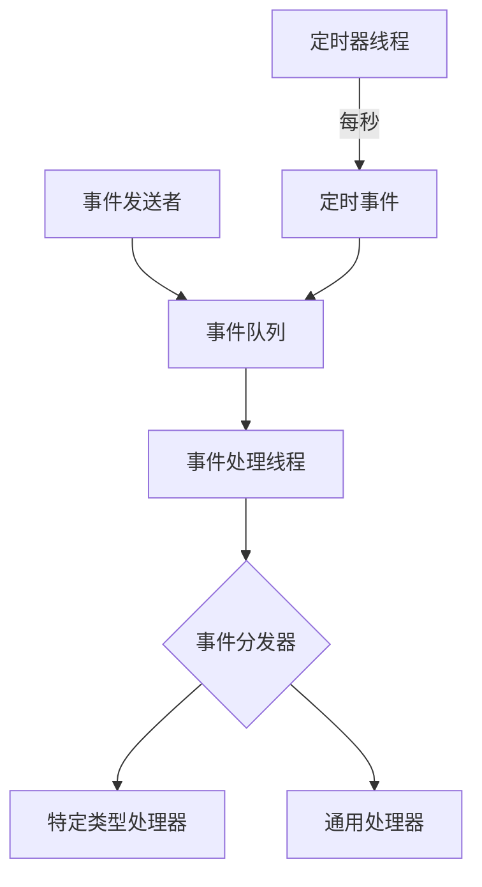
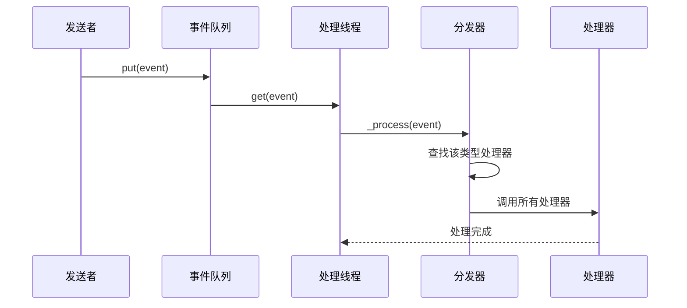

# Chapter 1: 事件驱动引擎


## 什么是事件驱动引擎？

想象一下，你是一家大公司的老板。公司里有许多部门：交易部门、风控部门、行情部门等等。当有新行情数据到来时，你需要通知所有相关部门；当订单成交时，你也需要通知风控部门检查保证金，通知策略模块更新持仓。

在没有事件驱动引擎的情况下，你可能需要这样做：行情部门直接打电话给交易部门、风控部门、界面部门...每个部门都要手动通知一遍。如果将来增加了新部门，你还要修改行情部门的代码。这会导致代码越来越混乱，部门之间耦合紧密。

**事件驱动引擎**就像公司的内部邮件系统。它是一个"中介"，负责接收"邮件"（事件），然后根据"邮件"的类型分发给对应的"部门"（处理器）。这样，发送方不需要知道谁会收到消息，接收方也不需要关心消息从哪里来。

在VeighNa框架中，事件驱动引擎就是这样一个核心组件。它实现了**观察者模式**，允许不同组件之间通过事件进行解耦通信。

## 核心概念

在开始使用之前，我们需要了解三个核心概念：

### 1. 事件（Event）

**事件**是信息的载体，就像一封邮件。每一封邮件都有：
- **类型（type）**：邮件的主题，决定谁来处理
- **数据（data）**：邮件的正文，包含实际信息

```python
# 创建一个事件：类型是"新行情"，数据是行情内容
event = Event(type="新行情", data=market_data)
```

### 2. 事件引擎（EventEngine）

**事件引擎**是整个系统的核心，负责：
- 接收事件（放入队列）
- 分发事件给对应的处理器
- 产生定时事件（用于定时任务）

### 3. 处理器（Handler）

**处理器**是你编写的一段代码，用来响应特定类型的事件。就像邮件到达时，相关部门会打开邮件并处理。

```python
def 处理行情(event):
    print(f"收到行情: {event.data}")
```

## 如何使用事件驱动引擎

让我们通过一个简单的例子来学习如何使用事件驱动引擎。

### 第一步：创建事件引擎

```python
from vnpy.event import EventEngine, Event

# 创建事件引擎，默认每秒产生一个定时事件
engine = EventEngine(interval=1)
```

### 第二步：注册事件处理器

处理器是一个函数，当特定类型的事件发生时会被调用。

```python
# 定义一个处理器函数
def on_timer(event):
    print("定时事件触发！")

# 注册处理器到定时事件
engine.register("eTimer", on_timer)
```

### 第三步：启动引擎

```python
# 启动引擎，开始处理事件
engine.start()
```

启动后，你会每秒看到"定时事件触发！"的输出。

### 第四步：发送自定义事件

除了定时事件，你还可以发送自己的事件：

```python
# 创建并发送一个自定义事件
my_event = Event(type="新订单", data={"symbol": "IF2106", "price": 5000})
engine.put(my_event)
```

### 第五步：停止引擎

```python
# 停止引擎
engine.stop()
```

## 完整示例：模拟接收行情数据

让我们通过一个更完整的例子来理解整个流程：

```python
from vnpy.event import EventEngine, Event

# 创建事件引擎
engine = EventEngine()

# 定义行情处理器
def on_market_data(event):
    data = event.data
    print(f"收到行情: {data['symbol']} = {data['last_price']}")

# 定义成交处理器
def on_trade(event):
    data = event.data
    print(f"订单成交: {data['order_id']} 成交价 {data['price']}")

# 注册处理器
engine.register("market_data", on_market_data)
engine.register("trade", on_trade)

# 启动引擎
engine.start()

# 模拟收到行情事件
market_event = Event(
    type="market_data",
    data={"symbol": "IF2106", "last_price": 5100.0}
)
engine.put(market_event)

# 模拟收到成交事件
trade_event = Event(
    type="trade",
    data={"order_id": "ORDER001", "price": 5100.5}
)
engine.put(trade_event)

# 等待片刻让引擎处理事件
import time
time.sleep(1)

# 停止引擎
engine.stop()
```

运行后，你会看到：
```
收到行情: IF2106 = 5100.0
订单成交: ORDER001 成交价 5100.5
```

## 内部实现原理

现在让我们深入了解事件引擎是如何工作的。

### 整体架构

事件引擎的内部包含以下几个关键部分：



1. **事件队列**：一个线程安全的队列，存放所有待处理的事件
2. **事件处理线程**：从队列中取出事件并处理
3. **事件分发器**：根据事件类型找到对应的处理器列表
4. **定时器线程**：定期产生定时事件

### 事件处理流程

当你调用 `engine.put(event)` 时，发生了什么？



### 核心代码解析

让我们看看关键代码：

**1. 事件类（Event）**

```python
class Event:
    def __init__(self, type: str, data: Any = None):
        self.type = str = type      # 事件类型
        self.data: Any = data       # 事件数据
```

非常简单！事件就是一个包含类型和数据的容器。

**2. 注册处理器**

```python
def register(self, type: str, handler: HandlerType):
    handler_list = self._handlers[type]
    if handler not in handler_list:
        handler_list.append(handler)
```

处理器被存储在一个字典中，key是事件类型，value是处理器列表。

**3. 处理事件**

```python
def _process(self, event: Event):
    # 分发给特定类型处理器
    if event.type in self._handlers:
        for handler in self._handlers[event.type]:
            handler(event)
    
    # 分发给通用处理器
    for handler in self._general_handlers:
        handler(event)
```

事件会被分发给两类处理器：
- **特定处理器**：只响应特定类型的事件
- **通用处理器**：响应所有事件

### 定时事件机制

事件引擎还会自动产生定时事件，用于需要定时执行的任务：

```python
def _run_timer(self):
    while self._active:
        sleep(self._interval)  # 等待指定秒数
        event = Event(EVENT_TIMER)  # 创建定时事件
        self.put(event)  # 放入队列
```

默认情况下，每隔1秒会产生一个 `eTimer` 类型的定时事件。

## 通用处理器

除了针对特定类型的事件，你还可以注册**通用处理器**，它会接收所有类型的事件：

```python
# 注册通用处理器
def log_all_events(event):
    print(f"[日志] 收到事件: {event.type}")

engine.register_general(log_all_events)

# 现在所有事件都会触发这个处理器
```

这在调试或记录日志时非常有用。

## 小结

本章我们学习了事件驱动引擎的核心概念：

1. **事件（Event）**：信息的载体，包含类型和数据
2. **事件引擎（EventEngine）**：负责接收、分发事件的核心组件
3. **处理器（Handler）**：响应事件的函数

事件驱动引擎让组件之间实现了解耦：发送方不需要知道谁会接收，接收方也不需要关心谁发送的。这就像公司的邮件系统，只需要把邮件放到正确的"类型"邮箱中，需要的人自然会去取。

在VeighNa框架中，事件驱动引擎是基础设施，几乎所有模块都依赖于它进行通信。行情数据、成交回报、仓位变化等都是通过事件来传递的。

---

在下一章中，我们将学习**主引擎**，它是如何整合事件引擎和其他组件的核心管理器。

[第2章：主引擎](02_主引擎_.md)

---

Generated by [AI Codebase Knowledge Builder](https://github.com/The-Pocket/Tutorial-Codebase-Knowledge)