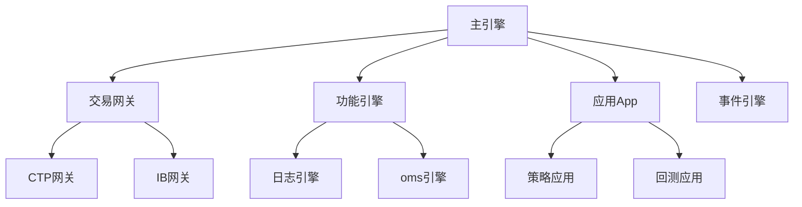
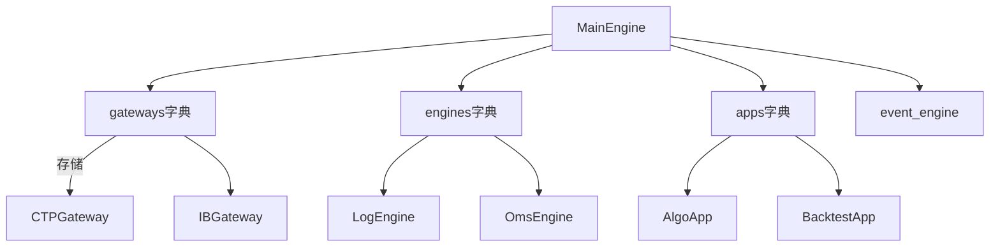
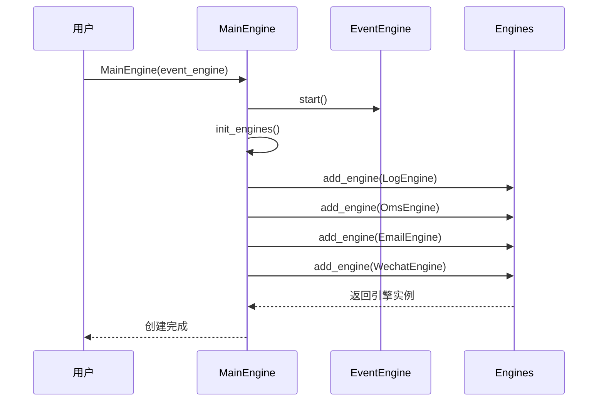
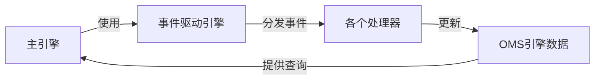

# Chapter 2: 主引擎


在上一章中，我们学习了事件驱动引擎，它就像公司的内部邮件系统，负责在不同部门之间传递信息。但仅有邮件系统是不够的——你还需要一个统筹全局的CEO来协调各个部门的工作。在VeighNa框架中，这个CEO的角色就是**主引擎（MainEngine）**。

## 什么是主引擎？

想象你是一家量化交易公司的老板。你需要：

- 连接到不同的券商交易接口（网关）
- 启动各种策略应用（App）
- 管理订单的发送、撤改
- 监控仓位和账户资金
- 记录日志和发送通知

如果没有一个统一的协调者，这些事情会变得非常混乱。主引擎就是来解决这个问题的——它是整个交易平台的核心管理器，负责统筹所有组件的工作。



## 主引擎的核心功能

主引擎主要有以下几个功能：

### 1. 管理交易网关

网关是连接交易所的桥梁。主引擎负责加载、连接和管理各种网关：

```python
# 添加一个交易网关
gateway = main_engine.add_gateway(CtpGateway)
# 连接网关
main_engine.connect(setting, "CTP")
```

### 2. 管理功能引擎

功能引擎提供各种基础服务，比如：

- **日志引擎**：记录系统运行日志
- **OMS引擎**：管理订单、持仓、账户等数据
- **邮件引擎**：发送邮件通知
- **微信引擎**：推送微信消息

### 3. 管理应用

应用是高级功能模块，比如策略交易、行情记录、回测系统等。主引擎负责启动和管理这些应用：

```python
# 添加一个应用
app_engine = main_engine.add_app(RpcApp)
```

### 4. 统一接口

主引擎提供统一的接口来操作各种功能：

```python
# 发送订单
order_id = main_engine.send_order(req, "CTP")
# 订阅行情
main_engine.subscribe(req, "CTP")
# 查询数据
contract = main_engine.get_contract("IF2106.CFFEX")
```

## 如何使用主引擎

让我们通过一个简单的例子来学习如何使用主引擎。

### 第一步：创建主引擎

```python
from vnpy.trader.engine import MainEngine
from vnpy.event import EventEngine

# 创建事件引擎
event_engine = EventEngine()
# 创建主引擎
main_engine = MainEngine(event_engine)
```

主引擎会自动初始化各种功能引擎，包括日志引擎、OMS引擎等。

### 第二步：添加交易网关

```python
from vnpy.gateway.ctp import CtpGateway

# 添加CTP网关
ctp_gateway = main_engine.add_gateway(CtpGateway)
```

### 第三步：连接网关

```python
# 配置连接参数
setting = {
    "用户名": "123456",
    "密码": "password",
    "经纪商代码": "9999",
    "交易服务器": "180.168.146.187:10101",
    "行情服务器": "180.168.146.187:10131",
}

# 连接网关
main_engine.connect(setting, "CTP")
```

### 第四步：订阅行情

```python
from vnpy.object import SubscribeRequest

# 创建订阅请求
req = SubscribeRequest(
    symbol="IF2106",
    exchange="CFFEX"
)

# 订阅行情
main_engine.subscribe(req, "CTP")
```

### 第五步：发送订单

```python
from vnpy.object import OrderRequest

# 创建买入开仓订单请求
req = OrderRequest(
    symbol="IF2106",
    exchange="CFFEX",
    direction="多",
    type="限价",
    volume=1,
    price=5000.0
)

# 发送订单
vt_orderid = main_engine.send_order(req, "CTP")
```

### 第六步：查询数据

```python
# 查询合约信息
contract = main_engine.get_contract("IF2106.CFFEX")
print(f"合约名称: {contract.name}")

# 查询所有活动订单
orders = main_engine.get_all_active_orders()
print(f"活动订单数: {len(orders)}")
```

### 第七步：关闭主引擎

```python
# 关闭主引擎，会自动停止所有网关和引擎
main_engine.close()
```

## 完整示例：初始化交易系统

下面是一个更完整的示例，展示了如何初始化一个基本的交易系统：

```python
from vnpy.trader.engine import MainEngine
from vnpy.event import EventEngine
from vnpy.gateway.ctp import CtpGateway
from vnpy.object import SubscribeRequest, OrderRequest

# 1. 创建主引擎
event_engine = EventEngine()
main_engine = MainEngine(event_engine)

# 2. 添加网关
main_engine.add_gateway(CtpGateway)

# 3. 连接网关
setting = {"用户名": "123456", "密码": "password"}
main_engine.connect(setting, "CTP")

# 4. 订阅行情
req = SubscribeRequest(symbol="IF2106", exchange="CFFEX")
main_engine.subscribe(req, "CTP")

# 5. 获取行情数据
import time
time.sleep(2)  # 等待行情数据
tick = main_engine.get_tick("IF2106.CFFEX")
print(f"最新价: {tick.last_price}")

# 6. 关闭
main_engine.close()
```

运行后，你会看到类似这样的输出：

```
最新价: 5100.5
```

## 内部实现原理

现在让我们深入了解主引擎是如何工作的。

### 整体架构

主引擎的内部包含以下几个关键部分：



### 初始化流程

当你创建主引擎时，发生了什么？



### 核心代码解析

让我们看看主引擎的关键代码：

**1. 主引擎初始化**

```python
class MainEngine:
    def __init__(self, event_engine: EventEngine | None = None) -> None:
        # 如果没有提供事件引擎，则创建一个
        if event_engine:
            self.event_engine = event_engine
        else:
            self.event_engine = EventEngine()
        self.event_engine.start()
        
        # 初始化各种容器
        self.gateways = {}    # 网关字典
        self.engines = {}     # 引擎字典
        self.apps = {}        # 应用字典
        self.exchanges = []   # 交易所列表
        
        # 初始化功能引擎
        self.init_engines()
```

**2. 添加网关**

```python
def add_gateway(self, gateway_class, gateway_name=""):
    # 使用默认名称
    if not gateway_name:
        gateway_name = gateway_class.default_name
    
    # 创建网关实例
    gateway = gateway_class(self.event_engine, gateway_name)
    self.gateways[gateway_name] = gateway
    
    # 添加支持的交易所
    for exchange in gateway.exchanges:
        if exchange not in self.exchanges:
            self.exchanges.append(exchange)
    
    return gateway
```

**3. 发送订单**

```python
def send_order(self, req: OrderRequest, gateway_name: str) -> str:
    # 获取网关
    gateway = self.get_gateway(gateway_name)
    if gateway:
        # 记录日志
        self.write_log(f"委托下单 -> {gateway_name}：{req}")
        # 发送订单到网关
        return gateway.send_order(req)
    else:
        return ""
```

### OMS引擎：订单管理系统

在主引擎中，最重要的引擎之一是OMS引擎（订单管理系统）。它负责：

- 存储和管理所有行情数据
- 存储和管理所有订单数据
- 存储和管理所有成交记录
- 存储和管理所有持仓数据
- 存储和管理所有账户数据

```python
class OmsEngine(BaseEngine):
    def __init__(self, main_engine, event_engine):
        # 各种数据存储
        self.ticks = {}      # 行情数据
        self.orders = {}     # 订单数据
        self.trades = {}     # 成交数据
        self.positions = {}  # 持仓数据
        self.accounts = {}   # 账户数据
        
        # 注册事件监听
        self.register_event()
```

OMS引擎通过监听事件来更新数据：

```python
def register_event(self):
    self.event_engine.register(EVENT_TICK, self.process_tick_event)
    self.event_engine.register(EVENT_ORDER, self.process_order_event)
    self.event_engine.register(EVENT_TRADE, self.process_trade_event)
    # ... 更多事件
```

## 主引擎与事件驱动引擎的关系

主引擎和事件驱动引擎是紧密合作的关系：



- 主引擎依赖事件驱动引擎来处理异步事件
- 事件驱动引擎将行情、成交等信息通知给OMS引擎
- OMS引擎存储数据并提供查询接口
- 主引擎对外提供统一的API

## 小结

本章我们学习了主引擎的核心概念：

1. **主引擎是什么**：整个交易平台的核心管理器，就像公司的CEO
2. **主要功能**：管理网关、引擎、应用，提供统一接口
3. **如何使用**：创建引擎 → 添加网关 → 连接 → 订阅/下单 → 查询数据 → 关闭
4. **内部原理**：通过事件驱动引擎协调各个组件工作

主引擎将事件驱动引擎、各类网关、功能引擎和应用整合在一起，形成了一个完整的交易系统。在下一章中，我们将学习**交易网关**，了解如何连接到具体的交易所。

---

[第3章：交易网关](03_交易网关_.md)

---

Generated by [AI Codebase Knowledge Builder](https://github.com/The-Pocket/Tutorial-Codebase-Knowledge)