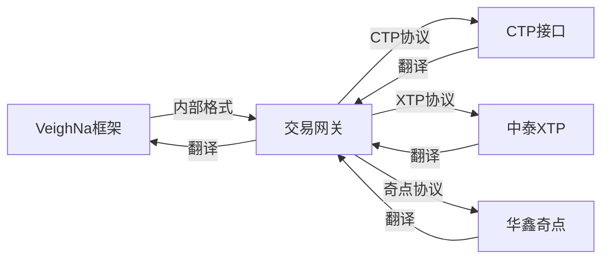
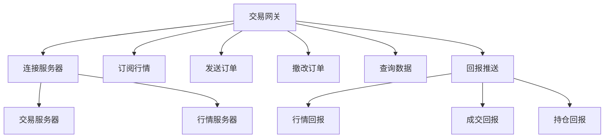
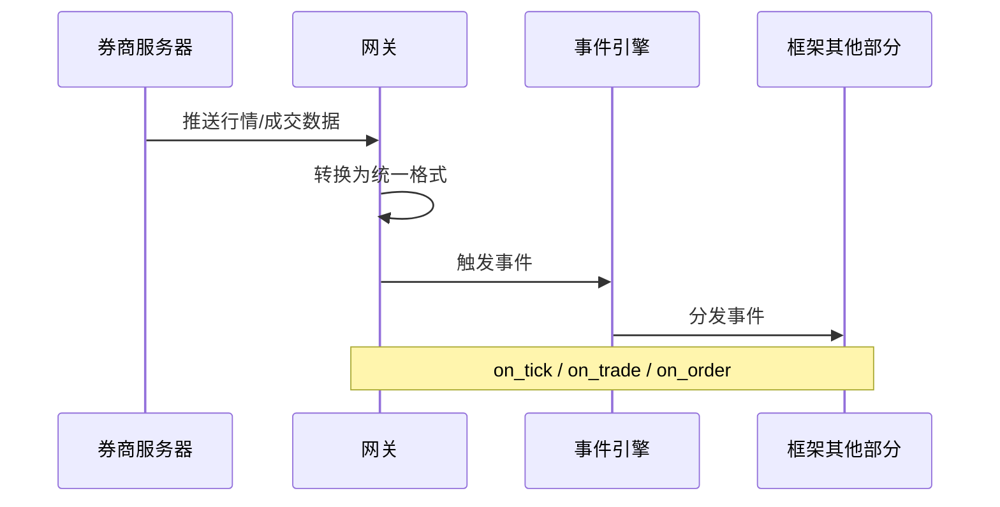

# Chapter 3: 交易网关


在上一章中，我们学习了主引擎，它就像公司的CEO，负责统筹管理整个交易系统。主引擎可以连接各种交易网关，就像CEO管理不同部门的负责人。在本章中，我们将学习**交易网关**，了解如何连接到具体的交易所或券商系统。

## 什么是交易网关？

想象你要去国外旅行，不会说外语，怎么办？你需要请一个**翻译员**。翻译员把你的话翻译成外语告诉对方，也把对方的回复翻译成中文告诉你。

在量化交易中，情况类似：VeighNa框架有自己的"语言"（内部数据格式），而每个券商或交易所也有自己的"语言"（接口协议）。**交易网关**就是扮演"翻译员"的角色，把外部系统的接口转换为框架内部统一的数据格式。



## 常见的交易网关

VeighNa支持很多种交易网关，常见的有：

- **CTP网关**：连接上海期货交易所（SHFE）、中金所（CFFEX）等
- **华鑫奇点**：支持A股实盘交易
- **中泰XTP**：支持A股实盘交易
- **IB网关**：连接盈透证券（Interactive Brokers）
- **Tushare**：免费行情数据网关

每个网关只负责与特定的券商或行情系统通信。

## 网关的核心功能

交易网关主要负责以下几项工作：



### 1. 连接服务器

网关负责与券商的交易服务器和行情服务器建立连接。

### 2. 订阅行情

通过网关订阅股票的实时行情数据。

### 3. 发送订单

把框架内部的订单请求转换为券商接口格式并发送出去。

### 4. 撤改订单

支持撤单和改单操作。

### 5. 查询数据

查询账户资金、持仓、合约信息等。

### 6. 回报推送

将行情数据、成交回报、持仓变化等推送给框架。

## 如何使用交易网关

让我们通过一个完整的例子来学习如何使用交易网关。

### 第一步：创建主引擎和交易网关

```python
from vnpy.trader.engine import MainEngine
from vnpy.event import EventEngine
from vnpy.gateway.ctp import CtpGateway

# 创建事件引擎
event_engine = EventEngine()
# 创建主引擎
main_engine = MainEngine(event_engine)
# 添加CTP网关
ctp_gateway = main_engine.add_gateway(CtpGateway)
```

### 第二步：配置连接参数

不同的网关需要不同的连接参数，以CTP为例：

```python
# CTP网关配置参数
setting = {
    "用户名": "your_username",
    "密码": "your_password",
    "经纪商代码": "9999",
    "交易服务器": "180.168.146.187:10101",
    "行情服务器": "180.168.146.187:10131",
}
```

### 第三步：连接网关

```python
# 连接CTP网关
main_engine.connect(setting, "CTP")
```

### 第四步：订阅行情

```python
from vnpy.object import SubscribeRequest

# 创建订阅请求
req = SubscribeRequest(
    symbol="IF2106",
    exchange="CFFEX"
)

# 订阅行情
main_engine.subscribe(req, "CTP")
```

### 第五步：发送订单

```python
from vnpy.object import OrderRequest, Direction, Exchange, OrderType

# 创建买入开仓订单请求
req = OrderRequest(
    symbol="IF2106",
    exchange=Exchange.CFFEX,
    direction=Direction.LONG,
    type=OrderType.LIMIT,
    volume=1,
    price=5000.0
)

# 发送订单，返回vt_orderid
vt_orderid = main_engine.send_order(req, "CTP")
print(f"订单已发送，订单ID: {vt_orderid}")
```

### 第六步：撤销订单

```python
from vnpy.object import CancelRequest

# 创建撤单请求
req = CancelRequest(
    orderid="ORDER001",  # 原始订单号
    symbol="IF2106",
    exchange=Exchange.CFFEX
)

# 发送撤单请求
main_engine.cancel_order(req, "CTP")
```

### 第七步：查询数据

```python
# 查询合约信息
contract = main_engine.get_contract("IF2106.CFFEX")
print(f"合约名称: {contract.name}")
print(f"合约乘数: {contract.size}")

# 查询所有活动订单
orders = main_engine.get_all_active_orders()
print(f"活动订单数: {len(orders)}")

# 查询持仓
positions = main_engine.get_all_positions()
print(f"持仓数量: {len(positions)}")
```

### 第八步：关闭网关

```python
# 关闭主引擎，会自动关闭所有网关
main_engine.close()
```

## 网关的基本结构

每个交易网关都继承自 `BaseGateway` 基类。让我们看看网关的基本结构：

```python
from vnpy.trader.gateway import BaseGateway

class CtpGateway(BaseGateway):
    """CTP网关实现"""
    
    # 默认名称
    default_name = "CTP"
    
    # 支持的交易所
    exchanges = [Exchange.CFFEX, Exchange.SHFE, Exchange.DCE, Exchange.CZCE]
    
    # 默认配置参数
    default_setting = {
        "用户名": "",
        "密码": "",
        "经纪商代码": "",
        "交易服务器": "",
        "行情服务器": "",
    }
```

## 事件的处理流程

当网关收到行情或成交回报时，会通过事件驱动引擎推送给框架：



## 回调函数

网关需要实现一些回调函数来处理服务器推送的数据：

```python
def on_tick(self, tick: TickData) -> None:
    """行情数据回调"""
    # 将行情数据推送给框架
    self.on_event(EVENT_TICK, tick)

def on_order(self, order: OrderData) -> None:
    """订单状态回调"""
    # 将订单状态推送给框架
    self.on_event(EVENT_ORDER, order)

def on_trade(self, trade: TradeData) -> None:
    """成交回报回调"""
    # 将成交信息推送给框架
    self.on_event(EVENT_TRADE, trade)
```

## 完整示例：完整的交易流程

下面是一个更完整的示例，展示了如何使用网关进行完整的交易：

```python
from vnpy.trader.engine import MainEngine
from vnpy.event import EventEngine
from vnpy.gateway.ctp import CtpGateway
from vnpy.object import (
    SubscribeRequest, OrderRequest, CancelRequest,
    Direction, Exchange, OrderType
)

# 1. 初始化
event_engine = EventEngine()
main_engine = MainEngine(event_engine)
main_engine.add_gateway(CtpGateway)

# 2. 连接
setting = {"用户名": "123", "密码": "123", "经纪商代码": "9999",
           "交易服务器": "180.168.146.187:10101",
           "行情服务器": "180.168.146.187:10131"}
main_engine.connect(setting, "CTP")

# 等待连接成功
import time
time.sleep(3)

# 3. 订阅行情
req = SubscribeRequest(symbol="IF2106", exchange=Exchange.CFFEX)
main_engine.subscribe(req, "CTP")

# 4. 发送订单
order_req = OrderRequest(
    symbol="IF2106",
    exchange=Exchange.CFFEX,
    direction=Direction.LONG,
    type=OrderType.LIMIT,
    volume=1,
    price=5000.0
)
vt_orderid = main_engine.send_order(order_req, "CTP")
print(f"订单已发送: {vt_orderid}")

# 等待成交
time.sleep(5)

# 5. 关闭
main_engine.close()
```

运行后，你会看到类似这样的输出：

```
订单已发送: CTp.ORDER.1
```

## 小结

本章我们学习了交易网关的核心概念：

1. **什么是交易网关**：连接外部交易系统的"翻译员"，把外部接口转换为框架内部统一格式
2. **常见网关**：CTP、华鑫奇点、中泰XTP等
3. **网关功能**：连接服务器、订阅行情、发送订单、撤改订单、查询数据、回报推送
4. **如何使用**：创建网关 → 连接 → 订阅行情 → 发送订单 → 撤销订单 → 查询数据 → 关闭

交易网关是VeighNa框架与外部交易系统沟通的桥梁。通过不同的网关，框架可以连接到各种券商和交易所，实现统一的交易功能。

在下一章中，我们将学习**基础数据对象**，了解框架内部使用的数据格式是什么样的。

---

[第4章：基础数据对象](04_基础数据对象_.md)

---

Generated by [AI Codebase Knowledge Builder](https://github.com/The-Pocket/Tutorial-Codebase-Knowledge)