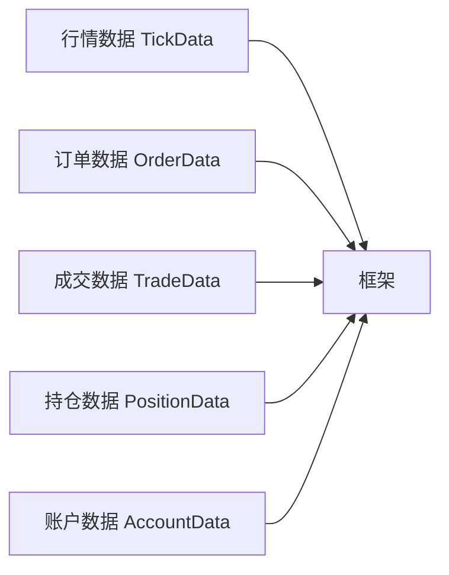
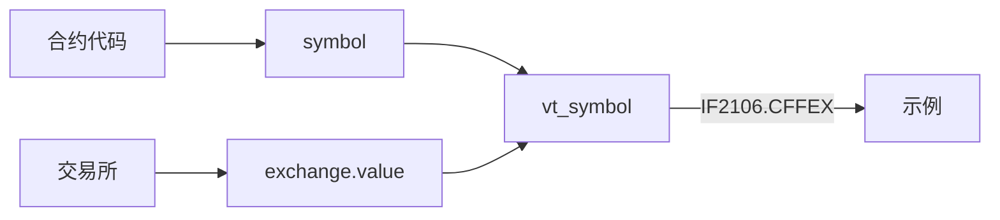
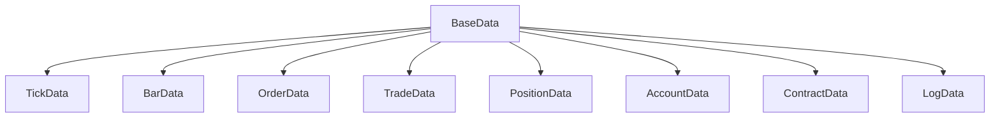

# Chapter 4: 基础数据对象


在上一章中，我们学习了[交易网关](03_交易网关_.md)，它负责连接外部交易系统并转换数据格式。但你有没有想过，这些数据在框架内部是以什么形式存储和传递的呢？

想象一下，你是一家物流公司的老板。每天你都会收到各种货物：订单、发货单、库存报告、车辆信息等。为了高效管理，你不会随意把这些文件塞进一个大箱子，而是会建立一套标准的**表单模板**：订单有订单表、发货有发货单、库存有库存表。每个表单都有固定的格式和字段，方便员工填写和查阅。

在VeighNa框架中，**基础数据对象**就是这套标准的"表单模板"。它们定义了各种交易相关数据的统一格式，让整个系统能够高效地存储和传递信息。

## 什么是基础数据对象？

基础数据对象是VeighNa框架中使用的基本数据结构。它们就像标准的表格模板，每个对象包含固定的字段（属性），用来描述特定类型的信息。

这些数据对象贯穿整个交易流程：



## 常见的数据对象类型

VeighNa框架定义了多种数据对象，下面我们逐一介绍最常用的几种。

### 1. 行情数据（TickData）

**TickData** 是行情数据的基本单位，记录某一时刻的市场信息。它就像一张**快照**，捕捉了那个瞬间的所有市场信息。

```python
from vnpy.object import TickData
from vnpy.trader.constant import Exchange
from datetime import datetime

# 创建一个行情数据对象
tick = TickData(
    symbol="IF2106",           # 合约代码
    exchange=Exchange.CFFEX,    # 交易所
    datetime=datetime(2021, 6, 18, 10, 30, 0),  # 时间
    last_price=5100.0,         # 最新价
    last_volume=10,            # 最新成交量
    bid_price_1=5099.0,        # 买一价
    ask_price_1=5101.0,        # 卖一价
    gateway_name="CTP"         # 网关名称
)
```

行情数据包含丰富的字段，主要分为以下几类：

| 字段类别 | 包含字段 | 说明 |
|---------|---------|------|
| 基础信息 | symbol, exchange, datetime | 合约代码、交易所、时间 |
| 价格信息 | last_price, open_price, high_price, low_price, pre_close | 最新价、开盘价、最高价、最低价、昨收价 |
| 涨跌停 | limit_up, limit_down | 涨停价、跌停价 |
| 五档买卖盘 | bid_price_1~5, ask_price_1~5, bid_volume_1~5, ask_volume_1~5 | 买一到买五、卖一到卖五的价格和数量 |
| 统计信息 | volume, turnover, open_interest | 成交量、成交额、持仓量 |

### 2. K线数据（BarData）

**BarData** 也叫K线数据或蜡烛图数据，记录一段时间内的价格波动情况。

```python
from vnpy.object import BarData
from vnpy.trader.constant import Exchange, Interval

# 创建一个K线数据对象（5分钟K线）
bar = BarData(
    symbol="IF2106",
    exchange=Exchange.CFFEX,
    datetime=datetime(2021, 6, 18, 10, 30, 0),
    interval=Interval.MINUTE,     # K线周期
    volume=100,                    # 成交量
    open_price=5100.0,            # 开盘价
    high_price=5120.0,            # 最高价
    low_price=5090.0,             # 最低价
    close_price=5115.0,           # 收盘价
    gateway_name="CTP"
)
```

K线数据的核心字段很简单：开盘价、最高价、最低价、收盘价，加上成交量和时间。

### 3. 订单数据（OrderData）

**OrderData** 记录订单的详细信息，就像一张**施工单**，记录了你要做的事情和当前进度。

```python
from vnpy.object import OrderData
from vnpy.trader.constant import Exchange, Direction, Offset, OrderType, Status

# 创建一个订单数据对象
order = OrderData(
    symbol="IF2106",
    exchange=Exchange.CFFEX,
    orderid="ORDER001",           # 订单ID
    type=OrderType.LIMIT,         # 订单类型：限价单
    direction=Direction.LONG,     # 方向：做多
    offset=Offset.OPEN,           # 开平：开仓
    price=5100.0,                 # 价格
    volume=1,                     # 数量
    traded=0,                     # 已成交数量
    status=Status.SUBMITTING,     # 状态：提交中
    gateway_name="CTP"
)

# 判断订单是否活跃
print(f"订单是否活跃: {order.is_active()}")
```

订单数据的关键字段包括：

- **orderid**：订单编号，由交易所或券商返回
- **direction**：交易方向（做多/做空）
- **offset**：开平标志（开仓/平仓/平今/平昨）
- **type**：订单类型（限价单、市价单、止损单等）
- **status**：订单状态（提交中、未成交、部分成交、已成交、已撤销等）
- **traded**：已成交数量

### 4. 成交数据（TradeData）

**TradeData** 记录每一次成交的详细信息，就像一张**收据**，证明一笔交易已经完成。

```python
from vnpy.object import TradeData
from vnpy.trader.constant import Exchange, Direction, Offset

# 创建一个成交数据对象
trade = TradeData(
    symbol="IF2106",
    exchange=Exchange.CFFEX,
    orderid="ORDER001",           # 对应的订单ID
    tradeid="TRADE001",           # 成交编号
    direction=Direction.LONG,     # 方向
    offset=Offset.OPEN,           # 开平
    price=5100.5,                 # 成交价格
    volume=1,                     # 成交数量
    datetime=datetime(2021, 6, 18, 10, 35, 0),
    gateway_name="CTP"
)
```

成交数据最重要的字段是 **tradeid**（成交编号），这是交易所给出的唯一成交凭证。

### 5. 持仓数据（PositionData）

**PositionData** 记录当前持有的仓位信息。

```python
from vnpy.object import PositionData
from vnpy.trader.constant import Exchange, Direction

# 创建一个持仓数据对象
position = PositionData(
    symbol="IF2106",
    exchange=Exchange.CFFEX,
    direction=Direction.LONG,     # 多头持仓
    volume=3,                     # 总持仓量
    frozen=1,                    # 冻结数量（未成交的挂单）
    price=5100.0,                # 持仓均价
    pnl=1500.0,                  # 持仓盈亏
    yd_volume=2,                # 昨仓数量
    gateway_name="CTP"
)
```

持仓数据的核心字段：

- **volume**：总持仓量
- **frozen**：冻结数量（已经被挂单占用、不能动的数量）
- **price**：持仓均价
- **pnl**：持仓盈亏
- **yd_volume**：昨仓（昨天收盘时持有的仓位）

### 6. 账户数据（AccountData）

**AccountData** 记录账户的资金状况。

```python
from vnpy.object import AccountData

# 创建一个账户数据对象
account = AccountData(
    accountid="123456",          # 账户ID
    balance=1000000.0,           # 总资金
    frozen=50000.0,              # 冻结资金
    gateway_name="CTP"
)

# 可用资金会自动计算
print(f"可用资金: {account.available}")
```

账户数据会自动计算 **available**（可用资金 = 总资金 - 冻结资金）。

### 7. 合约数据（ContractData）

**ContractData** 记录合约的基本信息，就像产品的**说明书**。

```python
from vnpy.object import ContractData
from vnpy.trader.constant import Exchange, Product

# 创建一个合约数据对象
contract = ContractData(
    symbol="IF2106",
    exchange=Exchange.CFFEX,
    name="沪深300指数期货",       # 合约名称
    product=Product.FUTURES,     # 产品类型：期货
    size=300,                    # 合约乘数
    pricetick=0.2,               # 最小价格变动
    min_volume=1,                # 最小下单量
    max_volume=100,              # 最大下单量
    gateway_name="CTP"
)
```

合约数据包含合约的各种属性，帮助交易者了解合约的交易规则。

### 8. 日志数据（LogData）

**LogData** 用于记录系统日志。

```python
from vnpy.object import LogData

# 创建一个日志数据对象
log = LogData(
    msg="订单已发送",             # 日志消息
    level=20,                    # 日志级别
    gateway_name="CTP"
)
```

## 请求对象

除了数据对象，框架还定义了**请求对象**，用于向网关发送请求。

### 1. 订阅请求（SubscribeRequest）

用于订阅行情数据。

```python
from vnpy.object import SubscribeRequest
from vnpy.trader.constant import Exchange

# 创建订阅请求
req = SubscribeRequest(
    symbol="IF2106",
    exchange=Exchange.CFFEX
)
```

### 2. 订单请求（OrderRequest）

用于发送订单。

```python
from vnpy.object import OrderRequest
from vnpy.trader.constant import Exchange, Direction, OrderType, Offset

# 创建订单请求
req = OrderRequest(
    symbol="IF2106",
    exchange=Exchange.CFFEX,
    direction=Direction.LONG,     # 买入
    type=OrderType.LIMIT,         # 限价单
    volume=1,                     # 数量
    price=5100.0,                 # 价格
    offset=Offset.OPEN             # 开仓
)
```

### 3. 撤单请求（CancelRequest）

用于撤销订单。

```python
from vnpy.object import CancelRequest
from vnpy.trader.constant import Exchange

# 创建撤单请求
req = CancelRequest(
    orderid="ORDER001",           # 要撤销的订单ID
    symbol="IF2106",
    exchange=Exchange.CFFEX
)
```

## 统一标识符（vt_symbol）

每个数据对象都有一个 **vt_symbol** 字段，这是VeighNa框架的**统一标识符**格式。



格式为：`合约代码.交易所代码`

例如：
- `IF2106.CFFEX` - 沪深300指数期货
- `rb2105.SHFE` - 螺纹钢期货
- `600000.SSE` - 浦发银行股票

这样的设计让**跨交易所交易**成为可能，因为每个合约都有唯一的标识。

## 如何在代码中使用数据对象

让我们看一个完整的例子，展示如何在策略中使用这些数据对象：

```python
from vnpy.trader.engine import MainEngine
from vnpy.event import EventEngine
from vnpy.gateway.ctp import CtpGateway
from vnpy.object import SubscribeRequest
from vnpy.trader.constant import Exchange

# 1. 初始化主引擎
event_engine = EventEngine()
main_engine = MainEngine(event_engine)
main_engine.add_gateway(CtpGateway)

# 2. 连接网关
setting = {"用户名": "123", "密码": "123", "经纪商代码": "9999",
           "交易服务器": "180.168.146.187:10101",
           "行情服务器": "180.168.146.187:10131"}
main_engine.connect(setting, "CTP")

# 3. 订阅行情
req = SubscribeRequest(symbol="IF2106", exchange=Exchange.CFFEX)
main_engine.subscribe(req, "CTP")

# 4. 获取行情数据（需要等待片刻）
import time
time.sleep(2)
tick = main_engine.get_tick("IF2106.CFFEX")

if tick:
    print(f"合约: {tick.vt_symbol}")
    print(f"最新价: {tick.last_price}")
    print(f"买一价: {tick.bid_price_1}")
    print(f"卖一价: {tick.ask_price_1}")
```

运行后，你会看到类似这样的输出：

```
合约: IF2106.CFFEX
最新价: 5100.0
买一价: 5099.0
卖一价: 5101.0
```

## 数据对象的内部实现

数据对象使用Python的 **dataclass**（数据类）来实现，这是一种简洁的方式来定义包含数据的类。

```python
# 订单数据的简化定义
from dataclasses import dataclass
from datetime import datetime

@dataclass
class OrderData:
    symbol: str
    exchange: str
    orderid: str
    price: float = 0
    volume: float = 0
    traded: float = 0
    gateway_name: str = ""
    # ... 更多字段
```

dataclass 的好处是：
1. 自动生成 `__init__` 方法
2. 自动生成 `__repr__` 方法（便于打印查看）
3. 代码简洁，易于阅读

### 数据对象的继承关系

所有数据对象都继承自 **BaseData**：



**BaseData** 定义了所有数据对象的共同属性：

```python
@dataclass
class BaseData:
    """所有数据对象的基类"""
    gateway_name: str              # 网关名称
    extra: dict | None = None     # 额外信息
```

## 小结

本章我们学习了VeighNa框架中的基础数据对象：

1. **什么是数据对象**：标准化的数据结构，用于存储和传递交易相关的信息
2. **主要类型**：
   - TickData：行情数据快照
   - BarData：K线数据
   - OrderData：订单数据
   - TradeData：成交数据
   - PositionData：持仓数据
   - AccountData：账户数据
   - ContractData：合约数据
3. **请求对象**：用于向网关发送请求（订阅、订单、撤单）
4. **vt_symbol**：统一的合约标识符格式

这些数据对象就像标准的表格模板，让整个系统能够高效地存储和传递信息。在下一章中，我们将学习[数据库适配器](05_数据库适配器_.md)，了解如何持久化存储这些数据。

---

[第5章：数据库适配器](05_数据库适配器_.md)

---

Generated by [AI Codebase Knowledge Builder](https://github.com/The-Pocket/Tutorial-Codebase-Knowledge)