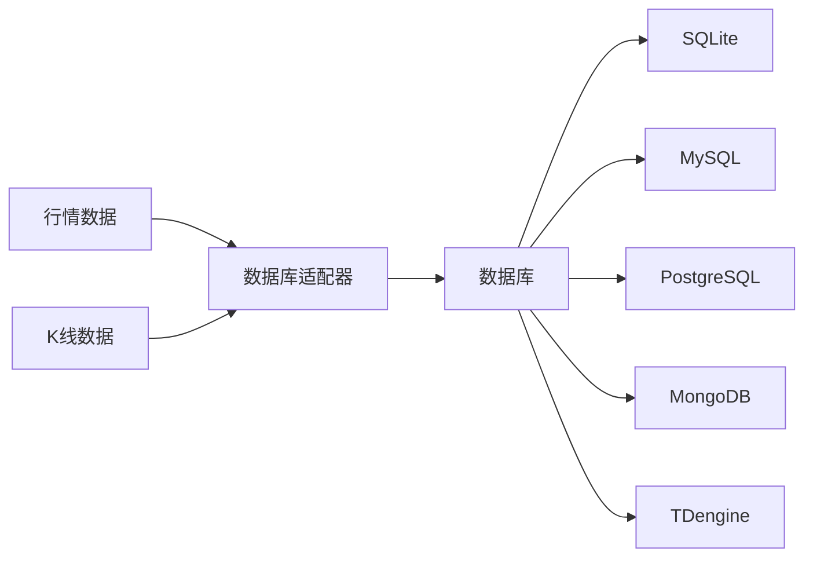
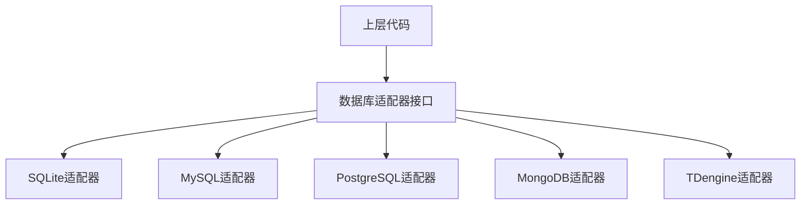
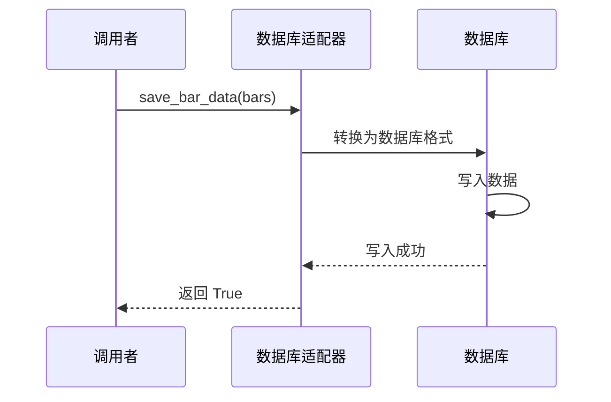

# Chapter 5: 数据库适配器


在上一章中，我们学习了[基础数据对象](04_基础数据对象_.md)，了解了VeighNa框架中用于存储和传递交易信息的各种数据格式，比如行情数据（TickData）、K线数据（BarData）、订单数据（OrderData）等。

但是，这里有一个重要的问题：这些数据创建之后，如果没有保存下来，一旦程序关闭，这些数据就会丢失。就像你写了一份重要的报告，如果不保存到电脑硬盘上，下次开机时就找不到了。

在本章中，我们将学习**数据库适配器**，它就像一个**档案室**，负责将重要的历史数据永久保存下来，并在需要时快速检索出来。

## 什么是数据库适配器？

想象你是一家大型医院的院长。医院每天都会产生大量的病历、检查报告、处方等信息。如果把这些纸质文件随便堆放在办公室里，找一份历史病历可能要翻半天，效率非常低。

于是，你建立了一个**档案室**：
- 每当有新的病历产生，就把它归档到档案室中
- 当医生需要查看某个病人的历史记录时，去档案室检索
- 档案室可以按照病人姓名、日期、科室等多种方式检索

**数据库适配器**在VeighNa框架中扮演的就是这个**档案室**的角色。它负责：

1. **保存数据**：将K线数据、Tick数据等持久化存储到数据库中
2. **读取数据**：根据条件从数据库中检索历史数据
3. **删除数据**：删除不再需要的历史数据



## 支持的数据库类型

VeighNa的数据库适配器支持多种数据库，就像档案室可以使用不同的存储方式：

| 数据库 | 特点 | 适用场景 |
|-------|------|---------|
| **SQLite** | 轻量级，无需安装，文件存储 | 个人学习、单机使用 |
| **MySQL** | 成熟稳定，客户端-服务器架构 | 生产环境，中小规模 |
| **PostgreSQL** | 功能强大，支持复杂查询 | 大规模数据，高性能需求 |
| **MongoDB** | 文档型数据库，灵活 | 非结构化数据 |
| **TDengine** | 时序数据库，高性能 | 大量时序数据（K线、Tick） |

对于大多数个人用户来说，**SQLite**是最简单、最方便的选择，因为不需要额外安装数据库软件。

## 核心功能

数据库适配器提供以下核心功能：

### 1. 保存K线数据

```python
def save_bar_data(self, bars: list[BarData], stream: bool = False) -> bool:
    """
    保存K线数据到数据库
    """
    pass
```

### 2. 读取K线数据

```python
def load_bar_data(
    self,
    symbol: str,
    exchange: Exchange,
    interval: Interval,
    start: datetime,
    end: datetime
) -> list[BarData]:
    """
    从数据库读取K线数据
    """
    pass
```

### 3. 保存Tick数据

```python
def save_tick_data(self, ticks: list[TickData], stream: bool = False) -> bool:
    """
    保存Tick数据到数据库
    """
    pass
```

### 4. 读取Tick数据

```python
def load_tick_data(
    self,
    symbol: str,
    exchange: Exchange,
    start: datetime,
    end: datetime
) -> list[TickData]:
    """
    从数据库读取Tick数据
    """
    pass
```

### 5. 删除数据

```python
def delete_bar_data(
    self,
    symbol: str,
    exchange: Exchange,
    interval: Interval
) -> int:
    """
    删除指定合约的K线数据
    """
    pass
```

### 6. 查询数据概览

```python
def get_bar_overview(self) -> list[BarOverview]:
    """
    查询数据库中存储了哪些K线数据
    """
    pass
```

## 如何使用数据库适配器

让我们通过简单的例子来学习如何使用数据库适配器。

### 第一步：获取数据库实例

```python
from vnpy.trader.database import get_database

# 获取数据库实例（会自动根据配置选择数据库类型）
db = get_database()
print(f"当前使用的数据库: {type(db).__name__}")
```

这段代码会读取配置文件，确定使用哪种数据库，然后返回对应的数据库实例。默认情况下，如果没有任何配置，会使用SQLite。

### 第二步：保存K线数据

假设我们有一些K线数据需要保存：

```python
from vnpy.object import BarData
from vnpy.trader.constant import Exchange, Interval
from datetime import datetime

# 创建一些K线数据
bars = [
    BarData(
        symbol="IF2106",
        exchange=Exchange.CFFEX,
        datetime=datetime(2021, 6, 18, 10, 0),
        interval=Interval.MINUTE,
        open_price=5100.0,
        high_price=5120.0,
        low_price=5090.0,
        close_price=5115.0,
        volume=100
    ),
    BarData(
        symbol="IF2106",
        exchange=Exchange.CFFEX,
        datetime=datetime(2021, 6, 18, 10, 5),
        interval=Interval.MINUTE,
        open_price=5115.0,
        high_price=5130.0,
        low_price=5110.0,
        close_price=5125.0,
        volume=120
    ),
]

# 保存到数据库
db.save_bar_data(bars)
print("K线数据已保存")
```

### 第三步：读取K线数据

当需要使用历史数据时，从数据库读取：

```python
from datetime import datetime

# 设置查询时间范围
start = datetime(2021, 6, 18, 0, 0)
end = datetime(2021, 6, 19, 0, 0)

# 从数据库读取K线数据
bars = db.load_bar_data(
    symbol="IF2106",
    exchange=Exchange.CFFEX,
    interval=Interval.MINUTE,
    start=start,
    end=end
)

# 打印读取到的数据
print(f"共读取到 {len(bars)} 条K线数据")
for bar in bars:
    print(f"{bar.datetime} 开:{bar.open_price} 高:{bar.high_price} 低:{bar.low_price} 收:{bar.close_price}")
```

运行后，你会看到类似这样的输出：

```
共读取到 2 条K线数据
2021-06-18 10:00:00 开:5100.0 高:5120.0 低:5090.0 收:5115.0
2021-06-18 10:05:00 开:5115.0 高:5130.0 低:5110.0 收:5125.0
```

### 第四步：保存和读取Tick数据

Tick数据的使用方式与K线数据类似：

```python
from vnpy.object import TickData

# 创建Tick数据
ticks = [
    TickData(
        symbol="IF2106",
        exchange=Exchange.CFFEX,
        datetime=datetime(2021, 6, 18, 10, 30, 0),
        last_price=5100.0,
        bid_price_1=5099.0,
        ask_price_1=5101.0,
        last_volume=10
    ),
]

# 保存Tick数据
db.save_tick_data(ticks)
print("Tick数据已保存")

# 读取Tick数据
start = datetime(2021, 6, 18, 0, 0)
end = datetime(2021, 6, 19, 0, 0)

ticks = db.load_tick_data(
    symbol="IF2106",
    exchange=Exchange.CFFEX,
    start=start,
    end=end
)

print(f"共读取到 {len(ticks)} 条Tick数据")
```

### 第五步：查询数据库中存有哪些数据

如果你想知道数据库中保存了哪些合约的数据：

```python
# 查询K线数据概览
overviews = db.get_bar_overview()
print("数据库中存储的K线数据：")
for overview in overviews:
    print(f"  {overview.symbol}.{overview.exchange.value} "
          f"[{overview.interval.value}] "
          f"共{overview.count}条 "
          f"从{overview.start}到{overview.end}")
```

输出类似：

```
数据库中存储的K线数据：
  IF2106.CFFEX [1min] 共2条 从2021-06-18 10:00:00到2021-06-18 10:05:00
```

### 第六步：删除不需要的数据

有时候需要清理旧数据：

```python
# 删除指定合约的K线数据
count = db.delete_bar_data(
    symbol="IF2106",
    exchange=Exchange.CFFEX,
    interval=Interval.MINUTE
)
print(f"已删除 {count} 条K线数据")
```

## 如何配置数据库类型

默认情况下，VeighNa使用SQLite数据库。如果你想使用其他数据库，需要修改配置文件。

### 配置文件位置

配置文件通常位于 `vnpy/trader/setting.py` 或者用户目录下的 `vt_setting.json`。

### 配置示例

```python
# setting.py 中的配置
SETTINGS = {
    # 数据库配置
    "database.name": "sqlite",        # 数据库类型：sqlite, mysql, postgres, mongodb, tdengine
    "database.database": "vnpy_db",  # 数据库名称
    "database.host": "localhost",    # 主机地址（MySQL/PostgreSQL使用）
    "database.port": 3306,           # 端口（MySQL/PostgreSQL使用）
    "database.user": "root",         # 用户名
    "database.password": "password", # 密码
}
```

切换到MySQL只需要把 `"database.name"` 改为 `"mysql"`：

```python
SETTINGS["database.name"] = "mysql"
```

数据库适配器会自动根据配置创建对应的数据库实例。

## 内部实现原理

现在让我们深入了解数据库适配器是如何工作的。

### 整体架构

数据库适配器采用**适配器模式**，上层代码不需要关心底层使用的是什么数据库，只需要调用统一的接口：



### 数据流程

当你调用 `save_bar_data` 时，发生了什么？



### 核心代码解析

**1. 基础抽象类**

所有数据库适配器都继承自 `BaseDatabase` 抽象类：

```python
class BaseDatabase(ABC):
    """数据库基类"""
    
    @abstractmethod
    def save_bar_data(self, bars: list[BarData], stream: bool = False) -> bool:
        pass

    @abstractmethod
    def load_bar_data(self, symbol: str, exchange: Exchange, 
                      interval: Interval, start: datetime, 
                      end: datetime) -> list[BarData]:
        pass
    
    # ... 其他抽象方法
```

`ABC` 表示这是一个抽象基类，规定了所有数据库适配器必须实现的方法。

**2. 获取数据库实例**

`get_database()` 函数负责根据配置创建数据库实例：

```python
def get_database() -> BaseDatabase:
    global database
    
    # 如果已经有实例，直接返回
    if database:
        return database
    
    # 读取配置中的数据库类型
    database_name = SETTINGS["database.name"]
    module_name = f"vnpy_{database_name}"
    
    # 尝试导入对应的数据库模块
    try:
        module = import_module(module_name)
    except ModuleNotFoundError:
        # 如果导入失败，使用默认的SQLite
        module = import_module("vnpy_sqlite")
    
    # 创建数据库实例
    database = module.Database()
    return database
```

**3. 数据概览**

`BarOverview` 用于描述数据库中存储的K线数据信息：

```python
@dataclass
class BarOverview:
    symbol: str           # 合约代码
    exchange: Exchange    # 交易所
    interval: Interval   # K线周期
    count: int           # 数据条数
    start: datetime      # 开始时间
    end: datetime        # 结束时间
```

这个概览信息对于数据管理非常有用，比如你可以快速知道数据库中有没有某个合约的数据。

## 完整示例：保存和读取历史K线

下面是一个完整的示例，展示了如何使用数据库适配器保存和读取K线数据：

```python
from vnpy.trader.database import get_database
from vnpy.object import BarData
from vnpy.trader.constant import Exchange, Interval
from datetime import datetime, timedelta

# 1. 获取数据库实例
db = get_database()

# 2. 创建测试K线数据（模拟过去5天的1分钟K线）
bars = []
now = datetime.now()
for i in range(5):
    for minute in range(60):
        bar_time = now - timedelta(days=i, minutes=minute)
        bar = BarData(
            symbol="IF2106",
            exchange=Exchange.CFFEX,
            datetime=bar_time,
            interval=Interval.MINUTE,
            open_price=5100.0 + minute,
            high_price=5110.0 + minute,
            low_price=5090.0 + minute,
            close_price=5105.0 + minute,
            volume=100
        )
        bars.append(bar)

# 3. 保存数据
db.save_bar_data(bars)
print(f"已保存 {len(bars)} 条K线数据")

# 4. 查询数据概览
overviews = db.get_bar_overview()
for overview in overviews:
    print(f"合约: {overview.symbol}.{overview.exchange.value}")
    print(f"周期: {overview.interval.value}")
    print(f"数量: {overview.count}")
    print(f"时间范围: {overview.start} 至 {overview.end}")
    print()

# 5. 读取最近100条数据
start_time = now - timedelta(days=1)
loaded_bars = db.load_bar_data(
    symbol="IF2106",
    exchange=Exchange.CFFEX,
    interval=Interval.MINUTE,
    start=start_time,
    end=now
)
print(f"读取到 {len(loaded_bars)} 条K线数据")

# 6. 清理数据（可选）
# count = db.delete_bar_data("IF2106", Exchange.CFFEX, Interval.MINUTE)
# print(f"已删除 {count} 条数据")
```

运行后，你会看到类似这样的输出：

```
已保存 300 条K线数据
合约: IF2106.CFFEX
周期: 1min
数量: 300
时间范围: 2024-01-15 10:00:00 至 2024-01-15 10:59:00

读取到 60 条K线数据
```

## 在回测中使用数据库

数据库适配器最重要的应用场景之一是**策略回测**。回测需要大量的历史K线数据，这些数据通常从数据库中读取：

```python
from vnpy.trader.database import get_database
from vnpy.trader.constant import Exchange, Interval
from datetime import datetime

# 获取数据库
db = get_database()

# 读取螺纹钢期货的日K线数据
bars = db.load_bar_data(
    symbol="rb2105",
    exchange=Exchange.SHFE,
    interval=Interval.DAILY,
    start=datetime(2020, 1, 1),
    end=datetime(2021, 12, 31)
)

print(f"加载了 {len(bars)} 条日K线数据")
# 接下来可以用这些数据进行回测
```

## 小结

本章我们学习了数据库适配器的核心概念：

1. **什么是数据库适配器**：就像档案室，负责持久化存储和检索历史数据
2. **支持的数据库**：SQLite、MySQL、PostgreSQL、MongoDB、TDengine
3. **核心功能**：保存/读取K线数据、Tick数据，查询数据概览，删除数据
4. **如何使用**：获取数据库实例 → 保存数据 → 读取数据
5. **内部原理**：采用适配器模式，根据配置自动选择数据库类型

数据库适配器让数据持久化变得简单高效。不管是实盘交易还是回测分析，都离不开数据库的支持。

在下一章中，我们将学习[K线图表模块](06_k线图表模块_.md)，了解如何将数据以图表的形式可视化展示。

---

[第6章：K线图表模块](06_k线图表模块_.md)

---

Generated by [AI Codebase Knowledge Builder](https://github.com/The-Pocket/Tutorial-Codebase-Knowledge)