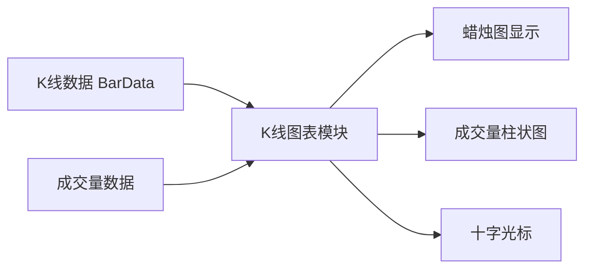
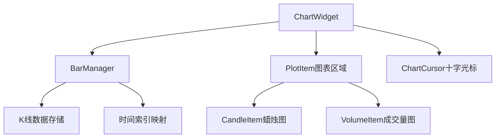
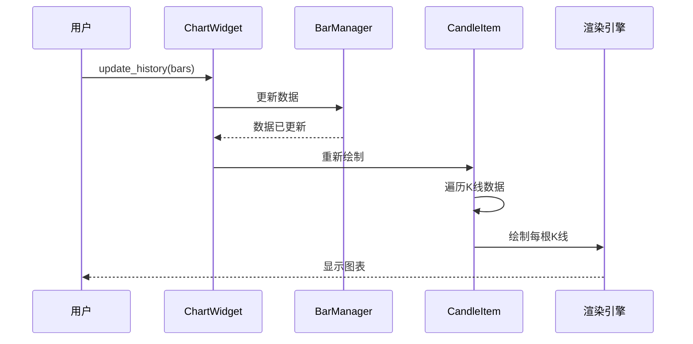

# Chapter 6: K线图表模块


在上一章中，我们学习了[数据库适配器](05_数据库适配器_.md)，了解了如何将K线数据永久保存到数据库中，并在需要时读取出来。但是，仅仅有数据是不够的——我们还需要一种方式来**可视化**这些数据，就像看盘软件中的行情走势图一样，直观地看到价格的变化。

在本章中，我们将学习**K线图表模块**，它是一个高性能的图表渲染组件，基于pyqtgraph库实现，能够实时显示K线走势，并支持缩放、滚动和十字光标等功能。

## 什么是K线图表模块？

想象你是一家股票交易公司的分析师。每天开盘后，你会紧盯行情软件中的走势图，观察股价的涨跌、成交量的变化。行情软件将枯燥的数字转换成直观的图表，让你一眼就能看出市场趋势。

**K线图表模块**就是VeighNa框架中实现类似功能的组件。它可以将K线数据和成交量数据渲染成专业的图表，就像这样：



### 核心功能

K线图表模块提供了以下核心功能：

1. **K线渲染**：将K线数据绘制成蜡烛图（或者美国线）
2. **成交量显示**：在下方显示对应的成交量柱状图
3. **缩放功能**：通过鼠标滚轮放大或缩小图表
4. **滚动功能**：通过鼠标拖动或键盘左右键查看历史数据
5. **十字光标**：鼠标移动时显示十字光标，实时显示K线信息

## 核心概念

在学习如何使用之前，我们需要了解几个核心概念。

### 1. K线数据（BarData）

在上一章中我们已经学习过，BarData是K线数据的基本单位，包含一段时间内的开盘价、最高价、最低价、收盘价和成交量。图表模块就是根据这些数据来绘制K线图的。

### 2. 图表管理器（BarManager）

BarManager就像是一个**数据仓库**，负责存储和管理所有的K线数据。它提供了高效的方法来：

- 添加新的K线数据
- 根据时间查找K线
- 计算价格范围和成交量范围

```python
from vnpy.chart.manager import BarManager
from vnpy.object import BarData
from datetime import datetime

# 创建图表管理器
manager = BarManager()

# 添加K线数据
bar = BarData(
    symbol="IF2106",
    exchange=Exchange.CFFEX,
    datetime=datetime(2021, 6, 18, 10, 0),
    interval=Interval.MINUTE,
    open_price=5100.0,
    high_price=5120.0,
    low_price=5090.0,
    close_price=5115.0,
    volume=100
)
manager.update_bar(bar)

# 获取总K线数量
print(f"K线数量: {manager.get_count()}")
```

### 3. 图表项（ChartItem）

ChartItem是图表上的各种图形元素的基类。VeighNa提供了两种常用的图表项：

- **CandleItem**：蜡烛图项，负责绘制K线
- **VolumeItem**：成交量项，负责绘制成交量柱状图

### 4. 图表组件（ChartWidget）

ChartWidget是整个图表模块的核心组件，它是一个基于pyqtgraph的PlotWidget，承载了所有的图表元素。

### 5. 十字光标（ChartCursor）

十字光标是图表上的辅助功能，当鼠标移动时，会显示一条竖线和一条横线，实时显示当前K线的信息。

## 如何使用K线图表模块

让我们通过一个简单的例子来学习如何使用K线图表模块。

### 第一步：创建图表组件

```python
from vnpy.chart.widget import ChartWidget

# 创建图表组件
chart_widget = ChartWidget()
```

### 第二步：添加图表区域

图表组件可以包含多个区域（plot），每个区域可以显示不同的内容。

```python
# 添加K线图表区域（主图）
chart_widget.add_plot(
    plot_name="K线",
    minimum_height=400  # 最小高度400像素
)

# 添加成交量图表区域（副图）
chart_widget.add_plot(
    plot_name="成交量",
    minimum_height=150,
    hide_x_axis=True  # 隐藏X轴（与主图共享）
)
```

### 第三步：添加图表项

```python
from vnpy.chart.item import CandleItem, VolumeItem

# 添加K线蜡烛图到主图
chart_widget.add_item(
    item_class=CandleItem,
    item_name="K线",
    plot_name="K线"
)

# 添加成交量柱状图到副图
chart_widget.add_item(
    item_class=VolumeItem,
    item_name="成交量",
    plot_name="成交量"
)
```

### 第四步：添加十字光标

十字光标可以让我们更方便地查看K线信息。

```python
# 添加十字光标
chart_widget.add_cursor()
```

### 第五步：加载K线数据

现在我们可以加载历史K线数据并显示在图表上。

```python
from vnpy.trader.database import get_database
from vnpy.trader.constant import Exchange, Interval
from datetime import datetime, timedelta

# 从数据库加载K线数据
db = get_database()
end_time = datetime.now()
start_time = end_time - timedelta(days=30)  # 最近30天

bars = db.load_bar_data(
    symbol="IF2106",
    exchange=Exchange.CFFEX,
    interval=Interval.MINUTE,
    start=start_time,
    end=end_time
)

# 更新图表数据
chart_widget.update_history(bars)
```

### 第六步：显示窗口

最后，显示图表窗口。

```python
# 显示图表
chart_widget.show()
```

## 完整示例：创建一个简单的K线图表

下面是一个完整的示例，展示了如何创建一个显示K线数据的图表窗口：

```python
from vnpy.chart.widget import ChartWidget
from vnpy.chart.item import CandleItem, VolumeItem
from vnpy.object import BarData
from vnpy.trader.constant import Exchange, Interval
from datetime import datetime, timedelta

# 1. 创建图表组件
chart = ChartWidget()

# 2. 添加图表区域
chart.add_plot("K线", minimum_height=400)
chart.add_plot("成交量", minimum_height=150, hide_x_axis=True)

# 3. 添加图表项
chart.add_item(CandleItem, "K线", "K线")
chart.add_item(VolumeItem, "成交量", "成交量")

# 4. 添加十字光标
chart.add_cursor()

# 5. 创建模拟数据（实际使用时从数据库读取）
bars = []
for i in range(100):
    base_price = 5000 + i * 2
    bar = BarData(
        symbol="IF2106",
        exchange=Exchange.CFFEX,
        datetime=datetime(2021, 6, 18, 10, 0) + timedelta(minutes=i*5),
        interval=Interval.MINUTE,
        open_price=base_price,
        high_price=base_price + 10,
        low_price=base_price - 10,
        close_price=base_price + 5,
        volume=100 + i
    )
    bars.append(bar)

# 6. 加载数据
chart.update_history(bars)

# 7. 显示图表
chart.show()

print("K线图表已显示")
```

运行后，你会看到一个图表窗口，显示了100根K线数据。你可以用鼠标滚轮缩放，用键盘左右键或鼠标拖动来滚动查看历史数据。

## 实时更新K线数据

除了加载历史数据，图表模块还支持实时更新最新的K线数据。

```python
# 当收到新的K线数据时，更新图表
def on_new_bar(bar: BarData):
    chart.update_bar(bar)

# 模拟实时更新
import time
for i in range(10):
    new_bar = BarData(
        symbol="IF2106",
        exchange=Exchange.CFFEX,
        datetime=datetime.now(),
        interval=Interval.MINUTE,
        open_price=5100 + i,
        high_price=5110 + i,
        low_price=5090 + i,
        close_price=5105 + i,
        volume=100
    )
    chart.update_bar(new_bar)
    time.sleep(1)  # 等待1秒
```

## 内部实现原理

现在让我们深入了解K线图表模块是如何工作的。

### 整体架构

K线图表模块由以下几个核心组件组成：



### 渲染流程

当你调用 `update_history(bars)` 时，发生了什么？



### 核心代码解析

**1. BarManager 数据管理**

BarManager使用字典来存储K线数据，并维护时间戳到索引的映射：

```python
class BarManager:
    def __init__(self):
        self._bars = {}                    # K线数据字典
        self._datetime_index_map = {}       # 时间 -> 索引
        self._index_datetime_map = {}       # 索引 -> 时间

    def update_bar(self, bar: BarData):
        dt = bar.datetime
        if dt not in self._datetime_index_map:
            ix = len(self._bars)
            self._datetime_index_map[dt] = ix
            self._index_datetime_map[ix] = dt
        self._bars[dt] = bar
```

**2. CandleItem 绘制K线**

CandleItem负责将每根K线绘制成蜡烛图形状：

```python
def _draw_bar_picture(self, ix, bar):
    # 创建画布
    picture = QtGui.QPicture()
    painter = QtGui.QPainter(picture)
    
    # 根据涨跌设置颜色
    if bar.close_price >= bar.open_price:
        painter.setPen(self._up_pen)
        painter.setBrush(self._black_brush)
    else:
        painter.setPen(self._down_pen)
        painter.setBrush(self._down_brush)
    
    # 绘制上下影线
    painter.drawLine(
        QtCore.QPointF(ix, bar.high_price),
        QtCore.QPointF(ix, bar.low_price)
    )
    
    # 绘制蜡烛实体
    rect = QtCore.QRectF(
        ix - BAR_WIDTH, bar.open_price,
        BAR_WIDTH * 2, bar.close_price - bar.open_price
    )
    painter.drawRect(rect)
    
    painter.end()
    return picture
```

**3. ChartWidget 缩放功能**

ChartWidget支持通过鼠标滚轮来缩放图表：

```python
def wheelEvent(self, event):
    delta = event.angleDelta()
    
    if delta.y() > 0:
        # 放大：减少可见K线数量
        self._bar_count = int(self._bar_count / 1.2)
    elif delta.y() < 0:
        # 缩小：增加可见K线数量
        self._bar_count = int(self._bar_count * 1.2)
    
    self._update_x_range()
```

**4. ChartCursor 十字光标**

十字光标会在鼠标移动时显示当前K线的信息：

```python
def _mouse_moved(self, evt):
    # 获取鼠标位置
    pos = evt
    
    # 转换为图表坐标
    mouse_point = view.mapSceneToView(pos)
    self._x = int(mouse_point.x())
    
    # 获取对应的K线数据
    bar = self._manager.get_bar(self._x)
    
    # 显示K线信息
    if bar:
        info_text = f"日期: {bar.datetime}\n"
        info_text += f"开盘: {bar.open_price}\n"
        info_text += f"最高: {bar.high_price}\n"
        info_text += f"最低: {bar.low_price}\n"
        info_text += f"收盘: {bar.close_price}"
```

## 在VeighNa框架中使用图表

在实际项目中，图表模块通常与主引擎结合使用。下面是一个简单的示例：

```python
from vnpy.trader.engine import MainEngine
from vnpy.event import EventEngine
from vnpy.chart.widget import ChartWidget
from vnpy.chart.item import CandleItem, VolumeItem

# 初始化引擎
event_engine = EventEngine()
main_engine = MainEngine(event_engine)

# 创建图表
chart = ChartWidget()
chart.add_plot("K线", 400)
chart.add_plot("成交量", 150, True)
chart.add_item(CandleItem, "K线", "K线")
chart.add_item(VolumeItem, "成交量", "成交量")
chart.add_cursor()

# 注册行情事件
def on_tick(event):
    tick = event.data
    # 将Tick数据转换为K线（简化处理）
    bar = convert_tick_to_bar(tick)
    chart.update_bar(bar)

main_engine.register("eTick", on_tick)

# 显示图表
chart.show()
```

## 小结

本章我们学习了K线图表模块的核心概念：

1. **什么是K线图表模块**：用于可视化显示K线数据的组件，基于pyqtgraph实现
2. **核心组件**：
   - BarManager：管理K线数据
   - CandleItem：绘制蜡烛图
   - VolumeItem：绘制成交量
   - ChartWidget：图表容器
   - ChartCursor：十字光标
3. **功能**：显示K线、成交量，支持缩放、滚动、十字光标
4. **使用方法**：创建组件 → 添加图表区域 → 添加图表项 → 加载数据 → 显示

通过K线图表模块，我们可以将枯燥的数字转换成直观的图表，更方便地分析市场走势。结合之前学到的数据库模块，我们可以实现从数据存储到可视化的完整流程。

在下一章中，我们将学习[开平转换器](07_开平转换器_.md)，了解如何处理期货交易中的开仓、平仓逻辑。

---

[第7章：开平转换器](07_开平转换器_.md)

---

Generated by [AI Codebase Knowledge Builder](https://github.com/The-Pocket/Tutorial-Codebase-Knowledge)