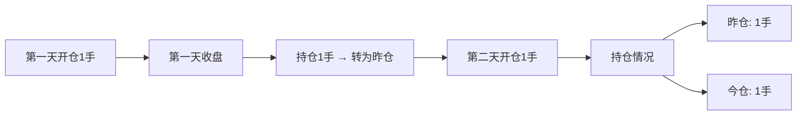
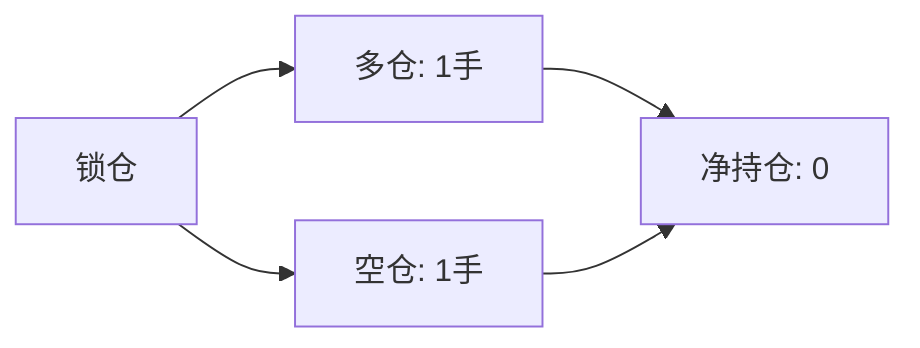
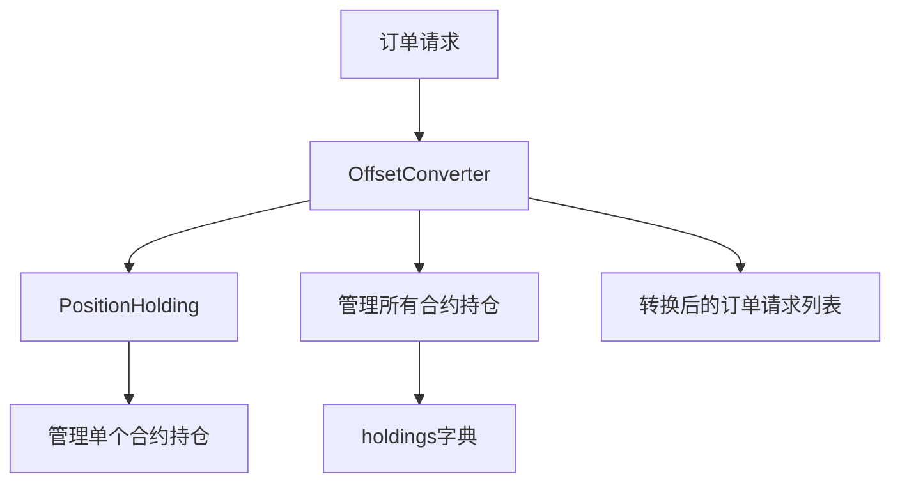
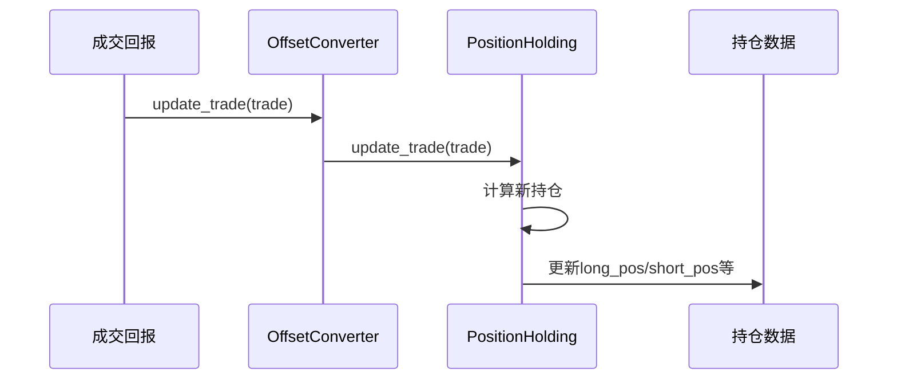

# Chapter 7: 开平转换器


在上一章中，我们学习了[K线图表模块](06_k线图表模块_.md)，了解了如何将K线数据以图表的形式可视化展示。这对于分析市场走势非常有帮助。

但是在期货交易中，除了分析行情，还有一个重要的问题需要解决：**如何正确地处理开仓和平仓？** 期货与股票不同，它涉及今仓、昨仓的区分，还有锁仓、净仓等多种持仓管理方式。

本章我们将学习**开平转换器**，它就像一个**财务计算器**，确保每一笔交易都被正确记录和计算。

## 什么是开平转换器？

想象你是一家大型仓库的管理员。你的仓库有两个区域：
- **昨日库存区**：昨天结束时剩下的货物
- **今日入库区**：今天新进的货物

当有客户要提货时，你需要决定：从哪个区域出货？先出昨日库存还是今日入库？这会影响仓库的库存统计和成本计算。

在期货交易中，情况类似：
- **昨仓**：昨天收盘前持有的仓位
- **今仓**：今天新开立的仓位
- **开仓**：建立新的仓位
- **平仓**：了结已有的仓位

不同的交易所和交易规则对这些有不同的要求。比如：
- 上海期货交易所（SHFE）要求必须区分平今和平昨
- 有些投资者使用锁仓策略（同时持有多空两个方向）
- 有些投资者只关心净持仓（多头减去空头）

**开平转换器**的作用就是：根据当前的持仓状况和交易规则，自动将你发送的"平仓"请求转换成正确的开平指令（今仓平仓、昨仓平仓，或者锁仓操作等）。

## 核心概念

在学习如何使用之前，我们需要了解几个核心概念。

### 1. 今仓与昨仓

期货是每日结算制度，每天收盘后，未平仓的合约会转为明天的持仓：



- **昨仓（Yd/昨日持仓）**：之前交易日开仓，当天尚未平仓的仓位
- **今仓（Td/今日持仓）**：当天交易时间内开仓的仓位

### 2. 开平标志（Offset）

期货订单中的开平标志决定了你是建立新仓位还是了结旧仓位：

| 开平标志 | 含义 | 说明 |
|---------|------|------|
| **开仓（OPEN）** | 建立新仓位 | 买入或卖出开多或开空 |
| **平仓（CLOSE）** | 平掉已有仓位 | 卖出或买入平多或平空 |
| **平今（CLOSETODAY）** | 平掉今天的仓位 | 只平今仓 |
| **平昨（CLOSEYESTERDAY）** | 平掉昨天的仓位 | 只平昨仓 |

### 3. 锁仓模式与净仓模式

期货交易有两种持仓管理模式：

**锁仓模式**：同时持有相同数量的多仓和空仓，就像同时打开两把锁互相锁住。这样无论行情涨跌，总有一个仓位是盈利的。



**净仓模式**：只关注净持仓（多头减去空头），就像只关心最终是赚还是亏。

### 4. 持仓Holding

开平转换器使用一个叫做`PositionHolding`的类来追踪每个合约的持仓状况：

```python
# 持仓信息的简化表示
position_info = {
    "vt_symbol": "IF2106.CFFEX",  # 合约标识
    "long_pos": 3,     # 多头总持仓
    "long_yd": 2,      # 多头昨仓
    "long_td": 1,      # 多头今仓
    "short_pos": 1,    # 空头总持仓
    "short_yd": 1,     # 空头昨仓
    "short_td": 0,     # 空头今仓
}
```

## 如何使用开平转换器

开平转换器通常与主引擎结合使用，不需要单独创建。下面我们通过例子来了解它的工作方式。

### 第一步：创建主引擎（自动包含开平转换器）

```python
from vnpy.trader.engine import MainEngine
from vnpy.event import EventEngine

# 创建主引擎
event_engine = EventEngine()
main_engine = MainEngine(event_engine)

# 主引擎会自动创建开平转换器
```

### 第二步：获取开平转换器

```python
# 从主引擎获取开平转换器
converter = main_engine.get_engine("offset_converter")
print(f"开平转换器: {converter}")
```

### 第三步：转换订单请求

当你发送一个平仓订单时，开平转换器会根据当前持仓自动判断应该如何平仓：

```python
from vnpy.object import OrderRequest
from vnpy.trader.constant import Direction, Offset, Exchange, OrderType

# 假设当前持有2手IF2106多头昨仓
# 现在发送一个平仓请求（卖出平多）
req = OrderRequest(
    symbol="IF2106",
    exchange=Exchange.CFFEX,
    direction=Direction.SHORT,    # 卖出
    type=OrderType.LIMIT,         # 限价单
    volume=2,                     # 数量2手
    price=5100.0,
    offset=Offset.CLOSE           # 平仓（不区分今昨）
)

# 开平转换器会自动将其转换为正确的平仓方式
# 对于非SHFE/INE交易所，可能转换为平昨
converted_reqs = converter.convert_order_request(req, lock=False, net=False)

print(f"原始请求: {req.offset.value}")
for i, converted_req in enumerate(converted_reqs):
    print(f"转换后请求{i+1}: {converted_req.offset.value} {converted_req.volume}手")
```

运行后，你会看到类似这样的输出：

```
原始请求: close
转换后请求1: close 2手
```

### 锁仓模式示例

如果你使用锁仓模式，开平转换器会自动处理：

```python
# 发送一个空头开仓请求（但当前有多头持仓）
req = OrderRequest(
    symbol="IF2106",
    exchange=Exchange.CFFEX,
    direction=Direction.SHORT,
    type=OrderType.LIMIT,
    volume=1,
    price=5100.0,
    offset=Offset.OPEN
)

# 启用锁仓模式转换
converted_reqs = converter.convert_order_request(req, lock=True, net=False)

print(f"原始请求: {req.offset.value}")
for i, converted_req in enumerate(converted_reqs):
    print(f"转换后请求{i+1}: {converted_req.offset.value} {converted_req.volume}手")
```

### 净仓模式示例

```python
# 净仓模式下，系统只关心净持仓
converted_reqs = converter.convert_order_request(req, lock=False, net=True)

# 对于SHFE/INE交易所，会自动区分平今和平昨
```

## 内部实现原理

现在让我们深入了解开平转换器是如何工作的。

### 整体架构

开平转换器主要由两个类组成：



### 持仓更新的流程

当你成交一笔交易后，开平转换器会更新持仓数据：



### 核心代码解析

**1. PositionHolding 类**

这个类负责管理单个合约的持仓信息：

```python
class PositionHolding:
    def __init__(self, contract):
        self.vt_symbol = contract.vt_symbol
        self.exchange = contract.exchange
        
        # 多头持仓
        self.long_pos = 0      # 总持仓
        self.long_yd = 0      # 昨仓
        self.long_td = 0      # 今仓
        
        # 空头持仓
        self.short_pos = 0
        self.short_yd = 0
        self.short_td = 0
        
        # 冻结数量
        self.long_pos_frozen = 0
        self.short_pos_frozen = 0
```

**2. 更新成交数据**

当成交发生时，需要更新持仓：

```python
def update_trade(self, trade):
    if trade.direction == Direction.LONG:
        if trade.offset == Offset.OPEN:
            # 开多仓
            self.long_td += trade.volume
        elif trade.offset == Offset.CLOSETODAY:
            # 平今仓
            self.short_td -= trade.volume
        elif trade.offset == Offset.CLOSEYESTERDAY:
            # 平昨仓
            self.short_yd -= trade.volume
        # ... 更多情况
    
    # 更新总持仓
    self.long_pos = self.long_td + self.long_yd
    self.short_pos = self.short_td + self.short_yd
```

**3. 上海期货交易所的转换逻辑**

SHFE和INE交易所要求严格区分平今和平昨：

```python
def convert_order_request_shfe(self, req):
    # 如果是开仓，直接返回
    if req.offset == Offset.OPEN:
        return [req]
    
    # 计算可用平仓数量
    if req.direction == Direction.LONG:
        pos_available = self.short_pos - self.short_pos_frozen
        td_available = self.short_td - self.short_td_frozen
    
    # 根据可用数量决定平仓方式
    if req.volume <= td_available:
        # 全部平今
        req_td = copy(req)
        req_td.offset = Offset.CLOSETODAY
        return [req_td]
    else:
        # 部分平今，部分平昨
        req_list = []
        # ... 拆分订单
        return req_list
```

**4. 锁仓模式的转换逻辑**

锁仓模式需要特殊处理，避免出现今仓：

```python
def convert_order_request_lock(self, req):
    close_yd_exchanges = {Exchange.SHFE, Exchange.INE}
    
    # 如果有今仓，只能开仓（锁仓）
    if self.exchange not in close_yd_exchanges:
        req_open = copy(req)
        req_open.offset = Offset.OPEN
        return [req_open]
    else:
        # 先平昨仓，再开新仓
        req_list = []
        # ... 处理逻辑
        return req_list
```

### 冻结数量的计算

在发送平仓订单前，需要计算有多少仓位已经被冻结（pending）：

```python
def calculate_frozen(self):
    # 重置冻结数量
    self.long_pos_frozen = 0
    self.short_pos_frozen = 0
    
    # 遍历所有活跃订单
    for order in self.active_orders.values():
        # 忽略开仓订单
        if order.offset == Offset.OPEN:
            continue
        
        frozen = order.volume - order.traded
        
        # 计算冻结数量
        if order.direction == Direction.LONG:
            if order.offset == Offset.CLOSETODAY:
                self.short_td_frozen += frozen
            # ... 其他情况
```

## 完整示例：模拟完整的交易流程

下面是一个完整的示例，展示了开平转换器如何处理各种交易场景：

```python
from vnpy.object import TradeData, OrderRequest
from vnpy.trader.constant import Direction, Offset, Exchange
from datetime import datetime

# 模拟创建持仓
class MockConverter:
    def __init__(self):
        self.long_td = 1  # 今仓1手
        self.long_yd = 2  # 昨仓2手
        self.short_td = 0
        self.short_yd = 0
    
    def convert_close(self, volume, direction):
        if direction == Direction.SHORT:
            # 平多仓：先平今仓，再平昨仓
            td_available = self.long_td
            if volume <= td_available:
                return [("CLOSETODAY", volume)]
            else:
                return [
                    ("CLOSETODAY", td_available),
                    ("CLOSEYESTERDAY", volume - td_available)
                ]
        return []

# 测试转换
converter = MockConverter()
print("当前持仓: 今仓1手, 昨仓2手")
print("平仓2手: ", converter.convert_close(2, Direction.SHORT))
print("平仓3手: ", converter.convert_close(3, Direction.SHORT))
```

运行后输出：

```
当前持仓: 今仓1手, 昨仓2手
平仓2手:  [('CLOSETODAY', 1), ('CLOSEYESTERDAY', 1)]
平仓3手:  [('CLOSETODAY', 1), ('CLOSEYESTERDAY', 2)]
```

## 小结

本章我们学习了开平转换器的核心概念：

1. **什么是开平转换器**：处理期货交易中开平仓逻辑的组件，确保每一笔交易都被正确计算
2. **核心概念**：
   - 今仓与昨仓：当天开仓 vs 之前开仓
   - 开平标志：OPEN、CLOSE、CLOSETODAY、CLOSEYESTERDAY
   - 锁仓模式 vs 净仓模式
3. **如何使用**：通过`convert_order_request`方法自动转换订单
4. **内部原理**：
   - `PositionHolding`类管理单个合约的持仓
   - 根据交易所规则和持仓情况自动拆分订单
   - 自动计算冻结数量，防止超额平仓

开平转换器就像一个智能的财务计算器，帮我们处理期货交易中复杂的开平仓逻辑。这样交易者只需要发送简单的"平仓"指令，系统会自动计算出正确的平仓方式。

在下一章中，我们将学习[策略回测与优化](08_策略回测与优化_.md)，了解如何利用历史数据来测试和优化我们的交易策略。

---

[第8章：策略回测与优化](08_策略回测与优化_.md)

---

Generated by [AI Codebase Knowledge Builder](https://github.com/The-Pocket/Tutorial-Codebase-Knowledge)