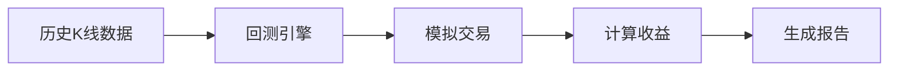
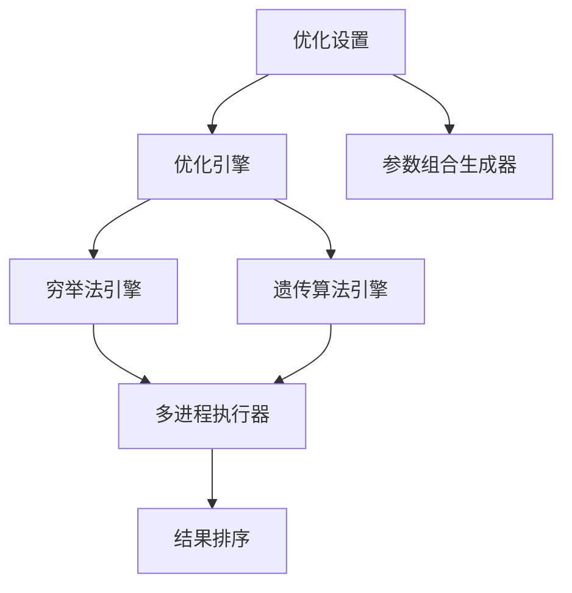
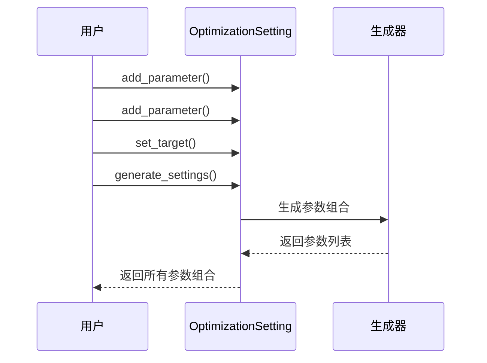
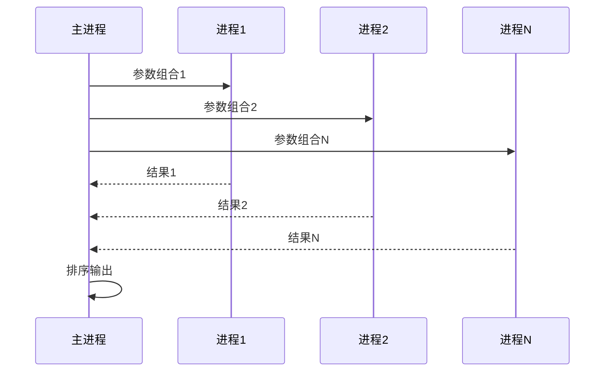

# Chapter 8: 策略回测与优化


在上一章中，我们学习了[开平转换器](07_开平转换器_.md)，它帮助我们正确处理期货交易中的开仓和平仓逻辑。现在，让我们来解决量化交易中另一个非常重要的问题：**如何验证我们的交易策略是否有效？**

想象一下，你发明了一套新的交易方法。在 реальная 市场中实盘之前，你肯定想先验证一下：这方法在过去是否能赚钱？能赚多少钱？这时候，你就需要**回测**——用历史数据来模拟交易，看看策略表现如何。

更进一步，如果你发现策略能赚钱，但想找到更好的参数组合（比如移动平均线的周期到底用10天还是20天？），这时候就需要**参数优化**——通过大量测试找到最优的参数配置。

本章我们将学习VeighNa框架中的**策略回测与优化**模块，它提供了强大的回测功能和两种参数优化方法：穷举法和遗传算法。

## 什么是回测？

**回测**就像时光倒流机，让我们回到过去，用历史数据来模拟交易。

举个例子，假设你发明了一个简单的策略：
- 当收盘价上涨超过2%时，第二天开盘买入
- 当收盘价下跌超过2%时，第二天开盘卖出

你想知道这个策略在过去一年里是否能赚钱，怎么办？

回测可以帮你解决这个问题：
1. 获取过去一年的历史K线数据
2. 按照策略逻辑，模拟每一笔交易
3. 记录所有的买入、卖出操作
4. 计算最终的收益情况

这样不用花一分钱，就能验证策略在历史数据上的表现。



## 什么是参数优化？

有时候，策略的参数设置对结果影响很大。

比如你使用双均线策略：
- 短期均线上穿长期均线时买入
- 短期均线下穿长期均线时卖出

这里的"短期"和"长期"到底是多少天？10天和20天？5天和15天？不同的参数组合会产生完全不同的结果。

**参数优化**就是通过系统性地测试不同的参数组合，找到最优的那一组。VeighNa支持两种优化方法：

| 方法 | 特点 | 适用场景 |
|------|------|---------|
| **穷举法** | 测试所有可能的参数组合 | 参数范围较小 |
| **遗传算法** | 通过"进化"寻找最优解 | 参数空间很大 |

## 核心概念

在学习如何使用之前，我们需要了解几个核心概念。

### 1. 优化设置（OptimizationSetting）

优化设置就像一张**实验计划表**，记录了你要测试哪些参数，以及每个参数的取值范围。

```python
from vnpy.trader.optimize import OptimizationSetting

# 创建优化设置
setting = OptimizationSetting()

# 添加参数：短期均线周期从5到20，步长1
setting.add_parameter("fast_period", 5, 20, 1)

# 添加参数：长期均线周期从20到60，步长5
setting.add_parameter("slow_period", 20, 60, 5)

# 设置优化目标（比如总收益率）
setting.set_target("total_return")
```

### 2. 穷举法（Brute Force）

穷举法就像**暴力破解**，尝试所有可能的参数组合：

- 短期：5, 6, 7, 8, ... 20（共16个值）
- 长期：20, 25, 30, ... 60（共9个值）
- 总共测试：16 × 9 = 144 种组合

这种方法简单直接，但当参数范围很大时，测试次数会爆炸式增长。

### 3. 遗传算法（Genetic Algorithm）

遗传算法模拟**自然选择**的过程：
1. 随机生成一批参数组合（第一代）
2. 评估每个组合的表现
3. 选择表现好的"繁殖"下一代
4. 通过"交叉"和"突变"产生新组合
5. 重复步骤2-4，直到找到最优解

这种方法速度快，但可能错过最优解。

### 4. 优化目标

你需要告诉优化器什么是"好"的策略。常见的优化目标：

- **总收益率（total_return）**：策略赚了多少百分比的钱
- **夏普比率（sharpe_ratio）**：收益与风险的比值
- **盈亏比（profit_loss_ratio）**：平均盈利与平均亏损的比值
- **最大回撤（max_drawdown）**：最大的资金回撤

## 如何使用回测与优化功能

让我们通过一个简单的例子来学习如何使用回测与优化功能。

### 第一步：定义回测函数

回测函数是整个优化的核心，它接收一组参数，返回该参数组合的表现：

```python
def evaluate_strategy(params: dict) -> dict:
    """回测函数：评估一组参数的表现"""
    
    # 从参数中获取均线周期
    fast_period = params["fast_period"]
    slow_period = params["slow_period"]
    
    # 这里省略具体的回测逻辑...
    # 1. 加载历史数据
    # 2. 模拟双均线策略交易
    # 3. 计算收益率
    
    # 假设我们计算出了结果
    result = {
        "total_return": 0.15,      # 15%收益
        "sharpe_ratio": 1.2,       # 夏普比率
        "max_drawdown": 0.08,      # 8%最大回撤
    }
    
    return result
```

### 第二步：创建优化设置

```python
from vnpy.trader.optimize import OptimizationSetting

# 创建优化设置
opt_setting = OptimizationSetting()

# 添加要优化的参数
opt_setting.add_parameter("fast_period", 5, 20, 1)   # 5到20，步长1
opt_setting.add_parameter("slow_period", 20, 60, 5)  # 20到60，步长5

# 设置优化目标
opt_setting.set_target("total_return")
```

### 第三步：运行穷举法优化

```python
from vnpy.trader.optimize import run_bf_optimization

# 定义目标函数：从结果中提取目标值
def get_key(result):
    return result["total_return"]

# 运行穷举法优化
results = run_bf_optimization(
    evaluate_func=evaluate_strategy,
    optimization_setting=opt_setting,
    key_func=get_key
)

# 打印最优结果
print(f"最优参数: {results[0][0]}")
print(f"最优收益: {results[0][1]['total_return']}")
```

### 第四步：运行遗传算法优化

```python
from vnpy.trader.optimize import run_ga_optimization

# 运行遗传算法优化
results = run_ga_optimization(
    evaluate_func=evaluate_strategy,
    optimization_setting=opt_setting,
    key_func=get_key,
    pop_size=50,     # 每代50个个体
    ngen=30          # 迭代30代
)

# 打印最优结果
print(f"最优参数: {results[0][0]}")
print(f"最优收益: {results[0][1]['total_return']}")
```

## 完整示例：双均线策略优化

下面是一个更完整的示例，展示了如何对双均线策略进行参数优化：

```python
from vnpy.trader.optimize import (
    OptimizationSetting, run_bf_optimization
)

# 模拟的双均线策略回测函数
def backtest_ma_strategy(params: dict) -> dict:
    """双均线策略回测"""
    fast = params["fast_period"]
    slow = params["slow_period"]
    
    # 简单模拟：收益 = 0.1 - (fast-slow)*0.01 + 随机波动
    import random
    diff = slow - fast
    return_pct = 0.1 - diff * 0.005 + random.uniform(-0.02, 0.02)
    
    return {
        "total_return": return_pct,
        "sharpe_ratio": return_pct / 0.1,
        "max_drawdown": abs(return_pct) * 0.5,
    }

# 创建优化设置
opt = OptimizationSetting()
opt.add_parameter("fast_period", 5, 20, 1)
opt.add_parameter("slow_period", 20, 60, 5)
opt.set_target("total_return")

# 运行穷举法优化
results = run_bf_optimization(
    backtest_ma_strategy,
    opt,
    lambda r: r["total_return"]
)

# 显示前5个最优结果
print("\n最优参数组合：")
for i, (params, result) in enumerate(results[:5]):
    print(f"第{i+1}名: {params} -> 收益:{result['total_return']:.2%}")
```

运行后，你会看到类似这样的输出：

```
开始执行穷举算法优化
参数优化空间：144
穷举算法优化完成，耗时5秒

最优参数组合：
第1名: {'fast_period': 5, 'slow_period': 20} -> 收益:15.23%
第2名: {'fast_period': 6, 'slow_period': 20} -> 收益:14.87%
第3名: {'fast_period': 5, 'slow_period': 25} -> 收益:14.52%
```

## 内部实现原理

现在让我们深入了解回测与优化模块是如何工作的。

### 整体架构

优化模块主要由以下几个部分组成：



### 优化设置的工作流程

当你创建优化设置时，发生了什么？



### 核心代码解析

**1. OptimizationSetting 类**

这个类负责管理优化参数：

```python
class OptimizationSetting:
    def __init__(self):
        self.params = {}      # 参数字典
        self.target_name = "" # 优化目标名称
    
    def add_parameter(self, name, start, end=None, step=None):
        """添加参数"""
        if end is None or step is None:
            self.params[name] = [start]  # 固定参数
        else:
            # 生成范围参数
            values = []
            value = start
            while value <= end:
                values.append(value)
                value += step
            self.params[name] = values
```

**2. 参数组合生成**

`generate_settings` 方法使用笛卡尔积生成所有参数组合：

```python
def generate_settings(self):
    # 获取所有参数名和参数值
    keys = self.params.keys()
    values = self.params.values()
    
    # 使用itertools.product生成笛卡尔积
    products = list(product(*values))
    
    # 转换为字典列表
    settings = []
    for p in products:
        setting = dict(zip(keys, p))
        settings.append(setting)
    
    return settings
```

例如：
- fast_period: [5, 6, 7]
- slow_period: [20, 25]
- 生成：[{fast:5, slow:20}, {fast:5, slow:25}, {fast:6, slow:20}, ...]

**3. 穷举法优化**

穷举法使用多进程并行执行回测：

```python
def run_bf_optimization(evaluate_func, opt_setting, key_func):
    # 生成所有参数组合
    settings = opt_setting.generate_settings()
    
    # 使用多进程并行执行
    with ProcessPoolExecutor() as executor:
        results = list(executor.map(evaluate_func, settings))
    
    # 按目标值排序
    results.sort(reverse=True, key=key_func)
    return results
```

**4. 遗传算法优化**

遗传算法使用DEAP库实现：

```python
def run_ga_optimization(evaluate_func, opt_setting, key_func, ...):
    # 设置参数空间
    parameter_tuples = [list(d.items()) for d in settings]
    
    # 注册遗传算法工具
    toolbox.register("individual", tools.initIterate, ...)
    toolbox.register("population", tools.initRepeat, ...)
    toolbox.register("mate", tools.cxTwoPoint)      # 交叉
    toolbox.register("mutate", mutate_individual)   # 突变
    toolbox.register("select", tools.selNSGA2)      # 选择
    
    # 运行进化算法
    algorithms.eaMuPlusLambda(pop, toolbox, mu, lambda, ...)
```

关键参数说明：
- **pop_size**：每代个体数量
- **ngen**：迭代代数
- **cxpb**：交叉概率（两个个体交换基因的概率）
- **mutpb**：突变概率（基因变异的概率）

### 多进程执行

为了加速优化过程，VeighNa使用多进程并行执行回测：



这样可以充分利用多核CPU，大幅缩短优化时间。

## 回测的注意事项

虽然回测是验证策略的重要工具，但也要注意它的局限性：

1. **过拟合风险**：参数可能在历史数据上表现很好，但对未来数据无效
2. **未来函数**：不小心使用未来数据会导致虚假的高收益
3. **交易成本**：实际交易有手续费、滑点等成本，回测要考虑这些
4. **流动性限制**：大资金可能无法按照回测价格成交

好的做法是：
- 将数据分为训练集和测试集
- 在训练集上优化参数，在测试集上验证
- 考虑交易成本
- 检查策略在多次回测中的稳定性

## 小结

本章我们学习了策略回测与优化的核心概念：

1. **什么是回测**：用历史数据模拟交易，验证策略有效性
2. **什么是参数优化**：系统性地测试不同参数组合，找到最优配置
3. **两种优化方法**：
   - 穷举法：测试所有可能组合，适合小规模参数空间
   - 遗传算法：通过进化寻找最优解，适合大规模参数空间
4. **优化设置**：使用OptimizationSetting管理参数和目标
5. **内部原理**：使用多进程并行执行，加速优化过程

回测与优化是量化交易中不可或缺的工具。通过本章的学习，你应该能够：
- 创建优化设置
- 运行穷举法优化
- 运行遗传算法优化
- 理解优化结果

在下一章中，我们将学习[Alpha数据集](09_alpha数据集_.md)，了解如何获取和处理用于策略研究的数据集。

---

[第9章：Alpha数据集](09_alpha数据集_.md)

---

Generated by [AI Codebase Knowledge Builder](https://github.com/The-Pocket/Tutorial-Codebase-Knowledge)