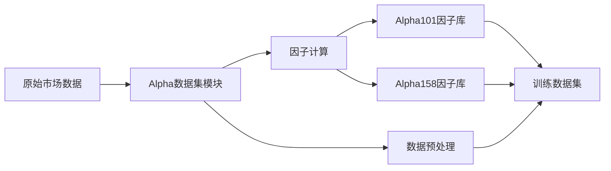
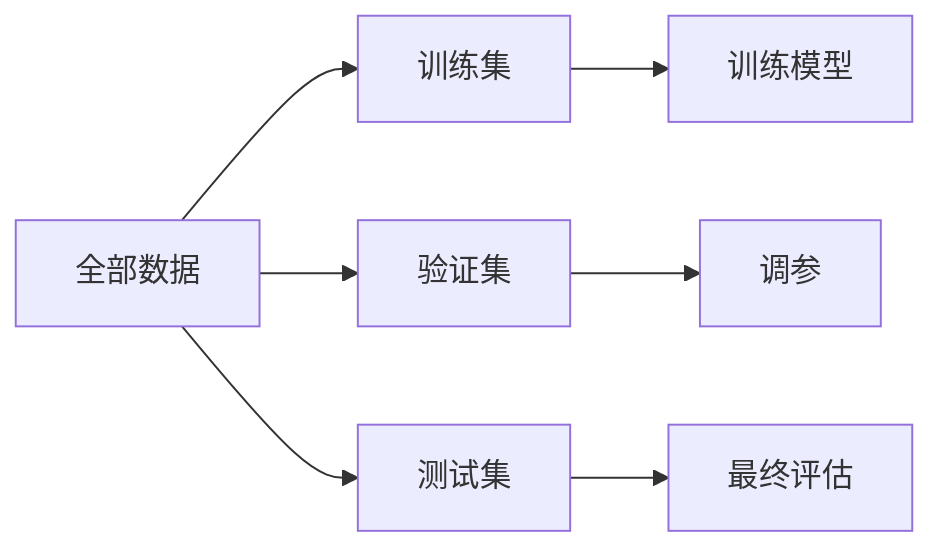
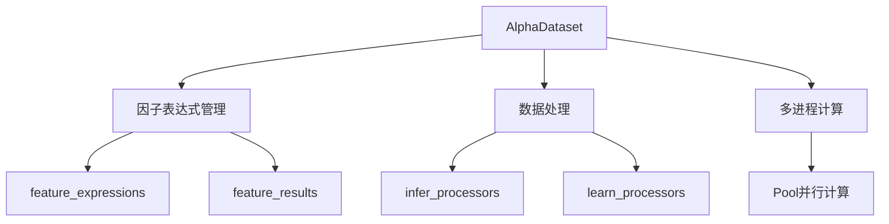
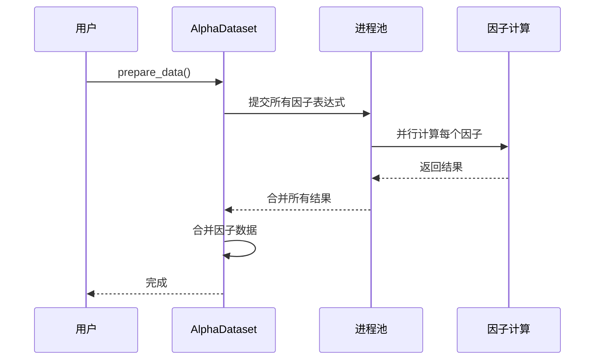

# Chapter 9: Alpha数据集


在上一章中，我们学习了[策略回测与优化](08_策略回测与优化_.md)，了解了如何利用历史数据来验证交易策略的有效性。但是，很多读者可能会问：回测需要的数据从哪里来？特别是那些用于机器学习的**因子数据**，该如何准备？

想象你是一家餐厅的厨师。要做一道美味的菜肴，你需要：
1. 好的食材（原始数据）
2. 各种调料和配料（因子特征）
3. 把食材处理成可以直接下锅的状态（数据预处理）

在量化交易中也是如此。要训练一个机器学习模型来预测股价走势，我们需要：
1. 原始的市场数据（价格、成交量等）
2. 经过计算的因子特征（比如移动平均、RSI等技术指标）
3. 处理好的、可以直接喂给模型的数据

**Alpha数据集**模块就是VeighNa框架中的"厨房"，专门负责准备这些"食材"——它提供了丰富的因子库，包括著名的Alpha101和Alpha158因子集，帮助你快速构建机器学习训练数据集。

## 什么是Alpha数据集？

Alpha数据模块是VeighNa框架中专门面向**机器学习多因子策略**的数据集模块。它的主要功能包括：

- **因子特征工程**：提供了大量预定义的因子表达式
- **数据处理**：支持数据筛选、填充、转换等操作
- **预处理功能**：将原始数据处理成机器学习模型可用的格式



### Alpha101因子库

Alpha101是WorldQuant发布的101个基础alpha因子，在量化领域非常有名。这些因子通过各种数学运算组合而成，能够捕捉市场的不同特征。

### Alpha158因子库

Alpha158是Qlib库提供的158个基础因子，包含了更多的技术指标和价量关系特征。

## 核心概念

在学习如何使用之前，我们需要了解几个核心概念。

### 1. 因子表达式

因子表达式就像是一个**数学公式**，用来描述如何从原始数据计算出一个新的特征值。

比如，简单的收益率因子可以这样表示：
```
(close / ts_delay(close, 1) - 1)
```

这个表达式的意思是：用今天的收盘价除以昨天的收盘价，再减去1，得到收益率。

### 2. 时间序列函数（ts_）

时间序列函数是计算因子的一把好手，它们基于历史数据进行计算：

- `ts_delay(close, 1)` - 获取N天前的收盘价
- `ts_mean(close, 20)` - 计算N天的收盘价均值（移动平均）
- `ts_std(close, 20)` - 计算N天收盘价的标准差
- `ts_rank(close, 20)` - 计算N天内收盘价的排名百分位

### 3. 截面函数（cs_）

截面函数用于在**同一时间点**对不同股票进行比较：

- `cs_rank(close)` - 对所有股票的收盘价进行排名
- `cs_mean(volume, 10)` - 对10只股票的成交量求均值

### 4. 数据分段

机器学习通常需要把数据分成三段：

- **训练集（Train）**：用于训练模型
- **验证集（Valid）**：用于调参和选择模型
- **测试集（Test）**：用于最终评估模型效果



## 如何使用Alpha数据集

让我们通过一个简单的例子来学习如何使用Alpha数据集。

### 第一步：准备原始数据

首先，你需要有原始的市场数据（价格、成交量等）：

```python
import polars as pl
from datetime import datetime

# 假设这是原始的市场数据
raw_data = pl.DataFrame({
    "datetime": [datetime(2021, 1, i) for i in range(1, 11)],
    "vt_symbol": ["000001.SSE"] * 10,
    "open": [100, 101, 102, 103, 104, 105, 106, 107, 108, 109],
    "high": [105, 106, 107, 108, 109, 110, 111, 112, 113, 114],
    "low": [99, 100, 101, 102, 103, 104, 105, 106, 107, 108],
    "close": [104, 105, 106, 107, 108, 109, 110, 111, 112, 113],
    "volume": [1000, 1100, 1200, 1300, 1400, 1500, 1600, 1700, 1800, 1900],
    "vwap": [102, 103, 104, 105, 106, 107, 108, 109, 110, 111]
})
```

### 第二步：创建Alpha158数据集

使用Alpha158因子库创建数据集非常简单：

```python
from vnpy.alpha.dataset.datasets.alpha_158 import Alpha158

# 定义数据时间段
train_period = ("2021-01-01", "2021-03-31")
valid_period = ("2021-04-01", "2021-04-30")
test_period = ("2021-05-01", "2021-05-31")

# 创建Alpha158数据集
dataset = Alpha158(
    df=raw_data,
    train_period=train_period,
    valid_period=valid_period,
    test_period=test_period
)
```

### 第三步：准备数据

调用`prepare_data`方法来计算所有因子：

```python
# 计算所有因子特征
dataset.prepare_data()

print("数据集准备完成！")
print(f"原始数据列: {raw_data.columns}")
print(f"处理后数据列数: {dataset.raw_df.columns}")
```

### 第四步：获取不同分段的数据

```python
# 获取训练集数据
train_df = dataset.fetch_raw("train")
print(f"训练集大小: {len(train_df)} 行")

# 获取验证集数据
valid_df = dataset.fetch_raw("valid")
print(f"验证集大小: {len(valid_df)} 行")

# 获取测试集数据
test_df = dataset.fetch_raw("test")
print(f"测试集大小: {len(test_df)} 行")
```

## 使用自定义因子表达式

除了使用预定义的因子库，你还可以添加自己的因子表达式。

### 添加单个因子

```python
from vnpy.alpha.dataset.template import AlphaDataset

# 创建数据集
dataset = AlphaDataset(
    df=raw_data,
    train_period=train_period,
    valid_period=valid_period,
    test_period=test_period
)

# 添加自定义因子：5日收益率
dataset.add_feature(
    name="return_5d",
    expression="close / ts_delay(close, 5) - 1"
)

# 设置标签：3天后收益率
dataset.set_label("ts_delay(close, -3) / close - 1")

# 准备数据
dataset.prepare_data()
```

### 使用数据处理器

数据处理器可以对数据进行额外的处理：

```python
# 定义一个处理器函数：标准化处理
def normalize_processor(df):
    # 对每个特征列进行z-score标准化
    for col in df.columns:
        if col not in ["datetime", "vt_symbol", "label"]:
            mean = df[col].mean()
            std = df[col].std()
            df = df.with_columns(
                ((df[col] - mean) / std).alias(col)
            )
    return df

# 添加处理器
dataset.add_processor("learn", normalize_processor)

# 处理数据
dataset.process_data()
```

## 完整示例：创建一个简单的因子数据集

下面是一个完整的示例，展示了如何使用Alpha数据集模块：

```python
import polars as pl
from datetime import datetime, timedelta
from vnpy.alpha.dataset.datasets.alpha_158 import Alpha158

# 1. 创建模拟数据（实际使用时从数据库读取）
dates = [datetime(2021, 1, 1) + timedelta(days=i) for i in range(100)]
data = {
    "datetime": dates * 10,  # 10只股票
    "vt_symbol": [f"60{i:04d}.SSE" for i in range(10)] * 100,
}

# 生成模拟的价格数据
import random
random.seed(42)
base_prices = [100 + random.random() * 10 for _ in range(10)]
prices = []
for bp in base_prices:
    for _ in range(100):
        bp += random.random() * 2 - 1
        prices.append(bp)

data["open"] = prices
data["high"] = [p + random.random() for p in prices]
data["low"] = [p - random.random() for p in prices]
data["close"] = [p + random.random() * 0.5 for p in prices]
data["volume"] = [random.randint(1000, 10000) for _ in range(1000)]
data["vwap"] = prices

df = pl.DataFrame(data)

# 2. 创建Alpha158数据集
dataset = Alpha158(
    df=df,
    train_period=("2021-01-01", "2021-03-31"),
    valid_period=("2021-04-01", "2021-04-30"),
    test_period=("2021-05-01", "2021-05-31")
)

# 3. 准备数据
dataset.prepare_data()

# 4. 查看结果
print(f"原始数据形状: {df.shape}")
print(f"处理后数据形状: {dataset.raw_df.shape}")
print(f"特征列数: {dataset.raw_df.width - 2}")  # 减去datetime和vt_symbol
```

运行后，你会看到类似这样的输出：

```
原始数据形状: (1000, 7)
处理后数据形状: (1000, 168)
特征列数: 166
```

这说明Alpha158数据集从原始的7列数据，生成了166个因子特征！

## 内部实现原理

现在让我们深入了解Alpha数据集模块是如何工作的。

### 整体架构

Alpha数据集模块主要由以下几个部分组成：



### 数据处理流程

当你调用`prepare_data`时，发生了什么？



### 因子计算的实现

因子表达式通过Python的`eval`函数来执行计算：

```python
# 简化的因子计算流程
def calculate_by_expression(df, expression):
    # 1. 导入所有函数到局部空间
    from .ts_function import ts_delay, ts_mean, ts_std
    from .cs_function import cs_rank
    # ... 更多函数
    
    # 2. 将DataFrame列转换为DataProxy对象
    d = locals()
    for col in df.columns:
        if col not in ["datetime", "vt_symbol"]:
            d[col] = DataProxy(df[["datetime", "vt_symbol", col]])
    
    # 3. 执行表达式计算
    result = eval(expression, {}, d)
    
    # 4. 返回结果DataFrame
    return result.df
```

### DataProxy类

DataProxy是实现因子计算的核心类，它重载了各种运算符：

```python
class DataProxy:
    """因子数据的代理类"""
    
    def __add__(self, other):
        # 加法运算
        s = self.df["data"] + other.df["data"]
        return self.result(s)
    
    def __sub__(self, other):
        # 减法运算
        s = self.df["data"] - other.df["data"]
        return self.result(s)
    
    # ... 其他运算符
```

这样，你可以用自然的方式组合因子：
```python
# 收益率 = 今日收盘价 / 昨日收盘价 - 1
returns = close / ts_delay(close, 1) - 1
```

### 时间序列函数的实现

以`ts_delay`为例，看看时间序列函数是如何工作的：

```python
def ts_delay(series, period):
    """获取N天前的值"""
    # 使用Polars的shift函数实现
    return series.shift(period)
```

## 常见的因子表达式示例

让我们看一些常用的因子表达式：

### 1. 收益率因子
```python
# 简单收益率
returns = "close / ts_delay(close, 1) - 1"

# 对数收益率
log_returns = "ts_log(close / ts_delay(close, 1))"
```

### 2. 移动平均因子
```python
# 5日均线
ma5 = "ts_mean(close, 5) / close"

# 20日均线
ma20 = "ts_mean(close, 20) / close"
```

### 3. 波动率因子
```python
# 20日波动率
volatility = "ts_std(returns, 20)"
```

### 4. 动量因子
```python
# 20日动量
momentum = "close / ts_delay(close, 20) - 1"
```

### 5. 成交量因子
```python
# 成交量变化率
volume_change = "volume / ts_delay(volume, 1) - 1"

# 5日均量比
volume_ratio = "volume / ts_mean(volume, 5)"
```

## 小结

本章我们学习了Alpha数据集模块的核心概念：

1. **什么是Alpha数据集**：面向机器学习的多因子策略数据集模块，负责准备训练数据
2. **主要功能**：
   - 因子特征工程：提供Alpha101和Alpha158因子库
   - 数据处理：筛选、填充、转换
   - 预处理：将数据处理成模型可用格式
3. **核心概念**：
   - 因子表达式：用数学公式描述如何计算特征
   - 时间序列函数（ts_）：基于历史数据计算
   - 截面函数（cs_）：同一时间点跨股票比较
   - 数据分段：训练集、验证集、测试集
4. **如何使用**：创建数据集 → 添加因子 → 准备数据 → 获取分段数据
5. **内部原理**：通过多进程并行计算因子表达式

Alpha数据集模块就像数据科学家的"实验台"，帮助你快速准备高质量的训练数据。结合下一章要学习的Alpha模型模块，你就可以构建完整的机器学习量化策略。

在下一章中，我们将学习[Alpha模型](10_alpha模型_.md)，了解如何利用准备好的数据集来训练和部署机器学习模型。

---

[第10章：Alpha模型](10_alpha模型_.md)

---

Generated by [AI Codebase Knowledge Builder](https://github.com/The-Pocket/Tutorial-Codebase-Knowledge)