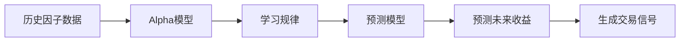
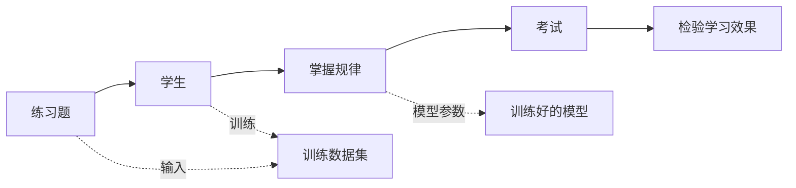
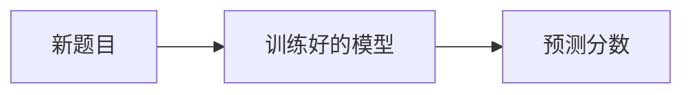
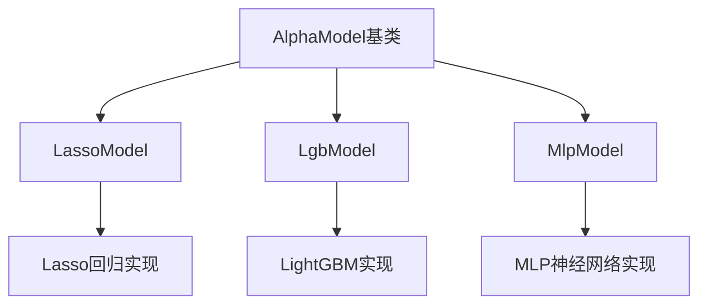
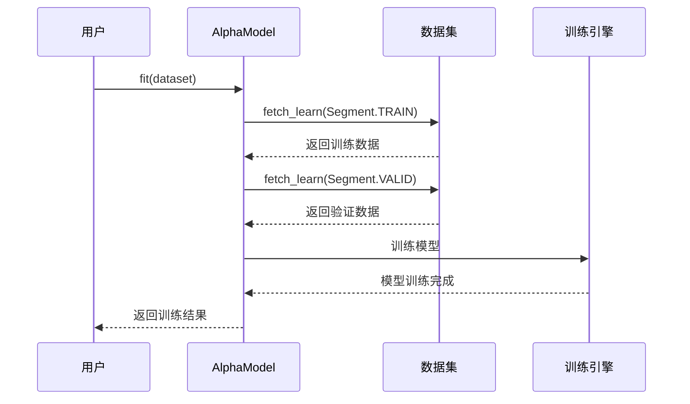
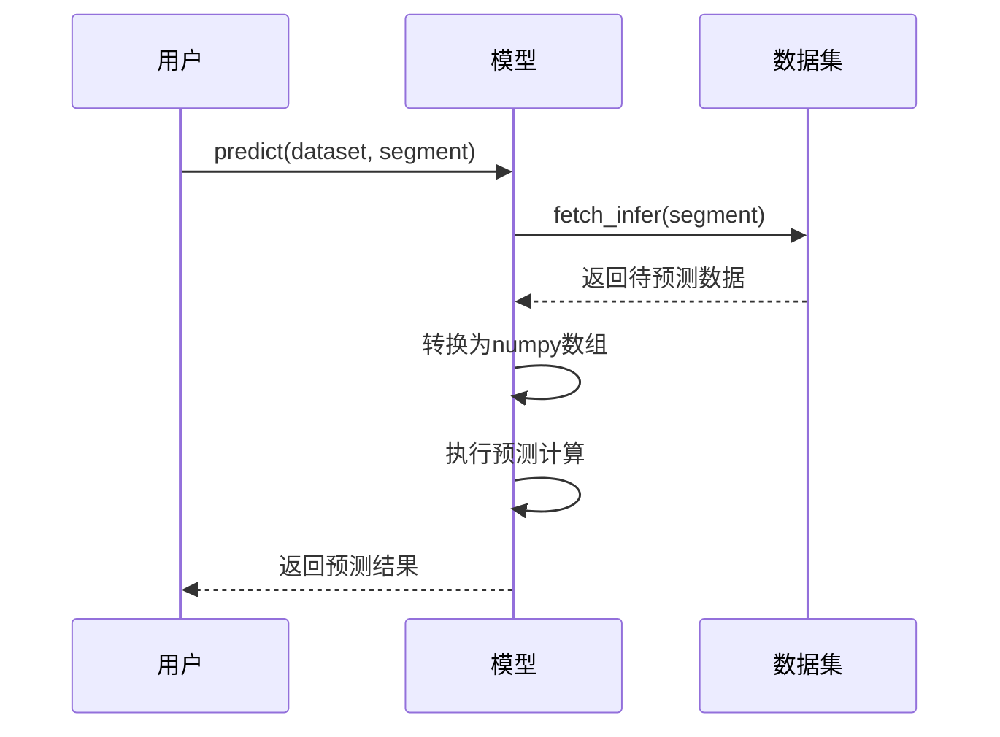

# Chapter 10: Alpha模型


在上一章中，我们学习了[Alpha数据集](09_alpha数据集_.md)，它就像一个智能的"厨房"，帮我们准备好了训练机器学习模型所需的"食材"——各种因子特征数据。但是，有了好食材，还需要一位优秀的"厨师"来烹饪出一道美味的菜肴。

在本章中，我们将学习**Alpha模型**模块，它就是VeighNa框架中的"厨师"，负责利用准备好的数据集来训练和部署机器学习模型，预测未来的价格走势。

## 什么是Alpha模型？

想象你是一位经验丰富的**基金经理**。每天开盘前，你会：
1. 查看各种研究报告和市场数据
2. 分析各种技术指标和因子
3. 综合这些信息，判断市场未来走势
4. 基于判断做出买入或卖出的决策

Alpha模型做的事情非常类似——它就像一个永不疲倦的"AI基金经理"，能够：
- 学习历史数据中的规律
- 分析各种因子与未来收益的关系
- 预测未来价格走势
- 生成交易信号



VeighNa框架提供了三种常用的机器学习模型：

| 模型 | 特点 | 适用场景 |
|------|------|---------|
| **Lasso回归** | 简单高效，能自动选择重要特征 | 因子数量较少初筛 |
| **LightGBM** | 速度快，精度高，支持特征重要性 | 大规模因子筛选 |
| **MLP神经网络** | 能捕捉复杂非线性关系 | 深度特征学习 |

## 核心概念

在学习如何使用之前，我们需要了解几个核心概念。

### 1. 模型训练（Fit）

模型训练就像让学生做大量的**练习题**：



- **训练集**：给学生做的练习题
- **验证集**：用来检查学习效果的模拟考试
- **模型参数**：学生从练习中学会的知识

### 2. 模型预测（Predict）

训练好的模型就像一位经验丰富的老师，可以**预测**学生考试会得多少分：



模型接收新的因子数据，输出对未来收益的预测值。

### 3. 特征重要性

特征重要性告诉我们**哪些因子最有用**，就像分析哪些知识点对考试成绩影响最大：

- Lasso模型：通过系数大小判断
- LightGBM：通过分裂次数和增益判断
- MLP：通过扰动分析判断

## 如何使用Alpha模型

让我们通过具体的例子来学习如何使用这三种模型。

### 第一步：准备数据集

首先，我们需要有训练好的数据集（详见上一章）：

```python
# 假设已经有准备好的Alpha数据集
from vnpy.alpha.dataset import AlphaDataset, Segment

# 创建或获取数据集
dataset = AlphaDataset(...)
dataset.prepare_data()
```

### 第二步：选择并创建模型

根据你的需求选择合适的模型：

```python
# 方式一：创建Lasso回归模型
from vnpy.alpha.model import LassoModel

lasso = LassoModel(
    alpha=0.0005,       # 正则化参数
    max_iter=1000       # 最大迭代次数
)

# 方式二：创建LightGBM模型
from vnpy.alpha.model import LgbModel

lgb_model = LgbModel(
    learning_rate=0.1,  # 学习率
    num_leaves=31,      # 叶子节点数
    num_boost_round=1000  # 迭代次数
)

# 方式三：创建MLP神经网络模型
from vnpy.alpha.model import MlpModel

mlp = MlpModel(
    input_size=360,     # 输入特征维度
    hidden_sizes=(256,), # 隐藏层大小
    lr=0.001           # 学习率
)
```

### 第三步：训练模型

使用训练数据集来训练模型：

```python
# 训练Lasso模型
lasso.fit(dataset)
print("Lasso模型训练完成！")

# 训练LightGBM模型
lgb_model.fit(dataset)
print("LightGBM模型训练完成！")

# 训练MLP模型
mlp.fit(dataset)
print("MLP模型训练完成！")
```

### 第四步：使用模型预测

用训练好的模型来预测未来收益：

```python
# 预测测试集
predictions = lasso.predict(dataset, Segment.TEST)
print(f"预测结果数量: {len(predictions)}")

# 也可以预测验证集
valid_preds = lgb_model.predict(dataset, Segment.VALID)
print(f"验证集预测完成")
```

### 第五步：查看特征重要性

了解哪些因子对预测最有帮助：

```python
# 查看Lasso模型的特征重要性
lasso.detail()

# 查看LightGBM模型的特征重要性
lgb_model.detail()

# 查看MLP模型的特征重要性
mlp.detail()
```

## 完整示例：使用Lasso模型进行预测

下面是一个完整的示例，展示了如何使用Lasso模型进行Alpha因子预测：

```python
# 完整示例：Lasso模型预测流程
from vnpy.alpha.dataset import AlphaDataset, Segment
from vnpy.alpha.model import LassoModel

# 1. 假设已有数据集
dataset = AlphaDataset(...)
dataset.prepare_data()

# 2. 创建模型
model = LassoModel(alpha=0.0005)

# 3. 训练模型
model.fit(dataset)
print("模型训练完成")

# 4. 在测试集上进行预测
predictions = model.predict(dataset, Segment.TEST)

# 5. 查看结果
print(f"预测样本数: {len(predictions)}")
print(f"预测值范围: [{predictions.min():.4f}, {predictions.max():.4f}]")

# 6. 查看特征重要性
model.detail()
```

运行后，你会看到类似这样的输出：

```
模型训练完成
预测样本数: 1000
预测值范围: [-0.025, 0.035]
LASSO模型特征总数量: 45
rank_mean_20: 0.023456
return_5d: 0.018234
volatility_20: -0.015678
...
```

## 内部实现原理

现在让我们深入了解Alpha模型是如何工作的。

### 整体架构

Alpha模型模块主要由以下几部分组成：



### 模型训练流程

当你调用`fit`方法时，发生了什么？



### 核心代码解析

**1. AlphaModel基类**

所有模型都继承自这个抽象基类：

```python
class AlphaModel(metaclass=ABCMeta):
    """机器学习算法的模板类"""

    @abstractmethod
    def fit(self, dataset: AlphaDataset) -> None:
        """使用数据集训练模型"""
        pass

    @abstractmethod
    def predict(self, dataset: AlphaDataset, segment: Segment) -> np.ndarray:
        """使用模型进行预测"""
        pass
```

**2. LassoModel实现**

Lasso回归使用sklearn库实现：

```python
class LassoModel(AlphaModel):
    def fit(self, dataset: AlphaDataset) -> None:
        # 获取训练和验证数据
        df_train = dataset.fetch_learn(Segment.TRAIN)
        df_valid = dataset.fetch_learn(Segment.VALID)
        
        # 合并数据
        df_train = pl.concat([df_train, df_valid])
        
        # 提取特征和标签
        X = df_train.select(feature_names).to_numpy()
        y = np.array(df_train["label"])
        
        # 训练模型
        self.model = Lasso(alpha=self.alpha)
        self.model.fit(X, y)
```

**3. LightGBM实现**

LightGBM使用轻量级梯度提升框架：

```python
class LgbModel(AlphaModel):
    def fit(self, dataset: AlphaDataset) -> None:
        # 准备训练和验证数据
        ds = self._prepare_data(dataset)
        
        # 训练模型
        self.model = lgb.train(
            self.params,
            ds[0],                    # 训练集
            num_boost_round=1000,
            valid_sets=ds,           # 验证集
            callbacks=[lgb.early_stopping(50)]
        )
```

**4. MLP神经网络实现**

MLP使用PyTorch实现：

```python
class MlpModel(AlphaModel):
    def fit(self, dataset: AlphaDataset) -> None:
        # 准备数据
        train_data = dataset.fetch_learn(Segment.TRAIN)
        
        # 转换为PyTorch张量
        X = torch.from_numpy(features).float()
        y = torch.from_numpy(labels).float()
        
        # 训练循环
        for epoch in range(n_epochs):
            # 前向传播
            pred = self.model(X)
            loss = self.loss_fn(pred, y)
            
            # 反向传播
            loss.backward()
            self.optimizer.step()
```

### 模型预测流程

当你调用`predict`方法时，发生了什么？



## 三种模型的对比

| 特性 | Lasso | LightGBM | MLP |
|------|-------|----------|-----|
| **原理** | 线性回归+L1正则 | 梯度提升树 | 多层神经网络 |
| **速度** | 快 | 快 | 慢 |
| **精度** | 较低 | 高 | 高 |
| **可解释性** | 高（系数） | 中 | 低 |
| **非线性能力** | 低 | 中 | 高 |
| **推荐场景** | 因子初筛 | 大规模筛选 | 深度学习 |

### 何时使用哪个模型？

- **因子数量少 (< 50)**：直接用Lasso，解释性强
- **因子数量中等 (50-500)**：用LightGBM，速度快
- **因子数量多 (> 500)**：用MLP，捕捉复杂关系

## 小结

本章我们学习了Alpha模型的核心概念：

1. **什么是Alpha模型**：利用机器学习算法预测未来价格走势的模型
2. **三种模型**：
   - Lasso回归：简单高效，适合因子初筛
   - LightGBM：快速精准，适合大规模因子
   - MLP神经网络：能捕捉复杂关系
3. **使用流程**：准备数据 → 创建模型 → 训练 → 预测 → 查看特征重要性
4. **内部原理**：通过fit训练模型，通过predict进行预测

Alpha模型模块把我们从上一章学到的Alpha数据集变成了真正可用的预测模型。就像有了一位永不疲倦的"AI分析师"，帮我们分析市场、预测走势。

---

通过这个教程系列，我们已经学习了VeighNa框架的核心组件：

- [第1章：事件驱动引擎](01_事件驱动引擎_.md) - 框架的消息传递系统
- [第2章：主引擎](02_主引擎_.md) - 框架的核心管理器
- [第3章：交易网关](03_交易网关_.md) - 连接交易所的桥梁
- [第4章：基础数据对象](04_基础数据对象_.md) - 标准化的数据结构
- [第5章：数据库适配器](05_数据库适配器_.md) - 数据持久化存储
- [第6章：K线图表模块](06_k线图表模块_.md) - 数据可视化
- [第7章：开平转换器](07_开平转换器_.md) - 期货开平逻辑
- [第8章：策略回测与优化](08_策略回测与优化_.md) - 策略验证工具
- [第9章：Alpha数据集](09_alpha数据集_.md) - 机器学习数据准备
- [第10章：Alpha模型](10_alpha模型_.md) - 机器学习模型训练

恭喜你完成了VeighNa框架的入门学习！现在你已经掌握了量化交易系统的核心知识，可以开始构建自己的交易策略了。祝你交易顺利！

---

Generated by [AI Codebase Knowledge Builder](https://github.com/The-Pocket/Tutorial-Codebase-Knowledge)