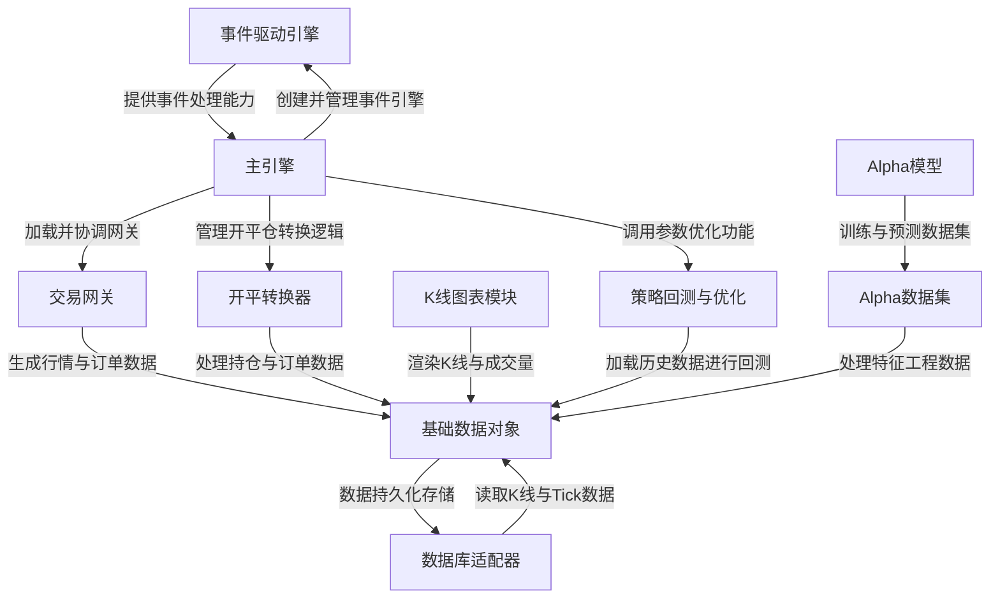

# Tutorial: vnpy

VeighNa是一个基于Python的**量化交易开源框架**，旨在为量化交易者提供统一、灵活的交易平台。该框架采用**事件驱动架构**，将交易、风控、数据管理等功能解耦，支持多品种、多策略的交易执行。核心组件包括**事件驱动引擎**负责消息传递、**主引擎**协调各模块、**交易网关**连接券商系+统、**K线图表**用于可视化分析，以及**Alpha数据集**和**Alpha模型**支持机器学习策略研究。

**Source Repository:** [https://github.com/vnpy/vnpy.git](https://github.com/vnpy/vnpy.git)

## Chapters

1. [事件驱动引擎
](01_事件驱动引擎_.md)
2. [主引擎
](02_主引擎_.md)
3. [交易网关
](03_交易网关_.md)
4. [基础数据对象
](04_基础数据对象_.md)
5. [数据库适配器
](05_数据库适配器_.md)
6. [K线图表模块
](06_k线图表模块_.md)
7. [开平转换器
](07_开平转换器_.md)
8. [策略回测与优化
](08_策略回测与优化_.md)
9. [Alpha数据集
](09_alpha数据集_.md)
10. [Alpha模型
](10_alpha模型_.md)

---

Generated by [AI Codebase Knowledge Builder](https://github.com/The-Pocket/Tutorial-Codebase-Knowledge)