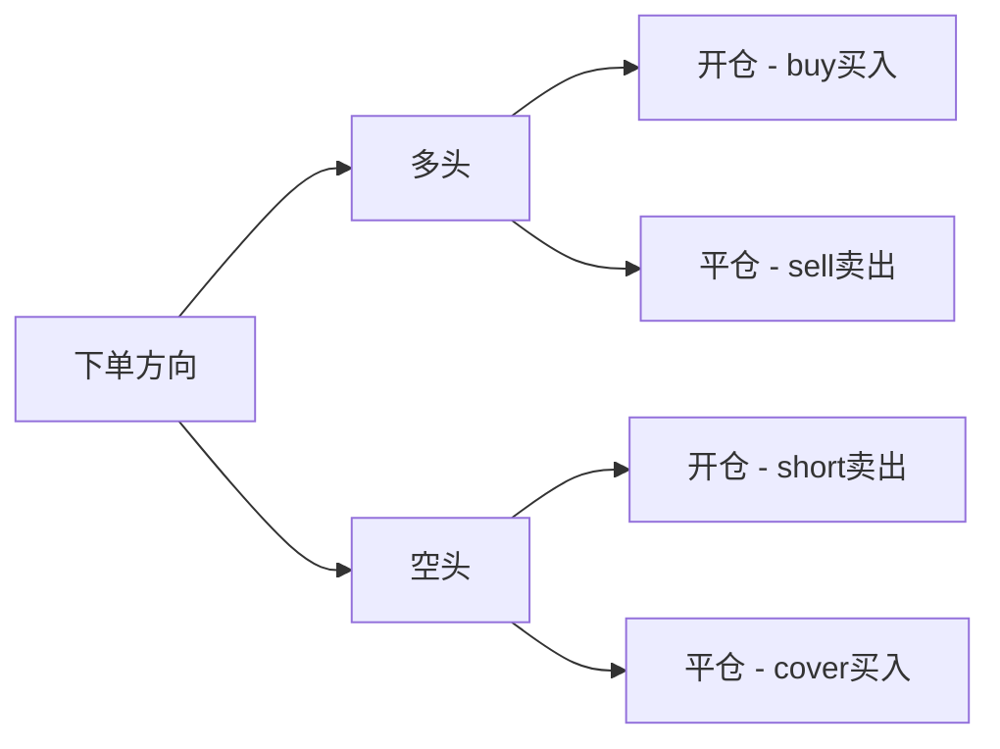
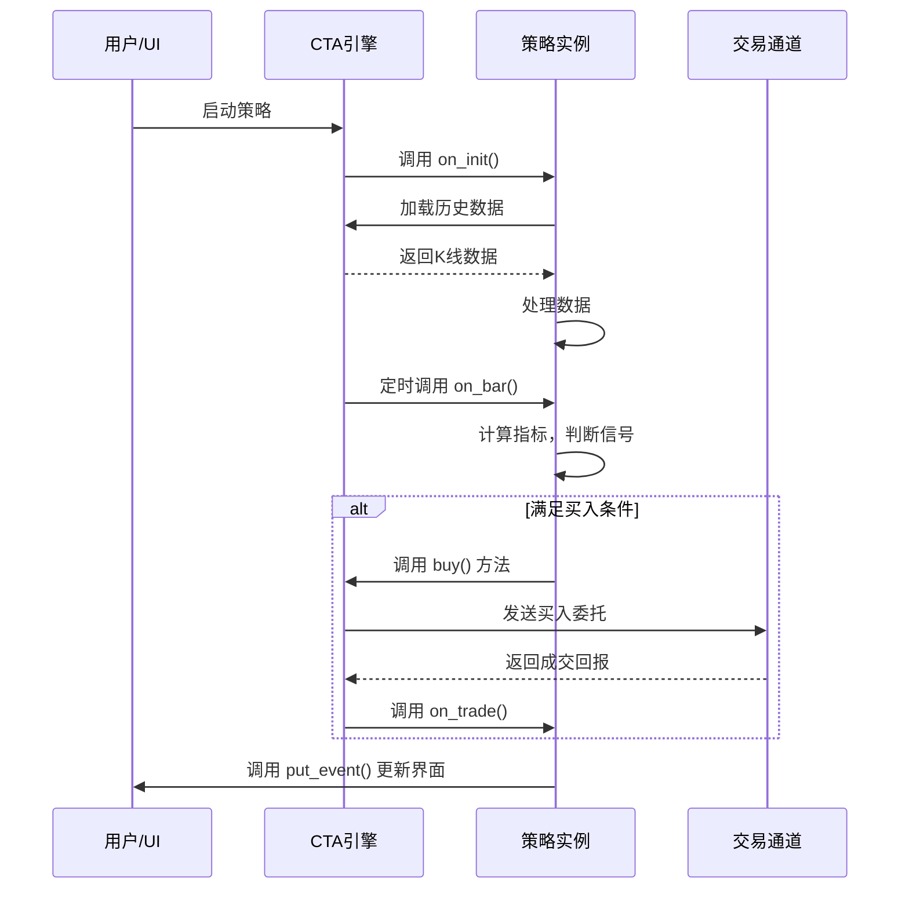
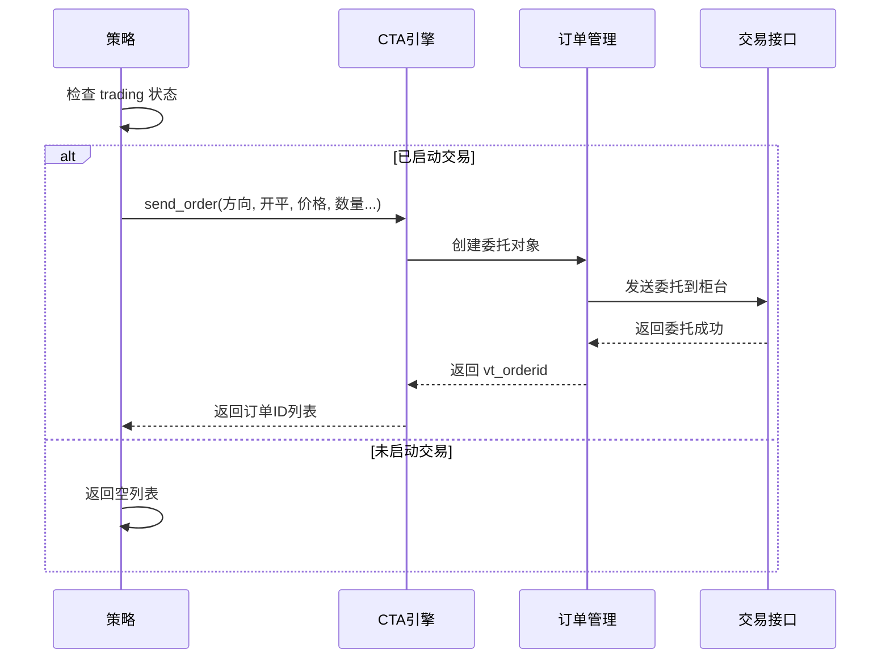

# Chapter 1: CTA策略模板


欢迎开始学习vnpy_ctastrategy框架！在本章中，我们将介绍CTA策略模板，这是整个CTA策略开发的基础。无论你是刚刚接触量化交易，还是有一定编程基础的新手，学完这一章后，你都将能够理解CTA策略的基本结构，并知道如何创建一个属于自己的交易策略。

## 1.1 什么是CTA策略模板？

想象一下，你要建造一栋房子。在开始之前，你需要一份**设计图纸**。这份图纸会告诉我们：
- 房子有哪些基本组成部分（卧室、客厅、厨房等）
- 这些部分应该按照什么顺序来建造
- 墙壁应该如何砌、门窗应该如何安装

在vnpy_ctastrategy中，**CTA策略模板（CtaTemplate）**就像这份设计图纸。它是所有交易策略的**基类**，相当于一套"骨架"。它定义了策略必须实现的回调方法和常用功能。

> **简单理解**：如果你想创建一个新的交易策略，你不需要从零开始写所有代码。你只需要继承CtaTemplate这个"模板"，然后实现你的核心交易逻辑就可以了。就像是填空题，模板已经帮你写好了大部分框架，你只需要填入自己的独特想法。

### CTA策略模板的主要功能

1. **回调方法**：模板定义了一套标准的方法，框架会在适当的时机自动调用它们。比如：
   - `on_init()` - 策略初始化时调用
   - `on_start()` - 策略启动时调用
   - `on_bar()` - 新的K线数据到达时调用
   - `on_trade()` - 成交发生时被调用

2. **交易功能**：模板提供了简单易用的下单、撤单方法：
   - `buy()` - 买入开多
   - `sell()` - 卖出平多
   - `short()` - 卖出开空
   - `cover()` - 买入平空

3. **数据获取**：可以获取合约信息、加载历史数据等

## 1.2 为什么需要策略模板？

在了解具体代码之前，让我们先思考一个问题：为什么我们需要这样一个模板？

### 没有模板的情况

如果让你从头开始编写一个完整的量化交易策略，你需要处理：
- 如何接收市场数据（行情数据）
- 如何判断是否要下单
- 如何发送买入/卖出委托
- 如何跟踪持仓和盈亏
- 如何处理成交回报
- 如何管理风险
- 如何保存和加载策略参数
- 等等...

这就像你要盖房子，却没有任何设计图，每一块砖都要自己决定放在哪里。这会非常复杂且容易出错。

### 有模板的情况

有了CtaTemplate模板后：
- 接收数据的事情框架已经帮你做好了，你只需要在`on_bar()`里处理
- 下单的事情有现成的方法，你只需要调用`buy()`或`sell()`
- 持仓跟踪自动完成，你直接读取`self.pos`就知道当前持仓
- 参数保存加载也不需要自己写

这就像有了一份详细的建筑图纸，你只需要按照图纸来施工，其他的事情都已经有人帮你处理好了。

## 1.3 策略模板的核心组成

让我们详细看看CtaTemplate模板包含哪些重要部分。

### 1.3.1 策略参数（Parameters）

每个策略都可以有一些可配置的参数，比如：
- 移动均线的周期数
- 止盈止损的点数
- 仓位管理的最大持仓比例

```python
class MyStrategy(CtaTemplate):
    author = "我的名字"
    parameters = ["fast_window", "slow_window", "fixed_size"]
    variables = ["count", "last_price"]
```

这些参数可以在策略创建时从外部配置，也可以在策略运行过程中修改。

### 1.3.2 策略变量（Variables）

策略变量用于存储策略运行过程中的状态数据，比如：
- `inited` - 策略是否已经初始化完成
- `trading` - 策略是否正在运行
- `pos` - 当前持仓数量
- 其他你需要跟踪的数据

```python
# 策略变量会自动跟踪，不需要手动设置
# 下面的代码展示如何读取这些内置变量
def on_bar(self, bar: BarData):
    if self.inited:  # 检查是否初始化完成
        if self.pos > 0:  # 读取当前持仓
            print(f"当前多头持仓：{self.pos}")
```

### 1.3.3 回调方法

回调方法是模板定义的标准接口，框架会在特定事件发生时自动调用它们。这是策略逻辑的核心。

| 方法名 | 调用时机 | 典型用途 |
|--------|----------|----------|
| `on_init()` | 策略初始化时 | 加载历史数据、初始化指标 |
| `on_start()` | 策略启动时 | 启动后的准备工作 |
| `on_stop()` | 策略停止时 | 清理工作、保存状态 |
| `on_bar()` | 新的K线数据到达 | 核心交易逻辑 |
| `on_tick()` | 新的tick数据到达 | tick级高频策略 |
| `on_trade()` | 成交回报到达 | 更新持仓、发送通知 |
| `on_order()` | 订单状态变化 | 订单管理 |

## 1.4 创建一个简单的CTA策略

现在让我们通过一个完整的例子，来看看如何基于CtaTemplate创建一个简单的双均线策略。

### 策略思路

这是一个非常经典的入门策略：
- 当短期均线上穿长期均线时，买入开多
- 当短期均线下穿长期均线时，卖出平多

### 第一步：定义策略类

```python
from vnpy_ctastrategy import CtaTemplate
from vnpy.trader.object import BarData

class DoubleMaStrategy(CtaTemplate):
    """双均线策略"""
    author = "新手投资者"
    
    # 策略参数
    fast_window = 10   # 快速均线周期
    slow_window = 20   # 慢速均线周期
    fixed_size = 1     # 每次开仓数量
    
    # 策略参数列表
    parameters = ["fast_window", "slow_window", "fixed_size"]
    # 策略变量列表
    variables = ["count"]
```

> **解释**：这里我们定义了一个名为`DoubleMaStrategy`的策略类，继承了`CtaTemplate`。我们定义了三个参数：快速均线周期、慢速均线周期和每次开仓数量。`parameters`列表告诉系统这些是可以从外部配置的参数。

### 第二步：实现初始化方法

```python
def __init__(self, cta_engine, strategy_name, vt_symbol, setting):
    super().__init__(cta_engine, strategy_name, vt_symbol, setting)
    self.count = 0
    self.variables.append("count")
```

> **解释**：在`__init__`方法中，我们调用父类的初始化方法，并初始化了一个计数器变量。

### 第三步：实现on_init回调

```python
def on_init(self):
    """策略初始化"""
    print("策略初始化，加载历史数据...")
    # 加载过去30天的1分钟K线数据
    self.load_bar(30, interval=Interval.MINUTE)
    print("初始化完成！")
```

> **解释**：`on_init`方法在策略加载时首先被调用。我们使用`load_bar`方法加载历史K线数据，这样策略在启动时就已经有足够的数据来计算指标了。

### 第四步：实现核心交易逻辑

```python
def on_bar(self, bar: BarData):
    """新的K线数据到达"""
    self.count += 1
    
    # 简单的交易逻辑示例
    if self.count > self.slow_window:
        # 这里应该计算均线并判断交叉
        # 为简化演示，仅打印信息
        print(f"收到第{self.count}根K线，当前价格：{bar.close_price}")
    
    # 通知界面更新数据
    self.put_event()
```

> **解释**：`on_bar`是策略的核心，每次有新的K线数据到达时，框架会自动调用这个方法。这里我们只是简单地打印价格信息，并更新界面。在真实的策略中，你会在这里计算各种指标，判断是否满足买入或卖出条件。

### 完整策略结构

下面是一个完整但简化版的策略代码结构：

```python
class DoubleMaStrategy(CtaTemplate):
    """双均线策略"""
    author = "新手投资者"
    parameters = ["fast_window", "slow_window", "fixed_size"]
    variables = ["count"]

    def __init__(self, cta_engine, strategy_name, vt_symbol, setting):
        super().__init__(cta_engine, strategy_name, vt_symbol, setting)
        self.count = 0
        self.variables.append("count")

    def on_init(self):
        print("策略初始化")
        self.load_bar(30)

    def on_start(self):
        print("策略启动")

    def on_bar(self, bar: BarData):
        self.count += 1
        print(f"新K线: {bar.datetime}, 收盘价: {bar.close_price}")
        
        # 交易逻辑：这里添加均线计算和买卖判断
        # if 金叉: self.buy(...)
        # if 死叉: self.sell(...)
        
        self.put_event()

    def on_trade(self, trade: TradeData):
        print(f"成交: {trade.direction} {trade.volume}手 @ {trade.price}")
```

## 1.5 交易下单方法详解

CtaTemplate提供了四个基本的下单方法，它们的关系可以用下图来表示：



### 买入开多（buy）

```python
# 买入开多仓
# 参数：价格，数量
vt_orderids = self.buy(5000, 1)  # 在5000价格买入1手
```

### 卖出平多（sell）

```python
# 卖出平多仓
vt_orderids = self.sell(5100, 1)  # 在5100价格卖出1手
```

### 卖出开空（short）

```python
# 卖出开空仓
vt_orderids = self.short(5000, 1)  # 在5000价格做空1手
```

### 买入平空（cover）

```python
# 买入平空仓
vt_orderids = self.cover(4900, 1)  # 在4900价格买入平空1手
```

> **小贴士**：这些方法都返回订单ID列表（vt_orderids），你可以用这个ID来跟踪订单状态或撤单。

## 1.6 内部实现原理

了解了如何使用CTA策略模板后，让我们来看看它的内部实现原理。这有助于你更深入地理解整个框架。

### 6.1 整体调用流程

当你创建一个策略并运行时，整个系统的调用流程如下：



### 6.2 策略的初始化过程

当你点击"启动策略"按钮时，系统会按照以下顺序执行：

1. **创建策略实例**：根据你配置的参数，创建策略对象
2. **调用on_init()**：执行策略的初始化逻辑
3. **加载历史数据**：如果调用了load_bar，会从数据库读取历史K线
4. **初始化完成**：设置`inited = True`
5. **调用on_start()**：执行启动前的准备工作
6. **开始交易**：设置`trading = True`，开始接收实时数据

### 6.3 订单发送流程

当你调用`self.buy(price, volume)`时，发生了什么？



> **关键点**：只有在`trading = True`（策略已启动）的情况下，订单才会被发送。如果策略还没有启动，调用下单方法会返回空列表，不会产生任何委托。

## 1.7 模板中的其他实用方法

除了前面介绍的核心功能，CtaTemplate还提供了很多实用方法：

### 撤单操作

```python
# 撤掉指定订单
self.cancel_order(vt_orderid)

# 撤掉所有订单
self.cancel_all()
```

### 日志和通知

```python
# 写入日志
self.write_log("策略信息：检测到金叉信号")

# 发送通知（邮件/短信等）
self.send_notification("策略触发止盈通知")
```

### 数据同步

```python
# 同步策略数据到磁盘
# 用于保存策略的持仓状态等重要信息
self.sync_data()
```

### 获取合约信息

```python
# 获取合约的最小价格变动单位
pricetick = self.get_pricetick()

# 获取合约的乘数（如螺纹钢是10吨/手）
size = self.get_size()
```

## 1.8 本章小结

本章我们学习了CTA策略模板的基础知识，主要包括：

1. **什么是CTA策略模板**：它是所有CTA策略的基类，提供了一套标准化的框架
2. **为什么需要模板**：简化策略开发，提供统一的接口和规范
3. **核心组成**：参数、变量、回调方法
4. **如何创建策略**：继承CtaTemplate并实现核心逻辑
5. **下单方法**：buy、sell、short、cover的用途和区别
6. **内部原理**：策略的初始化流程和订单发送流程

现在，你已经了解了CTA策略的基本结构。下一章我们将学习**具体策略实现**，教你如何编写一个真正可以运行的双均线策略，包括指标计算、信号判断和完整的回测流程。

---

**继续学习**： [第二章：具体策略实现](02_具体策略实现_.md)

---

Generated by [AI Codebase Knowledge Builder](https://github.com/The-Pocket/Tutorial-Codebase-Knowledge)