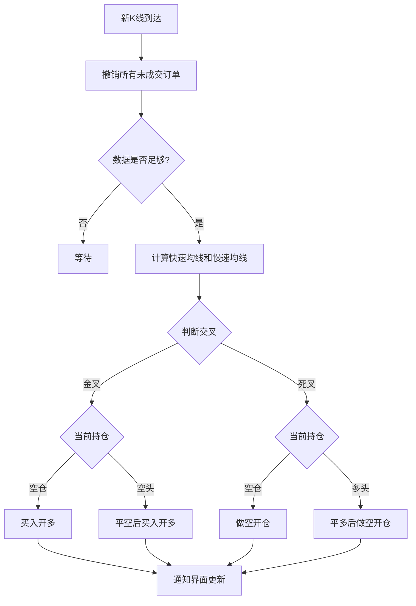

# Chapter 2: 具体策略实现


在上一章中，我们学习了CTA策略模板（CtaTemplate），了解了策略的基本结构和框架。就像我们已经拿到了一份建筑图纸，知道房子应该怎么盖。在本章中，让我们来看看vnpy_ctastrategy模块中**已经建好的房子**——即模块内置的示例策略。

这些示例策略展示了如何将技术指标组合起来形成完整的交易逻辑。你可以直接使用它们进行回测，也可以作为模板修改成自己的策略。

---

## 2.1 为什么要学习示例策略？

想象一下，你学做菜时，通常会先看菜谱——看看别人是怎么做的，然后照着做，最后再加入自己的创新。**示例策略就像是量化交易的"菜谱"**，它们展示了：

1. **如何计算技术指标**：使用ArrayManager计算均线、ATR、RSI等
2. **如何判断交易信号**：金叉死叉、突破上下轨等
3. **如何管理仓位**：加仓、减仓、平仓的时机
4. **如何设置止损止盈**：跟踪止损、固定止损等

---

## 2.2 双均线策略（DoubleMaStrategy）

双均线策略是最经典的入门策略之一，也是我们**第一个**要详细学习的策略。

### 2.2.1 策略原理

> **简单比喻**：想象你开车时看后视镜，短期均线就像看**1个月**的倒车镜，长期均线就像看**6个月**的倒车镜。当短期倒车镜显示的路况（价格）比长期倒车镜还好时，说明行情可能向上，此时买入；反之则卖出。

**交易逻辑**：
- **金叉买入**：短期均线上穿长期均线，买入开多
- **死叉卖出**：短期均线下穿长期均线，卖出平多

### 2.2.2 策略代码详解

让我们分步骤来看双均线策略的实现：

**第一步：定义策略参数和变量**

```python
class DoubleMaStrategy(CtaTemplate):
    author = "用Python的交易员"
    
    # 策略参数
    fast_window: int = 10   # 快速均线周期
    slow_window: int = 20   # 慢速均线周期
    
    # 策略变量
    fast_ma0: float = 0.0   # 当前快速均线值
    fast_ma1: float = 0.0   # 上一根K线的快速均线值
    slow_ma0: float = 0.0   # 当前慢速均线值
    slow_ma1: float = 0.0   # 上一根K线的慢速均线值
```

> **解释**：参数是可以从外部配置的（如10、20），变量是策略运行时自动计算的（如当前的均线值）。`fast_ma0`表示当前值，`fast_ma1`表示上一根K线的值，这样我们才能判断均线是否"交叉"。

**第二步：初始化方法**

```python
def on_init(self) -> None:
    self.write_log("策略初始化")
    self.bg = BarGenerator(self.on_bar)
    self.am = ArrayManager()
    self.load_bar(10)  # 加载10天历史数据
```

> **解释**：这里创建了两个重要对象——`BarGenerator`用于将tick数据合成K线，`ArrayManager`用于计算技术指标（均线、ATR等）。

**第三步：核心交易逻辑**

```python
def on_bar(self, bar: BarData) -> None:
    self.cancel_all()  # 先撤销所有未成交订单
    
    am = self.am
    am.update_bar(bar)
    if not am.inited:
        return  # 数据不够时等待
    
    # 计算均线
    fast_ma = am.sma(self.fast_window, array=True)
    slow_ma = am.sma(self.slow_window, array=True)
    self.fast_ma0 = fast_ma[-1]
    self.fast_ma1 = fast_ma[-2]
    self.slow_ma0 = slow_ma[-1]
    self.slow_ma1 = slow_ma[-2]
    
    # 判断金叉死叉
    cross_over = self.fast_ma0 > self.slow_ma0 and self.fast_ma1 < self.slow_ma1
    cross_below = self.fast_ma0 < self.slow_ma0 and self.fast_ma1 > self.slow_ma1
    
    # 执行交易
    if cross_over:
        if self.pos == 0:
            self.buy(bar.close_price, 1)
        elif self.pos < 0:
            self.cover(bar.close_price, 1)
            self.buy(bar.close_price, 1)
    
    elif cross_below:
        if self.pos == 0:
            self.short(bar.close_price, 1)
        elif self.pos > 0:
            self.sell(bar.close_price, 1)
            self.short(bar.close_price, 1)
    
    self.put_event()
```

> **解释**：这是策略的核心！每次收到新K线时：
> 1. 先撤销未成交订单（避免挂单堆积）
> 2. 更新数据并检查是否已初始化完成
> 3. 计算快速和慢速均线
> 4. 判断金叉（cross_over）和死叉（cross_below）
> 5. 根据持仓状态执行相应的买卖操作
> 6. 调用`put_event()`通知界面更新

### 2.2.3 策略流程图



---

## 2.3 ATR-RSI策略（AtrRsiStrategy）

ATR-RSI策略是一个结合了**波动率指标（ATR）**和**相对强弱指标（RSI）**的策略。

### 2.3.1 策略原理

> **简单比喻**：ATR像是测量**风浪的大小**，RSI像是测量**船的转速**。当风浪适中（ATR达标）且船转速强劲（RSI超买/超卖）时，可能是开船的好时机。

**交易逻辑**：
- **买入条件**：ATR向上突破其均线 AND RSI进入超买区
- **卖出条件**：ATR向上突破其均线 AND RSI进入超卖区
- **止损方式**：使用**跟踪止损**，随着价格向有利方向移动，不断调整止损点

### 2.3.2 策略代码要点

```python
class AtrRsiStrategy(CtaTemplate):
    # 策略参数
    atr_length: int = 22      # ATR周期
    atr_ma_length: int = 10  # ATR均线周期
    rsi_length: int = 5       # RSI周期
    rsi_entry: int = 16       # RSI入场阈值
    trailing_percent: float = 0.8  # 跟踪止损百分比
    fixed_size: int = 1       # 每次开仓手数
```

```python
def on_bar(self, bar: BarData) -> None:
    self.cancel_all()
    am = self.am
    am.update_bar(bar)
    if not am.inited:
        return
    
    # 计算ATR和RSI
    atr_array = am.atr(self.atr_length, array=True)
    self.atr_value = atr_array[-1]
    self.atr_ma = atr_array[-self.atr_ma_length:].mean()
    self.rsi_value = am.rsi(self.rsi_length)
    
    # 初始化日内高低点
    if self.pos == 0:
        self.intra_trade_high = bar.high_price
        self.intra_trade_low = bar.low_price
```

> **解释**：策略使用两个重要概念：
> 1. **ATR与ATR均线**：只有当ATR大于其均线时，说明波动在放大，此时信号更可靠
> 2. **RSI超买超卖**：RSI > 50 + rsi_entry 为超买，RSI < 50 - rsi_entry 为超卖

```python
    # 无持仓时：判断开仓信号
    if self.pos == 0:
        if self.atr_value > self.atr_ma:
            if self.rsi_value > self.rsi_buy:  # RSI超买
                self.buy(bar.close_price + 5, self.fixed_size)
            elif self.rsi_value < self.rsi_sell:  # RSI超卖
                self.short(bar.close_price - 5, self.fixed_size)
    
    # 持多头时：设置跟踪止损
    elif self.pos > 0:
        self.intra_trade_high = max(self.intra_trade_high, bar.high_price)
        long_stop = self.intra_trade_high * (1 - self.trailing_percent / 100)
        self.sell(long_stop, abs(self.pos), stop=True)
    
    # 持空头时：设置跟踪止损
    elif self.pos < 0:
        self.intra_trade_low = min(self.intra_trade_low, bar.low_price)
        short_stop = self.intra_trade_low * (1 + self.trailing_percent / 100)
        self.cover(short_stop, abs(self.pos), stop=True)
```

> **解释**：跟踪止损的原理是：记录持仓期间的**最高价/最低价**，然后按照一定百分比设置止损点。这样如果行情向有利方向移动，止损点也会跟着移动。

---

## 2.4 布林带策略（BollChannelStrategy）

布林带策略利用**布林带通道**来判断价格是否"过度"偏离。

### 2.4.1 策略原理

> **简单比喻**：想象价格像一条橡皮筋，布林带就是这条橡皮筋的**弹性范围**。当价格拉伸到上轨时，就像橡皮筋拉紧了，可能会弹回来；反之到了下轨也可能弹回来。

**交易逻辑**：
- **CCI指标配合**：只有当CCI也确认趋势时才入场（CCI > 0 做多，CCI < 0 做空）
- **ATR止损**：用ATR来设置止损距离

### 2.4.2 策略代码要点

```python
class BollChannelStrategy(CtaTemplate):
    # 策略参数
    boll_window: int = 18       # 布林带周期
    boll_dev: float = 3.4       # 布林带标准差倍数
    cci_window: int = 10        # CCI周期
    atr_window: int = 30        # ATR周期
    sl_multiplier: float = 5.2  # 止损ATR倍数
    fixed_size: int = 1
```

```python
def on_bar(self, bar: BarData) -> None:
    self.cancel_all()
    am = self.am
    am.update_bar(bar)
    if not am.inited:
        return
    
    # 计算布林带和CCI、ATR
    self.boll_up, self.boll_down = am.boll(self.boll_window, self.boll_dev)
    self.cci_value = am.cci(self.cci_window)
    self.atr_value = am.atr(self.atr_window)
    
    # 无持仓时：CCI确认趋势后入场
    if self.pos == 0:
        if self.cci_value > 0:
            self.buy(self.boll_up, self.fixed_size, True)
        elif self.cci_value < 0:
            self.short(self.boll_down, self.fixed_size, True)
    
    # 持仓时：ATR计算止损
    elif self.pos > 0:
        self.long_stop = self.intra_trade_high - self.atr_value * self.sl_multiplier
        self.sell(self.long_stop, abs(self.pos), True)
```

---

## 2.5 Dual Thrust策略（DualThrustStrategy）

Dual Thrust是一个**日内交易策略**，由Michael Chalek发明。

### 2.5.1 策略原理

> **简单比喻**：每天开盘前，我们先看看昨天的**波动范围**（最高价-最低价），然后根据这个范围算出**今天的入场门框**。如果价格向上突破门框就做多，向下突破就做空。

**核心公式**：
- 上轨 = 开盘价 + K1 × 昨日波动范围
- 下轨 = 开盘价 - K2 × 昨日波动范围

### 2.5.2 策略代码要点

```python
class DualThrustStrategy(CtaTemplate):
    # 策略参数
    k1: float = 0.4  # 多头系数
    k2: float = 0.6  # 空头系数
    fixed_size: int = 1
```

```python
def on_bar(self, bar: BarData) -> None:
    self.bars.append(bar)
    if len(self.bars) <= 2:
        return
    
    # 检查是否新的一天
    if last_bar.datetime.date() != bar.datetime.date():
        if self.day_high:
            # 计算波动范围和上下轨
            self.day_range = self.day_high - self.day_low
            self.long_entry = bar.open_price + self.k1 * self.day_range
            self.short_entry = bar.open_price - self.k2 * self.day_range
        
        # 重置日内数据
        self.day_open = bar.open_price
        self.day_high = bar.high_price
        self.day_low = bar.low_price
        self.long_entered = False
        self.short_entered = False
```

> **解释**：Dual Thrust的关键在于：
> 1. **每天只计算一次上下轨**（在第一天K线时）
> 2. 使用**停止单**（stop=True）挂单，当价格突破上下轨时自动成交
> 3. 在收盘前（14:55）强制平仓

```python
    # 交易时段：检查突破
    if bar.datetime.time() < self.exit_time:
        if self.pos == 0:
            if bar.close_price > self.day_open:
                self.buy(self.long_entry, self.fixed_size, stop=True)
            else:
                self.short(self.short_entry, self.fixed_size, stop=True)
    
    # 收盘前强制平仓
    else:
        if self.pos > 0:
            self.sell(bar.close_price * 0.99, abs(self.pos))
        elif self.pos < 0:
            self.cover(bar.close_price * 1.01, abs(self.pos))
```

---

## 2.6 海龟交易策略（TurtleSignalStrategy）

海龟交易策略是一个非常著名的**趋势跟踪策略**，源于1980年代的一个交易实验。

### 2.6.1 策略原理

> **简单比喻**：就像真正的海龟一样，这个策略的动作很慢但很稳定。它使用**唐奇安通道**（Donchian Channel）来捕捉大的趋势——当价格突破20日高点时买入，当价格跌破10日低点时卖出。

**核心概念**：
- **入场通道**：20日最高点/最低点
- **出场通道**：10日最高点/最低点
- **ATR**：用于计算止损距离和加仓间距

### 2.6.2 策略代码要点

```python
class TurtleSignalStrategy(CtaTemplate):
    # 策略参数
    entry_window: int = 20   # 入场窗口
    exit_window: int = 10    # 出场窗口
    atr_window: int = 20     # ATR窗口
    fixed_size: int = 1
```

```python
def on_bar(self, bar: BarData) -> None:
    self.cancel_all()
    am = self.am
    am.update_bar(bar)
    if not am.inited:
        return
    
    # 无持仓时：计算入场通道
    if not self.pos:
        self.entry_up, self.entry_down = am.donchian(self.entry_window)
    
    # 计算出场通道
    self.exit_up, self.exit_down = am.donchian(self.exit_window)
    
    # 无持仓：发送突破委托
    if not self.pos:
        self.atr_value = am.atr(self.atr_window)
        self.send_buy_orders(self.entry_up)
        self.send_short_orders(self.entry_down)
```

> **解释**：海龟策略的一个特点是**金字塔加仓**——当趋势延续时，每突破一个ATR间距就加仓一次，最多加4次。

```python
def send_buy_orders(self, price: float) -> None:
    """分批买入，最多加仓4次"""
    t = self.pos / self.fixed_size
    
    if t < 1:
        self.buy(price, self.fixed_size, True)
    if t < 2:
        self.buy(price + self.atr_value * 0.5, self.fixed_size, True)
    if t < 3:
        self.buy(price + self.atr_value, self.fixed_size, True)
    if t < 4:
        self.buy(price + self.atr_value * 1.5, self.fixed_size, True)
```

---

## 2.7 多信号策略（MultiSignalStrategy）

多信号策略展示了如何**组合多个指标信号**来做决策。

### 2.7.1 策略原理

> **简单比喻**：就像一个公司的**董事会决策**，不是一个人说了算，而是综合多个"董事"的意见。只有当多数"董事"都同意时，才执行交易。

**信号组成**：
- RSI信号：基于RSI指标
- CCI信号：基于CCI指标  
- MA信号：基于均线交叉

### 2.7.2 策略代码要点

```python
# 首先定义单个信号类
class RsiSignal(CtaSignal):
    def __init__(self, rsi_window: int, rsi_level: float) -> None:
        self.rsi_window = rsi_window
        self.rsi_long = 50 + rsi_level
        self.rsi_short = 50 - rsi_level
        self.bg = BarGenerator(self.on_bar)
        self.am = ArrayManager()
    
    def on_bar(self, bar: BarData) -> None:
        self.am.update_bar(bar)
        if not self.am.inited:
            self.set_signal_pos(0)
            return
        
        rsi = self.am.rsi(self.rsi_window)
        if rsi >= self.rsi_long:
            self.set_signal_pos(1)   # 多头信号
        elif rsi <= self.rsi_short:
            self.set_signal_pos(-1)  # 空头信号
        else:
            self.set_signal_pos(0)   # 无信号
```

> **解释**：每个信号类计算自己的信号位置（1、-1或0），然后策略将所有信号**累加**起来决定最终仓位。

```python
class MultiSignalStrategy(TargetPosTemplate):
    def on_init(self) -> None:
        # 创建三个信号对象
        self.rsi_signal = RsiSignal(self.rsi_window, self.rsi_level)
        self.cci_signal = CciSignal(self.cci_window, self.cci_level)
        self.ma_signal = MaSignal(self.fast_window, self.slow_window)
    
    def calculate_target_pos(self) -> None:
        """计算目标仓位"""
        # 获取各信号的位置
        rsi_pos = self.rsi_signal.get_signal_pos()
        cci_pos = self.cci_signal.get_signal_pos()
        ma_pos = self.ma_signal.get_signal_pos()
        
        # 累加所有信号
        target_pos = rsi_pos + cci_pos + ma_pos
        
        # 设置目标仓位
        self.set_target_pos(target_pos)
```

---

## 2.8 多时间周期策略（MultiTimeframeStrategy）

多时间周期策略展示了如何**同时分析多个时间周期**的数据。

### 2.8.1 策略原理

> **简单比喻**：就像你同时看**日K线**（看大势）和**5分钟K线**（找入场点）。大势向上时，只做多不做空；大势向下时，只做空不做多。

**周期组合**：
- 15分钟K线：判断中长期趋势（均线方向）
- 5分钟K线：寻找具体入场时机

### 2.8.2 策略代码要点

```python
class MultiTimeframeStrategy(CtaTemplate):
    def on_init(self) -> None:
        # 创建两个时间周期的K线生成器
        self.bg5 = BarGenerator(self.on_bar, 5, self.on_5min_bar)
        self.am5 = ArrayManager()
        
        self.bg15 = BarGenerator(self.on_bar, 15, self.on_15min_bar)
        self.am15 = ArrayManager()
```

```python
def on_bar(self, bar: BarData) -> None:
    # 同时向两个时间周期推送数据
    self.bg5.update_bar(bar)
    self.bg15.update_bar(bar)

def on_15min_bar(self, bar: BarData) -> None:
    """15分钟K线更新：判断趋势"""
    self.am15.update_bar(bar)
    if not self.am15.inited:
        return
    
    # 计算均线判断趋势
    fast_ma = self.am15.sma(self.fast_window)
    slow_ma = self.am15.sma(self.slow_window)
    
    if fast_ma > slow_ma:
        self.ma_trend = 1   # 多头趋势
    else:
        self.ma_trend = -1  # 空头趋势

def on_5min_bar(self, bar: BarData) -> None:
    """5分钟K线更新：执行交易"""
    self.am5.update_bar(bar)
    if not self.am5.inited or not self.ma_trend:
        return
    
    rsi_value = self.am5.rsi(self.rsi_window)
    
    # 只在趋势方向交易
    if self.pos == 0:
        if self.ma_trend > 0 and rsi_value >= self.rsi_long:
            self.buy(bar.close_price + 5, self.fixed_size)
        elif self.ma_trend < 0 and rsi_value <= self.rsi_short:
            self.short(bar.close_price - 5, self.fixed_size)
```

---

## 2.9 如何使用示例策略

### 2.9.1 直接使用

1. **在VN Trader中加载**：打开VN Trader，点击"功能"->"CTA策略"，选择需要的策略
2. **配置参数**：修改fast_window、slow_window等参数
3. **启动回测**：选择合约和时间段，运行回测

### 2.9.2 作为模板修改

如果你想基于示例策略创建自己的策略，只需要：

1. **复制策略文件**：在`vnpy_ctastrategy/strategies/`目录下
2. **修改类名**：如`class MyStrategy(DoubleMaStrategy):`
3. **调整参数和逻辑**：修改parameters和核心交易逻辑

```python
# 创建一个自己的双均线策略变体
class MyEnhancedMaStrategy(DoubleMaStrategy):
    """改进版双均线策略"""
    author = "我自己"
    
    # 添加一个新参数
    ma_period: int = 15
    
    def on_bar(self, bar: BarData) -> None:
        # 在这里修改交易逻辑
        # 调用父类方法
        super().on_bar(bar)
```

---

## 2.10 本章小结

本章我们学习了vnpy_ctastrategy模块中的**示例策略**，包括：

| 策略名称 | 核心指标 | 特点 |
|----------|----------|------|
| 双均线策略 | 简单移动均线 | 简单易懂，适合入门 |
| ATR-RSI策略 | ATR + RSI | 结合波动率和超买超卖 |
| 布林带策略 | 布林带 + CCI + ATR | 通道突破+趋势确认 |
| Dual Thrust | 波动率通道 | 日内交易经典策略 |
| 海龟交易策略 | 唐奇安通道 + ATR | 金字塔加仓，趋势跟踪 |
| 多信号策略 | RSI + CCI + MA | 多指标综合判断 |
| 多时间周期 | 15分钟 + 5分钟 | 大周期定方向，小周期找时机 |

通过学习这些示例策略，你应该理解：
- 如何使用**ArrayManager**计算各种技术指标
- 如何根据指标组合判断**交易信号**
- 如何实现**仓位管理**和**止损策略**
- 如何将**多个指标/周期**组合起来

---

**继续学习**： [第三章：目标仓位模板](03_目标仓位模板_.md)

---

Generated by [AI Codebase Knowledge Builder](https://github.com/The-Pocket/Tutorial-Codebase-Knowledge)