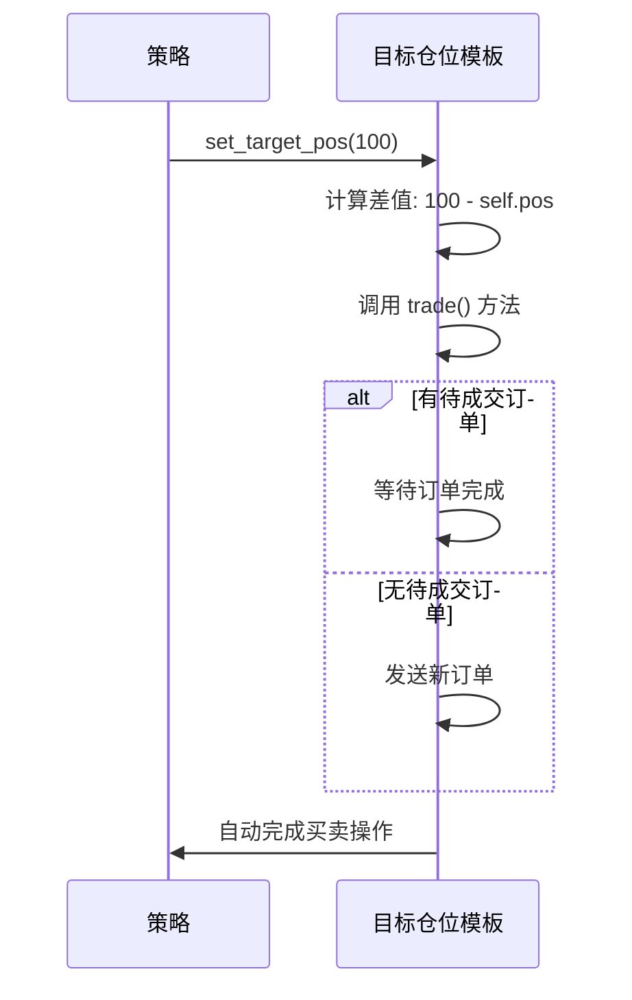

# Chapter 3: 目标仓位模板


在上一章中，我们学习了具体的策略实现，包括双均线策略、ATR-RSI策略等多个示例。我们了解了如何计算技术指标、判断交易信号，并手动编写买入卖出逻辑。

但你有没有想过：有没有更简单的方式来管理仓位？特别是当你想要实现"从当前持仓平滑过渡到目标持仓"这种常见需求时，有没有现成的方法可以直接使用？

这就是我们今天要学习的**目标仓位模板**（TargetPosTemplate）要解决的问题。

---

## 3.1 什么是目标仓位模板？

想象一下，你在经营一家餐厅。传统的方式是：
- 今天卖掉一份宫保鸡丁 → 你需要去厨房告诉厨师"做一份宫保鸡丁"
- 明天卖掉两份麻婆豆腐 → 你需要去厨房告诉厨师"做两份麻婆豆腐"

每卖出一道菜，你都要亲自去厨房下单，非常麻烦。

但如果你换一种方式呢？
- 你告诉厨师："我今天的**目标**是卖掉10份宫保鸡丁、5份麻婆豆腐"
- 厨师会根据当前已经卖出的数量，自动计算还需要做多少菜

**目标仓位模板**就像是这个"厨师"的角色。你只需要告诉策略"我想要持有**100手多头**"，策略会自动计算当前持仓是多少，然后自动发出买卖指令来达到目标仓位。

### 核心概念

目标仓位模板的核心思想非常简单：

```
目标仓位 - 当前持仓 = 需要交易的仓位
```

假设：
- 目标仓位 = 100手（多头）
- 当前持仓 = 60手（多头）
- 需要买入 = 100 - 60 = 40手

模板会自动帮你发出买入40手的订单。

---

## 3.2 为什么需要目标仓位模板？

在传统的CTA策略中，你需要手动处理很多细节：

### 3.2.1 传统方式的麻烦

```python
# 传统方式：你需要判断各种情况
if self.pos == 0:
    # 空仓 → 买入开多
    self.buy(price, 100)
elif self.pos > 0:
    # 持有多头 → 计算需要加多少仓
    change = 100 - self.pos
    if change > 0:
        self.buy(price, change)
elif self.pos < 0:
    # 持有空头 → 需要先平空，再开多（反手）
    self.cover(price, abs(self.pos))  # 先平空
    self.buy(price, 100)               # 再开多
```

你需要在每次交易时判断：
- 当前是空仓、多头还是空头？
- 目标仓位比当前多还是少？
- 如果要从空头变成多头，应该先平仓还是先开仓？

### 3.2.2 目标仓位模板的简便

使用目标仓位模板后，一切都变得超级简单：

```python
# 目标仓位模板：只需要设置目标
self.set_target_pos(100)  # 想要持有100手多头
```

是的，你没看错！只需要这一行代码，模板会自动处理：
- 空仓时自动买入
- 持仓不足时自动加仓
- 持仓过多时自动减仓
- 空头反手时自动平空+开多

---

## 3.3 目标仓位模板的基本用法

目标仓位模板（TargetPosTemplate）是CtaTemplate的子类，所以它拥有父类的所有功能，同时增加了仓位管理的便捷方法。

### 3.3.1 定义策略

```python
from vnpy_ctastrategy import TargetPosTemplate

class MyTargetStrategy(TargetPosTemplate):
    author = "新手投资者"
    
    # 策略参数
    rsi_length: int = 14
    rsi_buy: float = 30
    rsi_sell: float = 70
    
    # 参数列表
    parameters = ["rsi_length", "rsi_buy", "rsi_sell"]
    variables = ["target_pos"]
```

> **解释**：定义一个继承自TargetPosTemplate的策略类，就像你有一个魔法助手，你只需要告诉它目标，它会帮你完成所有交易操作。

### 3.3.2 核心逻辑：设置目标仓位

```python
def on_bar(self, bar: BarData) -> None:
    # 更新数据
    self.am.update_bar(bar)
    if not self.am.inited:
        return
    
    # 计算RSI指标
    rsi = self.am.rsi(self.rsi_length)
    
    # 根据RSI设置目标仓位
    if rsi < self.rsi_buy:
        # RSI低于30，认为超卖 → 目标做多
        self.set_target_pos(100)
    elif rsi > self.rsi_sell:
        # RSI高于70，认为超买 → 目标做空
        self.set_target_pos(-100)
    else:
        # 中间区域 → 目标空仓
        self.set_target_pos(0)
```

> **解释**：这就是目标仓位模板的强大之处！你只需要根据条件设置`target_pos`（目标持仓），模板会自动：
>
> - 如果当前是空仓 → 发出买入/卖出开仓指令
> - 如果当前持仓不足 → 发出加仓指令
> - 如果当前持仓过多 → 发出减仓指令
> - 如果需要反手（多头变空头或反之）→ 自动处理平仓+开仓

### 3.3.3 完整策略示例

```python
from vnpy_ctastrategy import TargetPosTemplate
from vnpy.trader.object import BarData

class RsiTargetStrategy(TargetPosTemplate):
    """基于RSI的目标仓位策略"""
    author = "新手投资者"
    
    rsi_length: int = 14
    rsi_buy: float = 30
    rsi_sell: float = 70
    fixed_size: int = 100
    
    parameters = ["rsi_length", "rsi_buy", "rsi_sell", "fixed_size"]
    variables = ["target_pos"]

    def on_init(self) -> None:
        self.am = ArrayManager()
        self.write_log("策略初始化")

    def on_bar(self, bar: BarData) -> None:
        self.am.update_bar(bar)
        if not self.am.inited:
            return
        
        # 计算RSI
        rsi = self.am.rsi(self.rsi_length)
        
        # 设置目标仓位
        if rsi < self.rsi_buy:
            self.set_target_pos(self.fixed_size)
        elif rsi > self.rsi_sell:
            self.set_target_pos(-self.fixed_size)
        else:
            self.set_target_pos(0)
        
        self.put_event()
```

---

## 3.4 目标仓位模板的进阶用法

### 3.4.1 目标仓位的多种状态

目标仓位可以是正数、负数或零：

| 目标仓位 | 含义 | 模板会做什么 |
|----------|------|--------------|
| 100 | 持有100手多头 | 买入开多或加仓到100手 |
| 0 | 空仓 | 卖出全部多头或买入平掉全部空头 |
| -50 | 持有50手空头 | 卖出开空或加仓到50手空头 |

### 3.4.2 动态调整目标仓位

你还可以根据市场情况动态调整目标仓位：

```python
def on_bar(self, bar: BarData) -> None:
    # ... 计算各种指标 ...
    
    # 根据多个指标综合判断
    signal = 0
    if rsi < 30:
        signal += 1
    if macd > 0:
        signal += 1
    if ma向上:
        signal += 1
    
    # 信号越强，目标仓位越大
    if signal >= 3:
        self.set_target_pos(200)   # 强烈看多
    elif signal == 2:
        self.set_target_pos(100)   # 轻度看多
    elif signal == 0:
        self.set_target_pos(0)     # 中立
    elif signal <= -2:
        self.set_target_pos(-100)  # 看空
```

---

## 3.5 内部实现原理

了解了如何使用目标仓位模板，让我们来看看它的**内部魔法**。

### 5.1 整体流程

当你调用`set_target_pos(100)`时，模板内部发生了什么？



### 5.2 核心方法解析

目标仓位模板有几个关键方法：

```python
def set_target_pos(self, target_pos: int) -> None:
    """设置目标仓位"""
    self.target_pos = target_pos
    self.trade()  # 开始执行交易

def trade(self) -> None:
    """执行交易"""
    # 检查是否有未完成的订单
    if not self.check_order_finished():
        # 有未完成订单 → 先撤销旧订单
        self.cancel_old_order()
    else:
        # 没有未完成订单 → 发送新订单
        self.send_new_order()

def send_new_order(self) -> None:
    """发送新订单"""
    # 计算需要交易的数量
    pos_change = self.target_pos - self.pos
    
    if pos_change > 0:
        # 需要买入 → 做多
        vt_orderids = self.buy(long_price, abs(pos_change))
    elif pos_change < 0:
        # 需要卖出 → 做空
        vt_orderids = self.short(short_price, abs(pos_change))
```

### 5.3 智能订单处理

目标仓位模板还有一个非常智能的功能：**处理反手**。

什么是反手？比如你当前持有**100手多头**，但现在你判断行情要下跌，想变成**100手空头**。

传统做法：
```python
# 你需要手动处理
self.sell(当前价格, 100)   # 先平掉100手多头
self.short(当前价格, 100) # 再开100手空头
```

目标仓位模板做法：
```python
# 一句话搞定
self.set_target_pos(-100)  # 目标变成-100手空头
```

模板会自动：
1. 先检查当前持仓是100手多头
2. 目标仓位是-100手空头
3. 自动发出平多仓单 + 开空仓单

---

## 3.6 与传统CTA模板的对比

| 功能 | CtaTemplate（传统） | TargetPosTemplate（目标仓位） |
|------|---------------------|------------------------------|
| 买入开多 | `self.buy(price, volume)` | `self.set_target_pos(100)` |
| 卖出平多 | `self.sell(price, volume)` | `self.set_target_pos(0)` |
| 做空开仓 | `self.short(price, volume)` | `self.set_target_pos(-100)` |
| 买入平空 | `self.cover(price, volume)` | `self.set_target_pos(0)` |
| 反手操作 | 需要手动处理平仓+开仓 | 自动处理 |
| 代码复杂度 | 较高，需要判断各种情况 | 简单，一行代码搞定 |

---

## 3.7 本章小结

本章我们学习了**目标仓位模板**（TargetPosTemplate），主要内容包括：

1. **什么是目标仓位模板**：一种高级策略模板，专注于"目标仓位"管理
2. **为什么需要它**：简化仓位管理，无需手动处理开仓、平仓、反手等复杂操作
3. **基本用法**：只需调用`set_target_pos()`设置目标仓位，模板自动完成剩余工作
4. **进阶用法**：可以动态调整目标仓位，实现复杂的仓位管理策略
5. **内部原理**：模板会自动计算目标与当前的差值，并智能处理订单

目标仓位模板特别适合：
- **多信号策略**：将多个指标信号转换为最终仓位（如上一章的多信号策略）
- **日内交易**：快速调整仓位
- **对冲策略**：同时管理多个方向的持仓

---

**继续学习**： [第四章：CTA信号类](04_cta信号类_.md)

---

Generated by [AI Codebase Knowledge Builder](https://github.com/The-Pocket/Tutorial-Codebase-Knowledge)