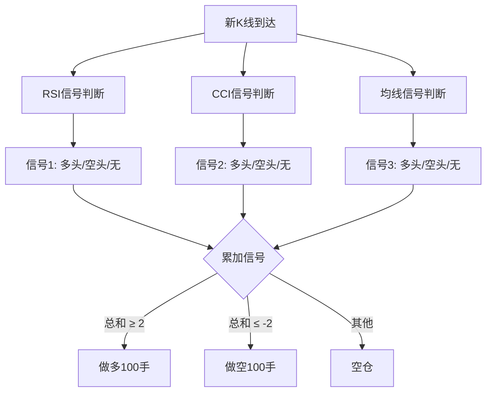
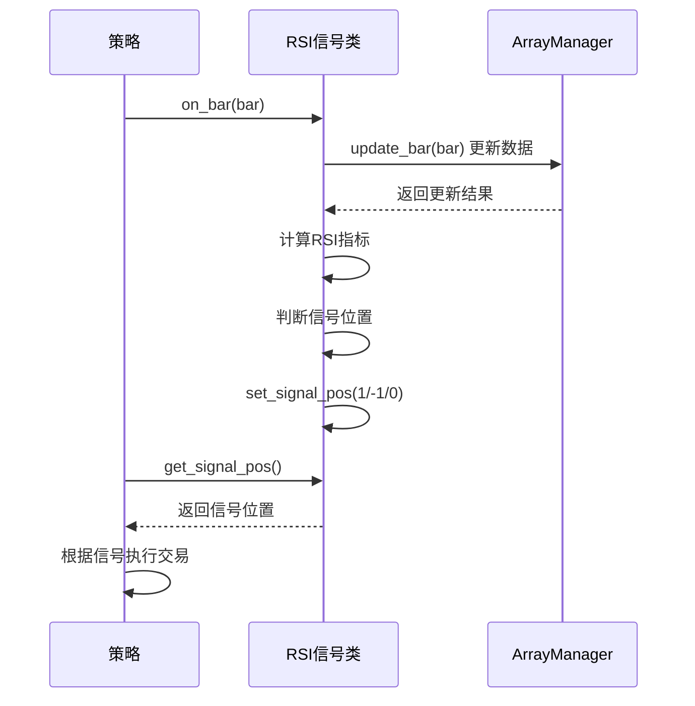

# Chapter 4: CTA信号类


在上一章中，我们学习了目标仓位模板（TargetPosTemplate），它可以帮助我们轻松管理仓位。你只需要设置"目标持仓是多少"，模板就会自动帮你完成买卖操作。

但有时候，策略的信号逻辑可能会变得很复杂。比如你想同时参考多个指标：RSI指标说"可以买"，CCI指标说"可以卖"，均线说"继续持有"。这时候，我们应该听谁的？

这就需要用到我们本章要学习的**CTA信号类**（CtaSignal）。它就像是一个个独立的"顾问"，每个顾问负责观察一个指标，然后给出自己的建议。最后，我们再综合所有顾问的建议来做决定。

---

## 4.1 什么是CTA信号类？

想象一下，你在管理一个**投资决策委员会**。委员会里有多个"顾问"：

- **RSI顾问**：专门研究RSI指标，告诉你应该做多还是做空
- **CCI顾问**：专门研究CCI指标，给出他的建议
- **均线顾问**：专门研究均线交叉，给出他的判断

每个顾问只负责自己擅长的领域，最后由"委员会主席"（也就是策略）综合所有意见来做最终决定。

**CTA信号类**就是这些独立的"顾问"。它们：
- 只负责产生信号（买入=1、卖出=-1、空仓=0）
- 不直接执行交易
- 可以被多个策略同时使用

---

## 4.2 信号类的基本结构

CTA信号类（CtaSignal）是一个抽象基类，定义在`vnpy_ctastrategy/template.py`中。它有三个核心部分：

```python
class CtaSignal(ABC):
    """CTA信号类基类"""
    
    def __init__(self):
        self.signal_pos = 0  # 信号位置：1=多头，-1=空头，0=无信号
    
    @abstractmethod
    def on_bar(self, bar: BarData) -> None:
        """必须实现的回调方法：处理K线数据"""
        pass
    
    def set_signal_pos(self, pos: int) -> None:
        """设置信号位置"""
        self.signal_pos = pos
    
    def get_signal_pos(self) -> int:
        """获取当前信号位置"""
        return self.signal_pos
```

> **解释**：每个信号类都有一个`signal_pos`变量，存放当前的信号状态：
> - `1` 表示多头信号（应该买入）
> - `-1` 表示空头信号（应该卖出）
> - `0` 表示没有信号（保持观望）

---

## 4.3 创建一个简单的RSI信号类

现在让我们创建一个最简单的信号类：**RSI信号类**。它的任务是：根据RSI指标产生交易信号。

### 第一步：定义信号类

```python
from vnpy_ctastrategy import CtaSignal
from vnpy.trader.object import BarData

class RsiSignal(CtaSignal):
    """RSI信号类"""
    
    # RSI参数
    rsi_window: int = 14    # RSI周期
    rsi_level: float = 20   # 阈值（RSI超过50+20=70超买，低于50-20=30超卖）
    
    def __init__(self, rsi_window: int, rsi_level: float):
        super().__init__()
        self.rsi_window = rsi_window
        self.rsi_level = rsi_level
        self.am = ArrayManager()  # 用于计算RSI
```

> **解释**：这个信号类接收两个参数：RSI周期和阈值。它使用ArrayManager来管理K线数据并计算RSI指标。

### 第二步：实现on_bar方法

```python
    def on_bar(self, bar: BarData) -> None:
        """处理新的K线数据"""
        self.am.update_bar(bar)
        if not self.am.inited:
            self.set_signal_pos(0)  # 数据不够时无信号
            return
        
        # 计算RSI
        rsi = self.am.rsi(self.rsi_window)
        
        # 判断信号
        rsi_long = 50 + self.rsi_level   # 超买阈值，如70
        rsi_short = 50 - self.rsi_level   # 超卖阈值，如30
        
        if rsi >= rsi_long:
            self.set_signal_pos(1)   # 多头信号
        elif rsi <= rsi_short:
            self.set_signal_pos(-1)  # 空头信号
        else:
            self.set_signal_pos(0)   # 无信号
```

> **解释**：每次收到新K线时，信号类会：
> 1. 更新数据
> 2. 计算RSI值
> 3. 根据RSI判断信号：RSI≥70时产生多头信号，RSI≤30时产生空头信号，其他情况无信号

---

## 4.4 在策略中使用信号类

现在让我们看看如何在策略中使用这些信号类。

### 4.4.1 单信号策略

首先，我们在一个简单的策略中使用一个RSI信号类：

```python
from vnpy_ctastrategy import CtaTemplate, CtaSignal
from vnpy.trader.object import BarData

class RsiSignalStrategy(CtaTemplate):
    """基于RSI信号类的策略"""
    
    rsi_window: int = 14
    rsi_level: float = 20
    
    def on_init(self) -> None:
        # 创建RSI信号对象
        self.rsi_signal = RsiSignal(self.rsi_window, self.rsi_level)
    
    def on_bar(self, bar: BarData) -> None:
        # 推送数据给信号类
        self.rsi_signal.on_bar(bar)
        
        # 获取信号
        signal_pos = self.rsi_signal.get_signal_pos()
        
        # 根据信号执行交易
        if signal_pos == 1 and self.pos == 0:
            self.buy(bar.close_price, 1)
        elif signal_pos == -1 and self.pos == 0:
            self.short(bar.close_price, 1)
```

> **解释**：这个策略的工作流程是：
> 1. 初始化时创建一个RSI信号对象
> 2. 每次收到新K线时，将数据传给信号类
> 3. 信号类计算并产生信号
> 4. 策略读取信号并执行相应的交易

### 4.4.2 多信号策略（组合多个信号）

这是信号类最强大的地方！我们可以让多个信号类同时工作，然后把它们的信号累加起来：

```python
class MultiSignalStrategy(CtaTemplate):
    """多信号组合策略"""
    
    rsi_window: int = 14
    cci_window: int = 20
    fast_window: int = 10
    slow_window: int = 20
    
    def on_init(self) -> None:
        # 创建多个信号对象
        self.rsi_signal = RsiSignal(self.rsi_window, 20)
        self.cci_signal = CciSignal(self.cci_window, 50)
        self.ma_signal = MaSignal(self.fast_window, self.slow_window)
    
    def on_bar(self, bar: BarData) -> None:
        # 所有信号类处理同一根K线
        self.rsi_signal.on_bar(bar)
        self.cci_signal.on_bar(bar)
        self.ma_signal.on_bar(bar)
        
        # 累加所有信号
        total_signal = (
            self.rsi_signal.get_signal_pos() +
            self.cci_signal.get_signal_pos() +
            self.ma_signal.get_signal_pos()
        )
        
        # 根据综合信号决定仓位
        if total_signal >= 2:
            target_pos = 100   # 至少2个信号看多
        elif total_signal <= -2:
            target_pos = -100  # 至少2个信号看空
        else:
            target_pos = 0     # 信号不一致，空仓观望
```

> **解释**：多信号策略的原理是"**民主投票**"：
> - 3个信号都是1 → 总信号=3 → 强力做多
> - 2个信号是1，1个是0 → 总信号=2 → 轻度做多
> - 1个信号是1，1个是0，1个是-1 → 总信号=0 → 不做
> - 2个信号是-1 → 总信号=-2 → 轻度做空

---

## 4.5 信号类的组合使用

CTA信号类的设计非常灵活，可以实现各种复杂的信号组合策略。

### 5.1 简单组合：多数投票



### 5.2 加权组合：不同权重

有时候我们可能觉得某些指标更可靠，可以给它们更高的权重：

```python
def on_bar(self, bar: BarData) -> None:
    # ... 处理所有信号 ...
    
    # 加权求和
    total_score = (
        self.rsi_signal.get_signal_pos() * 1.0 +    # RSI权重1
        self.cci_signal.get_signal_pos() * 1.5 +    # CCI权重1.5（更可靠）
        self.ma_signal.get_signal_pos() * 2.0       # 均线权重2（最可靠）
    )
    
    # 根据得分决定仓位
    if total_score >= 3:
        self.set_target_pos(100)
    elif total_score <= -3:
        self.set_target_pos(-100)
```

---

## 4.6 内部实现原理

了解了如何使用信号类，让我们来看看它的**内部工作机制**。

### 6.1 信号类的工作流程



### 6.2 信号类与目标仓位模板的配合

信号类最常配合目标仓位模板（TargetPosTemplate）使用：

```python
class SignalTargetStrategy(TargetPosTemplate):
    """信号类 + 目标仓位模板的组合"""
    
    def on_init(self) -> None:
        # 创建信号对象
        self.rsi_signal = RsiSignal(14, 20)
        self.cci_signal = CciSignal(20, 50)
    
    def on_bar(self, bar: BarData) -> None:
        # 处理信号
        self.rsi_signal.on_bar(bar)
        self.cci_signal.on_bar(bar)
        
        # 计算综合信号
        signal = (
            self.rsi_signal.get_signal_pos() + 
            self.cci_signal.get_signal_pos()
        )
        
        # 设置目标仓位
        if signal >= 2:
            self.set_target_pos(100)
        elif signal <= -2:
            self.set_target_pos(-100)
        else:
            self.set_target_pos(0)
```

> **解释**：这种组合非常强大：
> - 信号类负责"分析市场"，给出应该做多还是做空
> - 目标仓位模板负责"执行交易"，自动完成开仓、平仓、反手等操作

---

## 4.7 常见信号类示例

除了RSI信号类，这里再介绍几种常用的信号类：

### 7.1 均线信号类（MaSignal）

```python
class MaSignal(CtaSignal):
    """均线交叉信号"""
    
    def __init__(self, fast_window: int, slow_window: int):
        super().__init__()
        self.fast_window = fast_window
        self.slow_window = slow_window
        self.am = ArrayManager()
    
    def on_bar(self, bar: BarData) -> None:
        self.am.update_bar(bar)
        if not self.am.inited:
            self.set_signal_pos(0)
            return
        
        # 计算均线
        fast_ma = self.am.sma(self.fast_window)
        slow_ma = self.am.sma(self.slow_window)
        
        # 金叉做多，死叉做空
        if fast_ma > slow_ma:
            self.set_signal_pos(1)
        elif fast_ma < slow_ma:
            self.set_signal_pos(-1)
```

### 7.2 CCI信号类（CciSignal）

```python
class CciSignal(CtaSignal):
    """CCI指标信号"""
    
    def __init__(self, cci_window: int, cci_level: int):
        super().__init__()
        self.cci_window = cci_window
        self.cci_level = cci_level
        self.am = ArrayManager()
    
    def on_bar(self, bar: BarData) -> None:
        self.am.update_bar(bar)
        if not self.am.inited:
            self.set_signal_pos(0)
            return
        
        cci = self.am.cci(self.cci_window)
        
        # CCI > +100 超买，CCI < -100 超卖
        if cci > self.cci_level:
            self.set_signal_pos(1)
        elif cci < -self.cci_level:
            self.set_signal_pos(-1)
        else:
            self.set_signal_pos(0)
```

---

## 4.8 本章小结

本章我们学习了**CTA信号类**（CtaSignal），主要包括：

1. **什么是CTA信号类**：独立的信号生成模块，就像投资决策委员会中的各个"顾问"
2. **基本结构**：包含signal_pos变量、on_bar回调方法和信号设置/获取方法
3. **如何创建信号类**：继承CtaSignal，实现on_bar方法，在方法内计算指标并设置信号
4. **单信号策略**：使用一个信号类产生交易信号
5. **多信号组合**：将多个信号类的信号累加，通过"投票"机制做决策
6. **与目标仓位模板配合**：信号类负责分析，模板负责执行

CTA信号类的设计实现了两个重要**解耦**：
- **信号生成与交易执行解耦**：信号类只管分析，不管执行
- **指标逻辑与策略逻辑解耦**：每个信号类可以独立开发、测试

这样大大提高代码的**可复用性**和**可维护性**。

---

**继续学习**： [第五章：CTA策略引擎](05_cta策略引擎_.md)

---

Generated by [AI Codebase Knowledge Builder](https://github.com/The-Pocket/Tutorial-Codebase-Knowledge)