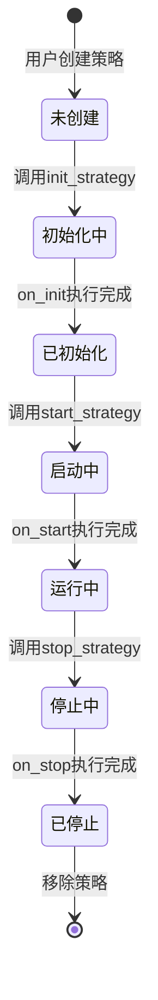
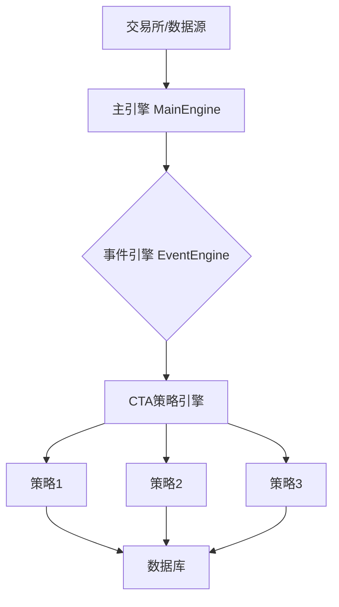
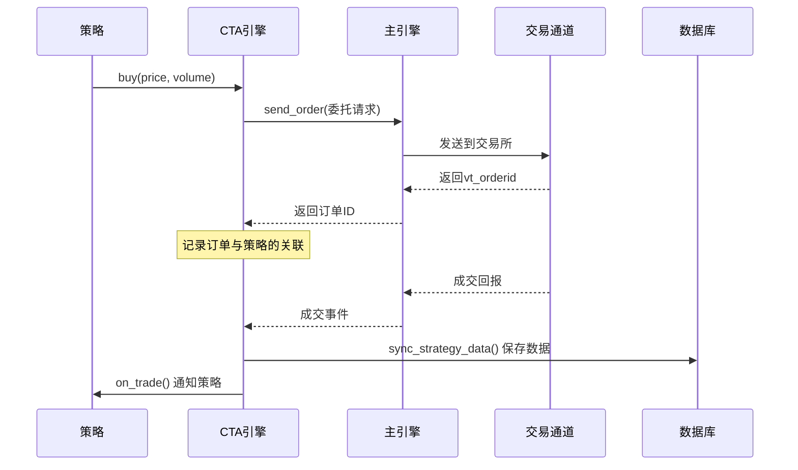

# Chapter 5: CTA策略引擎


在前面几章中，我们学习了CTA策略的基本构建模块：策略模板（[CTA策略模板](01_cta策略模板_.md)）、具体策略实现（[具体策略实现](02_具体策略实现_.md)）、目标仓位模板（[目标仓位模板](03_目标仓位模板_.md)）以及信号类（[CTA信号类](04_cta信号类_.md)）。这些知识让我们能够编写各种交易策略。

但是，编写好的策略如何在vnpy系统中运行呢？这就需要本章的主角——**CTA策略引擎**（CtaEngine）。它就像一个公司的CEO，负责管理和协调所有策略的运行。

---

## 5.1 什么是CTA策略引擎？

想象一下，你开了一家**餐厅**。前面几章我们学习了：
- 如何设计菜单（策略模板）
- 如何做菜（具体策略实现）
- 如何管理厨房库存（目标仓位模板）
- 如何培训厨师对菜品进行质量判断（信号类）

但是，**谁来决定今天要做哪些菜？谁来接收顾客的点单？谁来协调整个餐厅的运转？**

答案就是——**餐厅经理**！

CTA策略引擎就像是这个餐厅经理。它的主要职责包括：

| 职责 | 餐厅类比 | 在CTA引擎中的含义 |
|------|----------|-------------------|
| 接收订单 | 接收顾客点单 | 接收行情数据（Tick、K线） |
| 安排制作 | 把菜单交给厨房 | 调用策略的on_bar/on_tick方法 |
| 管理采购 | 采购食材 | 发送订单到交易所 |
| 记录库存 | 记录食材库存 | 记录持仓、盈亏等数据 |
| 协调运转 | 餐厅日常管理 | 策略的初始化、启动、停止 |

---

## 5.2 为什么需要CTA策略引擎？

你可能会问：为什么需要单独的一个"引擎"来管理策略？直接在策略里处理所有事情不行吗？

### 5.2.1 传统方式的麻烦

如果我们没有引擎，每个策略都需要自己处理：

```python
# 伪代码：没有引擎时策略需要自己处理的事情
class MyStrategy:
    def on_tick(self, tick):
        # 1. 自己订阅行情
        self.subscribe_market_data(tick.vt_symbol)
        
        # 2. 自己处理数据
        self.process_data(tick)
        
        # 3. 自己发送订单
        self.send_order_to_exchange(...)
        
        # 4. 自己管理持仓
        self.manage_position(...)
        
        # 5. 自己保存数据
        self.save_data_to_database(...)
        
        # 6. 自己处理各种异常
        self.handle_errors(...)
```

这就像一个餐厅老板既要亲自采购食材、亲自炒菜、亲自端盘子、亲自收银......会非常混乱！

### 5.2.2 有引擎的便利

有了CTA策略引擎后：

```python
# 有引擎时：策略只需要专注于交易逻辑
class MyStrategy(CtaTemplate):
    def on_bar(self, bar):
        # 策略只需要关注核心逻辑
        if self.cross_over:
            self.buy(bar.close_price, 1)
        
        # 其他事情引擎都帮你处理好了！
        # - 行情数据自动推送
        # - 订单自动发送
        # - 持仓自动更新
        # - 数据自动保存
```

---

## 5.3 CTA策略引擎的核心功能

CTA策略引擎有四大核心功能，让我们逐一介绍。

### 5.3.1 策略生命周期管理

引擎负责管理每个策略的完整生命周期：



| 状态 | 说明 | 引擎会做什么 |
|------|------|-------------|
| 未创建 | 策略对象已创建 | 加载策略参数配置 |
| 初始化中 | 正在执行on_init | 加载历史数据、初始化指标 |
| 已初始化 | 初始化完成 | 订阅行情数据 |
| 启动中 | 正在执行on_start | 标记为可交易状态 |
| 运行中 | 正常运行 | 接收数据、执行策略逻辑 |
| 停止中 | 正在停止 | 撤单、保存数据 |
| 已停止 | 完全停止 | 停止接收数据 |

### 5.3.2 行情数据推送

引擎负责接收市场数据，并分发给对应的策略：

```python
# 引擎内部简化代码
def process_tick_event(self, event):
    """处理行情数据"""
    tick = event.data
    
    # 找到订阅了这个合约的策略
    strategies = self.symbol_strategy_map[tick.vt_symbol]
    
    # 调用每个策略的on_tick方法
    for strategy in strategies:
        if strategy.inited:  # 只有初始化完成的策略才接收数据
            strategy.on_tick(tick)
```

> **解释**：当你订阅了一个合约（比如`IF2106.CFFEX`）的行情，引擎会找到所有使用这个合约的策略，然后把行情数据传给它们的`on_tick`方法。

### 5.3.3 订单管理

引擎负责处理订单的发送、撤改：

```python
# 引擎内部简化代码
def send_order(self, strategy, direction, offset, price, volume, ...):
    """发送订单"""
    # 1. 获取合约信息
    contract = self.main_engine.get_contract(strategy.vt_symbol)
    
    # 2. 创建委托请求
    req = OrderRequest(...)
    
    # 3. 发送订单到交易所
    vt_orderid = self.main_engine.send_order(req, contract.gateway_name)
    
    # 4. 记录订单与策略的关联
    self.orderid_strategy_map[vt_orderid] = strategy
    
    return vt_orderid
```

### 5.3.4 数据持久化

引擎会自动保存策略的重要数据：

```python
# 引擎会自动保存这些数据到JSON文件
# cta_strategy_data.json

{
    "DoubleMaStrategy": {
        "count": 150,
        "fast_ma0": 5100.5,
        "fast_ma1": 5098.3,
        "pos": 1
    }
}
```

---

## 5.4 CTA策略引擎的基本使用

虽然引擎主要是内部运行，但我们还是可以了解一下如何与它交互。

### 5.4.1 获取引擎实例

在vnpy中，可以通过主引擎获取CTA引擎：

```python
# 获取CTA引擎实例
cta_engine = main_engine.get_engine("cta_strategy")
```

### 5.4.2 加载策略类

引擎启动时，会自动扫描并加载策略文件：

```python
# 引擎会扫描这两个目录
# 1. vnpy_ctastrategy/strategies/  (内置策略)
# 2. strategies/                     (用户自定义策略)

# 加载后会得到所有可用的策略类名
class_names = cta_engine.get_all_strategy_class_names()
# 返回: ['DoubleMaStrategy', 'AtrRsiStrategy', ...]
```

### 5.4.3 创建策略实例

```python
# 创建一个策略实例
cta_engine.add_strategy(
    class_name="DoubleMaStrategy",      # 策略类名
    strategy_name="我的双均线策略",      # 策略实例名称
    vt_symbol="IF2106.CFFEX",           # 交易的合约
    setting={"fast_window": 10, "slow_window": 20}  # 参数配置
)
```

### 5.4.4 初始化和启动策略

```python
# 初始化策略（加载历史数据、初始化指标）
cta_engine.init_strategy("我的双均线策略")

# 启动策略（开始接收实时数据、开始交易）
cta_engine.start_strategy("我的双均线策略")
```

---

## 5.5 内部实现原理

了解了如何使用引擎，让我们深入看看它的**内部工作机制**。

### 5.5.1 整体架构



### 5.5.2 事件驱动机制

引擎采用**事件驱动**的工作方式：

```python
# 引擎启动时注册事件监听
def register_event(self):
    # 监听行情数据事件
    self.event_engine.register(EVENT_TICK, self.process_tick_event)
    
    # 监听委托事件
    self.event_engine.register(EVENT_ORDER, self.process_order_event)
    
    # 监听成交事件
    self.event_engine.register(EVENT_TRADE, self.process_trade_event)
```

### 5.5.3 订单处理流程

当你调用`self.buy(price, volume)`时，发生了什么？



---

## 5.6 策略与引擎的交互

让我们通过一个完整的例子，看看策略是如何与引擎配合工作的。

### 5.6.1 一个完整的交易流程

```python
# 策略代码：双均线策略
class DoubleMaStrategy(CtaTemplate):
    fast_window = 10
    slow_window = 20
    
    def on_init(self):
        """初始化：引擎调用"""
        self.load_bar(10)  # 引擎帮你加载历史数据
        self.am = ArrayManager()
    
    def on_bar(self, bar):
        """核心逻辑：引擎推送K线时调用"""
        self.am.update_bar(bar)
        
        # 计算均线...
        if self.cross_over:
            # 买入开多
            self.buy(bar.close_price, 1)
    
    def on_trade(self, trade):
        """成交回报：引擎调用"""
        # 更新持仓
        print(f"成交了：{trade.direction} {trade.volume}手")
```

### 5.6.2 引擎在背后做的事情

```python
# 引擎内部：处理新的K线数据
def process_bar(self, bar):
    # 1. 找到所有订阅了这个合约的策略
    strategies = self.symbol_strategy_map[bar.vt_symbol]
    
    # 2. 对每个策略调用on_bar
    for strategy in strategies:
        # 检查策略是否初始化完成
        if not strategy.inited:
            continue
        
        # 检查策略是否正在运行
        if not strategy.trading:
            continue
        
        # 3. 安全调用策略的on_bar方法
        try:
            strategy.on_bar(bar)
        except Exception as e:
            # 如果策略出错，停止策略
            strategy.trading = False
            self.write_log(f"策略执行出错: {e}")
```

---

## 5.7 引擎的配置与数据文件

引擎会使用两个重要的配置文件：

### 5.7.1 策略配置文件

`cta_strategy_setting.json` 保存策略的配置：

```json
{
    "我的双均线策略": {
        "class_name": "DoubleMaStrategy",
        "vt_symbol": "IF2106.CFFEX",
        "setting": {
            "fast_window": 10,
            "slow_window": 20,
            "fixed_size": 1
        }
    }
}
```

### 5.7.2 策略数据文件

`cta_strategy_data.json` 保存策略运行时的数据：

```json
{
    "我的双均线策略": {
        "count": 150,
        "fast_ma0": 5100.5,
        "pos": 1
    }
}
```

---

## 5.8 本章小结

本章我们学习了**CTA策略引擎**（CtaEngine），主要包括：

1. **什么是CTA策略引擎**：整个模块的核心大脑，负责管理所有策略的生命周期
2. **为什么需要引擎**：集中处理行情推送、订单管理、数据持久化等通用功能
3. **核心功能**：策略生命周期管理、行情数据推送、订单管理、数据持久化
4. **基本使用**：如何创建、初始化、启动策略
5. **内部原理**：事件驱动机制、订单处理流程

现在，你已经理解了vnpy_ctastrategy的完整架构：

- **策略模板** → 策略的基本框架
- **信号类** → 独立的信号生成模块
- **目标仓位模板** → 便捷的仓位管理
- **策略引擎** → 管理和运行所有策略的核心

---

**继续学习**：[第六章：停止委托](06_停止委托_.md)

---

Generated by [AI Codebase Knowledge Builder](https://github.com/The-Pocket/Tutorial-Codebase-Knowledge)