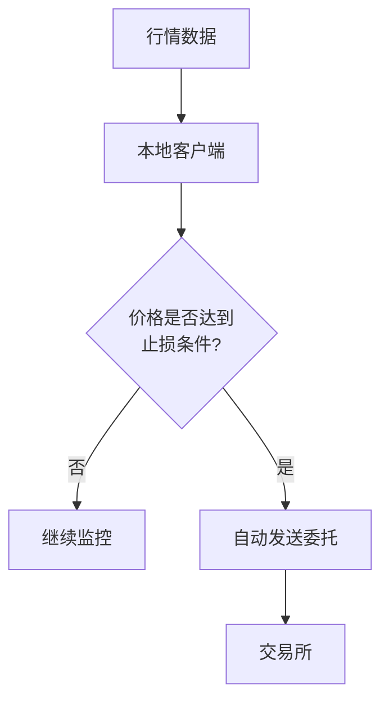
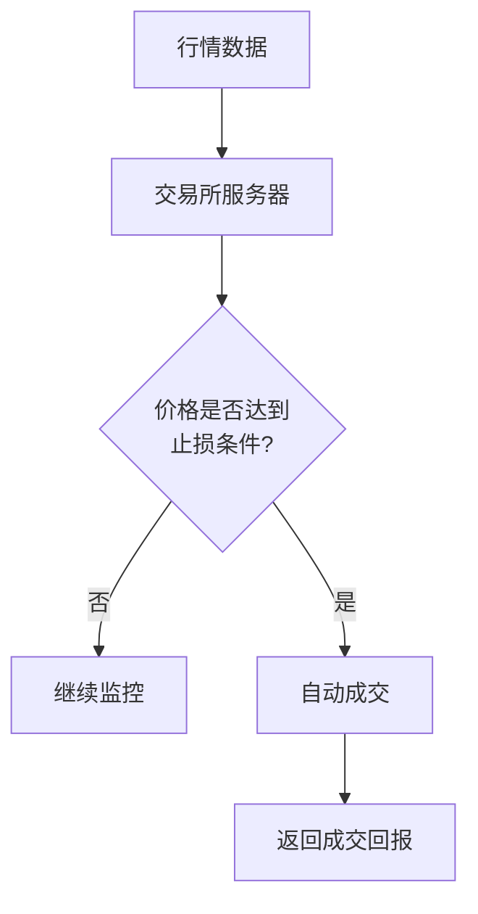
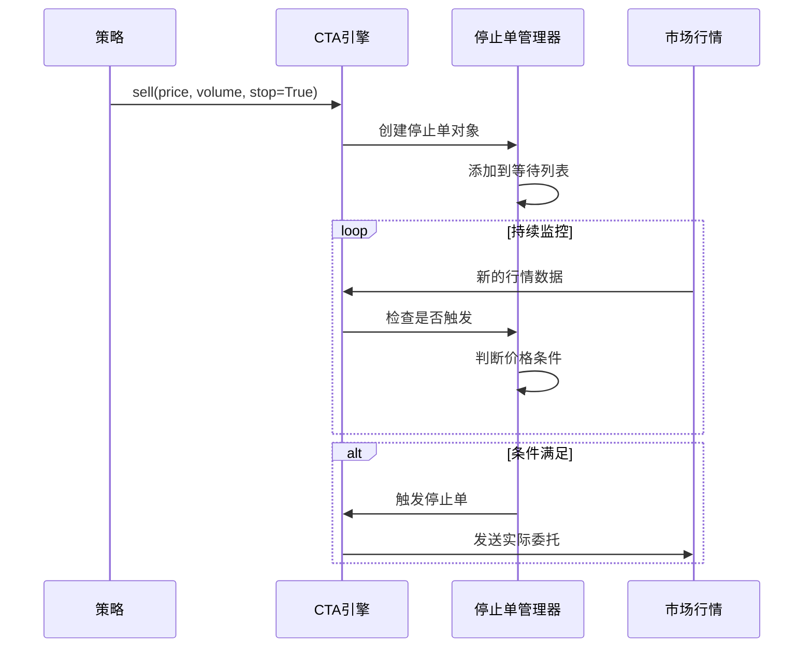
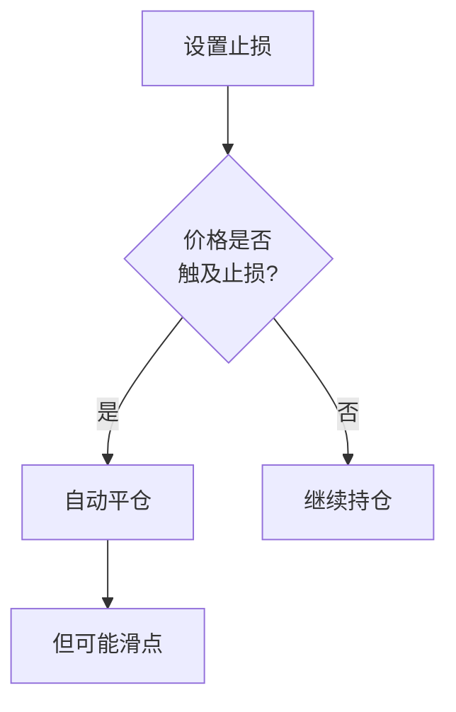

# Chapter 6: 停止委托


在上一章中，我们学习了[CTA策略引擎](05_cta策略引擎_.md)，了解了策略是如何在系统中运行和管理的。我们学会了如何创建策略、如何发送订单、以及如何管理持仓。

但是，你有没有想过这样一个问题：**如果我想设置一个"自动止损单"，当价格跌到某个位置时自动卖出，应该怎么实现？**

这就需要用到本章要学习的**停止委托**（Stop Order）机制。它就像是给策略安装了一个"自动警报器"，当行情达到预设条件时，会自动触发交易指令。

---

## 6.1 什么是停止委托？

想象一下，你正在经营一家水果店。你对店员说：

> "如果苹果的价格降到每斤5元以下，就立刻进货100斤！"

这句话就是一个"停止委托"——你设定了一个条件（价格低于5元），当条件满足时，自动执行一个动作（买入100斤苹果）。

在量化交易中，**停止委托**的工作原理完全一样：

```python
# 伪代码示例
# 当价格跌到4900以下时，自动卖出平仓（止损）
self.sell(4900, 1, stop=True)
```

> **简单理解**：停止委托就是"条件单"——满足了条件才执行的委托单。

### 停止委托的主要用途

1. **止损**：当价格不利变动时，自动平仓控制损失
2. **止盈**：当价格向有利方向移动到目标位时，自动获利了结
3. **突破交易**：当价格突破某个关键位置时，自动入场

---

## 6.2 停止委托的类型

停止委托有两种类型，它们的区别在于**在哪里监控触发条件**。

### 6.2.1 本地停止单

**本地停止单**在**客户端本地**监控触发条件：



**特点**：
- 由你的电脑监控价格
- 需要保持电脑开机
- 响应速度快（在你的电脑上直接判断）
- 网络断开时可能失效

### 6.2.2 服务器停止单

**服务器停止单**在**交易所服务器端**监控触发条件：



**特点**：
- 由交易所监控，无需保持电脑开机
- 更稳定可靠
- 不是所有交易所都支持
- 响应可能稍慢

> **比喻**：就像请了一个店员帮你看店。
> - **本地停止单** = 你自己盯着监控，发现价格到了就行动
> - **服务器停止单** = 告诉店员"价格到了告诉我"，店员帮你处理

---

## 6.3 在策略中使用停止委托

现在让我们看看如何在CTA策略中使用停止委托。

### 6.3.1 基本语法

在CTA策略中，使用 `stop=True` 参数就可以创建停止委托：

```python
# 买入止损（价格低于某价位时买入）
self.buy(价格, 数量, stop=True)

# 卖出止损（价格高于某价位时卖出）
self.sell(价格, 数量, stop=True)

# 做空止损（价格高于某价位时做空）
self.short(价格, 数量, stop=True)

# 平空止损（价格低于某价位时买入平空）
self.cover(价格, 数量, stop=True)
```

### 6.3.2 完整示例：ATR-RSI策略的止损

让我们看看第二章学过的ATR-RSI策略是如何使用止损的：

```python
def on_bar(self, bar: BarData) -> None:
    # 省略前面的代码...
    
    # 持有多头时：设置跟踪止损
    elif self.pos > 0:
        # 记录最高价
        self.intra_trade_high = max(self.intra_trade_high, bar.high_price)
        # 计算止损价格（最高价的98%）
        long_stop = self.intra_trade_high * 0.98
        # 设置止损卖出单
        self.sell(long_stop, abs(self.pos), stop=True)
```

> **解释**：这里使用的是**跟踪止损**（Trailing Stop）：
> 1. 记录持仓期间的最高价
> 2. 当价格从最高价下跌2%时，自动卖出平仓
> 3. 如果价格继续上涨，最高价也会更新，止损点跟着上移

### 6.3.3 完整示例：Dual Thrust策略的突破单

在Dual Thrust策略中，使用停止委托来实现突破入场：

```python
def on_bar(self, bar: BarData) -> None:
    # 省略前面的代码...
    
    # 检查是否突破上轨
    if self.pos == 0:
        if bar.close_price > self.long_entry:
            # 设置突破买入单（本地停止单）
            self.buy(self.long_entry, self.fixed_size, stop=True)
```

> **解释**：这是一种**突破交易**策略：
> - 预先计算好入场价位（上轨）
> - 设置一个停止买入单
> - 当价格真正突破上轨时，订单自动成交

---

## 6.4 停止委托的组成

了解完如何使用，让我们来看看停止委托的内部结构。

### 6.4.1 StopOrder类

在`vnpy_ctastrategy/base.py`中，定义了停止委托的数据结构：

```python
@dataclass
class StopOrder:
    vt_symbol: str           # 合约代码
    direction: Direction     # 方向（做多/做空）
    offset: Offset           # 开平（开仓/平仓）
    price: float             # 触发价格
    volume: float            # 委托数量
    stop_orderid: str        # 停止单ID
    strategy_name: str       # 策略名称
    datetime: datetime       # 创建时间
    status: StopOrderStatus # 状态（等待中/已撤销/已触发）
```

### 6.4.2 停止委托的状态

停止委托有三种状态：

| 状态 | 说明 |
|------|------|
| `WAITING`（等待中） | 条件未满足，等待触发 |
| `TRIGGERED`（已触发） | 条件已满足，委托已发出 |
| `CANCELLED`（已撤销） | 条件未满足前被主动撤销 |

---

## 6.5 内部实现原理

了解了如何使用停止委托，让我们深入看看它的**内部工作机制**。

### 6.5.1 本地停止单的处理流程

当策略设置一个本地停止单时，引擎在后台做了什么？



### 6.5.2 核心代码：检查触发

引擎会在每次收到新行情时检查是否触发停止单：

```python
# 引擎内部简化代码
def process_tick(self, tick):
    """处理行情数据，检查停止单"""
    
    # 获取该合约的所有停止单
    stop_orders = self.symbol_stoporders.get(tick.vt_symbol, [])
    
    for stop_order in stop_orders:
        if stop_order.status != StopOrderStatus.WAITING:
            continue  # 已处理过，跳过
        
        # 检查是否触发
        if self.check_stop_order_trigger(stop_order, tick):
            # 触发成功，发送实际委托
            self.send_stop_order(stop_order)
```

### 6.5.3 触发判断逻辑

根据不同的交易方向，触发条件也不同：

```python
# 引擎内部简化代码
def check_stop_order_trigger(self, stop_order, tick):
    """检查停止单是否触发"""
    
    if stop_order.direction == Direction.LONG:
        # 买入方向的停止单：价格 >= 触发价
        triggered = tick.last_price >= stop_order.price
    
    else:
        # 卖出方向的停止单：价格 <= 触发价
        triggered = tick.last_price <= stop_order.price
    
    return triggered
```

> **解释**：
> - **买入停止单**：当价格上涨到触发价**及以上**时触发（做多入场）
> - **卖出停止单**：当价格下跌到触发价**及以下**时触发（做空入场）

---

## 6.6 停止委托的实际应用场景

让我们通过几个实际场景来加深理解。

### 6.6.1 固定止损

最简单的止损方式：设置一个固定的止损价格。

```python
def on_bar(self, bar: BarData) -> None:
    # 假设当前持有多头
    if self.pos > 0:
        # 设置止损：成本价 - 2倍ATR
        stop_price = self.entrance_price - self.atr_value * 2
        self.sell(stop_price, abs(self.pos), stop=True)
```

### 6.6.2 移动止损

随着价格有利移动，不断调整止损点。

```python
def on_bar(self, bar: BarData) -> None:
    if self.pos > 0:
        # 更新最高价
        self.intra_trade_high = max(self.intra_trade_high, bar.high_price)
        # 止损点 = 最高价 - 2%
        stop_price = self.intra_trade_high * 0.98
        self.sell(stop_price, abs(self.pos), stop=True)
```

### 6.6.3 止盈离场

当价格达到目标盈利位时，自动平仓获利。

```python
def on_bar(self, bar: BarData) -> None:
    if self.pos > 0:
        # 如果盈利超过100点，设置止盈
        if bar.close_price - self.entrance_price >= 100:
            # 止盈价格
            profit_target = bar.close_price - 50
            self.sell(profit_target, abs(self.pos), stop=True)
```

---

## 6.7 注意事项

使用停止委托时需要注意以下几点：

### 6.7.1 止损单不等于保险



> **注意**：当价格剧烈波动时，实际成交价格可能与止损价格有偏差（滑点）。

### 6.7.2 避免频繁撤改

每次撤单和改单都需要时间，可能导致止损不及时。

### 6.7.3 本地停止单需要保持运行

如果使用本地停止单，需要保持电脑开机且VN Trader运行。

---

## 6.8 本章小结

本章我们学习了**停止委托**（Stop Order），主要包括：

1. **什么是停止委托**：满足条件才执行的"条件单"，常用于止损、止盈和突破交易
2. **两种类型**：
   - **本地停止单**：在客户端监控触发
   - **服务器停止单**：在交易所端监控触发
3. **如何使用**：在买入/卖出方法中添加 `stop=True` 参数
4. **主要用途**：
   - 固定止损
   - 跟踪止损（移动止损）
   - 止盈离场
   - 突破入场
5. **内部原理**：引擎在每次行情更新时检查是否满足触发条件

停止委托是风险管理的核心工具，合理使用可以有效控制亏损、保护盈利。下一章我们将学习[引擎类型](07_引擎类型_.md)，了解实盘交易和回测模式的区别。

---

**继续学习**：[第七章：引擎类型](07_引擎类型_.md)

---

Generated by [AI Codebase Knowledge Builder](https://github.com/The-Pocket/Tutorial-Codebase-Knowledge)