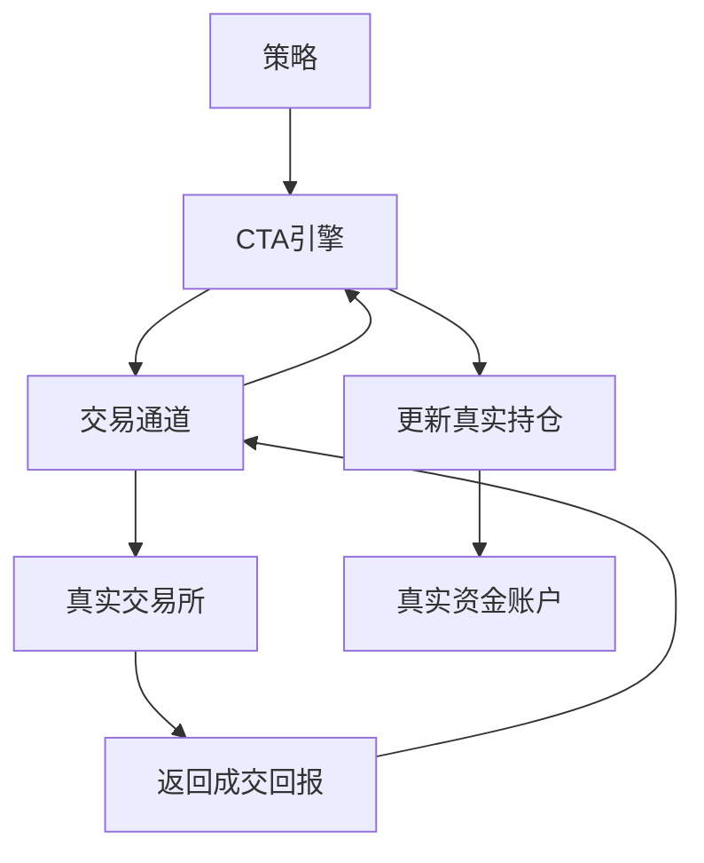
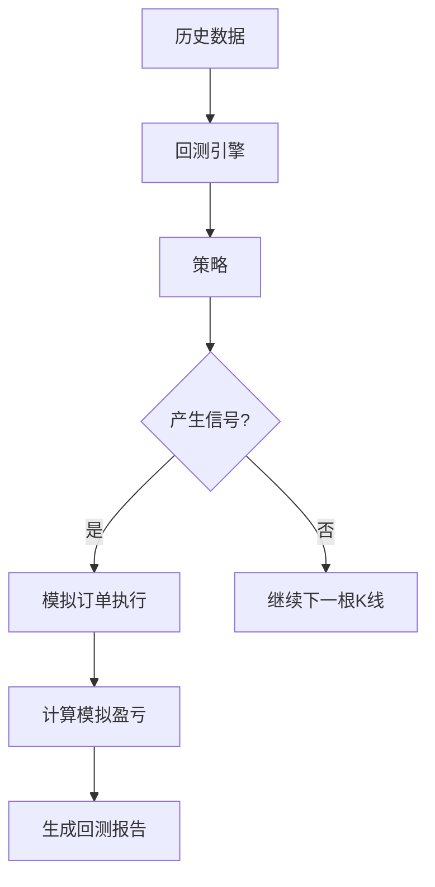
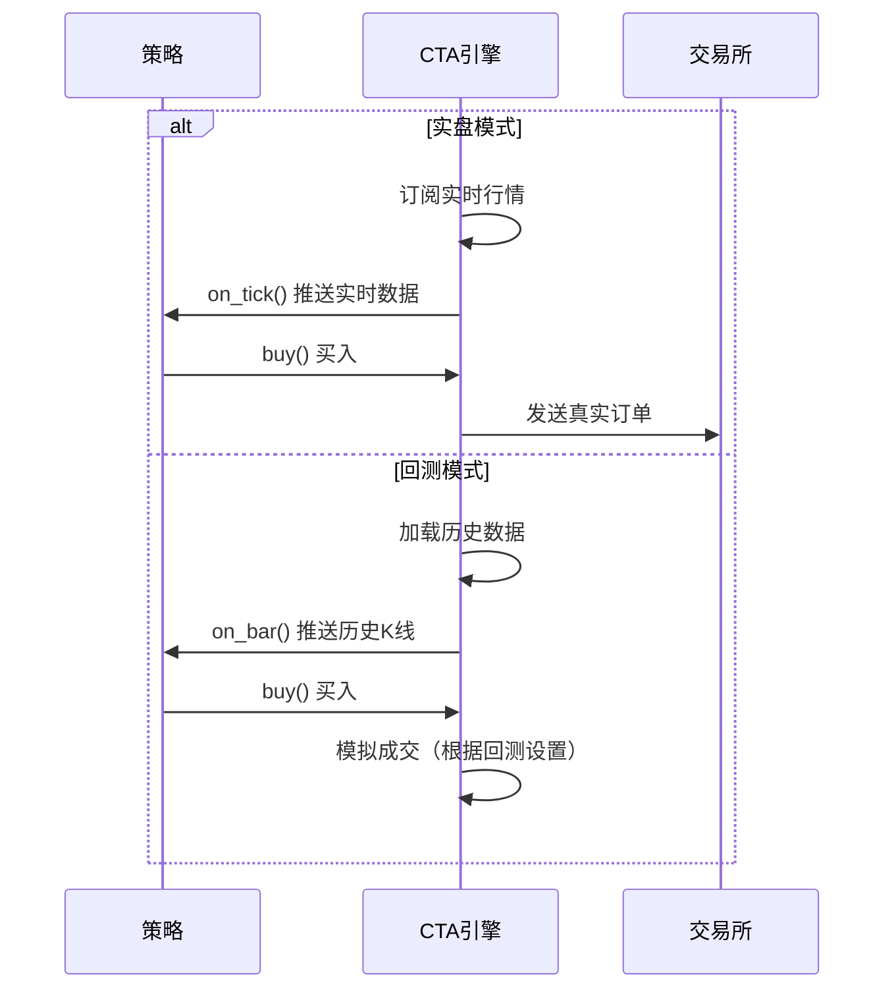
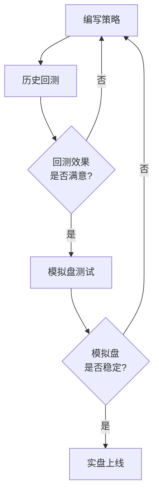

# Chapter 7: 引擎类型


在上一章中，我们学习了[停止委托](06_停止委托_.md)，了解了如何设置条件单来实现自动止损、止盈和突破交易。这些功能帮助我们在交易中更好地控制风险。

现在让我们来学习一个非常基础但非常重要的概念——**引擎类型**（EngineType）。它就像是区分"实战"和"演习"的标志，决定了策略是连接真实交易所进行交易，还是使用历史数据进行模拟。

---

## 7.1 什么是引擎类型？

想象一下，你在学习驾驶汽车。教练会让你做两件事情：

1. **模拟练习**：在驾校的模拟器上练习开车，熟悉操作流程
2. **实际上路**：真正开车上路，面对真实的交通情况

在这两种情况下，你的操作方式可能差不多（踩油门、刹车、转方向盘），但**环境完全不同**：
- 模拟练习：即使撞车也不会有 реальный（真正的）损失
- 实际上路：需要对自己的操作负责，会有真实的金钱盈亏

在vnpy_ctastrategy中，**引擎类型**就是用来区分这两种模式的：

| 引擎类型 | 含义 | 类比 |
|----------|------|------|
| `LIVE`（实盘） | 策略连接真实交易所进行交易 | 实际上路开车 |
| `BACKTESTING`（回测） | 策略使用历史数据进行模拟交易 | 驾校的模拟器 |

---

## 7.2 为什么需要区分引擎类型？

你可能会问：为什么不直接让策略在实盘中运行，还要区分什么回测模式？

这是因为在策略正式上线之前，我们需要**验证策略是否有效**。

### 7.2.1 没有回测的情况

如果只有实盘模式：
- 你设计了一个策略，必须真金白银去市场中测试
- 如果策略有问题（比如设计逻辑错误），就会直接亏损
- 测试成本非常高，风险很大

### 7.2.2 有回测的情况

有了回测模式后：
- 可以用**历史数据**来模拟策略在过去的表现
- 如果历史测试表现不好，就可以优化策略
- 确认策略有效后，再用实盘资金去验证
- 大大降低了测试成本和风险

> **简单比喻**：就像考试前要先做模拟题，确认自己掌握了对的知识点，再去参加正式考试。

---

## 7.3 实盘模式（LIVE）

### 7.3.1 什么是实盘模式？

实盘模式（LIVE）是策略**连接真实交易所**进行交易的状态。

在实盘模式下：
- 策略通过券商接口连接真实市场
- 发送的订单会真正到达交易所
- 成交后会产生真实的资金变动
- 需要承担真实的盈亏风险

### 7.3.2 实盘模式的特点



**实盘模式的特点**：
1. **真实订单**：所有买卖指令都会发送到真实的交易所
2. **真实资金**：盈亏是真实的金钱
3. **实时行情**：接收的是真实的实时行情数据
4. **需要风控**：需要设置更严格的风险控制

### 7.3.3 实盘模式的使用场景

实盘模式适用于：
- 策略已经通过回测验证
- 想要用真实资金进行交易
- 需要7×24小时运行策略

---

## 7.4 回测模式（BACKTESTING）

### 7.4.1 什么是回测模式？

回测模式（BACKTESTING）是使用**历史数据**对策略进行模拟交易。

在回测模式下：
- 使用过去的市场数据（如2020年的K线）来模拟交易
- 订单不会发送到真实交易所
- 盈亏是基于历史数据的模拟结果
- 目的是验证策略在过去的表现

### 7.4.2 回测模式的特点



**回测模式的特点**：
1. **模拟订单**：订单只在系统内部模拟执行
2. **模拟资金**：盈亏是基于模拟计算的
3. **历史行情**：使用历史K线数据
4. **快速验证**：可以快速测试策略的盈利能力

### 7.4.3 回测模式的使用场景

回测模式适用于：
- 验证策略逻辑是否正确
- 优化策略参数
- 评估策略的历史表现
- 快速迭代开发策略

---

## 7.5 引擎类型如何影响策略行为

引擎类型不仅仅是标记，它会实际影响CTA引擎和策略的**执行逻辑**。

### 7.5.1 订单执行逻辑不同

```python
# 引擎内部简化逻辑
def send_order(self, strategy, direction, offset, price, volume):
    
    if self.engine_type == EngineType.LIVE:
        # 实盘模式：发送到真实交易所
        return self.main_engine.send_order(...)
    
    elif self.engine_type == EngineType.BACKTESTING:
        # 回测模式：在本地模拟成交
        return self.backtesting_engine.send_order(...)
```

### 7.5.2 风控方式不同

```python
# 引擎内部简化逻辑
def check_risk(self, order_req):
    
    if self.engine_type == EngineType.LIVE:
        # 实盘：严格风控
        # - 检查资金是否充足
        # - 检查持仓是否超限
        # - 检查是否超过单日最大亏损
        return self.strict_risk_check(order_req)
    
    elif self.engine_type == EngineType.BACKTESTING:
        # 回测：简化风控
        # - 只需要基本的资金检查
        return self.simple_risk_check(order_req)
```

### 7.5.3 数据获取方式不同

```python
# 引擎内部简化逻辑
def get_price(self, vt_symbol):
    
    if self.engine_type == EngineType.LIVE:
        # 实盘：从实时行情获取最新价
        return self.get_latest_price(vt_symbol)
    
    elif self.engine_type == EngineType.BACKTESTING:
        # 回测：从历史数据中获取价格
        return self.get_historical_price(vt_symbol)
```

---

## 7.6 如何设置引擎类型

在vnpy中，你可以通过界面选择引擎类型。

### 7.6.1 在VN Trader中设置

1. **回测模式**：
   - 点击"功能"→"CTA策略"
   - 选择"回测"标签页
   - 设置回测参数（合约、时间、手续费等）
   - 点击"开始回测"

2. **实盘模式**：
   - 点击"功能"→"CTA策略"
   - 选择"实盘"标签页
   - 添加策略并启动

### 7.6.2 在代码中判断引擎类型

如果你需要在策略中根据引擎类型做不同处理：

```python
# 在策略中获取引擎类型
from vnpy_ctastrategy.base import EngineType

class MyStrategy(CtaTemplate):
    def on_init(self):
        # 获取引擎类型
        engine_type = self.cta_engine.engine_type
        
        if engine_type == EngineType.LIVE:
            print("当前是实盘模式")
        elif engine_type == EngineType.BACKTESTING:
            print("当前是回测模式")
```

---

## 7.7 内部实现原理

让我们深入看看引擎类型是如何在代码中实现的。

### 7.7.1 EngineType枚举定义

在`vnpy_ctastrategy/base.py`中定义了引擎类型：

```python
class EngineType(Enum):
    LIVE = _("实盘")
    BACKTESTING = _("回测")
```

> **解释**：这是一个简单的枚举类型，只有两个值——实盘和回测。

### 7.7.2 引擎初始化时设置类型

```python
# CTA引擎初始化时的简化逻辑
class CtaEngine:
    def __init__(self, main_engine, event_engine, engine_type):
        self.engine_type = engine_type
        
        if engine_type == EngineType.BACKTESTING:
            # 初始化回测相关组件
            self.backtesting_engine = BacktestingEngine()
```

### 7.7.3 处理流程差异



---

## 7.8 注意事项

使用引擎类型时需要注意以下几点：

### 7.8.1 回测结果不代表未来

> **重要提示**：回测表现好的策略，不一定在实盘中也能赚钱！
> 
> 这是因为：
> - 历史数据不能完全代表未来
> - 回测时可能存在"未来函数"（使用未来数据）
> - 滑点和手续费在回测中可能被低估

### 7.8.2 建议的开发流程



推荐的流程是：
1. **编写策略** → 设计交易逻辑
2. **历史回测** → 用历史数据验证
3. **模拟盘测试** → 用模拟资金实盘验证
4. **实盘上线** → 使用真实资金

---

## 7.9 本章小结

本章我们学习了**引擎类型**（EngineType），主要包括：

1. **什么是引擎类型**：区分策略运行环境的枚举类型，有实盘（LIVE）和回测（BACKTESTING）两种
2. **为什么需要区分**：实盘需要真金白银，回测可以使用历史数据模拟，两者用途不同
3. **实盘模式特点**：连接真实交易所，使用实时行情，承担真实风险
4. **回测模式特点**：使用历史数据模拟，快速验证策略有效性
5. **对策略的影响**：引擎类型会影响订单执行、风控方式、数据获取等方面

理解引擎类型对于正确使用vnpy_ctastrategy非常重要——它帮助我们在风险可控的情况下开发和验证策略。

下一章我们将学习[回测模式](08_回测模式_.md)，深入了解如何在vnpy中进行历史数据的回测测试。

---

**继续学习**：[第八章：回测模式](08_回测模式_.md)

---

Generated by [AI Codebase Knowledge Builder](https://github.com/The-Pocket/Tutorial-Codebase-Knowledge)