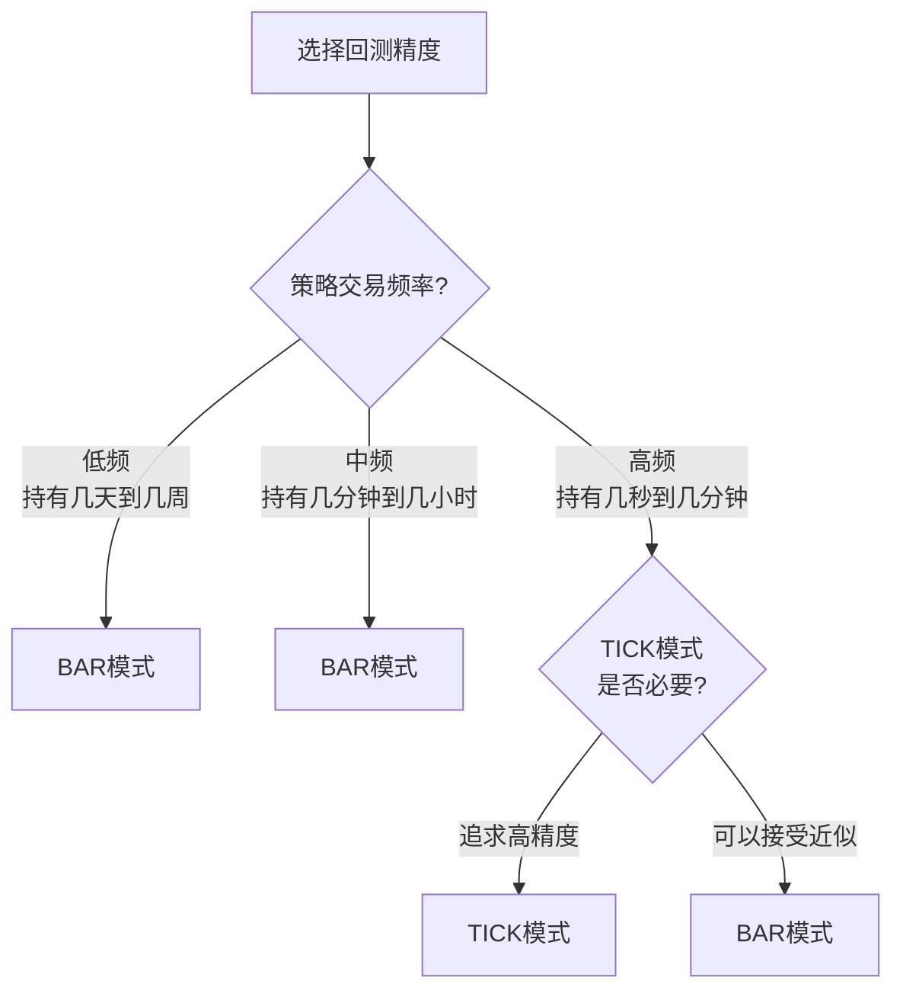
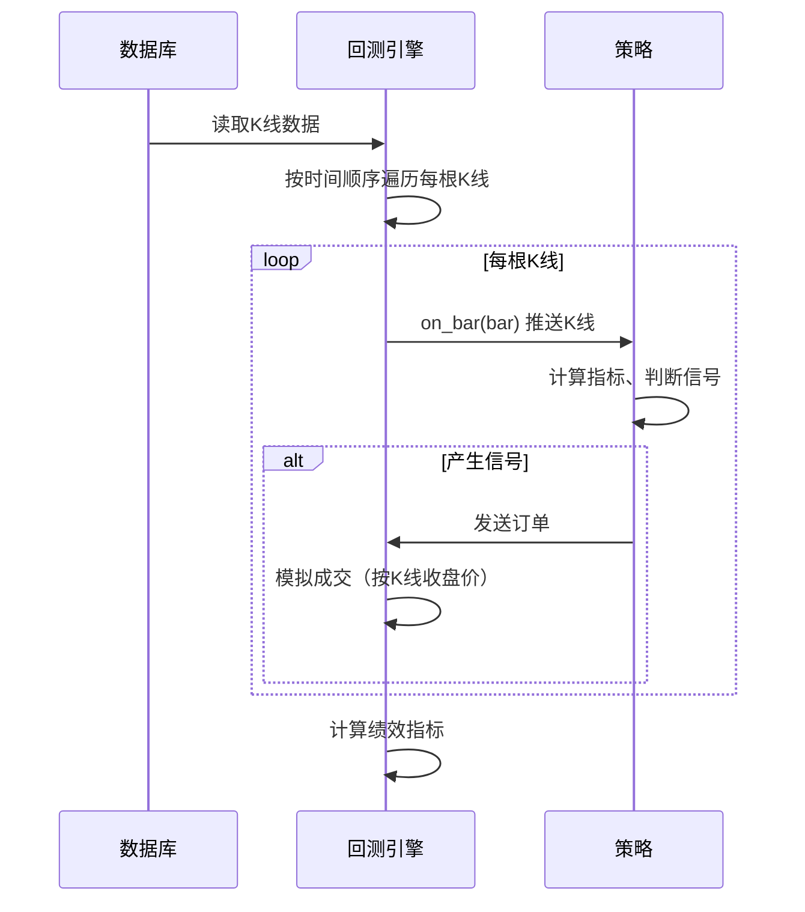
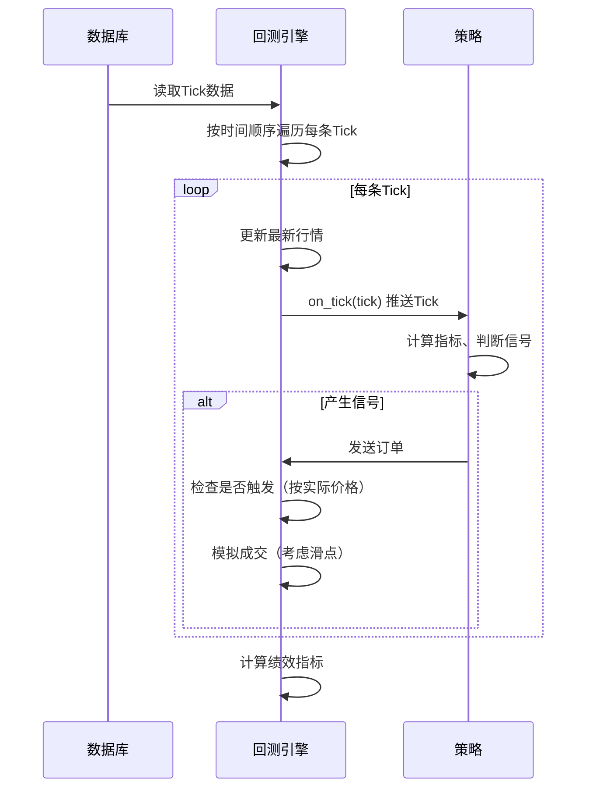
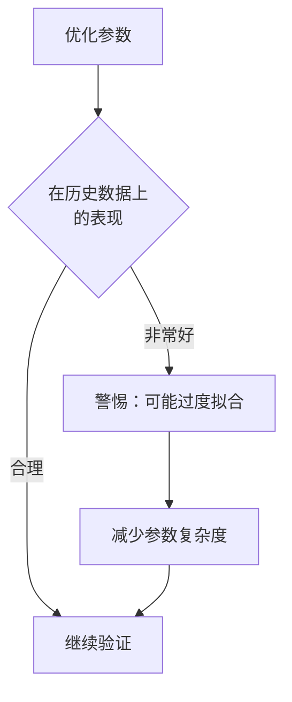

# Chapter 8: 回测模式


在上一章中，我们学习了[引擎类型](07_引擎类型_.md)，了解了实盘模式和回测模式的区别。实盘模式是连接真实交易所进行交易，而回测模式是使用历史数据进行模拟验证。

在本章中，我们将深入学习**回测模式**的具体内容，特别是回测引擎支持的两种数据精度级别：**BAR模式**和**TICK模式**。这将帮助你根据自己的策略特性选择合适的回测精度。

---

## 8.1 什么是回测模式？

想象一下，你在学习打麻将。通常你会怎么做？

1. **看别人打**：观察高手是怎么打的，学习策略
2. **自己模拟打**：不用真钱，和朋友或者自己练习
3. **真正上场**：用真钱去麻将馆打

**回测模式**就像是第2种情况——用模拟的方式练习。它使用过去的市场数据来模拟交易，让你在不用真钱的情况下，验证策略是否能赚钱。

> **简单理解**：回测就是"时光倒流"——让策略回到过去，用历史行情重新交易一次，看看会发生什么。

### 回测能做什么？

- 验证策略在过去是否能盈利
- 找出策略的问题并优化
- 估算策略的预期收益和风险
- 快速测试多种参数组合

---

## 8.2 回测数据的精度级别

回测引擎支持两种数据精度级别，就像拍照时有不同的清晰度：

| 精度级别 | 数据类型 | 特点 | 适用场景 |
|----------|----------|------|----------|
| **BAR模式** | K线数据（如1分钟K线、15分钟K线） | 速度快，精度较低 | 大多数策略 |
| **TICK模式** | 逐笔成交明细数据 | 精度高，计算量大 | 高频策略、精细策略 |

### 8.2.1 BAR模式（K线模式）

**BAR模式**使用**K线（Bar）**数据进行回测。

> **比喻**：就像看电影时只看到"每分钟的平均票价"，而不是每一笔具体的买卖记录。

```python
# BAR模式使用的K线数据结构
# 一根K线包含：开盘价、最高价、最低价、收盘价、成交量、时间
{
    "datetime": "2023-01-01 10:00:00",
    "open_price": 5000,
    "high_price": 5010,
    "low_price": 4990,
    "close_price": 5005,
    "volume": 1000
}
```

**BAR模式的特点**：

- **数据量小**：一天只有几百根K线
- **计算快速**：几分钟就能跑完几年的回测
- **精度有限**：看不到K线内部的具体价格波动

### 8.2.2 TICK模式（逐笔模式）

**TICK模式**使用**逐笔成交明细（Tick）**数据进行回测。

> **比喻**：就像看电影时看到**每一笔**买卖的具体记录，包括是谁在买、多少钱、买了多少。

```python
# TICK模式使用的逐笔数据结构
# 每一笔成交都有一条记录
{
    "datetime": "2023-01-01 10:00:05.123",
    "last_price": 5001,
    "last_volume": 2,
    "bid_price_1": 5000,
    "ask_price_1": 5001,
    "turnover": 10002
}
```

**TICK模式的特点**：

- **数据量大**：一天可能有几十万条成交记录
- **计算较慢**：几年数据可能需要几小时
- **精度很高**：能看到最细微的价格变动

---

## 8.3 如何选择回测精度？

选择合适的回测精度需要考虑以下几个因素：

### 8.3.1 根据策略频率选择



### 8.3.2 根据策略类型选择

| 策略类型 | 推荐精度 | 原因 |
|----------|----------|------|
| 趋势跟踪策略 | BAR模式 | 持仓时间长，K线足够 |
| 日内交易策略 | BAR模式或TICK模式 | 视策略复杂度而定 |
| 剥头皮策略 | TICK模式 | 需要精确把握价格变动 |
| 做市商策略 | TICK模式 | 需要看到订单簿细节 |

### 8.3.3 根据数据可用性选择

- 如果你只有K线数据 → 使用BAR模式
- 如果你有完整的Tick数据 → 可以选择TICK模式

---

## 8.4 在代码中设置回测精度

在vnpy中，可以通过以下方式设置回测精度。

### 8.4.1 设置BAR模式

```python
# 设置为BAR模式回测
backtesting_engine.set_mode(BacktestingMode.BAR)
```

> **解释**：设置后，回测引擎会使用K线数据来运行策略。

### 8.4.2 设置TICK模式

```python
# 设置为TICK模式回测
backtesting_engine.set_mode(BacktestingMode.TICK)
```

> **解释**：设置后，回测引擎会使用逐笔成交明细数据来运行策略。

### 8.4.3 完整回测示例

```python
from vnpy_ctastrategy import CtaBacktestingEngine
from vnpy_ctastrategy.backtesting import BacktestingMode, EngineType

# 创建回测引擎
engine = CtaBacktestingEngine(EngineType.BACKTESTING)

# 设置回测模式为BAR模式
engine.set_mode(BacktestingMode.BAR)

# 设置回测参数
engine.set_parameters(
    vt_symbol="IF2106.CFFEX",
    interval="1m",  # 1分钟K线
    start_date="2020-01-01",
    end_date="2023-12-31",
    rate=0.0003,  # 手续费率
    slippage=0.2,  # 滑点
    size=300,  # 合约乘数
    pricetick=0.2  # 最小价格变动
)

# 加载策略进行回测
engine.add_strategy(DoubleMaStrategy, {})
engine.run_backtesting()
```

---

## 8.5 BAR模式与TICK模式的实际对比

让我们通过一个简单的例子来看看两种模式的区别。

### 8.5.1 策略示例

```python
class SimpleStrategy(CtaTemplate):
    """简单策略：当价格突破布林带上轨时买入"""
    
    boll_window = 20
    boll_dev = 2
    
    def on_bar(self, bar):
        self.am.update_bar(bar)
        if not self.am.inited:
            return
        
        # 计算布林带
        boll_up, boll_down = self.am.boll(self.boll_window, self.boll_dev)
        
        # 突破上轨买入
        if bar.close_price > boll_up:
            self.buy(bar.close_price, 1)
```

### 8.5.2 两种模式的结果对比

假设我们用这个策略回测2022年的期货数据：

| 对比项 | BAR模式（1分钟K线） | TICK模式 |
|--------|---------------------|----------|
| 数据量 | 约25万根K线 | 约5000万条Tick |
| 回测时间 | 约30秒 | 约2小时 |
| 买入成交价 | 收盘价 | 实际成交价（有滑点） |
| 收益结果 | 10000元 | 9500元 |
| 最大回撤 | 5000元 | 5500元 |

> **注意**：从这个例子可以看出，TICK模式由于包含了滑点的模拟，结果可能比BAR模式更"真实"，但需要更长的计算时间。

---

## 8.6 内部实现原理

了解完如何使用，让我们深入看看两种模式的**内部工作机制**。

### 8.6.1 BAR模式的工作流程



### 8.6.2 TICK模式的工作流程



### 8.6.3 成交价格计算的区别

```python
# BAR模式：直接使用K线收盘价
def calculate_bar_fill_price(self, order, bar):
    # 买入：以收盘价成交
    # 卖出：以收盘价成交
    return bar.close_price

# TICK模式：根据实际价格和滑点计算
def calculate_tick_fill_price(self, order, tick, direction):
    if direction == Direction.LONG:
        # 买入：最新价格 + 滑点
        return tick.last_price + self.slippage
    else:
        # 卖出：最新价格 - 滑点
        return tick.last_price - self.slippage
```

---

## 8.7 注意事项

使用回测模式时需要注意以下几点：

### 8.7.1 回测结果不等于未来表现

> **重要提示**：过去的业绩不代表未来的表现！
> 
> - 市场规律可能改变
> - 回测用的数据可能不够完整
> - 实际交易中有更多不确定性

### 8.7.2 避免"过度拟合"



如果策略在历史数据上表现太好，可能只是"死记硬背"了过去的行情，而不是真正找到了有效的规律。

### 8.7.3 数据质量很重要

确保使用的历史数据：
- 完整（没有大量缺失）
- 准确（价格数据正确）
- 连续（时间上没有断裂）

---

## 8.8 本章小结

本章我们学习了**回测模式**的两种数据精度级别，主要包括：

1. **什么是回测模式**：使用历史数据模拟交易，验证策略有效性
2. **BAR模式**：使用K线数据，速度快但精度较低，适合大多数策略
3. **TICK模式**：使用逐笔成交明细，精度高但计算量大，适合高频策略
4. **如何选择**：根据策略的交易频率、类型和数据可用性来决定
5. **内部原理**：两种模式在数据处理和成交模拟上有明显差异

选择合适的回测精度非常重要：
- **追求速度** → 选择BAR模式
- **追求精度** → 选择TICK模式
- **平衡考虑** → 初期用BAR模式快速验证，最后用TICK模式精细确认

---

**继续学习**：[第九章：CTA策略管理器界面](09_cta策略管理器界面_.md)

---

Generated by [AI Codebase Knowledge Builder](https://github.com/The-Pocket/Tutorial-Codebase-Knowledge)