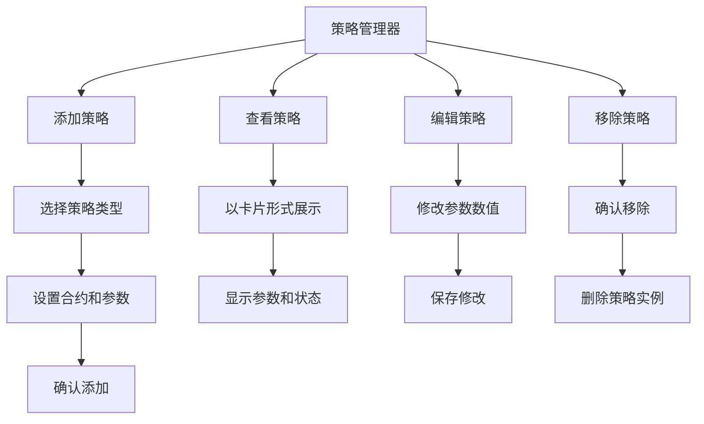
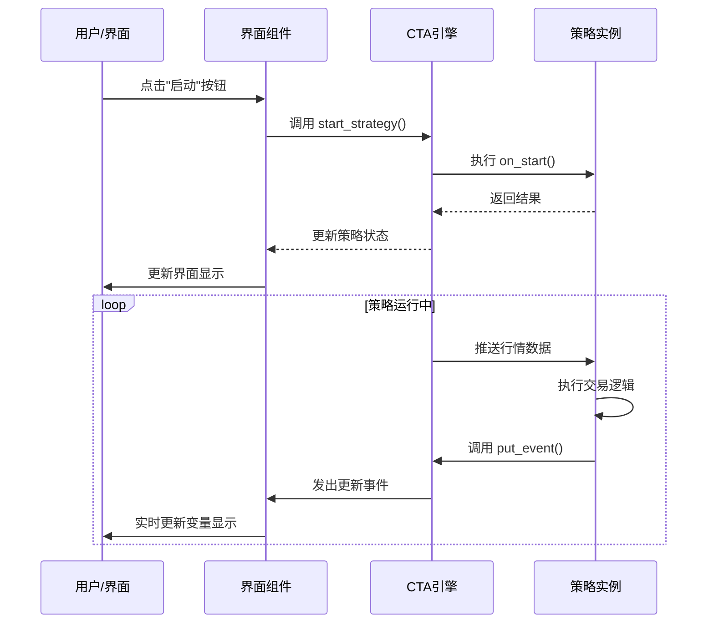

# Chapter 9: CTA策略管理器界面


在上一章中，我们学习了[回测模式](08_回测模式_.md)，了解了如何使用历史数据来验证策略的有效性。在实际使用中，我们需要一个友好的图形界面来管理和控制策略，这就本章要介绍的**CTA策略管理器界面**。

---

## 9.1 什么是CTA策略管理器界面？

想象一下，你是一家餐厅的**店长**。你需要管理多家分店的多位厨师：

- **添加新厨师**：招聘新的厨师到店里
- **查看厨师状态**：了解每位厨师当前的工作状态
- **安排任务**：告诉厨师今天要做什么菜
- **调整工作**：根据顾客反馈调整厨师的工作
- **移除厨师**：某位厨师表现不好，需要解雇

在vnpy_ctastrategy中，**CTA策略管理器界面**就像是这个店长角色。它是一个图形化的管理面板，帮助你：

- 添加新的策略
- 查看每个策略的运行状态
- 启动、停止策略
- 修改策略参数
- 查看策略的日志信息

> **简单理解**：策略管理器界面就是策略的"控制台"，让你可以图形化地管理所有的CTA策略。

---

## 9.2 界面主要功能

CTA策略管理器界面提供了以下核心功能：

### 9.2.1 策略的增删改查



### 9.2.2 策略运行控制

每个策略都有**三种状态**：

| 状态 | 说明 | 可以做什么 |
|------|------|------------|
| **未初始化** | 策略刚创建，还未加载数据 | 初始化、编辑、移除 |
| **已初始化** | 已加载历史数据，等待启动 | 启动、编辑、停止、移除 |
| **运行中** | 正在接收行情并执行交易 | 停止（不能编辑或移除） |

---

## 9.3 界面布局介绍

让我们看看CTA策略管理器界面的主要组成部分。

### 9.3.1 顶部工具栏

界面顶部有一排按钮，用于全局操作：

```python
# 顶部工具栏包含以下功能按钮
添加策略     # 添加新的策略实例
全部初始化   # 一次性初始化所有策略
全部启动    # 一次性启动所有策略
全部停止    # 一次性停止所有策略
清空日志    # 清空日志显示区域
移仓助手    # 打开移仓工具（下一章介绍）
```

### 9.3.2 策略卡片区域

中间的主要区域以**卡片形式**展示每个策略：

```
┌─────────────────────────────────────────────────┐
│  双均线策略_001  -  IF2106.CFFEX  (DoubleMa)   │
├─────────────────────────────────────────────────┤
│  参数:                                          │
│  ├─ fast_window: 10                            │
│  ├─ slow_window: 20                            │
│  └─ fixed_size: 1                              │
├─────────────────────────────────────────────────┤
│  变量:                                          │
│  ├─ inited: True                               │
│  ├─ trading: True                              │
│  ├─ pos: 1                                     │
│  └─ count: 150                                 │
├─────────────────────────────────────────────────┤
│  [初始化] [启动] [停止] [编辑] [移除]           │
└─────────────────────────────────────────────────┘
```

> **解释**：每个卡片显示：
> - 策略名称、交易合约、策略类名
> - 参数（可以修改的配置）
> - 变量（运行时的状态数据）
> - 操作按钮

---

## 9.4 如何添加新策略

下面我们通过一个完整的例子，看看如何通过界面添加一个新策略。

### 9.4.1 第一步：选择策略类型

在顶部左侧的下拉框中，选择你想要使用的策略模板：

```
┌──────────────────────┐
│ DoubleMaStrategy  ▼│  ← 选择策略类型
└──────────────────────┘
```

可选的策略类型包括：
- 双均线策略（DoubleMaStrategy）
- ATR-RSI策略（AtrRsiStrategy）
- 布林带策略（BollChannelStrategy）
- 等等...

### 9.4.2 第二步：配置参数

点击"添加策略"按钮，弹出参数配置对话框：

```python
# 参数配置对话框
{
    "strategy_name": "我的双均线策略",  # 给策略起个名字
    "vt_symbol": "IF2106.CFFEX",       # 交易合约
    "fast_window": 10,                 # 快速均线周期
    "slow_window": 20,                 # 慢速均线周期
    "fixed_size": 1                    # 每次开仓手数
}
```

> **解释**：
> - `strategy_name`：策略的专属名称，用于区分不同的策略实例
> - `vt_symbol`：要交易的合约代码（如IF2106股指期货）
> - 其他参数是策略特有的配置

### 9.4.3 第三步：确认添加

配置好参数后，点击"添加"按钮，策略就会被创建，并显示在卡片区域。

---

## 9.5 如何控制策略运行

策略添加后，可以通过卡片上的按钮来控制其运行。

### 9.5.1 初始化策略

点击"初始化"按钮，策略会：

1. 执行 `on_init()` 方法
2. 加载历史K线数据
3. 初始化技术指标
4. 状态变为"已初始化"

```python
# 初始化过程（简化）
def init_strategy(self, strategy_name):
    # 1. 创建策略实例
    strategy = create_strategy_instance(...)
    
    # 2. 调用初始化方法
    strategy.on_init()
    
    # 3. 加载历史数据
    strategy.load_bar(10)  # 加载10天历史数据
    
    # 4. 更新状态
    strategy.inited = True
```

### 9.5.2 启动策略

当初始化完成后，点击"启动"按钮：

1. 执行 `on_start()` 方法
2. 开始接收实时行情数据
3. 状态变为"运行中"
4. 开始自动执行交易

```python
# 启动过程（简化）
def start_strategy(self, strategy_name):
    # 1. 调用启动方法
    strategy.on_start()
    
    # 2. 订阅实时行情
    subscribe_market_data(strategy.vt_symbol)
    
    # 3. 更新状态
    strategy.trading = True
```

### 9.5.3 停止策略

当需要暂停策略时，点击"停止"按钮：

1. 撤销所有未成交订单
2. 执行 `on_stop()` 方法
3. 停止接收行情数据
4. 状态变为"已初始化"（非运行中）

```python
# 停止过程（简化）
def stop_strategy(self, strategy_name):
    # 1. 撤销所有未成交订单
    cancel_all_orders(strategy)
    
    # 2. 调用停止方法
    strategy.on_stop()
    
    # 3. 取消行情订阅
    unsubscribe_market_data(strategy.vt_symbol)
    
    # 4. 更新状态
    strategy.trading = False
```

---

## 9.6 如何查看策略状态和日志

### 9.6.1 查看参数和变量

每个策略卡片都会实时显示：

- **参数**：策略的配置值（如均线周期、开仓手数）
- **变量**：策略运行时的状态数据

```python
# 变量显示示例
variables = {
    "inited": True,      # 是否已初始化
    "trading": True,     # 是否正在运行
    "pos": 1,            # 当前持仓手数
    "count": 150         # 处理的K线数量
}
```

> **小贴士**：如果你在策略中调用了 `self.put_event()`，界面会自动更新显示最新的变量值。

### 9.6.2 查看日志信息

界面底部有一个**日志面板**，显示策略运行时的重要信息：

```
时间              信息
─────────────────────────────────────────
10:30:15  策略初始化完成，加载了300根K线
10:30:20  检测到金叉信号，买入开多1手
10:30:25  订单已发送，委托号：VT12345
10:30:30  成交回报：买入成交1手 @ 5100.5
```

你可以在策略中使用 `self.write_log()` 方法来输出日志：

```python
# 在策略中写入日志
def on_bar(self, bar):
    self.write_log(f"收到新K线，收盘价：{bar.close_price}")
    
    if self.cross_over:
        self.write_log("检测到金叉信号，买入开多")
        self.buy(bar.close_price, 1)
```

---

## 9.7 如何编辑和移除策略

### 9.7.1 编辑策略参数

在策略未运行（未启动）时，可以点击"编辑"按钮来修改参数：

1. 弹出参数编辑对话框
2. 修改需要的参数值
3. 点击"确定"保存修改

> **注意**：只能在策略**停止状态**下编辑参数，运行中的策略不能修改。

```python
# 参数修改流程
def edit_strategy(self, strategy_name, new_settings):
    strategy = get_strategy(strategy_name)
    
    # 检查策略是否在运行
    if strategy.trading:
        return False  # 运行中不能修改
    
    # 更新参数
    for key, value in new_settings.items():
        setattr(strategy, key, value)
    
    return True
```

### 9.7.2 移除策略

当不再需要某个策略时，可以点击"移除"按钮：

1. 会弹出确认对话框
2. 确认后，策略会被完全删除
3. 相关的配置信息也会被清除

> **注意**：同样只能在策略**停止状态**下移除。

---

## 9.8 停止委托监控

界面上还提供了一个**停止委托监控面板**，显示所有本地停止单的状态：

```
停止委托号    限价委托号    合约      方向  价格   数量  状态
─────────────────────────────────────────────────────────────
STOP_001     VT12345      IF2106   多头  4900   1    等待中
STOP_002     VT12346      IF2106   空头  5200   1    已触发
```

| 状态 | 说明 |
|------|------|
| 等待中 | 条件未满足，等待触发 |
| 已触发 | 条件已满足，委托已发出 |
| 已撤销 | 条件未满足前被主动撤销 |

---

## 9.9 内部实现原理

了解了如何使用界面，让我们深入看看它的**内部工作机制**。

### 9.9.1 界面与引擎的通信



### 9.9.2 事件驱动更新

界面使用**事件机制**来实时更新数据：

```python
# 界面监听的事件类型
EVENT_CTA_STRATEGY    # 策略状态变化事件
EVENT_CTA_LOG        # 日志消息事件
EVENT_CTA_STOPORDER  # 停止委托状态变化事件
```

```python
# 注册事件监听
def register_event(self):
    # 监听策略状态变化
    self.event_engine.register(
        EVENT_CTA_STRATEGY, 
        self.process_strategy_event
    )
```

### 9.9.3 策略管理器类

每个策略卡片由 `StrategyManager` 类管理：

```python
# StrategyManager 类的简化结构
class StrategyManager:
    def __init__(self, cta_manager, cta_engine, data):
        self.cta_manager = cta_manager
        self.cta_engine = cta_engine
        self.strategy_name = data["strategy_name"]
        
        # 创建界面组件
        self.init_button = QPushButton("初始化")
        self.start_button = QPushButton("启动")
        self.stop_button = QPushButton("停止")
        self.edit_button = QPushButton("编辑")
        self.remove_button = QPushButton("移除")
        
        # 绑定点击事件
        self.init_button.clicked.connect(self.init_strategy)
        self.start_button.clicked.connect(self.start_strategy)
```

---

## 9.10 本章小结

本章我们学习了**CTA策略管理器界面**，主要包括：

1. **什么是策略管理器界面**：图形化的策略控制面板，用于管理CTA策略
2. **主要功能**：
   - 添加新策略
   - 查看策略状态（参数、变量）
   - 控制策略运行（初始化、启动、停止）
   - 编辑和移除策略
   - 查看日志和停止委托
3. **策略的三种状态**：未初始化 → 已初始化 → 运行中
4. **界面布局**：顶部工具栏 + 策略卡片区域 + 日志面板
5. **内部原理**：事件驱动机制，界面与引擎通过事件通信

通过策略管理器界面，你可以轻松地管理多个策略，实时监控它们的运行状态，并根据需要进行调整。

---

**继续学习**：[第十章：移仓助手工具](10_移仓助手工具_.md)

---

Generated by [AI Codebase Knowledge Builder](https://github.com/The-Pocket/Tutorial-Codebase-Knowledge)