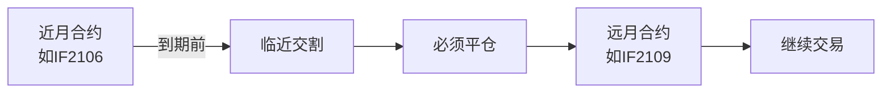
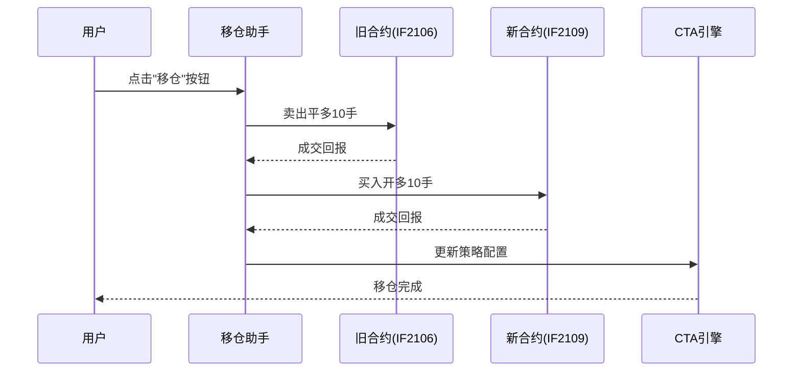
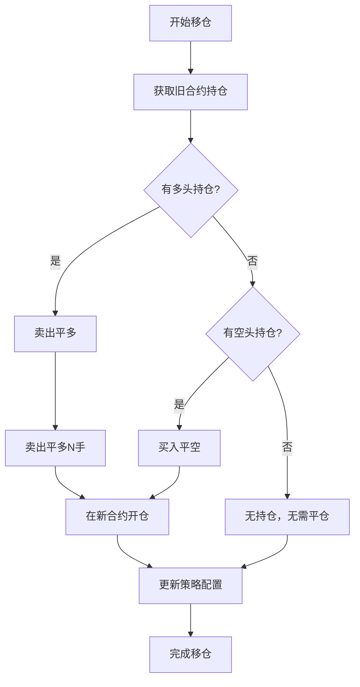
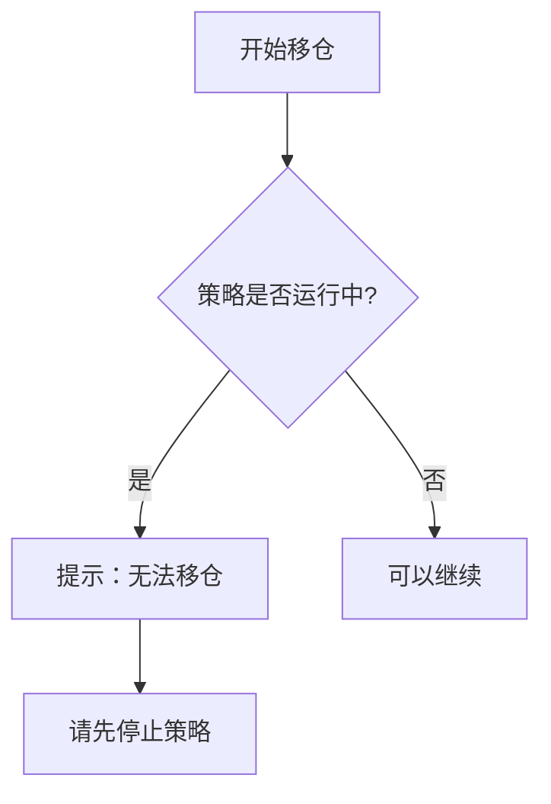

# Chapter 10: 移仓助手工具


在上一章中，我们学习了CTA策略管理器界面，学会了如何通过图形界面来管理策略的运行。在实际交易中，期货合约有一个特殊的特性——**合约到期换月**。当主力合约从近月切换到远月时，我们需要把原有的持仓进行迁移。这就是本章要介绍的**移仓助手工具**要解决的问题。

---

## 10.1 为什么要使用移仓助手？

### 10.1.1 期货合约的换月特性

想象一下，你爱吃的水果有季节性。夏天有**水蜜桃**，冬天有**苹果**。当夏天过去，水蜜桃下市了，你就需要把店里的水蜜桃库存处理掉，然后换成苹果来卖。

期货市场也是一样的道理：



| 术语 | 含义 |
|------|------|
| 近月合约 | 距离交割日期较近的合约，如IF2106（2021年6月） |
| 远月合约 | 距离交割日期较远的合约，如IF2109（2021年9月） |
| 主力合约 | 成交量最大的合约，通常是近月合约 |
| 换月 | 从近月合约切换到远月合约 |

### 10.1.2 移仓的问题

如果没有专门的移仓工具，你会遇到这些问题：

```python
# 手动移仓需要做的步骤
# 假设当前持有 IF2106 多头 10手，想要换到 IF2109

# 步骤1：平掉旧合约的多头
self.sell(目标价位, 10)  # 卖出IF2106

# 步骤2：等待平仓成交后，再开新合约多头
# 但这里有个问题：
# - 你需要一直盯着是否成交
# - 成交后要立刻开新合约
# - 如果价格变动，可能错过最佳时机

# 步骤3：修改策略的订阅合约
# 需要把策略从 IF2106 改成 IF2109
# 但这需要先停止策略、删除旧策略、创建新策略...
# 非常麻烦！
```

> **简单比喻**：就像你要把店里的货物从仓库A搬到仓库B。手动操作需要：先把仓库A的东西搬出来 → 运到仓库B → 登记入库。如果东西很多或者距离很远，非常累人！

---

## 10.2 什么是移仓助手工具？

**移仓助手工具**就是vnpy提供的一个自动化工具，它可以帮你一键完成：

1. **平掉旧合约的持仓**（近月合约）
2. **在远月合约开仓**（保持相同的方向和数量）
3. **更新策略**（让策略继续在新合约上运行）

整个过程只需要填写几个参数，然后点击"移仓"按钮就可以了！

---

## 10.3 移仓助手工具界面

在CTA策略管理器界面的顶部工具栏，有一个"移仓助手"按钮。点击后会弹出一个对话框：

```
┌──────────────────────────────────────────────────────────┐
│                      移仓助手                              │
├──────────────────────────────────────────────────────────┤
│  移仓合约:    [IF2106.CFFEX              ▼]            │
│                                                          │
│  目标合约:    [                      ]                    │
│                                                          │
│  委托超价:    [5 ]                                        │
│                                                          │
│  单笔上限:    [100]                                       │
│                                                          │
│  [           移仓             ]                          │
│                                                          │
│  ─────────────────────────────────────────────────────  │
│  日志输出:                                                │
│  10:30:15  准备移仓：IF2106 → IF2109                    │
│  10:30:15  发出卖出委托：IF2106，卖出平多，10手          │
│  10:30:15  发出买入委托：IF2109，买入开多，10手          │
│  10:30:20  成功移仓10手到IF2109                          │
└──────────────────────────────────────────────────────────┘
```

### 参数说明

| 参数 | 说明 | 举例 |
|------|------|------|
| 移仓合约 | 当前持有的旧合约（近月） | IF2106.CFFEX |
| 目标合约 | 要换到的新合约（远月） | IF2109.CFFEX |
| 委托超价 | 相对盘口的超价 ticks 数 | 5 |
| 单笔上限 | 单次委托的最大手数 | 100 |

---

## 10.4 如何使用移仓助手工具

下面我们通过一个完整的例子来看看如何使用移仓助手。

### 10.4.1 场景设定

假设你有一个双均线策略，当前正在交易 **IF2106** 合约，并且持有 **10手多头**。现在IF2106即将到期，你需要把持仓换到 **IF2109** 合约上。

### 10.4.2 操作步骤

**第一步：确保策略已停止**

在使用移仓工具之前，需要先停止策略：

```python
# 策略需要处于"已初始化"状态
# 即：不能是"运行中"状态
# 如果策略正在运行，需要先点击"停止"按钮
```

**第二步：打开移仓助手**

在CTA策略管理器界面，点击顶部工具栏的"移仓助手"按钮。

**第三步：填写参数**

```
移仓合约：选择 IF2106.CFFEX
目标合约：填写 IF2109.CFFEX
委托超价：5
单笔上限：100
```

**第四步：点击"移仓"按钮**

系统会自动完成以下操作：



---

## 10.5 移仓的内部实现原理

了解了如何使用，让我们深入看看移仓助手在内部做了什么。

### 10.5.1 整体流程



### 10.5.2 核心代码逻辑

移仓助手的核心逻辑主要分为两部分：**移仓持仓**和**更新策略**。

#### 1. 移仓持仓

```python
def roll_position(self, old_symbol, new_symbol, payup):
    """移动持仓"""
    
    # 获取旧合约的持仓信息
    holding = converter.get_position_holding(old_symbol)
    
    # 处理多头持仓
    if holding.long_pos:
        volume = holding.long_pos
        
        # 第一步：平掉旧合约的多头（卖出）
        self.send_order(
            old_symbol,
            Direction.SHORT,  # 卖出
            Offset.CLOSE,     # 平仓
            payup,
            volume
        )
        
        # 第二步：在新合约开多头（买入）
        self.send_order(
            new_symbol,
            Direction.LONG,   # 买入
            Offset.OPEN,      # 开仓
            payup,
            volume
        )
    
    # 处理空头持仓（同理）
    if holding.short_pos:
        volume = holding.short_pos
        # 平空头 → 开空头
        ...
```

> **解释**：这段代码做了两件事：
> - 如果有多头持仓，就**先平多再开多**
> - 如果有空头持仓，就**先平空再开空**
> 这样可以保持原有的方向不变。

#### 2. 更新策略配置

```python
def roll_strategy(self, strategy, new_vt_symbol):
    """更新策略的合约配置"""
    
    # 1. 保存旧策略的参数
    pos = strategy.pos           # 保存当前持仓
    name = strategy.strategy_name  # 保存策略名称
    parameters = strategy.get_parameters()  # 保存参数
    
    # 2. 删除旧策略
    self.cta_engine.remove_strategy(name)
    
    # 3. 创建新策略（使用新合约）
    self.cta_engine.add_strategy(
        strategy.__class__.__name__,  # 策略类名
        name,                          # 策略名称
        new_vt_symbol,                 # 新合约
        parameters                     # 参数配置
    )
    
    # 4. 初始化新策略
    self.cta_engine.init_strategy(name)
    
    # 5. 手动更新持仓数据
    new_strategy = self.cta_engine.strategies[name]
    new_strategy.pos = pos              # 设置持仓
    new_strategy.sync_data()             # 同步数据
```

> **解释**：这段代码做了这些事：
> 1. 记录旧策略的持仓和参数
> 2. 删除旧策略（因为它绑定的是旧合约）
> 3. 创建一个新策略（绑定新合约）
> 4. 把旧策略的持仓数量"复制"给新策略
> 5. 保存数据，这样新策略就知道自己有多少持仓了

---

## 10.6 移仓的实际应用场景

### 10.6.1 股指期货换月

股指期货（如IF、IH、IC）是国内最活跃的期货品种。每月第三周是交割周，你需要在这之前完成换月：

```python
# 典型的股指期货移仓时间线
# 
# IF2106 (6月合约)
#    ↓
# 6月第三周：IF2106即将到期，开始移仓
#    ↓
# IF2109 (9月合约)
```

### 10.6.2 商品期货换月

商品期货（如螺纹钢、铜）有不同的换月时间：

```python
# 商品期货移仓
# 螺纹钢(RB)：通常是逐月换月
# 铜(CU)：通常是隔月换月
# 
# 以螺纹钢为例：
# RB2105 → RB2106 → RB2107 → ...
```

---

## 10.7 注意事项

使用移仓助手时需要注意以下几点：

### 10.7.1 策略必须先停止



> **重要**：移仓前必须先停止策略，否则可能会产生不可预期的交易行为。

### 10.7.2 移仓有时间窗口

```python
# 最佳移仓时间
# - 不要在收盘前几分钟移仓
# - 不要在波动剧烈时移仓
# - 建议在开盘后一段时间、市场稳定时操作
```

### 10.7.3 注意交易成本

```python
# 移仓会产生额外的交易成本
# 
# 正常交易：买入 → 卖出（只交易一次）
# 移仓操作：平旧合约 → 开新合约（交易两次）
# 
# 成本 = 手续费 × 2 + 滑点 × 2
```

---

## 10.8 本章小结

本章我们学习了**移仓助手工具**，主要包括：

1. **为什么需要移仓**：期货合约到期必须平仓，需要换到远月合约继续交易
2. **什么是移仓助手**：vnpy提供的自动化工具，一键完成平仓+开仓+策略更新
3. **界面参数说明**：移仓合约、目标合约、委托超价、单笔上限
4. **使用步骤**：停止策略 → 打开移仓助手 → 填写参数 → 点击移仓
5. **内部原理**：
   - 先平旧合约持仓，再在新合约开仓
   - 删除旧策略，创建绑定新合约的新策略
   - 手动同步持仓数据

移仓助手工具可以大大简化期货换月的操作，让你能轻松地把持仓从一个合约转移到另一个合约，同时保持策略的连续性。

---

本教程的CTA策略系列章节已经全部结束了。通过学习这十章内容，你已经掌握了vnpy_ctastrategy框架的核心知识，包括：

- CTA策略模板的设计
- 具体策略的实现方法
- 目标仓位管理和信号类
- 策略引擎和回测模式
- 策略管理界面和移仓工具

希望这些知识能够帮助你在量化交易的道路上走得更远！祝交易顺利！

---

Generated by [AI Codebase Knowledge Builder](https://github.com/The-Pocket/Tutorial-Codebase-Knowledge)