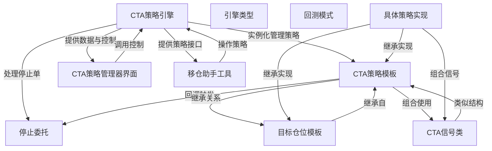

# Tutorial: vnpy_ctastrategy

**vnpy_ctastrategy** 是vn.py框架的核心量化交易模块，主要用于**自动化交易策略的开发与执行**。它提供了一套完整的策略框架，包括**策略模板**、**信号生成**、**仓位管理**和**回测功能**。用户可以通过继承**CTA策略模板**快速构建自己的交易策略，或者使用内置的**目标仓位模板**实现更高级的仓位控制。该模块还支持**停止委托**（止损止盈）和**实盘/回测**两种运行模式。

**Source Repository:** [https://github.com/vnpy/vnpy_ctastrategy.git](https://github.com/vnpy/vnpy_ctastrategy.git)

## Chapters

1. [CTA策略模板
](01_cta策略模板_.md)
2. [具体策略实现
](02_具体策略实现_.md)
3. [目标仓位模板
](03_目标仓位模板_.md)
4. [CTA信号类
](04_cta信号类_.md)
5. [CTA策略引擎
](05_cta策略引擎_.md)
6. [停止委托
](06_停止委托_.md)
7. [引擎类型
](07_引擎类型_.md)
8. [回测模式
](08_回测模式_.md)
9. [CTA策略管理器界面
](09_cta策略管理器界面_.md)
10. [移仓助手工具
](10_移仓助手工具_.md)

---

Generated by [AI Codebase Knowledge Builder](https://github.com/The-Pocket/Tutorial-Codebase-Knowledge)