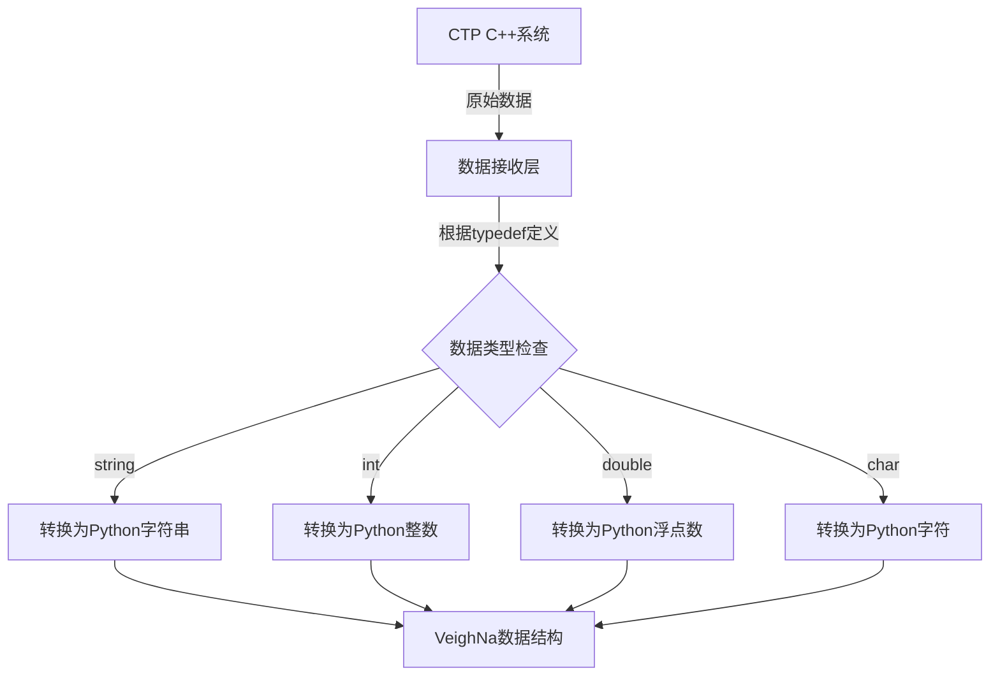

# Chapter 1: 数据类型定义 (ctp_typedef)


## 什么是数据类型？

在开始学习 `vnpy_ctp` 之前，我们需要先理解一个基础概念：**数据类型**。

想象一下，你在填写一份表格。表格中的每个格子都有特定的用途：
- 姓名栏：填写文字（字符串）
- 年龄栏：填写数字（整数）
- 身高栏：填写带小数的数字（浮点数）

**数据类型就像是表格中每个格子的"填写规则"**，它告诉程序：这个字段应该放什么类型的内容。

## 为什么 CTP 需要数据类型定义？

CTP（交易结算平台）是由 C++ 编写的柜台系统，而 VeighNa 是用 Python 编写的交易框架。当两者需要"对话"时，必须有一种方式来确保两边对数据的理解一致。

这就好像两个使用不同语言的人要交流，需要一个翻译器。**ctp_typedef 就是这个翻译器的"词典"**，它定义了 CTP 协议中每个字段应该使用什么数据类型。

## ctp_typedef 文件内容

让我们看看 `vnpy_ctp` 项目中是如何定义数据类型的。打开文件 `vnpy_ctp/api/generator/ctp_typedef.py`，可以看到类似这样的定义：

```python
# 字符串类型
TThostFtdcTraderIDType = "string"
TThostFtdcInvestorIDType = "string"
TThostFtdcBrokerIDType = "string"

# 整数类型
TThostFtdcIPPortType = "int"
TThostFtdcVolumeType = "int"
TThostFtdcErrorIDType = "int"

# 浮点数类型
TThostFtdcPriceType = "double"
TThostFtdcMoneyType = "double"

# 字符类型（单个字符）
TThostFtdcDirectionType = "char"
TThostFtdcOrderStatusType = "char"
```

### 数据类型分类

从上面的代码可以看到，CTP 主要使用了四种数据类型：

| 类型名称 | Python 对应类型 | 用途举例 |
|---------|----------------|---------|
| `string` | 字符串 | 合约代码、投资者ID、交易所名称 |
| `int` | 整数 | 端口号、数量、错误代码 |
| `double` | 浮点数 | 价格、资金、保证金 |
| `char` | 字符 | 方向（多/空）、状态标志 |

### 字段命名规则

观察类型名称，可以发现它们都遵循一定的命名规律：
- `TThostFtdc` - 所有类型的统一前缀
- 中间部分 - 表示这个类型用于什么字段（如 `Price` 价格、`Volume` 数量）
- 最后部分 - 表示数据类型（如 `Type`）

例如：`TThostFtdcPriceType` 就是"价格类型"的意思。

## 实际使用场景

当我们从 CTP 接收行情数据或交易数据时，这些类型定义会确保数据正确转换。假设我们收到一个合约信息：

```python
# 模拟收到的合约数据（来自CTP）
contract_data = {
    "InstrumentID": "RU2405",      # 合约代码 → string
    "ExchangeID": "SHFE",          # 交易所 → string
    "VolumeMultiple": 10,          # 合约乘数 → int
    "PriceTick": 5.0,             # 价格跳动 → double
}
```

如果没有类型定义，程序可能会把 `10` 当作字符串 `"10"`，把 `5.0` 当作字符串 `"5.0"`，导致后续计算出错。**类型定义就像是一个"数据校对器"**，确保每个字段都被正确理解。

## 类型定义在代码中的作用

在 VeighNa 的交易网关中，类型定义主要用于：

### 1. 数据验证
确保从 CTP 返回的数据类型正确：

```python
# 检查价格是否是有效的浮点数
price = contract_data["PriceTick"]
if isinstance(price, float):
    print("价格数据类型正确")
```

### 2. 类型转换
在 Python 和 C++ 之间传递数据时进行必要的转换：

```python
# 将字符串转换为整数
port = int("5201")  # "5201" → 5201
```

### 3. 常量映射
配合常量定义文件，将 CTP 的字符常量转换为 VeighNa 的标准枚举：

```python
# 方向映射：CTP的字符 → VeighNa的方向枚举
DIRECTION_CTP2VT = {
    '0': Direction.LONG,   # '0' 代表多头
    '1': Direction.SHORT,  # '1' 代表空头
}
```

## 内部实现原理

为了更好地理解类型定义的工作方式，让我们用流程图来说明数据是如何流动的：



### 数据流转步骤

1. **CTP 发送数据**：C++ 系统以二进制格式发送数据
2. **接收层解析**：根据字段名称查找对应的类型定义
3. **类型转换**：将 C++ 类型转换为 Python 类型
4. **构建对象**：用转换后的数据创建 VeighNa 的数据结构

## 总结

本章我们学习了：

- **数据类型定义**是 CTP 协议的"语法规则"，告诉程序每个字段应该使用什么类型
- 主要有四种类型：`string`（字符串）、`int`（整数）、`double`（浮点数）、`char`（字符）
- 类型定义确保 Python 和 C++ 之间数据传递的正确性
- 类型名称遵循统一的命名规则，便于识别和查找

### 下一步学习

了解了数据类型定义之后，我们需要知道 CTP 协议中有哪些**具体的常量值**。例如，`Direction`（方向）字段中，`'0'` 代表多头，`'1'` 代表空头。这些常量是如何定义的呢？

让我们继续学习下一章：[CTP常量定义 (ctp_constant)](02_ctp常量定义__ctp_constant__.md)。

---

Generated by [AI Codebase Knowledge Builder](https://github.com/The-Pocket/Tutorial-Codebase-Knowledge)