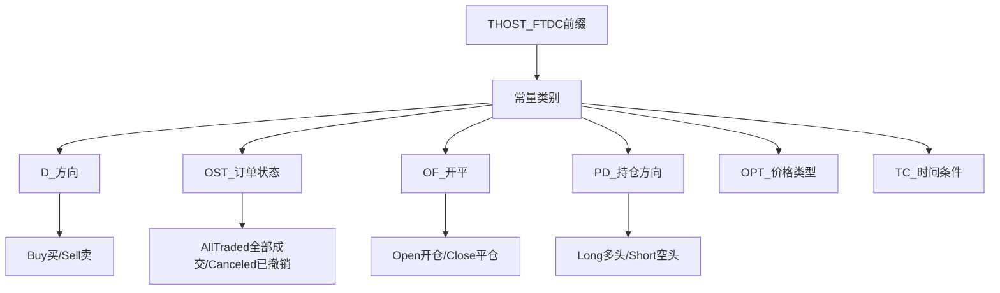
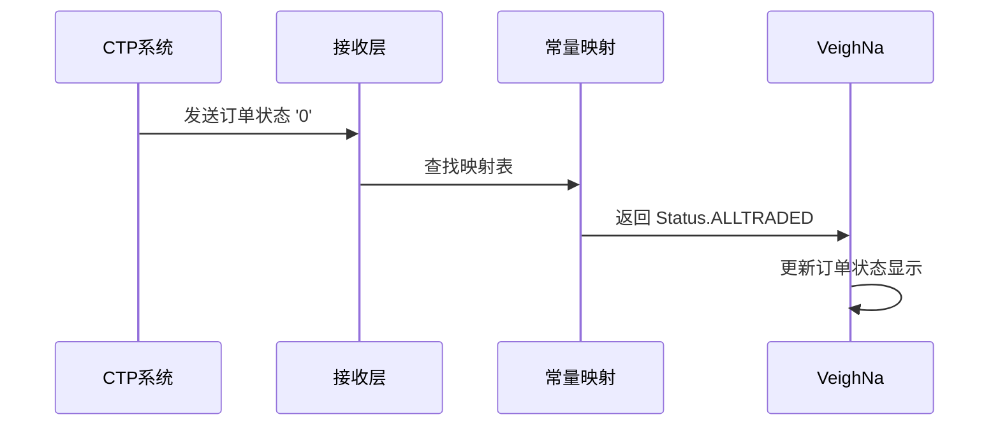

# Chapter 2: CTP常量定义 (ctp_constant)

## 什么是CTP常量？

在上一章[数据类型定义 (ctp_typedef)](01_数据类型定义__ctp_typedef__.md)中，我们学习了CTP协议中每个字段应该使用什么**数据类型**。就像知道了表格中每个格子应该填什么类型的值（数字、文字等）。

但光知道类型还不够，我们还需要知道每个字段可以填什么**具体的值**。这就好像知道"年龄"应该填数字还不够，还需要知道：什么是未成年人（小于18岁）？什么是成年人（18岁以上）？

**CTP常量就是这些"具体的值"**，它们是CTP协议中的"词汇表"，定义了每个字段所有可能的取值。

## 为什么需要常量定义？

想象一下，你在填写一份非常重要的表格：

- 性别栏：可以填什么？「男」「女」还是「其他」？
- 婚姻状况：可以填什么？「未婚」「已婚」还是「离婚」？

如果没有明确规定，每个人可能填不同的答案，表格就乱套了。

CTP常量就是来解决这个问题的：

- 交易方向：买入用`'0'`表示，卖出用`'1'`表示
- 订单状态：全部成交用`'0'`，部分成交用`'1'`，已撤销用`'5'`
- 交易所：上海期货交易所用`'SHFE'`，大连商品交易所用`'DCE'`

这样一来，所有的交易系统都使用统一的"语言"，不会产生歧义。

## CTP常量文件内容

在`vnpy_ctp`项目中，常量定义文件位于`vnpy_ctp/api/ctp_constant.py`。让我们看看一些最常用的常量：

### 1. 交易方向常量

```python
# 买入和卖出
THOST_FTDC_D_Buy = '0'   # 买入（多头）
THOST_FTDC_D_Sell = '1'  # 卖出（空头）
```

**记忆技巧**：D代表Direction（方向），Buy是0，Sell是1。

### 2. 订单状态常量

```python
# 订单状态枚举
THOST_FTDC_OST_AllTraded = '0'              # 全部成交
THOST_FTDC_OST_PartTradedQueueing = '1'     # 部分成交（排队中）
THOST_FTDC_OST_PartTradedNotQueueing = '2' # 部分成交（未排队）
THOST_FTDC_OST_NoTradeQueueing = '3'        # 未成交（排队中）
THOST_FTDC_OST_NoTradeNotQueueing = '4'     # 未成交（未排队）
THOST_FTDC_OST_Canceled = '5'               # 已撤销
```

**记忆技巧**：OST代表OrderStatus（订单状态），从0到5代表订单的完整生命周期。

### 3. 开平标志常量

```python
# 开平仓类型
THOST_FTDC_OF_Open = '0'           # 开仓
THOST_FTDC_OF_Close = '1'          # 平仓
THOST_FTDC_OF_ForceClose = '2'     # 强平
THOST_FTDC_OF_CloseToday = '3'     # 平今（只平今天开的仓位）
THOST_FTDC_OF_CloseYesterday = '4' # 平昨（平昨天之前的仓位）
```

### 4. 持仓方向常量

```python
# 持仓方向
THOST_FTDC_PD_Net = '1'   # 净持仓
THOST_FTDC_PD_Long = '2'  # 多头持仓
THOST_FTDC_PD_Short = '3' # 空头持仓
```

### 5. 报单价格类型常量

```python
# 报单价格类型
THOST_FTDC_OPT_AnyPrice = '1'      # 市价
THOST_FTDC_OPT_LimitPrice = '2'    # 限价
THOST_FTDC_OPT_BestPrice = '3'     # 最优价
THOST_FTDC_OPT_LastPrice = '4'    # 最新价
```

### 6. 有效期类型常量

```python
# 订单有效期类型
THOST_FTDC_TC_IOC = '1'  # 立即撤销（IOC）
THOST_FTDC_TC_GFS = '2'  # 本节有效
THOST_FTDC_TC_GFD = '3'  # 当日有效
THOST_FTDC_TC_GTD = '4'  # 指定日期前有效
THOST_FTDC_TC_GTC = '5'  # 撤销前有效
```

### 7. 交易所代码常量

```python
# 交易所标识
THOST_FTDC_EIDT_SHFE = 'S'  # 上海期货交易所
THOST_FTDC_EIDT_CZCE = 'Z'  # 郑州商品交易所
THOST_FTDC_EIDT_DCE = 'D'   # 大连商品交易所
THOST_FTDC_EIDT_CFFEX = 'J' # 中国金融期货交易所
THOST_FTDC_EIDT_INE = 'N'  # 上海国际能源交易中心
```

## 常量在代码中的使用

让我们看看常量在实际代码中是如何使用的：

### 场景：处理订单回报

当你下一笔订单后，CTP会返回订单状态：

```python
# 模拟从CTP收到的订单状态
ctp_order_status = '0'  # 全部成交

# 使用常量进行判断
if ctp_order_status == THOST_FTDC_OST_AllTraded:
    print("订单已全部成交！")
elif ctp_order_status == THOST_FTDC_OST_Canceled:
    print("订单已撤销")
elif ctp_order_status == THOST_FTDC_OST_PartTradedQueueing:
    print("订单部分成交，还持有仓位")
```

### 场景：发送下单请求

当你需要下单时，需要指定各种参数：

```python
# 构建下单请求
order_req = {
    "Direction": THOST_FTDC_D_Buy,       # 买入
    "Offset": THOST_FTDC_OF_Open,         # 开仓
    "PriceType": THOST_FTDC_OPT_LimitPrice, # 限价
    "TimeCondition": THOST_FTDC_TC_GFD,    # 当日有效
    "VolumeCondition": THOST_FTDC_VC_AV,   # 任意数量
}
```

## 常量的组织结构

CTP常量虽然很多，但都是有规律的组织在一起的。了解这个规律可以帮助你更快找到需要的常量：



### 常量命名规则

观察常量名称，可以发现它们都遵循以下规律：

| 前缀部分 | 含义 | 示例 |
|---------|------|------|
| `THOST_FTDC_D_` | Direction方向 | `D_Buy`, `D_Sell` |
| `THOST_FTDC_OST_` | OrderStatus订单状态 | `OST_AllTraded`, `OST_Canceled` |
| `THOST_FTDC_OF_` | Offset开平 | `OF_Open`, `OF_Close` |
| `THOST_FTDC_PD_` | PositionDirection持仓方向 | `PD_Long`, `PD_Short` |
| `THOST_FTDC_OPT_` | OrderPriceType价格类型 | `OPT_LimitPrice`, `OPT_AnyPrice` |
| `THOST_FTDC_TC_` | TimeCondition时间条件 | `TC_GFD`, `TC_GTC` |
| `THOST_FTDC_EIDT_` | 交易所标识 | `EIDT_SHFE`, `EIDT_DCE` |

## 常量映射：CTP到VeighNa

VeighNa框架内部使用自己的标准枚举类型，而不是直接使用CTP的字符常量。因此需要建立映射关系：

```python
# 方向映射：CTP字符 -> VeighNa枚举
DIRECTION_CTP2VT = {
    '0': Direction.LONG,   # 买入 -> 多头
    '1': Direction.SHORT, # 卖出 -> 空头
}

# 订单状态映射
STATUS_CTP2VT = {
    '0': Status.ALLTRADED,    # 全部成交
    '1': Status.TRADING,      # 部分成交
    '5': Status.CANCELLED,    # 已撤销
}
```

这个映射机制将CTP的"语言"翻译成VeighNa能理解的语言，确保两边能够正确沟通。

## 内部实现原理

当我们从CTP接收数据时，常量转换的流程如下：



**流程说明**：
1. CTP系统发送订单状态字符`'0'`
2. 接收层将字符传给常量映射模块
3. 映射模块查找映射表，找到对应的VeighNa枚举
4. VeighNa使用自己的枚举类型更新界面和内存数据

## 实际案例：解析完整的订单回报

让我们看一个更完整的例子，了解常量如何与其他数据一起使用：

```python
# 模拟从CTP收到的完整订单回报
order_data = {
    "InstrumentID": "RU2405",      # 合约代码
    "Direction": '0',              # 方向：买入
    "Offset": '0',                 # 开平：开仓
    "OrderStatus": '0',           # 状态：全部成交
    "VolumeTraded": 10,            # 成交数量
    "VolumeTotal": 0,              # 剩余数量
    "InsertDate": "20240315",     # 下单日期
    "InsertTime": "10:30:00",     # 下单时间
}

# 使用常量解析订单信息
direction_map = {'0': '买入', '1': '卖出'}
offset_map = {'0': '开仓', '1': '平仓'}
status_map = {
    '0': '全部成交',
    '1': '部分成交',
    '5': '已撤销'
}

# 打印人类可读的信息
direction = direction_map.get(order_data["Direction"], "未知")
offset = offset_map.get(order_data["Offset"], "未知")
status = status_map.get(order_data["OrderStatus"], "未知")

print(f"合约：{order_data['InstrumentID']}")
print(f"操作：{direction} {offset}")
print(f"状态：{status}")
print(f"成交数量：{order_data['VolumeTraded']}")
```

输出结果：
```
合约：RU2405
操作：买入 开仓
状态：全部成交
成交数量：10
```

这样，原本晦涩的字符`'0'`，就被转换成了人类容易理解的"买入 开仓 全部成交"。

## 总结

本章我们学习了：

- **CTP常量**是CTP协议中字段的具体取值定义，是系统的"词汇表"
- 主要常量包括：交易方向、订单状态、开平标志、持仓方向、价格类型、时间条件、交易所代码等
- 常量使用统一的命名规则，便于识别和查找
- VeighNa通过常量映射将CTP的字符常量转换为自己的标准枚举
- 正确使用常量可以确保交易系统之间的准确通信

### 下一步学习

现在我们已经了解了数据类型和常量定义，它们分别解决了"字段填什么类型"和"字段填什么值"的问题。

接下来，让我们学习另一个重要的概念——[合约数据映射表 (symbol_contract_map)](03_合约数据映射表__symbol_contract_map__.md)，它告诉我们如何根据合约代码找到对应的合约详细信息（如合约乘数、最小波动价位等）。

---

Generated by [AI Codebase Knowledge Builder](https://github.com/The-Pocket/Tutorial-Codebase-Knowledge)