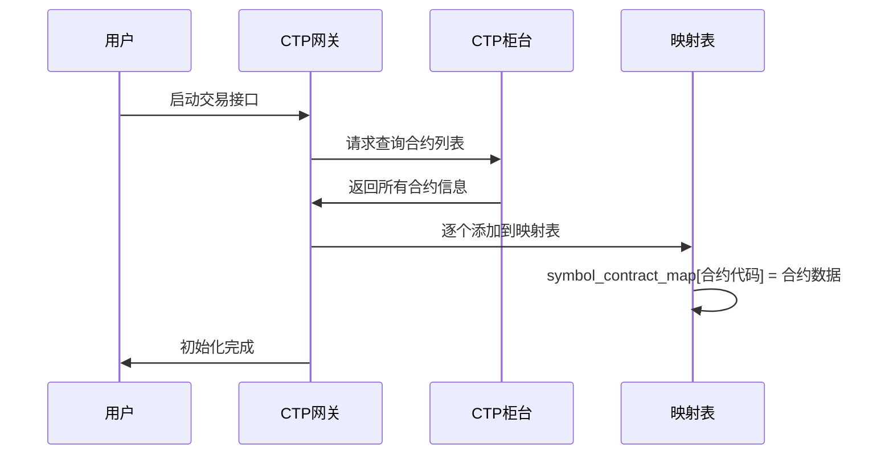
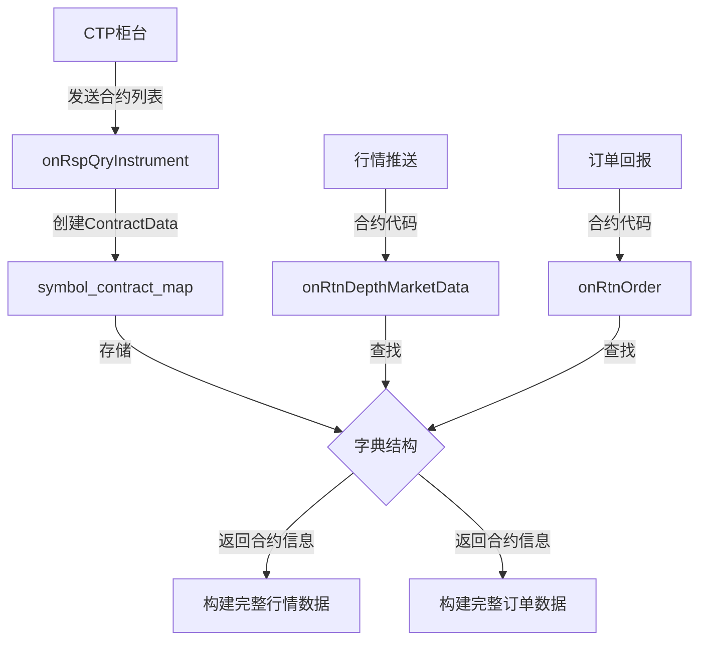

# Chapter 3: 合约数据映射表 (symbol_contract_map)

## 上一章回顾

在上一章[CTP常量定义 (ctp_constant)](02_ctp常量定义__ctp_constant__.md)中，我们学习了CTP协议中的"词汇表"——各种常量值。比如知道`'0'`代表买入，`'1'`代表卖出，`'0'`代表全部成交等。

但光知道这些常量值还不够，当我们实际进行交易时，还需要知道每个合约的**详细信息**，比如：
- 橡胶期货每手多少吨？
- 螺纹钢的最小波动价位是多少？
- 这个合约在上海交易所还是大连交易所交易？

**合约数据映射表**就是来解决这个问题的！它像一本"合约百科全书"，记录了所有期货合约的详细信息。

## 什么是合约数据映射表？

想象一下，你要去图书馆找一本书。你有两种方式：

**方式一：逐本查找**
- 走进图书馆，一本一本地找
- 效率极低，可能要找几个小时

**方式二：查目录**
- 找到图书馆的目录卡片
- 根据书名直接定位书架位置
- 几秒钟就能找到

**合约数据映射表就像是这本"目录卡片"**！

当系统收到行情数据时，它只知道合约代码（如`"RU2405"`），但不知道这个合约的详细信息。通过查询映射表，系统可以立即知道：
- `RU2405`是天然橡胶期货
- 在上海期货交易所（SHFE）交易
- 合约乘数是10吨
- 最小波动价位是5元/吨
- 合约名称是"天然橡胶"

## 合约数据包含哪些信息？

让我们看看一个完整的合约数据包含哪些内容：

```python
# 合约数据结构
contract = {
    "symbol": "RU2405",           # 合约代码（唯一标识）
    "exchange": "SHFE",           # 交易所
    "name": "天然橡胶",            # 合约名称
    "product": "期货",            # 产品类型
    "size": 10,                   # 合约乘数（每手数量）
    "pricetick": 5.0,            # 最小波动价位
    "min_volume": 1,              # 最小下单量
    "max_volume": 100,           # 最大下单量
}
```

### 关键字段解释

| 字段名 | 含义 | 示例 |
|-------|------|------|
| `symbol` | 合约代码 | `RU2405`、`IF2406` |
| `exchange` | 交易所 | `SHFE`、`DCE`、`CFFEX` |
| `name` | 合约名称 | `天然橡胶`、`沪深300指数` |
| `size` | 合约乘数 | 10（表示每手10吨） |
| `pricetick` | 最小波动价位 | 5.0（表示最小波动5元） |

### 为什么要知道这些信息？

**举例1：计算实际成交金额**

假设你买入1手橡胶期货，价格是15000元/吨：

```
实际成交金额 = 价格 × 合约乘数 × 手数
             = 15000 × 10 × 1
             = 150000元
```

如果没有`size`（合约乘数），你就无法计算实际需要多少资金！

**举例2：设置价格条件**

橡胶的最小波动价位是5元，如果你想设置止损：
- 买入价：15000
- 止损价：14995（可以）
- 止损价：14997（不行，因为不是5的倍数）

## 映射表的工作原理

### 初始化过程

系统启动时，会自动查询所有合约信息并填充到映射表中：



### 使用过程

当收到行情数据时，通过映射表快速查找合约信息：

```python
# 伪代码：处理行情数据
def on_market_data(data):
    # 1. 获取行情中的合约代码
    symbol = data["InstrumentID"]  # 例如："RU2405"
    
    # 2. 从映射表查找合约信息
    contract = symbol_contract_map.get(symbol)
    
    # 3. 使用合约信息构建完整行情
    tick = TickData(
        symbol=symbol,
        exchange=contract.exchange,  # 交易所：SHFE
        name=contract.name,          # 名称：天然橡胶
        size=contract.size,          # 乘数：10
        pricetick=contract.pricetick  # 最小波动：5
    )
```

## 实际代码示例

### 1. 定义全局映射表

在`vnpy_ctp/gateway/ctp_gateway.py`中，定义了全局映射表：

```python
# 合约数据全局缓存字典
symbol_contract_map: dict[str, ContractData] = {}
```

这是一个空的字典，在系统初始化时会填充内容。

### 2. 添加合约到映射表

当查询到合约信息时，会添加到映射表中：

```python
# 收到合约查询响应时
def onRspQryInstrument(self, data, error, reqid, last):
    # 创建合约数据对象
    contract = ContractData(
        symbol=data["InstrumentID"],
        exchange=EXCHANGE_CTP2VT[data["ExchangeID"]],
        name=data["InstrumentName"],
        size=data["VolumeMultiple"],
        pricetick=data["PriceTick"]
    )
    
    # 添加到映射表
    symbol_contract_map[contract.symbol] = contract
```

**运行结果**：映射表从空`{}`变成`{'RU2405': ContractData(...), 'IF2406': ContractData(...), ...}`

### 3. 从映射表查找合约

处理行情数据时，从映射表查找合约信息：

```python
# 处理行情推送
def onRtnDepthMarketData(self, data):
    symbol = data["InstrumentID"]
    
    # 查找合约（如果不存在则返回None）
    contract = symbol_contract_map.get(symbol, None)
    if not contract:
        return  # 还没收到合约信息，跳过
    
    # 使用合约信息创建行情对象
    tick = TickData(
        symbol=symbol,
        exchange=contract.exchange,
        name=contract.name
    )
```

### 4. 使用映射表计算实际资金

下单时需要根据合约乘数计算保证金：

```python
# 计算开仓保证金
def calculate_margin(contract, price, volume):
    # 保证金 = 价格 × 合约乘数 × 手数 × 保证金比例
    margin = price * contract.size * volume * 0.10
    return margin
```

## 内部实现原理

### 数据流向



### 为什么使用字典？

映射表使用**字典**（HashMap）存储，这种数据结构有以下优点：

| 特点 | 解释 |
|------|------|
| **查找速度快** | 无论有多少合约，查找时间都差不多（O(1)） |
| **键值对应** | 用合约代码作为"钥匙"，直接打开对应的"盒子" |
| **使用简单** | 代码简洁：`map["RU2405"]` 就能获取信息 |

### 延迟加载机制

系统有一个`contract_inited`标志，确保在合约信息加载完成后再处理订单和成交数据：

```python
# 订单推送处理
def onRtnOrder(self, data):
    # 如果还没初始化完成，先缓存起来
    if not self.contract_inited:
        self.order_data.append(data)
        return
    
    # 初始化完成后处理
    symbol = data["InstrumentID"]
    contract = symbol_contract_map[symbol]
    # ... 继续处理
```

这样可以避免因数据顺序问题导致的错误。

## 常见问题

### Q1: 映射表是空的时候会发生什么？

如果收到行情数据时映射表还是空的，系统会直接跳过这条数据：

```python
contract = symbol_contract_map.get(symbol, None)
if not contract:
    return  # 映射表为空，跳过
```

### Q2: 如何查看当前映射表内容？

可以在调试时查看：

```python
# 查看所有合约代码
print(symbol_contract_map.keys())

# 查看某个合约的详细信息
print(symbol_contract_map["RU2405"])
```

### Q3: 映射表会更新吗？

一般来说，合约信息在交易时段内不会变化。但如果是新上市的合约，需要重新登录才能获取到。

## 总结

本章我们学习了：

- **合约数据映射表**是一个全局字典，存储所有合约的详细信息
- 它像"合约百科全书"，通过合约代码快速查找对应信息
- 主要信息包括：合约代码、交易所、名称、合约乘数、最小波动价位等
- 系统启动时自动查询并填充映射表
- 后续处理行情、订单等数据时，都需要从映射表获取合约信息

### 下一步学习

现在我们了解了数据类型、常量定义、合约数据映射表。这些都是基础数据"原材料"。

接下来，让我们学习[订单状态映射 (STATUS_CTP2VT)](04_订单状态映射__status_ctp2vt__.md)，看看如何将CTP的订单状态转换为VeighNa内部的标准状态，这样我们就能正确显示订单是"成交"、"已撤"还是"拒单"了。

---

Generated by [AI Codebase Knowledge Builder](https://github.com/The-Pocket/Tutorial-Codebase-Knowledge)