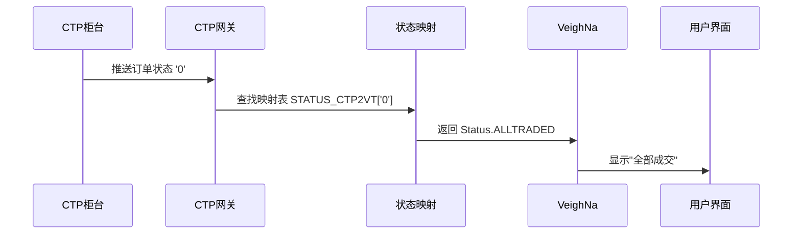
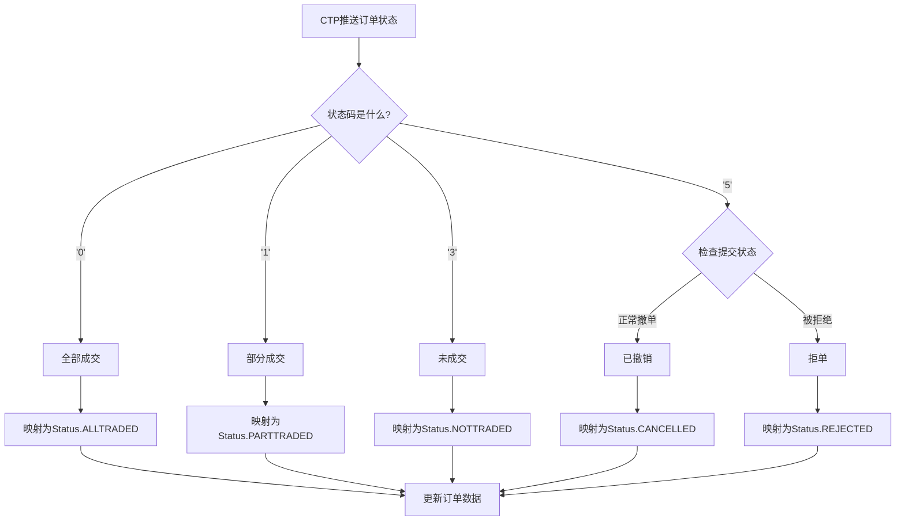

# Chapter 4: 订单状态映射 (STATUS_CTP2VT)

## 上一章回顾

在上一章[合约数据映射表 (symbol_contract_map)](03_合约数据映射表__symbol_contract_map__.md)中，我们学习了如何通过合约代码查找合约的详细信息，比如合约乘数、最小波动价位等。这就像是一本"合约百科全书"，让我们能快速获取每个期货品种的具体参数。

但是还有一个重要的问题没有解决：**当我们下一笔订单后，如何知道订单的当前状态呢？** 比如订单是否成交了？是否被撤单了？是否被拒单了？

这就是我们本章要学习的内容——**订单状态映射 (STATUS_CTP2VT)**。

## 为什么要做状态映射？

想象一下这样的场景：

你给朋友发了一条微信消息，你需要知道这条消息的**状态**：
- 是否发送成功？
- 朋友是否已读？
- 是否发送失败？

在交易系统中同样如此。当你下一笔订单后，你需要知道订单的**实时状态**：

```
订单状态：已提交 → 部分成交 → 全部成交
         或
订单状态：已提交 → 已撤销
         或
订单状态：已提交 → 拒单（被期货公司拒绝）
```

### CTP的状态编码 vs VeighNa的状态枚举

问题来了：**CTP和VeighNa使用不同的"语言"来描述订单状态！**

**CTP使用字符编码**（像密码一样）：
- `'0'` = 全部成交
- `'1'` = 部分成交
- `'3'` = 未成交（排队中）
- `'5'` = 已撤销

**VeighNa使用易读的枚举**（像人类语言）：
- `Status.ALLTRADED` = 全部成交
- `Status.PARTTRADED` = 部分成交
- `Status.NOTTRADED` = 未成交
- `Status.CANCELLED` = 已撤销
- `Status.REJECTED` = 拒单

这就好像两个朋友一个说中文、一个说英文，需要翻译一样。**STATUS_CTP2VT就是这个"翻译器"**！

## 订单状态映射表

让我们看看具体的映射表代码：

```python
# 委托状态映射：从CTP字符到VeighNa状态枚举
STATUS_CTP2VT: dict[str, Status] = {
    THOST_FTDC_OST_NoTradeQueueing: Status.NOTTRADED,      # '3' → 未成交
    THOST_FTDC_OST_PartTradedQueueing: Status.PARTTRADED,  # '1' → 部分成交
    THOST_FTDC_OST_AllTraded: Status.ALLTRADED,            # '0' → 全部成交
    THOST_FTDC_OST_Canceled: Status.CANCELLED,             # '5' → 已撤销
    THOST_FTDC_OST_Unknown: Status.SUBMITTING              # 未知 → 提交中
}
```

这段代码做了什么？
- 创建了一个**字典**（映射表）
- **键(Key)**：CTP的字符状态（如`'0'`、``'5'`）
- **值(Value)**：VeighNa的状态枚举（如`Status.ALLTRADED`）

### 完整的CTP状态常量

为了更好地理解，我们看看CTP协议中所有的订单状态常量：

```python
# CTP订单状态常量定义
THOST_FTDC_OST_AllTraded = '0'              # 全部成交
THOST_FTDC_OST_PartTradedQueueing = '1'     # 部分成交（排队中）
THOST_FTDC_OST_PartTradedNotQueueing = '2' # 部分成交（未排队）
THOST_FTDC_OST_NoTradeQueueing = '3'        # 未成交（排队中）
THOST_FTDC_OST_NoTradeNotQueueing = '4'     # 未成交（未排队）
THOST_FTDC_OST_Canceled = '5'               # 已撤销
THOST_FTDC_OST_Unknown = 'a'               # 未知（初始状态）
```

VeighNa的状态枚举定义在`vnpy.trader.constant`模块中：

```python
# VeighNa订单状态枚举
Status.NOTTRADED      # 未成交
Status.PARTTRADED     # 部分成交
Status.ALLTRADED      # 全部成交
Status.CANCELLED      # 已撤销
Status.REJECTED       # 拒单
Status.SUBMITTING     # 提交中
```

## 状态映射的使用场景

### 场景1：接收订单状态推送

当CTP推送订单状态变化时，需要用映射表转换：

```python
# 模拟从CTP收到的订单状态
ctp_status = '0'  # CTP返回：全部成交

# 使用映射表转换为VeighNa状态
vt_status = STATUS_CTP2VT.get(ctp_status)

# 结果：Status.ALLTRADED
print(vt_status)  # 输出: Status.ALLTRADED
```

### 场景2：处理部分成交

```python
# 模拟部分成交状态
ctp_status = '1'  # 部分成交

# 映射转换
vt_status = STATUS_CTP2VT.get(ctp_status)

print(vt_status)  # 输出: Status.PARTTRADED
```

### 场景3：处理撤单

```python
# 模拟撤单状态
ctp_status = '5'  # 已撤销

vt_status = STATUS_CTP2VT.get(ctp_status)
print(vt_status)  # 输出: Status.CANCELLED
```

### 场景4：处理未知状态

如果收到一个CTP不支持的状态码，会发生什么？

```python
# 模拟未知状态
ctp_status = '9'  # 这不是一个有效的CTP状态码

vt_status = STATUS_CTP2VT.get(ctp_status)

print(vt_status)  # 输出: None（字典的get方法找不到时返回None）
```

在实际代码中，如果状态为`None`，系统会记录一条警告日志：

```python
if not status:
    self.gateway.write_log(f"收到不支持的委托状态，委托号：{orderid}")
    return
```

## 特殊情况的处理

除了基本的映射，还有一些**特殊情况**需要处理：

### 特殊情况：拒单状态

当订单被期货公司拒绝时，CTP返回的状态是`'5'`（已撤销），但实际上这是因为**提交时就被拒绝了**，所以应该映射为`Status.REJECTED`（拒单）而不是`Status.CANCELLED`（已撤销）。

```python
# 检查是否是提交被拒绝导致的"撤单"
if (
    data["OrderStatus"] == THOST_FTDC_OST_Canceled
    and data["OrderSubmitStatus"] == THOST_FTDC_OSS_InsertRejected
):
    status = Status.REJECTED  # 调整为拒单状态
```

这段代码做了什么？
- 如果订单状态是`'5'`（已撤销）
- **并且**提交状态是`InsertRejected`（提交被拒绝）
- 那么将状态改为`Status.REJECTED`（拒单）

### 特殊情况：初始状态

订单刚提交时，CTP可能返回未知状态`'a'`：

```python
THOST_FTDC_OST_Unknown: Status.SUBMITTING  # 未知 → 提交中
```

这表示订单正在提交过程中，尚未被CTP确认接收。

## 内部实现原理

### 数据流转过程

让我们用流程图来看订单状态是如何从CTP传递到VeighNa的：



### 完整的状态处理流程



### 代码实现位置

订单状态映射的使用主要在`ctp_gateway.py`的`onRtnOrder`方法中：

```python
# onRtnOrder 方法中处理订单状态
def onRtnOrder(self, data: dict) -> None:
    # 从CTP数据中获取订单状态字符
    ctp_status = data["OrderStatus"]
    
    # 通过映射表转换为VeighNa状态
    status = STATUS_CTP2VT.get(ctp_status)
    
    # 如果状态无效，记录日志并返回
    if not status:
        self.gateway.write_log(f"收到不支持的委托状态")
        return
    
    # 特殊情况：检查是否是拒单
    if (ctp_status == THOST_FTDC_OST_Canceled 
        and data["OrderSubmitStatus"] == THOST_FTDC_OSS_InsertRejected):
        status = Status.REJECTED
    
    # 创建订单数据对象
    order = OrderData(
        # ... 其他字段 ...
        status=status  # 使用转换后的状态
    )
    
    # 推送订单更新
    self.gateway.on_order(order)
```

## 实际案例：完整的状态变化过程

让我们通过一个完整的例子，看看订单状态如何变化：

```python
# 模拟订单的完整生命周期
order_status_history = ['a', '3', '1', '0']

# 逐个转换状态
for ctp_status in order_status_history:
    vt_status = STATUS_CTP2VT.get(ctp_status, Status.SUBMITTING)
    print(f"CTP状态: {ctp_status} → VeighNa状态: {vt_status}")
```

输出结果：
```
CTP状态: a → VeighNa状态: Status.SUBMITTING
CTP状态: 3 → VeighNa状态: Status.NOTTRADED
CTP状态: 1 → VeighNa状态: Status.PARTTRADED
CTP状态: 0 → VeighNa状态: Status.ALLTRADED
```

这就是一笔订单从提交到成交的完整状态变化过程！

### 另一个例子：撤单过程

```python
# 模拟订单被撤销的过程
order_status_history = ['a', '3', '5']

for ctp_status in order_status_history:
    vt_status = STATUS_CTP2VT.get(ctp_status, Status.SUBMITTING)
    print(f"CTP状态: {ctp_status} → VeighNa状态: {vt_status}")
```

输出结果：
```
CTP状态: a → VeighNa状态: Status.SUBMITTING
CTP状态: 3 → VeighNa状态: Status.NOTTRADED
CTP状态: 5 → VeighNa状态: Status.CANCELLED
```

## 总结

本章我们学习了：

- **订单状态映射**是将CTP的字符状态码转换为VeighNa标准状态枚举的"翻译器"
- CTP使用字符`'0'`、`'1'`、`'3'`、`'5'`等表示订单状态
- VeighNa使用`Status.ALLTRADED`、`Status.PARTTRADED`等易读的状态枚举
- 映射表`STATUS_CTP2VT`建立了两种状态表示之间的对应关系
- 需要处理特殊情况：被拒绝的订单要映射为`Status.REJECTED`而不是`Status.CANCELLED`
- 这样用户就能在界面上看到清晰的订单状态，而不是晦涩的字符编码

### 下一步学习

现在我们已经学习了数据类型定义、CTP常量、合约数据映射表和订单状态映射。这些都是**数据转换**的基础知识，帮助我们在CTP和VeighNa之间建立"翻译"桥梁。

接下来，让我们学习[行情数据接口 (MdApi)](05_行情数据接口__mdapi__.md)，看看如何接收市场行情数据。这是交易系统中非常重要的部分，让我们能够实时了解期货价格的变化！

---

Generated by [AI Codebase Knowledge Builder](https://github.com/The-Pocket/Tutorial-Codebase-Knowledge)