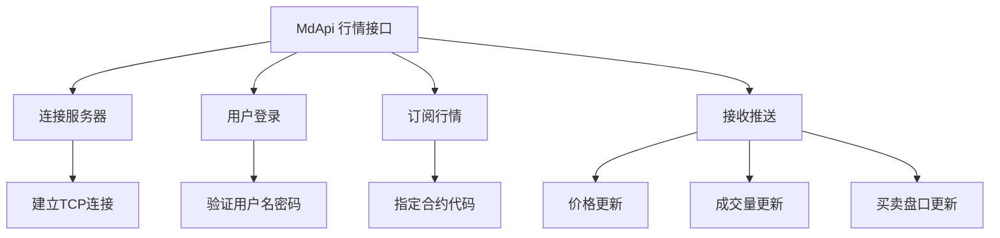
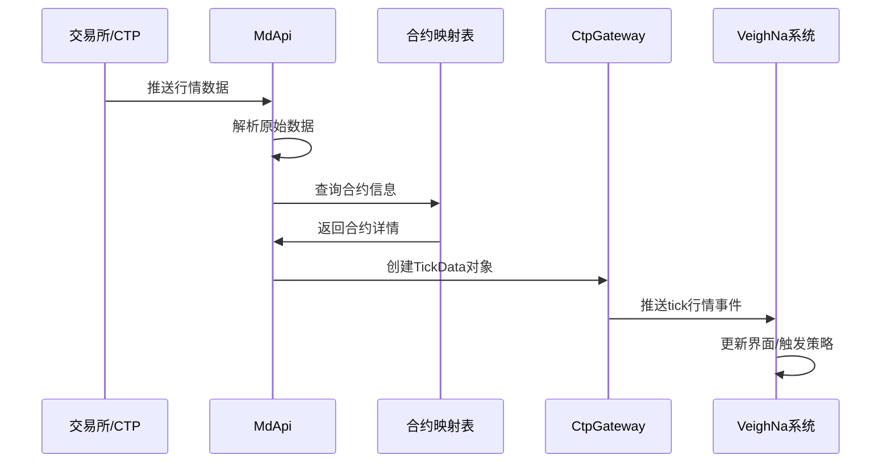
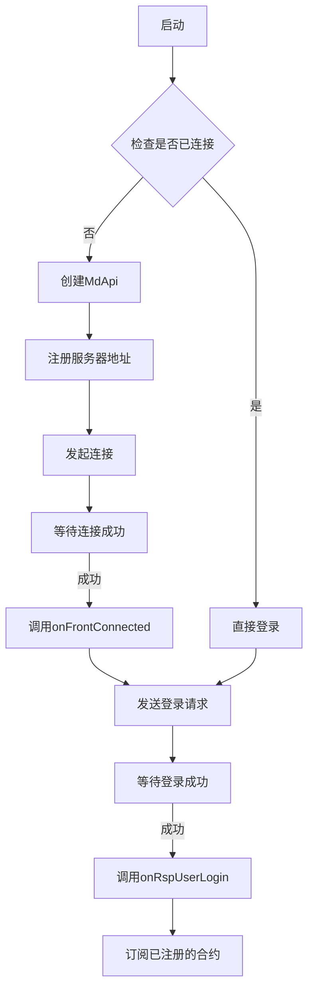

# Chapter 5: 行情数据接口 (MdApi)

## 上一章回顾

在上一章[订单状态映射 (STATUS_CTP2VT)](04_订单状态映射__status_ctp2vt__.md)中，我们学习了如何将CTP的订单状态字符转换为VeighNa的标准状态枚举。这就像给交易系统装上了"状态翻译器"，让我们能够清楚地看到订单是成交、撤单还是被拒绝。

现在，让我们学习另一个非常重要的部分——**行情数据接口 (MdApi)**。如果说交易接口是系统的"手"（执行交易操作），那么行情接口就是系统的"眼睛"——没有它，我们就无法看到市场的实时价格变化！

## 什么是行情数据接口？

想象一下，你正在观看一场足球比赛。如果你只能看到比赛的结果（进球了or没进），而看不到比赛的过程（球员的跑动、传切配合等），你就很难做出正确的判断和决策。

**行情数据接口就像是这场比赛的"现场直播"**！它负责：

1. **连接交易所** - 与CTP柜台建立通信连接
2. **接收实时数据** - 不断接收交易所推送的最新价格、成交量等信息
3. **转换数据格式** - 将CTP的原始数据转换为VeighNa能理解的标准格式

## MdApi的核心功能

MdApi主要有以下几个功能：



### 1. 连接服务器

首先，MdApi需要与CTP行情服务器建立连接：

```python
# 连接行情服务器
def connect(self, address, userid, password, brokerid, production_mode):
    # 创建API对象
    self.createFtdcMdApi(...)
    # 注册服务器地址
    self.registerFront(address)
    # 启动连接
    self.init()
```

### 2. 用户登录

连接建立后，需要登录才能获取数据：

```python
# 登录请求
def login(self):
    req = {
        "UserID": self.userid,
        "Password": self.password,
        "BrokerID": self.brokerid
    }
    self.reqUserLogin(req, self.reqid)
```

### 3. 订阅行情

登录成功后，就可以订阅感兴趣的合约行情：

```python
# 订阅行情
def subscribe(self, req):
    # 订阅指定合约的市场数据
    self.subscribeMarketData(req.symbol)
    # 记录已订阅的合约
    self.subscribed.add(req.symbol)
```

### 4. 接收行情推送

这是最重要的部分！当有行情变化时，CTP会主动推送数据：

```python
# 行情数据推送回调
def onRtnDepthMarketData(self, data):
    # 解析数据
    tick = TickData(
        symbol=data["InstrumentID"],      # 合约代码
        last_price=data["LastPrice"],     # 最新价
        volume=data["Volume"],            # 成交量
        bid_price=data["BidPrice1"],     # 买一价
        ask_price=data["AskPrice1"],     # 卖一价
        # ... 其他字段
    )
    # 推送给网关
    self.gateway.on_tick(tick)
```

## 行情数据包含哪些信息？

当我们接收行情数据时，会获得一个完整的"快照"，包含以下信息：

```python
# 完整的行情数据示例
tick = {
    "symbol": "RU2405",           # 合约代码
    "last_price": 15000,          # 最新价
    "volume": 500,                # 成交量
    "turnover": 7500000,          # 成交额
    "open_interest": 1000,        # 持仓量
    
    "open_price": 14900,         # 开盘价
    "high_price": 15100,          # 最高价
    "low_price": 14850,           # 最低价
    "pre_close": 14950,           # 昨收价
    
    "limit_up": 16445,            # 涨停价
    "limit_down": 13455,          # 跌停价
    
    "bid_price_1": 14995,         # 买一价
    "ask_price_1": 15000,        # 卖一价
    "bid_volume_1": 10,          # 买一量
    "ask_volume_1": 5,           # 卖一量
    
    # ... 还有买卖二到五档数据
}
```

### 字段解释

| 字段名 | 含义 | 例子 |
|--------|------|------|
| `symbol` | 合约代码 | `RU2405` |
| `last_price` | 最新价 | `15000` |
| `volume` | 成交量 | `500` |
| `bid_price_1` | 买一价（最高买入价） | `14995` |
| `ask_price_1` | 卖一价（最低卖出价） | `15000` |
| `limit_up` | 涨停价 | `16445` |
| `limit_down` | 跌停价 | `13455` |

## 实际使用案例

让我们看看MdApi在实际项目中是如何使用的。

### 案例：订阅橡胶期货行情

```python
# 创建一个订阅请求
req = SubscribeRequest()
req.symbol = "RU2405"  # 橡胶2405合约

# 通过网关订阅
gateway.subscribe(req)
```

执行后，系统会：
1. 向CTP发送订阅请求
2. CTP开始推送该合约的行情数据
3. 每当价格变化时，`onRtnDepthMarketData`会被调用

### 案例：处理收到的行情数据

```python
# MdApi收到行情后的处理流程
def onRtnDepthMarketData(self, data):
    # 1. 获取合约代码
    symbol = data["InstrumentID"]
    
    # 2. 从映射表查找合约信息
    contract = symbol_contract_map.get(symbol)
    if not contract:
        return  # 还没有合约信息，跳过
    
    # 3. 创建行情对象
    tick = TickData(
        symbol=symbol,
        exchange=contract.exchange,
        name=contract.name,
        last_price=data["LastPrice"],
        volume=data["Volume"],
        # ... 其他字段
    )
    
    # 4. 推送给大家使用
    self.gateway.on_tick(tick)
```

## 内部实现原理

### 数据流转过程



### 连接流程详解



### 核心回调方法

MdApi中有几个非常重要的回调方法：

| 方法名 | 作用 | 何时调用 |
|--------|------|----------|
| `onFrontConnected` | 连接成功 | 与服务器建立TCP连接后 |
| `onFrontDisconnected` | 连接断开 | 与服务器断开连接后 |
| `onRspUserLogin` | 登录结果 | 登录请求响应后 |
| `onRspSubMarketData` | 订阅结果 | 订阅行情请求响应后 |
| `onRtnDepthMarketData` | 行情推送 | 收到实时行情数据时 |

### 完整代码示例

下面是`CtpMdApi`类的简化版本，展示了完整的实现：

```python
class CtpMdApi(MdApi):
    def __init__(self, gateway):
        super().__init__()
        self.gateway = gateway
        self.connect_status = False
        self.login_status = False
        
    def onFrontConnected(self):
        """服务器连接成功"""
        self.gateway.write_log("行情服务器连接成功")
        self.login()  # 自动登录
        
    def onRspUserLogin(self, data, error, reqid, last):
        """登录成功"""
        if not error["ErrorID"]:
            self.login_status = True
            self.gateway.write_log("行情服务器登录成功")
            
    def onRtnDepthMarketData(self, data):
        """行情数据推送"""
        # 过滤无效数据
        if not data["UpdateTime"]:
            return
            
        symbol = data["InstrumentID"]
        contract = symbol_contract_map.get(symbol)
        if not contract:
            return
            
        # 创建行情对象
        tick = TickData(
            symbol=symbol,
            exchange=contract.exchange,
            last_price=data["LastPrice"],
            volume=data["Volume"]
        )
        
        self.gateway.on_tick(tick)
```

## 常见问题

### Q1: 为什么订阅后收不到行情？

可能的原因：
1. 还没有登录成功（需要等待`onRspUserLogin`回调）
2. 合约代码错误（检查合约代码是否正确）
3. 网络连接断开（检查网络状态）

### Q2: 行情数据是实时还是定时推送？

CTP的行情是**实时推送**的，只要有价格变化就会推送。这种方式也叫"推送模式"（Push Mode），效率很高。

### Q3: 如何订阅多个合约？

```python
# 订阅多个合约
req1 = SubscribeRequest(symbol="RU2405")
req2 = SubscribeRequest(symbol="RU2409")

gateway.subscribe(req1)
gateway.subscribe(req2)
```

## 总结

本章我们学习了：

- **MdApi是行情数据接口**，负责接收市场的实时数据
- 它像"眼睛"一样，让我们能实时看到价格变化
- 主要功能包括：连接服务器、用户登录、订阅行情、接收推送
- 行情数据包含：最新价、成交量、买卖盘口等信息
- 收到数据后，会通过`onRtnDepthMarketData`回调处理
- 最后会将数据转换为VeighNa标准的`TickData`对象推送出去

### 下一步学习

现在我们已经学会了如何获取行情数据。但是光有行情数据还不够，我们还需要知道如何**下单买卖**！

下一章，让我们学习[交易数据接口 (TdApi)](06_交易数据接口__tdapi__.md)，看看如何通过接口进行开仓、平仓等操作。这样我们就有了"眼睛"（MdApi）和"手"（TdApi），可以完整地进行交易了！

---

Generated by [AI Codebase Knowledge Builder](https://github.com/The-Pocket/Tutorial-Codebase-Knowledge)