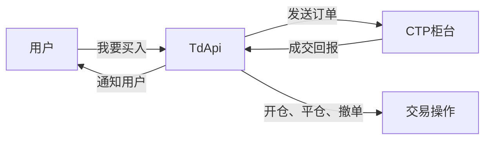
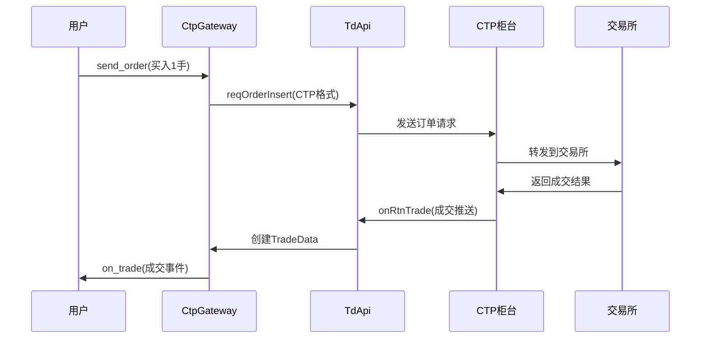
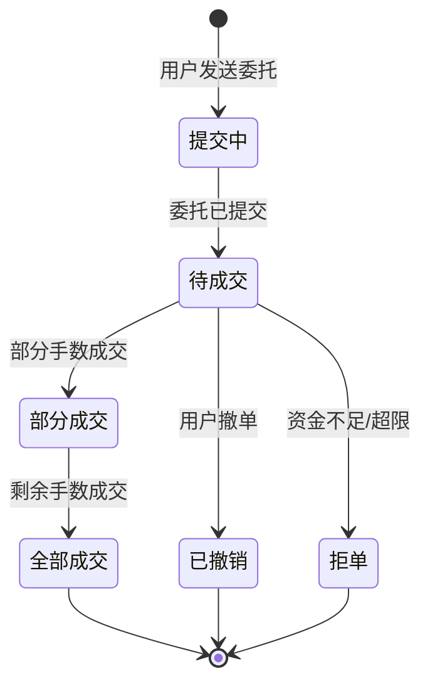

# Chapter 6: 交易数据接口 (TdApi)


## 上一章回顾

在上一章[行情数据接口 (MdApi)](05_行情数据接口__mdapi__.md)中，我们学习了如何通过行情接口获取市场的实时数据。这就像是给系统装上了"眼睛"，让我们能够看到期货价格的实时变化。

但是光有行情数据还不够，我们还需要能够**下单买卖**！这就像有了"眼睛"之后，我们还需要有一双"手"来执行交易操作。

本章我们要学习的**交易数据接口 (TdApi)**，就是这双执行交易的"手"！

## 什么是交易数据接口？

想象一下这样的场景：

你正在观看股票行情，发现某只股票的价格下跌到了一个很好的买入点。你想要买入100股。

这时候你需要：
1. **发出买入指令** - 告诉系统你要买入
2. **系统执行指令** - 把指令发送到交易所
3. **获取成交回报** - 告诉你是否成功买入

**TdApi就是负责完成这些工作的接口！** 它就像一个"交易执行器"，专门处理买卖操作。



## TdApi的核心功能

TdApi主要负责以下几个功能：

| 功能 | 说明 | 例子 |
|------|------|------|
| **连接服务器** | 与CTP交易服务器建立通信 | 连接到期货公司服务器 |
| **用户登录** | 验证身份获取交易权限 | 输入用户名密码登录 |
| **委托下单** | 发送买入或卖出指令 | 买入1手螺纹钢 |
| **委托撤单** | 撤销尚未成交的订单 | 撤销未成交的买单 |
| **查询持仓** | 查看当前持有的仓位 | 查看有多少手多单 |
| **查询资金** | 查看账户可用资金 | 查看还有多少钱 |

## 交易流程详解

让我们通过一个完整的例子，看看交易是如何进行的：

### 第一步：连接和登录

在使用交易功能之前，首先需要连接服务器并登录：

```python
# 连接交易服务器
td_api.connect(
    address="tcp://120.120.120.120:51205",  # 交易服务器地址
    userid="123456",                          # 用户名
    password="abcdef",                        # 密码
    brokerid="9999",                          # 经纪商代码
    auth_code="xxxxx",                        # 授权码
    appid="xxx",                              # 产品名称
    production_mode=True                      # 是否实盘
)
```

登录成功后，系统会显示："交易服务器登录成功"

### 第二步：订阅行情（前置条件）

在进行交易之前，**必须先订阅行情**！这是CTP的规定，就像你要看电视节目，必须先打开电视一样。

```python
# 订阅行情（通过MdApi）
req = SubscribeRequest()
req.symbol = "RU2405"  # 橡胶2405合约
gateway.subscribe(req)
```

### 第三步：委托下单

现在可以下单了！假设我们要买入1手橡胶期货：

```python
# 创建买入委托请求
req = OrderRequest()
req.symbol = "RU2405"       # 合约代码
req.exchange = Exchange.SHFE  # 交易所
req.direction = Direction.LONG  # 买入（做多）
req.offset = Offset.OPEN     # 开仓
req.price = 15000            # 价格
req.volume = 1               # 数量

# 发送委托
orderid = gateway.send_order(req)
print(f"委托已发送，委托号：{orderid}")
```

这段代码做了什么？
- 创建了一个**买入开仓**的委托请求
- 委托买入1手RU2405，价格15000元
- 发送到CTP执行
- 返回一个委托编号（orderid）

### 第四步：接收成交回报

当订单成交后，CTP会推送成交数据：

```python
# 成交数据推送回调
def onRtnTrade(self, data):
    # 创建成交数据对象
    trade = TradeData(
        symbol=data["InstrumentID"],
        tradeid=data["TradeID"],       # 成交编号
        orderid=orderid,               # 委托编号
        direction=Direction.LONG,     # 买入
        offset=Offset.OPEN,           # 开仓
        price=data["Price"],           # 成交价
        volume=data["Volume"]          # 成交量
    )
    
    # 通知系统
    self.gateway.on_trade(trade)
    print(f"成交了！买入1手，价格{trade.price}")
```

## 交易操作的类型

在期货市场中，常见的交易操作有以下几种：

### 1. 开仓 (Open)

**定义**：买入或卖出期货合约，建立新的仓位

```python
# 买入开仓（做多）
req = OrderRequest(
    symbol="RU2405",
    direction=Direction.LONG,
    offset=Offset.OPEN
)

# 卖出开仓（做空）
req = OrderRequest(
    symbol="RU2405",
    direction=Direction.SHORT,
    offset=Offset.OPEN
)
```

### 2. 平仓 (Close)

**定义**：对冲已有的仓位，了结持仓

```python
# 平掉多头仓位（卖出平仓）
req = OrderRequest(
    symbol="RU2405",
    direction=Direction.SHORT,
    offset=Offset.CLOSE  # 平仓
)
```

### 3. 撤单 (Cancel)

**定义**：撤销尚未完全成交的订单

```python
# 撤销之前的委托
req = CancelRequest()
req.orderid = "1_2_1001"  # 要撤销的委托编号

gateway.cancel_order(req)
```

## 订单类型

除了普通的限价单，CTP还支持多种订单类型：

```python
# 限价单 - 指定价格成交
OrderType.LIMIT

# 市价单 - 以当前最优价格成交
OrderType.MARKET

# FAK单 - 部分成交，剩余撤销
OrderType.FAK

# FOK单 - 全部成交或全部撤销
OrderType.FOK
```

## 实际代码示例

让我们看一个完整的交易流程示例：

```python
# 完整的交易流程
def trade_example():
    # 1. 创建委托请求
    req = OrderRequest()
    req.symbol = "RU2405"
    req.exchange = Exchange.SHFE
    req.direction = Direction.LONG      # 买入
    req.offset = Offset.OPEN            # 开仓
    req.type = OrderType.LIMIT          # 限价单
    req.price = 15000                   # 价格15000
    req.volume = 1                      # 1手
    
    # 2. 发送委托
    orderid = gateway.send_order(req)
    
    # 3. 返回委托编号
    return orderid
```

```python
# 撤销委托
def cancel_example(orderid):
    req = CancelRequest()
    req.orderid = orderid
    
    gateway.cancel_order(req)
```

## 内部实现原理

### 数据流转过程

当用户发送一个买入委托时，数据是如何流动的呢？



### 核心回调方法

TdApi中有几个非常重要的回调方法：

| 方法名 | 作用 | 何时调用 |
|--------|------|----------|
| `onFrontConnected` | 连接成功 | 与服务器建立TCP连接后 |
| `onRspAuthenticate` | 授权验证结果 | 授权验证响应后 |
| `onRspUserLogin` | 登录结果 | 登录请求响应后 |
| `onRspOrderInsert` | 下单失败回报 | 下单请求被拒绝时 |
| `onRtnOrder` | 订单状态更新 | 订单状态变化时 |
| `onRtnTrade` | 成交推送 | 订单成交时 |
| `onRspOrderAction` | 撤单失败回报 | 撤单请求被拒绝时 |

### 订单状态变化

一笔订单从提交到成交，状态会经历多次变化：



## 完整代码示例：TdApi类的核心实现

下面是`CtpTdApi`类的简化版本，展示了主要的实现逻辑：

```python
class CtpTdApi(TdApi):
    def __init__(self, gateway):
        super().__init__()
        self.gateway = gateway
        self.order_ref = 0  # 委托引用计数器
        
    def onFrontConnected(self):
        """连接成功后，自动登录"""
        self.gateway.write_log("交易服务器连接成功")
        self.login()
        
    def send_order(self, req):
        """发送委托"""
        # 增加委托引用编号
        self.order_ref += 1
        
        # 构建CTP格式的请求
        ctp_req = {
            "InstrumentID": req.symbol,
            "LimitPrice": req.price,
            "VolumeTotalOriginal": req.volume,
            "Direction": DIRECTION_VT2CTP[req.direction],
            "OrderRef": str(self.order_ref)
        }
        
        # 发送到CTP
        self.reqid += 1
        self.reqOrderInsert(ctp_req, self.reqid)
        
        # 返回本地委托编号
        return f"{self.frontid}_{self.sessionid}_{self.order_ref}"
```

```python
    def onRtnOrder(self, data):
        """订单状态更新推送"""
        # 创建订单对象
        order = OrderData(
            symbol=data["InstrumentID"],
            orderid=orderid,
            status=STATUS_CTP2VT[data["OrderStatus"]],
            traded=data["VolumeTraded"]
        )
        
        # 推送订单更新
        self.gateway.on_order(order)
```

```python
    def onRtnTrade(self, data):
        """成交数据推送"""
        # 创建成交对象
        trade = TradeData(
            symbol=data["InstrumentID"],
            tradeid=data["TradeID"],
            price=data["Price"],
            volume=data["Volume"]
        )
        
        # 推送成交事件
        self.gateway.on_trade(trade)
```

## 常见问题

### Q1: 为什么无法下单？

可能的原因：
1. 还没有登录成功
2. 资金不足
3. 合约不在交易时间内
4. 价格超出涨跌停范围

### Q2: 委托号和成交号有什么区别？

- **委托号 (orderid)**：是你这笔订单的"身份证"，用于追踪订单状态
- **成交号 (tradeid)**：是每一笔成交的"身份证"，一笔委托可能分多次成交

### Q3: 撤单一定能成功吗？

不一定！如果订单已经全部成交，就无法撤单了。撤单只能撤销尚未成交的部分。

## 总结

本章我们学习了：

- **TdApi是交易数据接口**，负责执行所有的交易操作
- 它就像系统的"手"，负责开仓、平仓、撤单等操作
- 交易前需要先连接服务器、登录、订阅行情
- 主要功能包括：委托下单、委托撤单、持仓查询、资金查询
- 订单状态会经历：提交中 → 待成交 → 成交/撤单/拒单
- 成交后会推送`onRtnTrade`事件，通知用户成交结果

### 下一步学习

现在我们已经有了"眼睛"（MdApi，行情接口）和"手"（TdApi，交易接口），可以完整地进行交易了！

但是这两个接口是如何组合在一起工作的呢？让我们继续学习下一章：[CTP交易网关 (CtpGateway)](07_ctp交易网关__ctpgateway__.md)，看看交易网关是如何协调行情和交易两个接口的！

---

Generated by [AI Codebase Knowledge Builder](https://github.com/The-Pocket/Tutorial-Codebase-Knowledge)