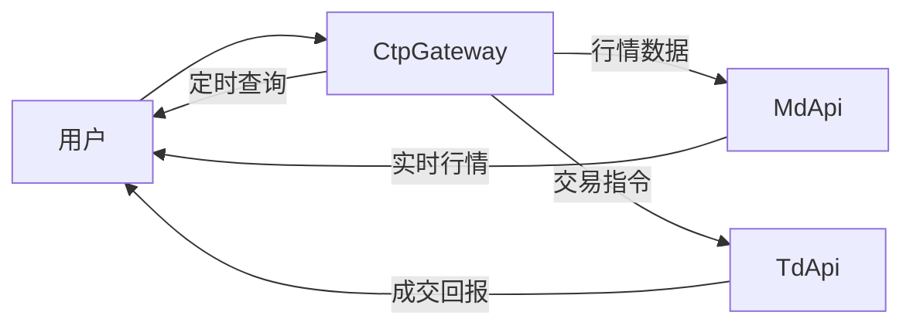
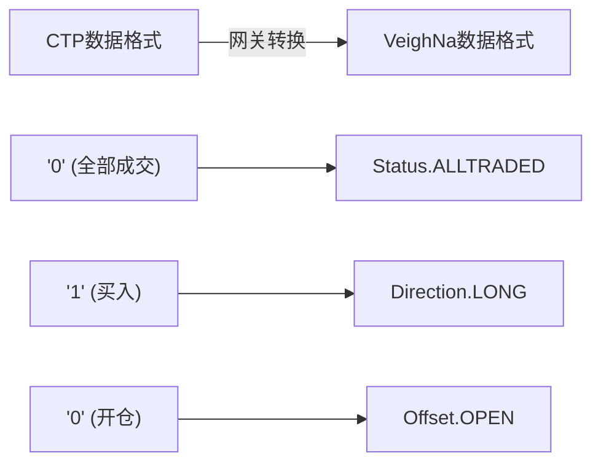
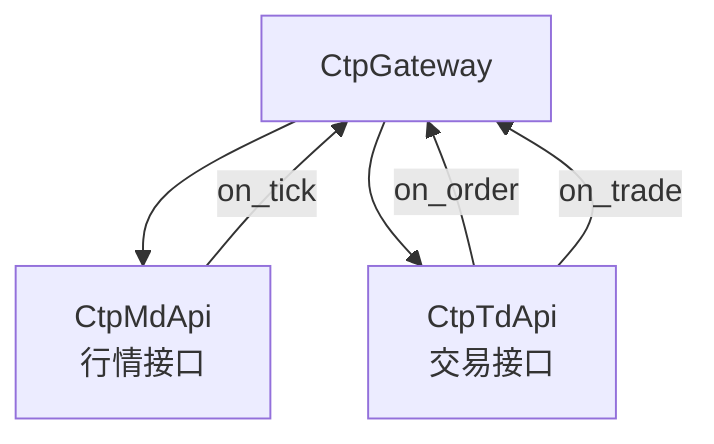
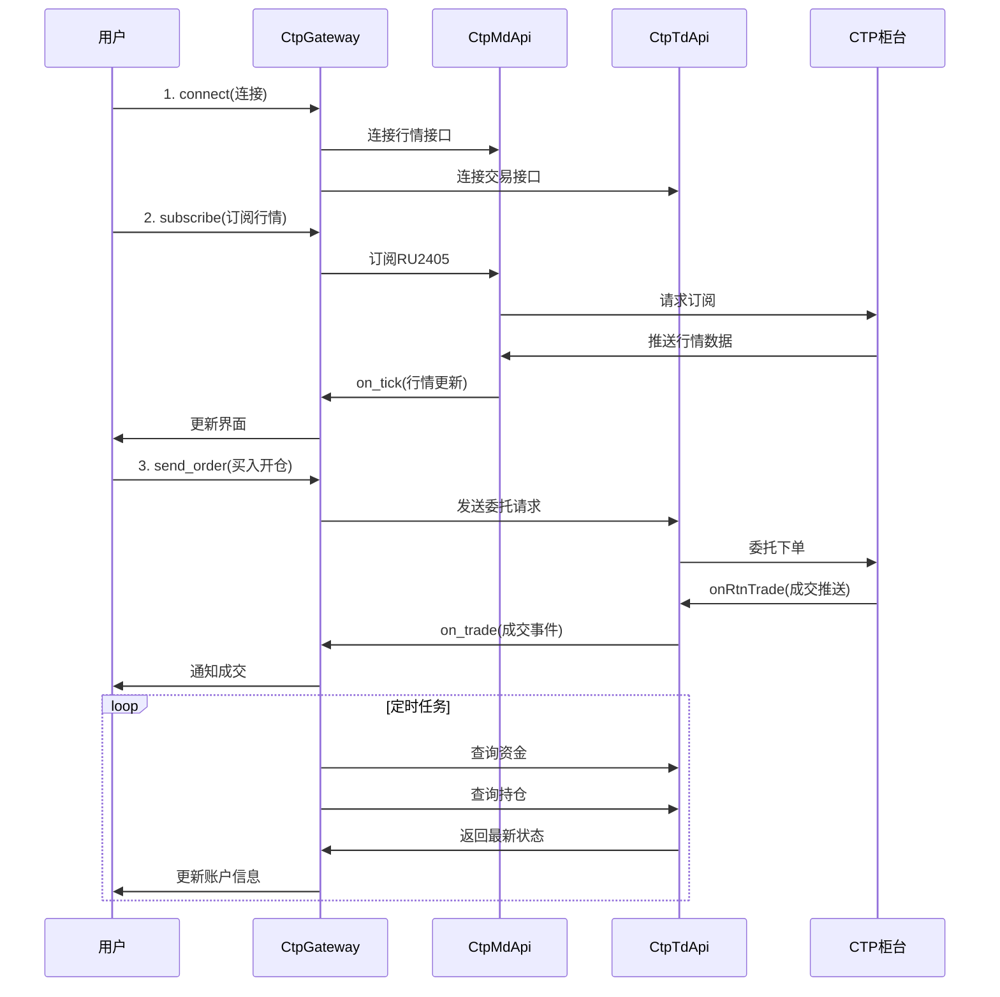

# Chapter 7: CTP交易网关 (CtpGateway)

## 上一章回顾

在上一章[交易数据接口 (TdApi)](06_交易数据接口__tdapi__.md)中，我们学习了如何通过交易接口进行开仓、平仓、撤单等操作。这就像是给系统装上了执行交易的"手"。

但是你有没有想过一个问题：**行情接口（MdApi）和交易接口（TdApi）是如何协同工作的呢？** 谁来协调这两个接口？谁来把复杂的数据转换变简单？

这就是我们本章要学习的内容——**CTP交易网关 (CtpGateway)**！它是整个系统的"大脑"和"枢纽"。

## 什么是CTP交易网关？

想象一下这样的场景：

你是一家跨国公司的 CEO，你的公司有两个部门：
- **市场部**：负责收集市场信息（就像 MdApi 行情接口）
- **销售部**：负责执行交易操作（就像 TdApi 交易接口）

作为 CEO，你需要：
- 协调两个部门的工作
- 把外部信息翻译成公司内部能理解的格式
- 把内部指令转换成外部能执行的形式

**CTP交易网关就像是这家公司的 CEO！** 它负责：
1. **统一管理**行情接口和交易接口
2. **数据转换**——把 CT协议转换为 VeighNa 格式
3. **状态维护**——定时查询账户资金和持仓信息



## CtpGateway的核心功能

CtpGateway 就像一个"翻译官"和"调度中心"，主要负责以下工作：

| 功能 | 说明 | 类比 |
|------|------|------|
| **连接管理** | 同时管理行情和交易两个接口的连接 | 公司的通讯中心 |
| **数据转换** | 把 CTP 格式转换为 VeighNa 格式 | 翻译官 |
| **请求转发** | 把用户的交易指令发送给交易接口 | 调度员 |
| **状态维护** | 定时查询账户资金和持仓信息 | 财务定期汇报 |

## 为什么需要网关？

你可能会问：为什么需要网关？让 MdApi 和 TdApi 直接工作不行吗？

**答案是：不行！** 原因有以下几点：

### 1. 简化使用复杂度

如果没有网关，用户需要分别连接两个接口、分别登录、分别处理两种不同的数据格式。这就像你要同时打两份工，非常辛苦！

```python
# 没有网关的情况（复杂！）
# 需要分别管理两个连接
md_api.connect(...)
td_api.connect(...)
md_api.login(...)
td_api.login(...)
# 处理两套不同的数据格式
md_api.on_tick = handle_tick
td_api.on_trade = handle_trade
```

有了网关之后，一切都变得简单：

```python
# 有网关的情况（简单！）
gateway.connect(setting)
gateway.subscribe(req)  # 自动订阅行情
gateway.send_order(req)  # 自动发送交易
```

### 2. 统一数据格式

CTP 返回的数据格式和 VeighNa 使用的数据格式不同。网关负责"翻译"：



### 3. 维护系统状态

网关会定时查询账户资金和持仓，确保系统始终有最新的状态信息：

```python
# 网关会定时执行这些查询
def process_timer_event(self, event):
    # 每隔几秒查询一次资金和持仓
    self.td_api.query_account()    # 查询资金
    self.td_api.query_position()   # 查询持仓
```

## CtpGateway的使用方法

现在让我们看看如何在实际项目中使用 CtpGateway。

### 1. 创建网关实例

首先，需要创建一个网关实例：

```python
from vnpy.event import EventEngine
from vnpy_ctp import CtpGateway

# 创建事件引擎（负责处理各种事件）
event_engine = EventEngine()

# 创建CTP网关
gateway = CtpGateway(event_engine, "CTP")
```

### 2. 连接接口

使用配置信息连接交易接口：

```python
# 配置连接参数
setting = {
    "用户名": "123456",
    "密码": "abcdef",
    "经纪商代码": "9999",
    "交易服务器": "tcp://120.120.120.120:51205",
    "行情服务器": "tcp://120.120.120.120:51211",
    "产品名称": "simnow",
    "授权编码": "xxxxx",
    "柜台环境": "实盘"
}

# 连接
gateway.connect(setting)
```

执行后，网关会自动：
- 连接行情服务器并登录
- 连接交易服务器并登录
- 查询所有合约信息
- 开始定时查询资金和持仓

### 3. 订阅行情

订阅感兴趣的合约行情：

```python
from vnpy.trader.object import SubscribeRequest

# 创建订阅请求
req = SubscribeRequest()
req.symbol = "RU2405"  # 橡胶2405合约

# 订阅
gateway.subscribe(req)
```

### 4. 发送订单

发送买入或卖出指令：

```python
from vnpy.trader.object import OrderRequest
from vnpy.trader.constant import Direction, Offset, Exchange, OrderType

# 创建买入开仓委托
req = OrderRequest()
req.symbol = "RU2405"
req.exchange = Exchange.SHFE
req.direction = Direction.LONG    # 买入（做多）
req.offset = Offset.OPEN         # 开仓
req.type = OrderType.LIMIT       # 限价单
req.price = 15000               # 价格
req.volume = 1                  # 数量

# 发送委托
orderid = gateway.send_order(req)
print(f"委托已发送，委托号：{orderid}")
```

### 5. 撤销订单

撤销尚未成交的订单：

```python
from vnpy.trader.object import CancelRequest

# 创建撤单请求
req = CancelRequest()
req.orderid = "1_2_1001"  # 要撤销的委托编号
req.symbol = "RU2405"

# 发送撤单
gateway.cancel_order(req)
```

## 网关内部结构

CtpGateway 内部主要包含两个核心组件：



### 1. CtpMdApi（行情接口）

负责接收市场行情数据：

```python
class CtpMdApi(MdApi):
    def __init__(self, gateway):
        self.gateway = gateway
        # ...
        
    def onRtnDepthMarketData(self, data):
        # 收到行情数据后，创建TickData对象
        tick = TickData(
            symbol=data["InstrumentID"],
            last_price=data["LastPrice"],
            # ...
        )
        # 推送给网关
        self.gateway.on_tick(tick)
```

### 2. CtpTdApi（交易接口）

负责执行交易操作和处理订单回报：

```python
class CtpTdApi(TdApi):
    def __init__(self, gateway):
        self.gateway = gateway
        # ...
        
    def send_order(self, req):
        # 构建CTP格式的委托请求
        ctp_req = {
            "InstrumentID": req.symbol,
            "LimitPrice": req.price,
            "Direction": DIRECTION_VT2CTP[req.direction],
            # ...
        }
        # 发送到CTP
        self.reqOrderInsert(ctp_req, self.reqid)
        
    def onRtnTrade(self, data):
        # 创建成交数据对象
        trade = TradeData(...)
        # 推送给网关
        self.gateway.on_trade(trade)
```

## 数据转换过程

网关最重要的功能之一就是**数据转换**。让我们看看具体是如何转换的：

### 1. 方向转换

```python
# 买入/卖出 转换为 CTP 格式
DIRECTION_VT2CTP = {
    Direction.LONG: '0',    # 多头 -> '0'
    Direction.SHORT: '1'    # 空头 -> '1'
}

# CTP 格式转换为 VeighNa 格式
DIRECTION_CTP2VT = {
    '0': Direction.LONG,
    '1': Direction.SHORT
}
```

### 2. 订单状态转换

```python
# CTP 状态码转换为 VeighNa 状态
STATUS_CTP2VT = {
    '0': Status.ALLTRADED,    # 全部成交
    '1': Status.PARTTRADED,   # 部分成交
    '3': Status.NOTTRADED,   # 未成交
    '5': Status.CANCELLED,   # 已撤销
}
```

### 3. 开平转换

```python
# 开平方向转换
OFFSET_VT2CTP = {
    Offset.OPEN: '0',           # 开仓
    Offset.CLOSE: '1',          # 平仓
    Offset.CLOSETODAY: '3',    # 平今
    Offset.CLOSEYESTERDAY: '4' # 平昨
}
```

## 定时查询机制

网关会**定时**查询账户资金和持仓信息，保持系统状态实时更新：

```python
def init_query(self):
    # 初始化查询任务列表
    self.query_functions = [
        self.query_account,    # 查询资金
        self.query_position    # 查询持仓
    ]
    
    # 注册定时器事件
    self.event_engine.register(EVENT_TIMER, self.process_timer_event)

def process_timer_event(self, event):
    # 每隔几秒执行一个查询任务
    self.count += 1
    if self.count < 2:
        return
    self.count = 0
    
    # 取出下一个查询任务
    func = self.query_functions.pop(0)
    func()
    # 把任务放回队尾
    self.query_functions.append(func)
```

这个机制确保了：
- 系统始终知道当前账户有多少资金
- 系统始终知道当前持仓是多少
- 即使有成交变化，也能及时更新

## 完整的工作流程

让我们通过一个完整的例子，看看数据是如何在系统中流动的：



## 实际代码示例

下面是一个简化版的 CtpGateway 初始化过程：

```python
# CtpGateway 初始化流程
def connect(self, setting):
    """连接交易接口"""
    # 1. 获取配置参数
    userid = setting["用户名"]
    password = setting["密码"]
    brokerid = setting["经纪商代码"]
    td_address = setting["交易服务器"]
    md_address = setting["行情服务器"]
    
    # 2. 连接交易接口
    self.td_api.connect(td_address, userid, password, brokerid, ...)
    
    # 3. 连接行情接口
    self.md_api.connect(md_address, userid, password, brokerid, ...)
    
    # 4. 启动定时查询
    self.init_query()
```

## 常见问题

### Q1: 网关和接口有什么区别？

- **接口 (Api)**：负责与 CTP 柜台直接通信
- **网关 (Gateway)**：负责统一管理接口，并进行数据转换

简单来说：**网关是"管理者"，接口是"执行者"**。

### Q2: 为什么需要同时连接行情和交易两个接口？

因为 CTP 的行情和交易是**分开**的！
- 行情接口专门负责接收价格数据
- 交易接口专门负责下单和撤单

这样设计更安全、更稳定。

### Q3: 定时查询会影响性能吗？

不会！定时查询的间隔通常设置为几秒，而且只是简单的数据查询，不会影响交易执行。

## 总结

本章我们学习了：

- **CtpGateway 是核心网关**，统一管理行情接口和交易接口
- 它像是"翻译官"，把 CTP 协议转换为 VeighNa 格式
- 它像是"调度中心"，协调行情和交易两个接口的工作
- 它负责定时查询资金和持仓，维持系统实时状态
- 用户只需要与网关交互，不需要直接处理复杂的接口细节

### 下一步学习

现在我们已经学习了行情接口（MdApi）、交易接口（TdApi）和交易网关（CtpGateway）。这三个组件组合在一起，就构成了完整的 CTP 交易系统！

但是，你有没有想过：这些接口的代码是如何生成的呢？难道要手动一行一行写吗？

下一章，让我们学习 [API代码生成器](08_api代码生成器_.md)，看看如何自动生成这些接口代码！

---

Generated by [AI Codebase Knowledge Builder](https://github.com/The-Pocket/Tutorial-Codebase-Knowledge)