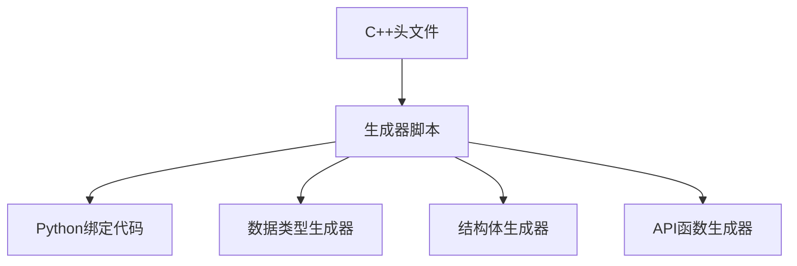
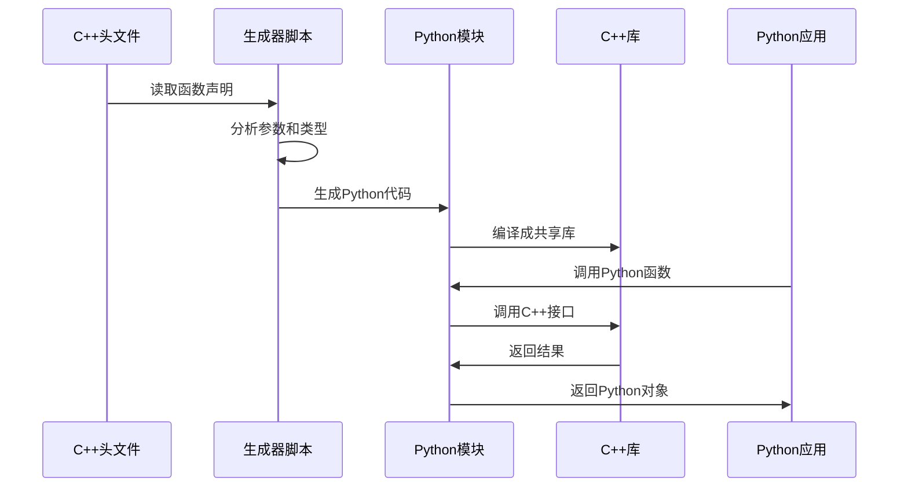
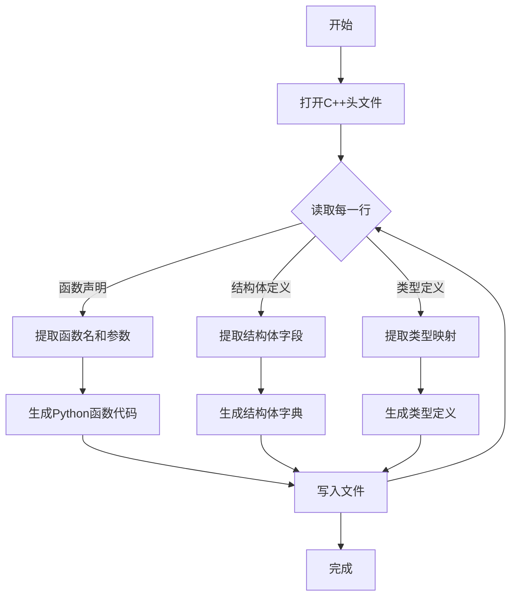

# Chapter 8: API代码生成器

## 上一章回顾

在上一章[CTP交易网关 (CtpGateway)](07_ctp交易网关__ctpgateway__.md)中，我们学习了如何通过交易网关统一管理行情接口和交易接口。网关就像一个"翻译官"和"调度中心"，把复杂的接口细节封装起来，让我们只需要简单地调用几个函数就能完成交易。

但是你有没有想过一个问题：**这些接口的代码是如何生成的？** 难道要程序员一行一行手动写出来吗？

想象一下，如果让你手写几千个函数，每个函数都有几十行代码，那该有多恐怖啊！

这就是我们本章要学习的内容——**API代码生成器**！它是一个自动化工具，能够根据C++头文件自动生成Python代码，大大提高了开发效率。

## 什么是API代码生成器？

想象一下这样的场景：

你是一家工厂的老板，你需要生产一批零件。传统的方式是：
- **手工制作**：每个零件都要工人亲手打造，耗时耗力
- **模具生产**：先制作一个模具，然后用模具批量生产零件，快速又准确

**API代码生成器就像是这个"模具"！**

CTP的交易接口是用C++编写的，但我们需要用Python来调用它。这就需要一种"翻译"机制，把C++代码转换成Python代码。如果手动来做这项工作，需要写几千行代码，而且每次CTP更新都要重新修改，非常麻烦。

**API代码生成器**能够自动完成这个转换工作：
1. 读取C++头文件（.h文件）
2. 分析其中的函数声明和数据结构
3. 自动生成对应的Python绑定代码

## 为什么要用代码生成器？

让我们看看没有代码生成器时会发生什么：

### 手动编写的问题

假设CTP有一个函数叫`ReqUserLogin`，用于用户登录：

```cpp
// C++ 头文件中的声明
virtual int ReqUserLogin(CThostFtdcReqUserLoginField *pReqUserLogin, int nRequestID) = 0;
```

如果手动编写Python绑定，程序员需要：
1. 编写Python函数声明
2. 编写数据转换代码（把Python字典转为C++结构体）
3. 编写回调处理函数
4. 编写pybind11绑定代码
5. 重复以上步骤几千次...

这就像让你手工制作几千个零件，不仅累，而且容易出错。

### 使用生成器的优势

有了代码生成器，这些工作都可以自动完成：

```python
# 生成的Python代码（自动！）
def req_user_login(self, req, reqid):
    # 自动构建C++结构体
    myreq = CThostFtdcReqUserLoginField()
    memset(&myreq, 0, sizeof(myreq))
    
    # 自动转换数据
    getString(req, "UserID", myreq.UserID)
    getString(req, "Password", myreq.Password)
    
    # 调用C++接口
    return self.api.ReqUserLogin(&myreq, reqid)
```

## 代码生成器的工作原理

API代码生成器主要分为三个部分：



### 1. 数据类型生成器 (generate_data_type.py)

这个生成器负责把C++的类型定义转换成Python的类型：

```cpp
// C++ 中的类型定义
typedef char TThostFtdcBrokerIDType[11];
typedef char TThostFtdcInvestorIDType[13];
typedef int TThostFtdcInt32Type;
```

转换后变成Python代码：

```python
# 生成的Python类型定义
TThostFtdcBrokerIDType = "string"
TThostFtdcInvestorIDType = "string"
TThostFtdcInt32Type = "int"
```

### 2. 结构体生成器 (generate_struct.py)

这个生成器负责把C++的结构体转换成Python字典：

```cpp
// C++ 中的结构体
struct CThostFtdcDepthMarketDataField {
    char InstrumentID[31];      // 合约代码
    double LastPrice;           // 最新价
    int Volume;                 // 成交量
};
```

转换后变成Python代码：

```python
# 生成的Python结构体定义
CThostFtdcDepthMarketDataField = {
    "InstrumentID": "string",
    "LastPrice": "double",
    "Volume": "int",
}
```

### 3. API函数生成器 (generate_api_functions.py)

这个生成器负责生成Python函数代码，包括：
- 函数声明
- 参数转换
- 调用C++接口
- 回调函数绑定

```python
# 生成的买入开仓函数
def req_order_insert(self, req, reqid):
    """自动生成的委托下单函数"""
    # 1. 创建C++结构体
    myreq = CThostFtdcInputOrderField()
    memset(&myreq, 0, sizeof(myreq))
    
    # 2. 转换参数
    getString(req, "InstrumentID", myreq.InstrumentID)
    getString(req, "Direction", myreq.Direction)
    getInt(req, "Volume", &myreq.VolumeTotalOriginal)
    
    # 3. 调用C++接口
    i = self.api.ReqOrderInsert(&myreq, reqid)
    return i
```

## 生成器的输入和输出

让我们用一个具体的例子来看生成器的工作过程：

### 输入：C++头文件

```cpp
// CThostFtdcTraderApi.h 中的部分内容
class CThostFtdcTraderApi {
public:
    virtual int ReqUserLogin(CThostFtdcReqUserLoginField *pReqUserLogin, int nRequestID) = 0;
    virtual int ReqUserLogout(CThostFtdcUserLogoutField *pUserLogout, int nRequestID) = 0;
    virtual int ReqOrderInsert(CThostFtdcInputOrderField *pInputOrder, int nRequestID) = 0;
    // ... 还有几千个函数
};
```

### 输出：Python绑定代码

生成器会生成以下文件：

| 文件名 | 内容 |
|--------|------|
| `ctp_struct.py` | 结构体定义字典 |
| `ctp_typedef.py` | 类型定义 |
| `ctp_md_api.py` | 行情API封装 |
| `ctp_td_api.py` | 交易API封装 |

## 实际案例：生成一个简单的函数

让我们看看生成器是如何生成一个简单函数的：

### 第一步：读取函数声明

```cpp
// 原始C++声明
virtual int ReqOrderInsert(CThostFtdcInputOrderField *pInputOrder, int nRequestID) = 0;
```

### 第二步：分析参数

生成器会识别出：
- 函数名：`ReqOrderInsert`
- 返回类型：`int`
- 参数1：`CThostFtdcInputOrderField`（结构体）
- 参数2：`nRequestID`（整数）

### 第三步：生成Python代码

```python
# 生成的Python函数
def req_order_insert(self, req, reqid):
    """委托下单请求"""
    # 创建C++结构体实例
    myreq = CThostFtdcInputOrderField()
    
    # 清空内存
    memset(&myreq, 0, sizeof(myreq))
    
    # 逐个字段转换数据
    getString(req, "InstrumentID", myreq.InstrumentID)
    getString(req, "BrokerID", myreq.BrokerID)
    getString(req, "Direction", myreq.Direction)
    # ... 更多字段转换
    
    # 调用C++接口
    i = self.api.ReqOrderInsert(&myreq, reqid)
    return i
```

这就是生成器的威力！只需要几行配置，就能生成几千行代码。

## 内部实现原理

### 数据流转过程



### 生成器的工作流程



### 代码生成示例

让我们看看`ApiGenerator`类的核心方法：

```python
# 核心方法：处理每一行
def process_line(self, line):
    line = line.replace(";", "")
    line = line.replace("\n", "")
    
    # 检查是否是回调函数
    if "virtual void On" in line:
        self.process_callback(line)
    # 检查是否是主动请求函数
    elif "virtual int Req" in line:
        self.process_function(line)
```

```python
# 处理回调函数
def process_callback(self, line):
    # 提取函数名
    name = line[line.index("On"):line.index("(")]
    
    # 生成参数字典
    d = self.generate_arg_dict(line)
    self.callbacks[name] = d
```

```python
# 生成参数字典
def generate_arg_dict(self, line):
    args_str = line[line.index("(")+1:line.index(")")]
    args = args_str.split(",")
    
    d = {}
    for arg in args:
        words = arg.split(" ")
        words = [w for w in words if w]
        d[words[1].replace("*", "")] = words[0]
    
    return d
```

## 常见的生成器类型

### 1. 数据类型生成器

专门处理C++的基本类型定义：

```python
TYPE_CPP2PY = {
    "int": "int",
    "char": "char",
    "double": "double",
}
```

### 2. 结构体生成器

处理C++的结构体定义，生成Python字典：

```python
def process_member(self, line):
    words = line.split("\t")
    py_type = self.typedefs[words[0]]  # 查表获取Python类型
    name = words[1]
    
    new_line = f'    "{name}": "{py_type}",\n'
    self.f_struct.write(new_line)
```

### 3. API函数生成器

生成完整的Python函数实现：

```python
def generate_source_function(self):
    # 为每个API函数生成代码
    for name, d in self.functions.items():
        req_name = name.replace("Req", "req")
        
        # 生成函数体
        f.write(f"int {self.class_name}::{req_name}(const dict &req, int reqid)\n")
        f.write("{\n")
        f.write(f"\t{type_} myreq = {type_}();\n")
        f.write("\tmemset(&myreq, 0, sizeof(myreq));\n")
        
        # 生成字段转换代码
        for field, field_type in struct_fields.items():
            if field_type == "string":
                f.write(f'\tgetString(req, "{field}", myreq.{field});\n')
            else:
                f.write(f'\tget{field_type.capitalize()}(req, "{field}", &myreq.{field});\n')
        
        f.write("};\n\n")
```

## 生成器的优势

使用代码生成器有以下几个显著优势：

| 优势 | 说明 |
|------|------|
| **提高效率** | 几分钟生成几千行代码 |
| **减少错误** | 自动生成比手写更准确 |
| **易于维护** | CTP更新时只需重新运行生成器 |
| **一致性** | 所有代码风格统一 |

## 总结

本章我们学习了：

- **API代码生成器**是自动化工具，用于生成CTP的Python绑定代码
- 主要有三个生成器：**数据类型生成器**、**结构体生成器**、**API函数生成器**
- 生成器读取C++头文件，自动分析函数声明和结构体定义
- 生成的Python代码使用pybind11与C++库进行交互
- 使用生成器大大提高了开发效率，减少了手动维护的工作量

### 下一步学习

到这里，我们已经学习了vnpy_ctp项目的核心内容：
- 数据类型定义
- CTP常量定义
- 合约数据映射表
- 订单状态映射
- 行情数据接口
- 交易数据接口
- CTP交易网关
- API代码生成器

这些知识组合在一起，就构成了完整的CTP交易接口封装！希望这个教程能够帮助你理解期货交易接口的工作原理。

如果你想继续深入学习VeighNa框架的其他部分，可以访问[VeighNa官方文档](https://www.vnpy.com)获取更多信息。

祝你在量化交易的路上越走越远！

---

Generated by [AI Codebase Knowledge Builder](https://github.com/The-Pocket/Tutorial-Codebase-Knowledge)