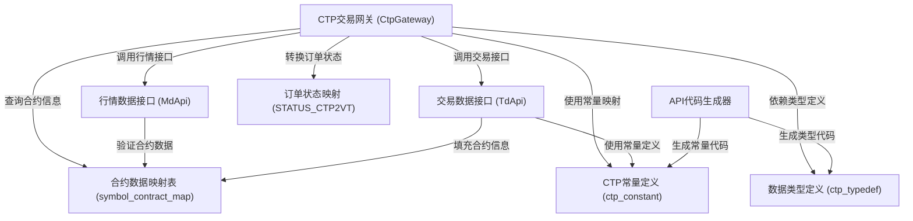

# Tutorial: vnpy_ctp

**vnpy_ctp** 是一个用于连接**CTP（综合交易平台）**的Python接口项目，为vnpy框架提供**期货交易**功能。该项目通过**行情数据接口（MdApi）**接收实时市场数据，通过**交易数据接口（TdApi）**执行下单、撤单等交易操作。**CTP交易网关（CtpGateway）**作为核心枢纽，负责协调行情与交易接口，并将CTP协议的数据转换为vnpy内部格式。项目中还包含**API代码生成器**，用于自动生成Python绑定代码，以及**常量定义**和**数据类型定义**，确保与CTP系统通信的一致性。

**Source Repository:** [https://github.com/vnpy/vnpy_ctp.git](https://github.com/vnpy/vnpy_ctp.git)

## Chapters

1. [数据类型定义 (ctp_typedef)
](01_数据类型定义__ctp_typedef__.md)
2. [CTP常量定义 (ctp_constant)
](02_ctp常量定义__ctp_constant__.md)
3. [合约数据映射表 (symbol_contract_map)
](03_合约数据映射表__symbol_contract_map__.md)
4. [订单状态映射 (STATUS_CTP2VT)
](04_订单状态映射__status_ctp2vt__.md)
5. [行情数据接口 (MdApi)
](05_行情数据接口__mdapi__.md)
6. [交易数据接口 (TdApi)
](06_交易数据接口__tdapi__.md)
7. [CTP交易网关 (CtpGateway)
](07_ctp交易网关__ctpgateway__.md)
8. [API代码生成器
](08_api代码生成器_.md)

---

Generated by [AI Codebase Knowledge Builder](https://github.com/The-Pocket/Tutorial-Codebase-Knowledge)