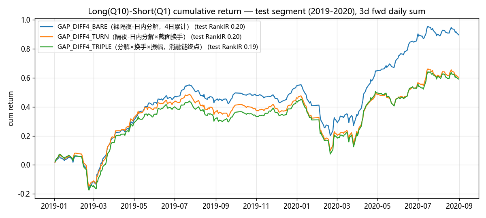
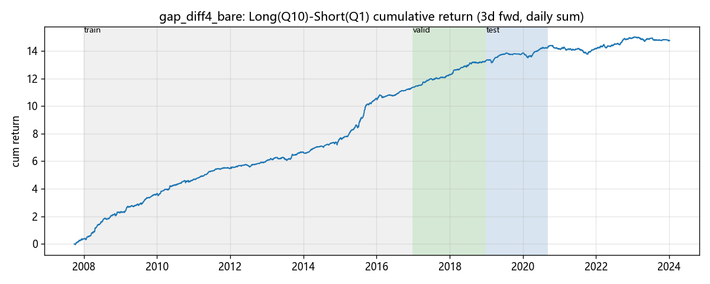
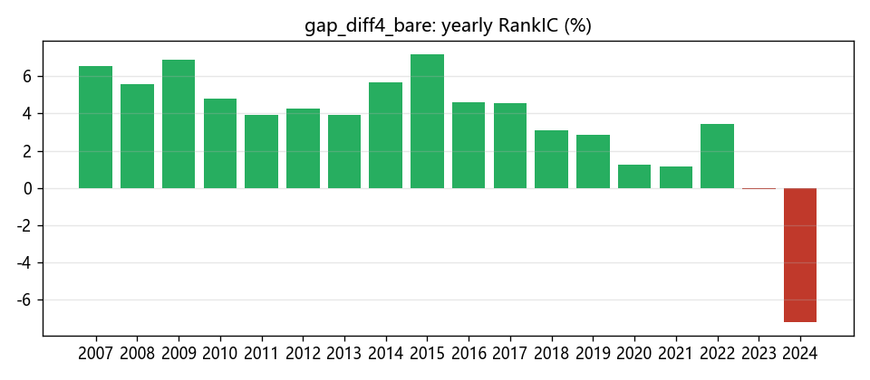
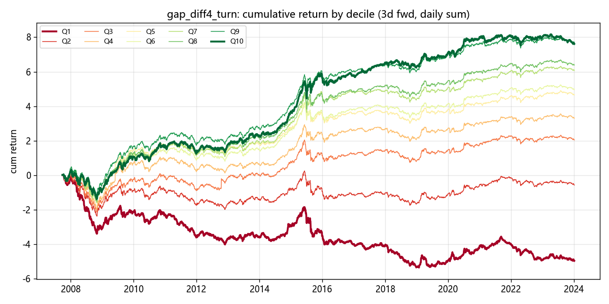
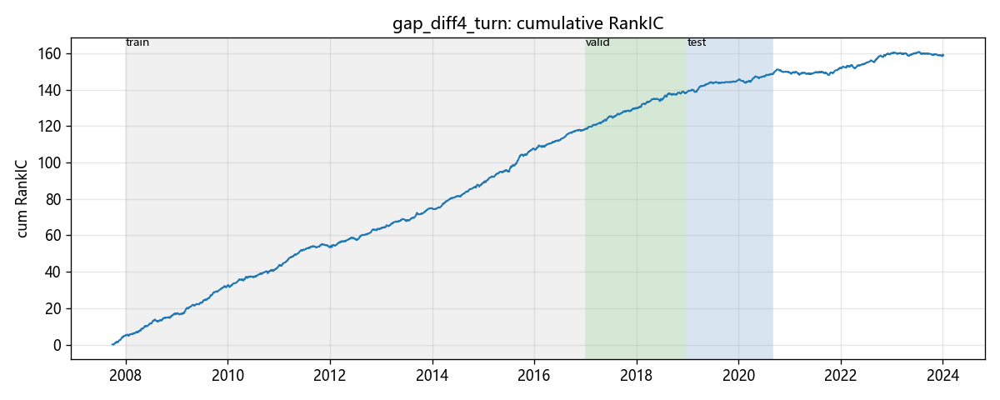
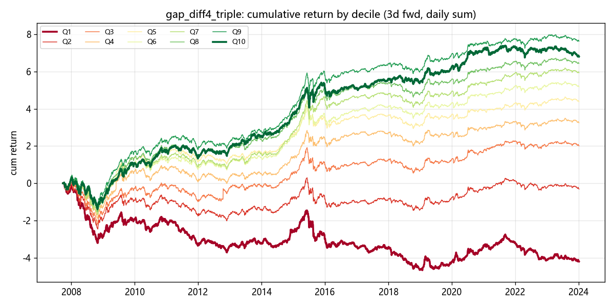
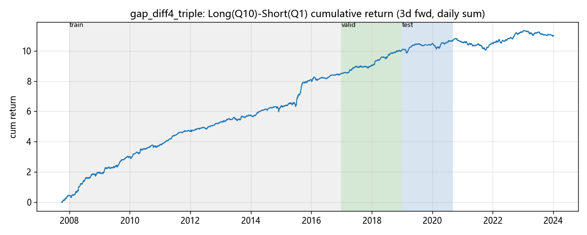
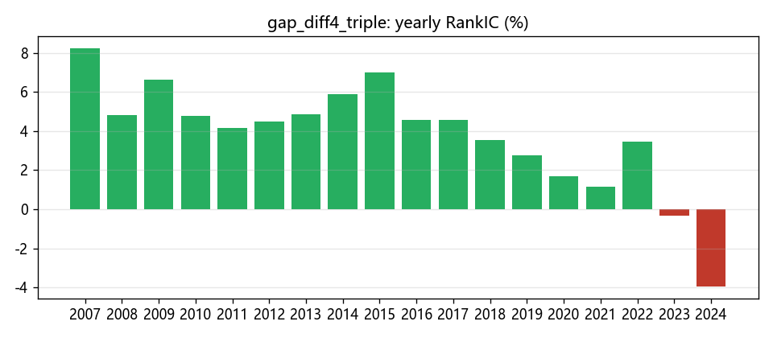

# 留存因子终局绩效分析报告

- 因子值与前瞻 label 均由 vnpy.alpha（AlphaDataset 表达式引擎）计算
- 股票池：沪深300 成分股日线 859 只；label = T+1→T+3 收益
- 分组：每日按因子值 10 分组（qcut）；多空 = Q10 均值 − Q1 均值；年化按 244 交易日

## 因子总览

| 因子 | train RankIR | valid RankIR | test RankIR | test 多空 Sharpe |
|---|---|---|---|---|
| GAP_DIFF4_BARE（裸隔夜-日内分解，4日累计） | +0.38 | +0.28 | +0.20 | 2.53 |
| GAP_DIFF4_TURN（隔夜-日内分解×截面换手） | +0.37 | +0.29 | +0.20 | 1.62 |
| GAP_DIFF4_TRIPLE（分解×换手×振幅，消融链终点） | +0.37 | +0.28 | +0.19 | 1.57 |

test 段为三个因子的共同样本外确认区间，多空净值对比如下：

## GAP_DIFF4_BARE（裸隔夜-日内分解，4日累计）（gap_diff4_bare）

表达式：ts_sum((open / ts_delay(close, 1) - 1) - (close / open - 1), 4)

### 分段 IC 指标

| 段 | 天数 | IC | IR | RankIC | RankIR | 方向胜率 |
|---|---|---|---|---|---|---|
| train | 2190 | +0.0504 | +0.389 | +0.0521 | +0.379 | 64.89% |
| valid | 487 | +0.0594 | +0.427 | +0.0382 | +0.276 | 62.63% |
| test | 405 | +0.0381 | +0.340 | +0.0231 | +0.198 | 57.28% |

### 全样本分组与多空表现

| 指标 | 数值 |
|---|---|
| 分组平均日收益 Q1→Q10 | -0.12% / +0.01% / +0.05% / +0.09% / +0.10% / +0.11% / +0.13% / +0.14% / +0.17% / +0.25% |
| 单调性（Q 序号 Spearman） | +1.00 |
| 多空年化收益 | +90.99% |
| 多空年化波动 | +25.64% |
| 多空 Sharpe | 3.55 |
| 多空最大回撤 | -48.77% |
| 多头(Q10)年化 | +60.99% |
| 多头组日均换手率 | 62.5% |

> 成本提示：多头组日均换手 62.5%，按单边 0.1%、双边每日调仓估算，年化拖累约 +30.51%，扣除后多空年化约 +60.49%。IC 类指标 ≠ 扣费后组合收益。

### 分段多空表现

| 段 | 多空年化 | 多空波动 | 多空 Sharpe | 最大回撤 | 多头(Q10)年化 | 多头组换手 |
|---|---|---|---|---|---|---|
| train | +122.64% | +27.08% | 4.53 | -21.13% | +82.04% | 63.2% |
| valid | +96.80% | +21.56% | 4.49 | -8.79% | +25.08% | 62.0% |
| test | +54.00% | +21.32% | 2.53 | -30.15% | +101.83% | 61.3% |

### 分年 RankIC

| 年份 | RankIC |
|---|---|
| 2007 | +0.0655 |
| 2008 | +0.0555 |
| 2009 | +0.0686 |
| 2010 | +0.0482 |
| 2011 | +0.0390 |
| 2012 | +0.0428 |
| 2013 | +0.0394 |
| 2014 | +0.0567 |
| 2015 | +0.0719 |
| 2016 | +0.0460 |
| 2017 | +0.0453 |
| 2018 | +0.0310 |
| 2019 | +0.0284 |
| 2020 | +0.0123 |
| 2021 | +0.0113 |
| 2022 | +0.0346 |
| 2023 | -0.0008 |
| 2024 | -0.0722 |

**16/18 年 RankIC 为正**

## GAP_DIFF4_TURN（隔夜-日内分解×截面换手）（gap_diff4_turn）

表达式：ts_sum((open / ts_delay(close, 1) - 1) - (close / open - 1), 4) * cs_rank(turnover)

### 分段 IC 指标

| 段 | 天数 | IC | IR | RankIC | RankIR | 方向胜率 |
|---|---|---|---|---|---|---|
| train | 2190 | +0.0335 | +0.269 | +0.0518 | +0.372 | 64.66% |
| valid | 487 | +0.0311 | +0.240 | +0.0415 | +0.292 | 63.04% |
| test | 405 | +0.0143 | +0.122 | +0.0240 | +0.200 | 56.05% |

### 全样本分组与多空表现

| 指标 | 数值 |
|---|---|
| 分组平均日收益 Q1→Q10 | -0.13% / -0.01% / +0.05% / +0.08% / +0.12% / +0.13% / +0.15% / +0.16% / +0.19% / +0.19% |
| 单调性（Q 序号 Spearman） | +0.99 |
| 多空年化收益 | +77.61% |
| 多空年化波动 | +26.43% |
| 多空 Sharpe | 2.94 |
| 多空最大回撤 | -55.95% |
| 多头(Q10)年化 | +46.93% |
| 多头组日均换手率 | 61.7% |

> 成本提示：多头组日均换手 61.7%，按单边 0.1%、双边每日调仓估算，年化拖累约 +30.11%，扣除后多空年化约 +47.49%。IC 类指标 ≠ 扣费后组合收益。

### 分段多空表现

| 段 | 多空年化 | 多空波动 | 多空 Sharpe | 最大回撤 | 多头(Q10)年化 | 多头组换手 |
|---|---|---|---|---|---|---|
| train | +104.36% | +28.03% | 3.72 | -24.79% | +62.31% | 63.0% |
| valid | +90.34% | +22.27% | 4.06 | -12.47% | +22.55% | 61.5% |
| test | +36.34% | +22.39% | 1.62 | -32.97% | +96.27% | 59.9% |

### 分年 RankIC

| 年份 | RankIC |
|---|---|
| 2007 | +0.0827 |
| 2008 | +0.0496 |
| 2009 | +0.0628 |
| 2010 | +0.0447 |
| 2011 | +0.0410 |
| 2012 | +0.0433 |
| 2013 | +0.0461 |
| 2014 | +0.0575 |
| 2015 | +0.0761 |
| 2016 | +0.0450 |
| 2017 | +0.0474 |
| 2018 | +0.0356 |
| 2019 | +0.0277 |
| 2020 | +0.0161 |
| 2021 | +0.0106 |
| 2022 | +0.0333 |
| 2023 | -0.0036 |
| 2024 | -0.0669 |

**16/18 年 RankIC 为正**

## GAP_DIFF4_TRIPLE（分解×换手×振幅，消融链终点）（gap_diff4_triple）

表达式：ts_sum((open / ts_delay(close, 1) - 1) - (close / open - 1), 4) * cs_rank(turnover) * ts_mean(high / low - 1, 5)

### 分段 IC 指标

| 段 | 天数 | IC | IR | RankIC | RankIR | 方向胜率 |
|---|---|---|---|---|---|---|
| train | 2190 | +0.0318 | +0.251 | +0.0524 | +0.367 | 64.38% |
| valid | 487 | +0.0249 | +0.192 | +0.0405 | +0.280 | 61.81% |
| test | 405 | +0.0182 | +0.149 | +0.0242 | +0.191 | 57.28% |

### 全样本分组与多空表现

| 指标 | 数值 |
|---|---|
| 分组平均日收益 Q1→Q10 | -0.11% / -0.01% / +0.05% / +0.08% / +0.11% / +0.13% / +0.15% / +0.16% / +0.19% / +0.17% |
| 单调性（Q 序号 Spearman） | +0.99 |
| 多空年化收益 | +67.79% |
| 多空年化波动 | +26.54% |
| 多空 Sharpe | 2.55 |
| 多空最大回撤 | -55.82% |
| 多头(Q10)年化 | +41.92% |
| 多头组日均换手率 | 61.4% |

> 成本提示：多头组日均换手 61.4%，按单边 0.1%、双边每日调仓估算，年化拖累约 +29.94%，扣除后多空年化约 +37.85%。IC 类指标 ≠ 扣费后组合收益。

### 分段多空表现

| 段 | 多空年化 | 多空波动 | 多空 Sharpe | 最大回撤 | 多头(Q10)年化 | 多头组换手 |
|---|---|---|---|---|---|---|
| train | +89.89% | +28.21% | 3.19 | -30.39% | +54.61% | 63.3% |
| valid | +76.37% | +22.18% | 3.44 | -14.53% | +13.20% | 60.6% |
| test | +35.64% | +22.72% | 1.57 | -31.95% | +97.75% | 59.1% |

### 分年 RankIC

| 年份 | RankIC |
|---|---|
| 2007 | +0.0825 |
| 2008 | +0.0481 |
| 2009 | +0.0661 |
| 2010 | +0.0476 |
| 2011 | +0.0416 |
| 2012 | +0.0450 |
| 2013 | +0.0484 |
| 2014 | +0.0590 |
| 2015 | +0.0700 |
| 2016 | +0.0455 |
| 2017 | +0.0456 |
| 2018 | +0.0354 |
| 2019 | +0.0275 |
| 2020 | +0.0169 |
| 2021 | +0.0114 |
| 2022 | +0.0347 |
| 2023 | -0.0032 |
| 2024 | -0.0397 |

**16/18 年 RankIC 为正**

