# 留存因子终局绩效分析报告

- 因子值与前瞻 label 均由 vnpy.alpha（AlphaDataset 表达式引擎）计算
- 股票池：沪深300 成分股日线 859 只；label = T+1→T+3 收益
- 分组：每日按因子值 10 分组（qcut）；多空 = Q10 均值 − Q1 均值；年化按 244 交易日

## 因子总览

| 因子 | train RankIR | valid RankIR | test RankIR | test 多空 Sharpe |
|---|---|---|---|---|
| PV_ANTI_TRIPLE（量价反共振×截面换手×振幅） | +0.41 | +0.52 | +0.34 | 2.53 |
| PV_ANTI_PAIR（量价反共振×截面换手） | +0.39 | +0.52 | +0.32 | 1.87 |
| PV_ANTI_BARE（裸量价反共振，= VP_ANTI_RES5） | +0.35 | +0.40 | +0.28 | 1.81 |

test 段为三个因子的共同样本外确认区间，多空净值对比如下：

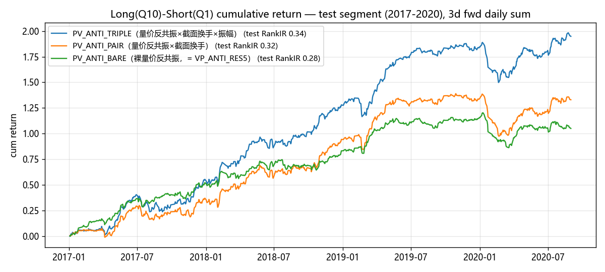

## PV_ANTI_TRIPLE（量价反共振×截面换手×振幅）（pv_anti_triple）

表达式：-ts_corr(close / ts_delay(close, 1) - 1, volume / ts_delay(volume, 1) - 1, 5) * cs_rank(turnover) * ts_mean(high / low - 1, 5)

### 分段 IC 指标

| 段 | 天数 | IC | IR | RankIC | RankIR | 方向胜率 |
|---|---|---|---|---|---|---|
| train | 1702 | +0.0310 | +0.263 | +0.0489 | +0.408 | 65.63% |
| valid | 488 | +0.0346 | +0.283 | +0.0633 | +0.519 | 71.52% |
| test | 892 | +0.0176 | +0.147 | +0.0410 | +0.344 | 65.25% |

### 全样本分组与多空表现

| 指标 | 数值 |
|---|---|
| 分组平均日收益 Q1→Q10 | -0.07% / -0.01% / +0.03% / +0.07% / +0.09% / +0.13% / +0.14% / +0.15% / +0.17% / +0.17% |
| 单调性（Q 序号 Spearman） | +1.00 |
| 多空年化收益 | +58.40% |
| 多空年化波动 | +22.98% |
| 多空 Sharpe | 2.54 |
| 多空最大回撤 | -36.77% |
| 多头(Q10)年化 | +41.70% |
| 多头组日均换手率 | 54.8% |

> 成本提示：多头组日均换手 54.8%，按单边 0.1%、双边每日调仓估算，年化拖累约 +26.72%，扣除后多空年化约 +31.67%。IC 类指标 ≠ 扣费后组合收益。

### 分段多空表现

| 段 | 多空年化 | 多空波动 | 多空 Sharpe | 最大回撤 | 多头(Q10)年化 | 多头组换手 |
|---|---|---|---|---|---|---|
| train | +70.77% | +22.46% | 3.15 | -36.77% | +48.89% | 56.6% |
| valid | +85.67% | +27.34% | 3.13 | -19.10% | +62.02% | 59.1% |
| test | +53.31% | +21.10% | 2.53 | -32.78% | +56.43% | 53.0% |

### 分年 RankIC

| 年份 | RankIC |
|---|---|
| 2007 | +0.0600 |
| 2008 | +0.0521 |
| 2009 | +0.0487 |
| 2010 | +0.0430 |
| 2011 | +0.0465 |
| 2012 | +0.0422 |
| 2013 | +0.0679 |
| 2014 | +0.0425 |
| 2015 | +0.0649 |
| 2016 | +0.0618 |
| 2017 | +0.0511 |
| 2018 | +0.0441 |
| 2019 | +0.0371 |
| 2020 | +0.0274 |
| 2021 | +0.0204 |
| 2022 | +0.0419 |
| 2023 | +0.0287 |
| 2024 | +0.1028 |

**18/18 年 RankIC 为正**

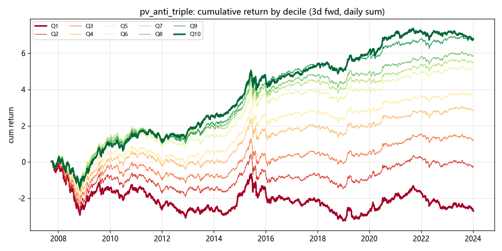

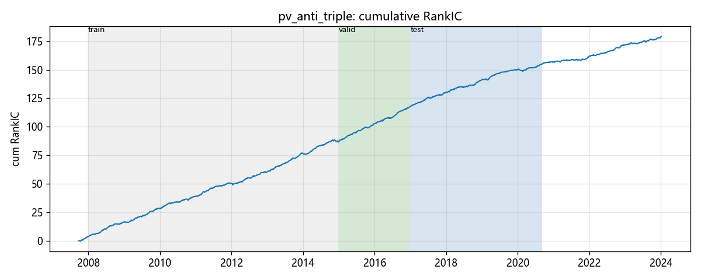

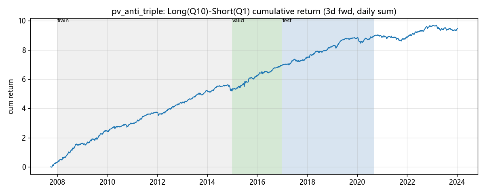

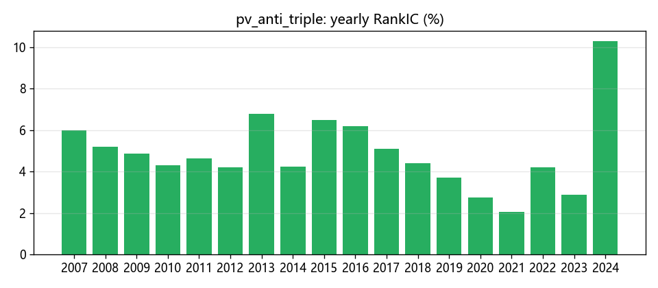

## PV_ANTI_PAIR（量价反共振×截面换手）（pv_anti_pair）

表达式：-ts_corr(close / ts_delay(close, 1) - 1, volume / ts_delay(volume, 1) - 1, 5) * cs_rank(turnover)

### 分段 IC 指标

| 段 | 天数 | IC | IR | RankIC | RankIR | 方向胜率 |
|---|---|---|---|---|---|---|
| train | 1702 | +0.0309 | +0.279 | +0.0458 | +0.387 | 66.04% |
| valid | 488 | +0.0371 | +0.332 | +0.0605 | +0.519 | 71.52% |
| test | 892 | +0.0181 | +0.170 | +0.0363 | +0.318 | 63.90% |

### 全样本分组与多空表现

| 指标 | 数值 |
|---|---|
| 分组平均日收益 Q1→Q10 | -0.07% / -0.02% / +0.03% / +0.07% / +0.10% / +0.13% / +0.16% / +0.16% / +0.17% / +0.14% |
| 单调性（Q 序号 Spearman） | +0.93 |
| 多空年化收益 | +49.80% |
| 多空年化波动 | +21.68% |
| 多空 Sharpe | 2.30 |
| 多空最大回撤 | -38.40% |
| 多头(Q10)年化 | +33.31% |
| 多头组日均换手率 | 55.7% |

> 成本提示：多头组日均换手 55.7%，按单边 0.1%、双边每日调仓估算，年化拖累约 +27.19%，扣除后多空年化约 +22.61%。IC 类指标 ≠ 扣费后组合收益。

### 分段多空表现

| 段 | 多空年化 | 多空波动 | 多空 Sharpe | 最大回撤 | 多头(Q10)年化 | 多头组换手 |
|---|---|---|---|---|---|---|
| train | +63.97% | +21.13% | 3.03 | -30.10% | +38.39% | 56.9% |
| valid | +91.89% | +27.07% | 3.39 | -19.48% | +61.35% | 59.2% |
| test | +36.38% | +19.41% | 1.87 | -34.47% | +46.23% | 54.8% |

### 分年 RankIC

| 年份 | RankIC |
|---|---|
| 2007 | +0.0574 |
| 2008 | +0.0536 |
| 2009 | +0.0425 |
| 2010 | +0.0437 |
| 2011 | +0.0430 |
| 2012 | +0.0387 |
| 2013 | +0.0646 |
| 2014 | +0.0351 |
| 2015 | +0.0658 |
| 2016 | +0.0552 |
| 2017 | +0.0485 |
| 2018 | +0.0383 |
| 2019 | +0.0310 |
| 2020 | +0.0213 |
| 2021 | +0.0187 |
| 2022 | +0.0341 |
| 2023 | +0.0207 |
| 2024 | +0.0667 |

**18/18 年 RankIC 为正**

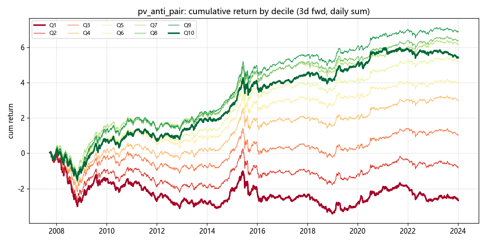

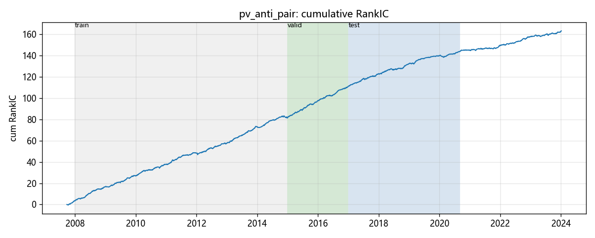

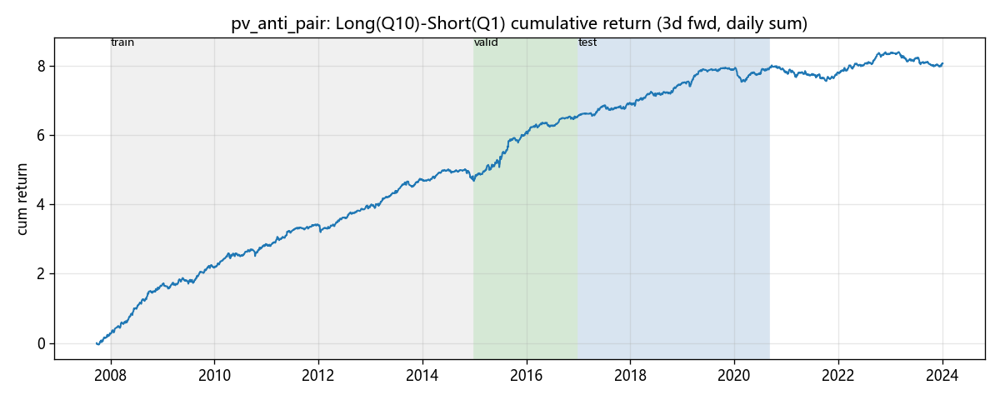

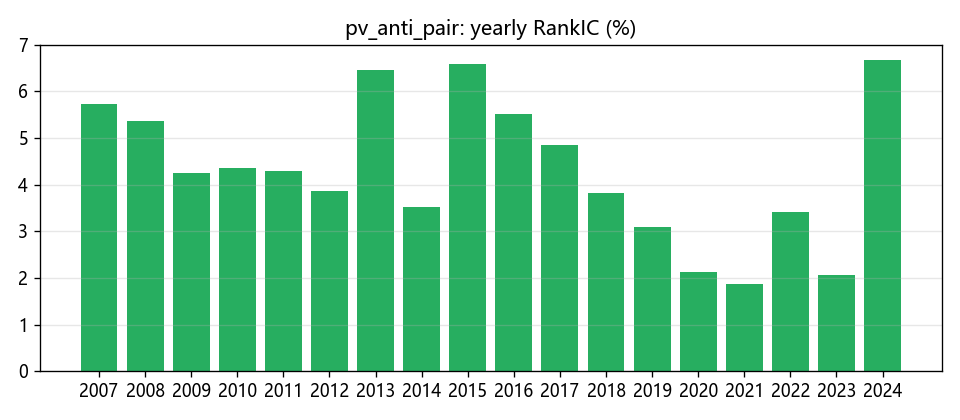

## PV_ANTI_BARE（裸量价反共振，= VP_ANTI_RES5）（pv_anti_bare）

表达式：-ts_corr(close / ts_delay(close, 1) - 1, volume / ts_delay(volume, 1) - 1, 5)

### 分段 IC 指标

| 段 | 天数 | IC | IR | RankIC | RankIR | 方向胜率 |
|---|---|---|---|---|---|---|
| train | 1702 | +0.0255 | +0.253 | +0.0380 | +0.353 | 64.51% |
| valid | 488 | +0.0311 | +0.309 | +0.0432 | +0.401 | 65.98% |
| test | 892 | +0.0168 | +0.176 | +0.0286 | +0.280 | 62.89% |

### 全样本分组与多空表现

| 指标 | 数值 |
|---|---|
| 分组平均日收益 Q1→Q10 | -0.03% / +0.03% / +0.06% / +0.06% / +0.08% / +0.11% / +0.11% / +0.13% / +0.14% / +0.16% |
| 单调性（Q 序号 Spearman） | +0.99 |
| 多空年化收益 | +46.15% |
| 多空年化波动 | +18.89% |
| 多空 Sharpe | 2.44 |
| 多空最大回撤 | -46.96% |
| 多头(Q10)年化 | +39.99% |
| 多头组日均换手率 | 60.7% |

> 成本提示：多头组日均换手 60.7%，按单边 0.1%、双边每日调仓估算，年化拖累约 +29.64%，扣除后多空年化约 +16.52%。IC 类指标 ≠ 扣费后组合收益。

### 分段多空表现

| 段 | 多空年化 | 多空波动 | 多空 Sharpe | 最大回撤 | 多头(Q10)年化 | 多头组换手 |
|---|---|---|---|---|---|---|
| train | +63.75% | +18.19% | 3.51 | -19.71% | +44.02% | 61.5% |
| valid | +78.08% | +25.44% | 3.07 | -21.70% | +81.42% | 61.4% |
| test | +28.73% | +15.88% | 1.81 | -29.18% | +37.48% | 60.2% |

### 分年 RankIC

| 年份 | RankIC |
|---|---|
| 2007 | +0.0550 |
| 2008 | +0.0455 |
| 2009 | +0.0318 |
| 2010 | +0.0375 |
| 2011 | +0.0372 |
| 2012 | +0.0313 |
| 2013 | +0.0552 |
| 2014 | +0.0277 |
| 2015 | +0.0443 |
| 2016 | +0.0421 |
| 2017 | +0.0485 |
| 2018 | +0.0174 |
| 2019 | +0.0250 |
| 2020 | +0.0147 |
| 2021 | +0.0064 |
| 2022 | +0.0299 |
| 2023 | +0.0045 |
| 2024 | +0.0760 |

**18/18 年 RankIC 为正**

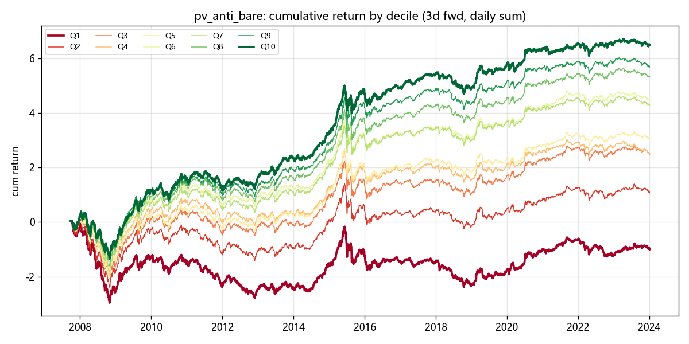

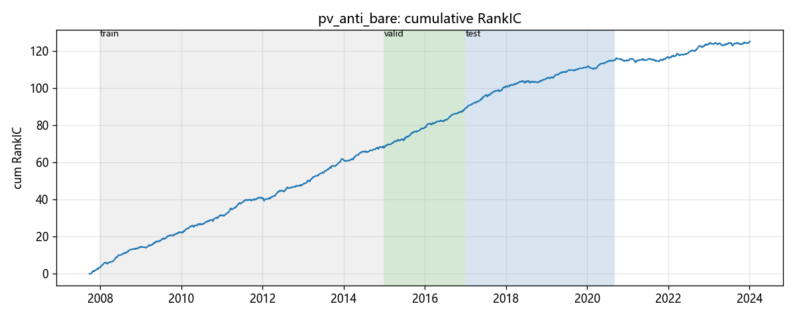

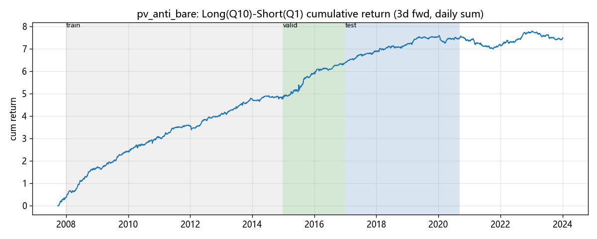

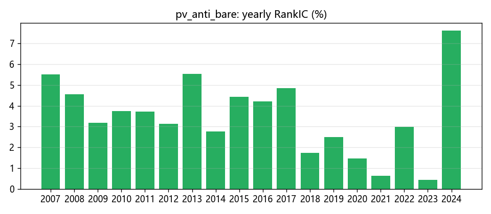
