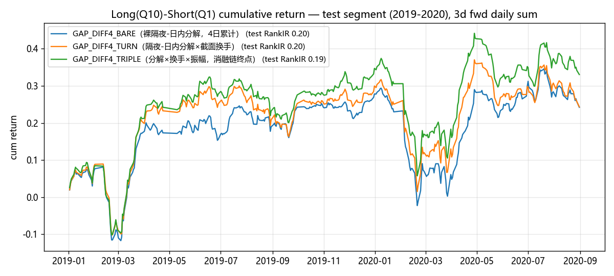
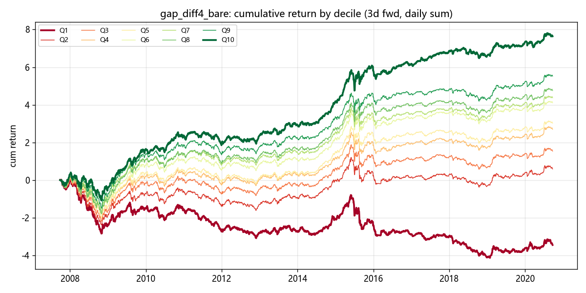
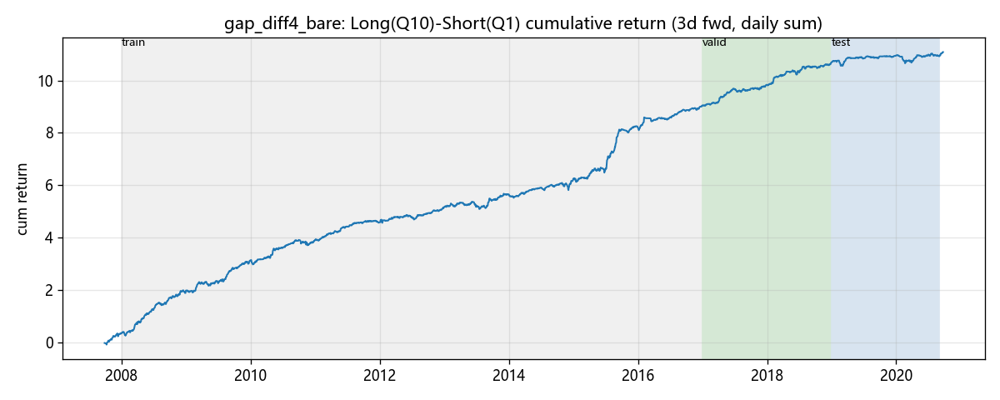
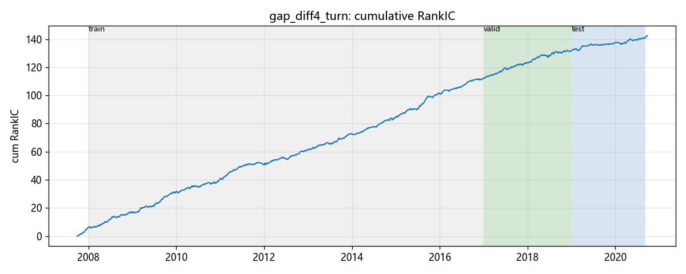
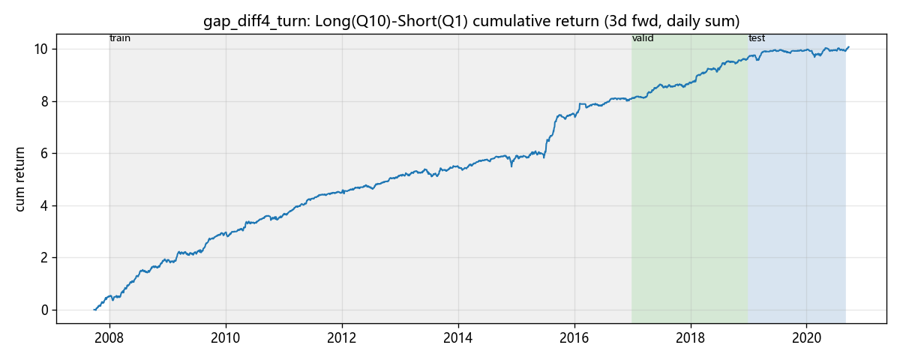
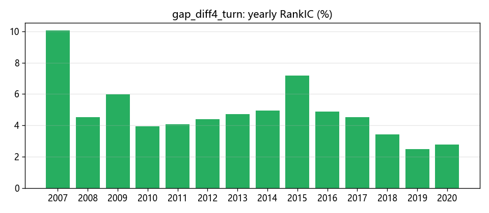
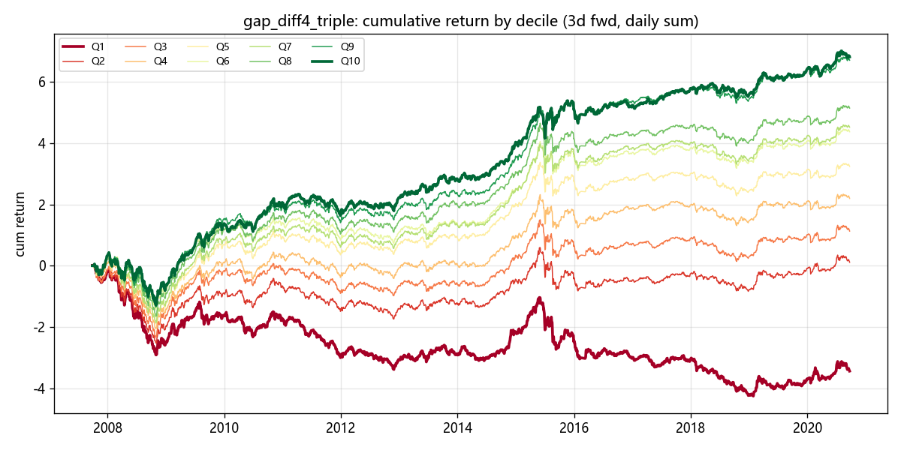
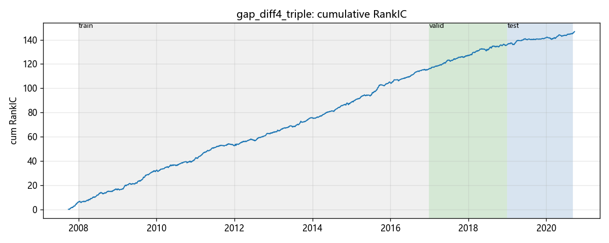
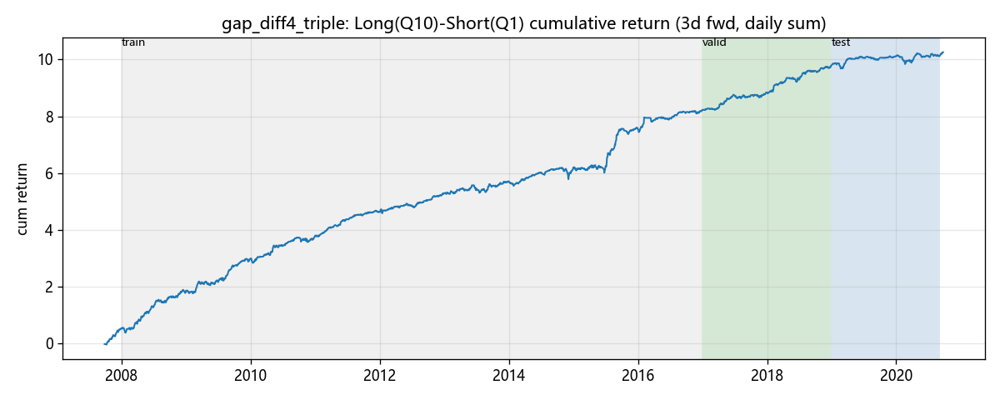

# 留存因子终局绩效分析报告

- 因子值与前瞻 label 均由 vnpy.alpha（AlphaDataset 表达式引擎）计算
- 股票池：沪深300 成分股日线 859 只；label = T+1→T+3 收益
- 分组：每日按因子值 10 分组（qcut）；多空 = Q10 均值 − Q1 均值；年化按 244 交易日

## 因子总览

| 因子 | train RankIR | valid RankIR | test RankIR | test 多空 Sharpe |
|---|---|---|---|---|
| GAP_DIFF4_BARE（裸隔夜-日内分解，4日累计） | +0.38 | +0.28 | +0.20 | 0.75 |
| GAP_DIFF4_TURN（隔夜-日内分解×截面换手） | +0.37 | +0.29 | +0.20 | 0.71 |
| GAP_DIFF4_TRIPLE（分解×换手×振幅，消融链终点） | +0.37 | +0.28 | +0.19 | 0.95 |

test 段为三个因子的共同样本外确认区间，多空净值对比如下：

## GAP_DIFF4_BARE（裸隔夜-日内分解，4日累计）（gap_diff4_bare）

表达式：ts_sum((open / ts_delay(close, 1) - 1) - (close / open - 1), 4)

### 分段 IC 指标

| 段 | 天数 | IC | IR | RankIC | RankIR | 方向胜率 |
|---|---|---|---|---|---|---|
| train | 2140 | +0.0438 | +0.316 | +0.0502 | +0.358 | 64.53% |
| valid | 487 | +0.0497 | +0.349 | +0.0354 | +0.249 | 60.37% |
| test | 396 | +0.0180 | +0.160 | +0.0196 | +0.174 | 54.80% |

### 全样本分组与多空表现

| 指标 | 数值 |
|---|---|
| 分组平均日收益 Q1→Q10 | -0.11% / +0.02% / +0.05% / +0.09% / +0.10% / +0.13% / +0.14% / +0.15% / +0.18% / +0.25% |
| 单调性（Q 序号 Spearman） | +1.00 |
| 多空年化收益 | +87.24% |
| 多空年化波动 | +25.81% |
| 多空 Sharpe | 3.38 |
| 多空最大回撤 | -27.44% |
| 多头(Q10)年化 | +60.14% |
| 多头组日均换手率 | 64.2% |

> 成本提示：多头组日均换手 64.2%，按单边 0.1%、双边每日调仓估算，年化拖累约 +31.32%，扣除后多空年化约 +55.92%。IC 类指标 ≠ 扣费后组合收益。

### 分段多空表现

| 段 | 多空年化 | 多空波动 | 多空 Sharpe | 最大回撤 | 多头(Q10)年化 | 多头组换手 |
|---|---|---|---|---|---|---|
| train | +99.12% | +27.31% | 3.63 | -24.98% | +67.27% | 64.8% |
| valid | +81.61% | +22.41% | 3.64 | -15.47% | +19.35% | 63.1% |
| test | +14.91% | +19.79% | 0.75 | -27.44% | +72.43% | 61.9% |

### 分年 RankIC

| 年份 | RankIC |
|---|---|
| 2007 | +0.0739 |
| 2008 | +0.0533 |
| 2009 | +0.0665 |
| 2010 | +0.0448 |
| 2011 | +0.0364 |
| 2012 | +0.0451 |
| 2013 | +0.0406 |
| 2014 | +0.0493 |
| 2015 | +0.0642 |
| 2016 | +0.0522 |
| 2017 | +0.0430 |
| 2018 | +0.0278 |
| 2019 | +0.0236 |
| 2020 | +0.0233 |

**14/14 年 RankIC 为正**

## GAP_DIFF4_TURN（隔夜-日内分解×截面换手）（gap_diff4_turn）

表达式：ts_sum((open / ts_delay(close, 1) - 1) - (close / open - 1), 4) * cs_rank(turnover)

### 分段 IC 指标

| 段 | 天数 | IC | IR | RankIC | RankIR | 方向胜率 |
|---|---|---|---|---|---|---|
| train | 2140 | +0.0332 | +0.243 | +0.0496 | +0.351 | 64.77% |
| valid | 487 | +0.0326 | +0.231 | +0.0398 | +0.275 | 60.57% |
| test | 396 | +0.0092 | +0.080 | +0.0225 | +0.191 | 56.57% |

### 全样本分组与多空表现

| 指标 | 数值 |
|---|---|
| 分组平均日收益 Q1→Q10 | -0.13% / +0.00% / +0.04% / +0.08% / +0.11% / +0.15% / +0.15% / +0.19% / +0.20% / +0.20% |
| 单调性（Q 序号 Spearman） | +0.98 |
| 多空年化收益 | +79.34% |
| 多空年化波动 | +26.55% |
| 多空 Sharpe | 2.99 |
| 多空最大回撤 | -35.73% |
| 多头(Q10)年化 | +48.65% |
| 多头组日均换手率 | 63.5% |

> 成本提示：多头组日均换手 63.5%，按单边 0.1%、双边每日调仓估算，年化拖累约 +30.98%，扣除后多空年化约 +48.37%。IC 类指标 ≠ 扣费后组合收益。

### 分段多空表现

| 段 | 多空年化 | 多空波动 | 多空 Sharpe | 最大回撤 | 多头(Q10)年化 | 多头组换手 |
|---|---|---|---|---|---|---|
| train | +86.88% | +28.11% | 3.09 | -35.73% | +50.38% | 64.4% |
| valid | +77.44% | +23.12% | 3.35 | -14.14% | +12.70% | 62.1% |
| test | +15.00% | +20.99% | 0.71 | -26.42% | +80.80% | 60.0% |

### 分年 RankIC

| 年份 | RankIC |
|---|---|
| 2007 | +0.1004 |
| 2008 | +0.0452 |
| 2009 | +0.0599 |
| 2010 | +0.0395 |
| 2011 | +0.0409 |
| 2012 | +0.0441 |
| 2013 | +0.0473 |
| 2014 | +0.0495 |
| 2015 | +0.0719 |
| 2016 | +0.0489 |
| 2017 | +0.0453 |
| 2018 | +0.0342 |
| 2019 | +0.0249 |
| 2020 | +0.0278 |

**14/14 年 RankIC 为正**

## GAP_DIFF4_TRIPLE（分解×换手×振幅，消融链终点）（gap_diff4_triple）

表达式：ts_sum((open / ts_delay(close, 1) - 1) - (close / open - 1), 4) * cs_rank(turnover) * ts_mean(high / low - 1, 5)

### 分段 IC 指标

| 段 | 天数 | IC | IR | RankIC | RankIR | 方向胜率 |
|---|---|---|---|---|---|---|
| train | 2140 | +0.0332 | +0.242 | +0.0515 | +0.360 | 64.67% |
| valid | 487 | +0.0304 | +0.218 | +0.0403 | +0.276 | 60.99% |
| test | 396 | +0.0147 | +0.122 | +0.0230 | +0.186 | 56.31% |

### 全样本分组与多空表现

| 指标 | 数值 |
|---|---|
| 分组平均日收益 Q1→Q10 | -0.11% / +0.00% / +0.04% / +0.07% / +0.10% / +0.14% / +0.15% / +0.17% / +0.22% / +0.22% |
| 单调性（Q 序号 Spearman） | +1.00 |
| 多空年化收益 | +80.70% |
| 多空年化波动 | +26.64% |
| 多空 Sharpe | 3.03 |
| 多空最大回撤 | -34.21% |
| 多头(Q10)年化 | +53.66% |
| 多头组日均换手率 | 63.3% |

> 成本提示：多头组日均换手 63.3%，按单边 0.1%、双边每日调仓估算，年化拖累约 +30.87%，扣除后多空年化约 +49.83%。IC 类指标 ≠ 扣费后组合收益。

### 分段多空表现

| 段 | 多空年化 | 多空波动 | 多空 Sharpe | 最大回撤 | 多头(Q10)年化 | 多头组换手 |
|---|---|---|---|---|---|---|
| train | +87.79% | +28.28% | 3.10 | -34.21% | +56.17% | 64.6% |
| valid | +77.79% | +22.53% | 3.45 | -14.25% | +15.31% | 61.1% |
| test | +20.36% | +21.42% | 0.95 | -27.53% | +84.81% | 59.0% |

### 分年 RankIC

| 年份 | RankIC |
|---|---|
| 2007 | +0.1002 |
| 2008 | +0.0437 |
| 2009 | +0.0639 |
| 2010 | +0.0437 |
| 2011 | +0.0421 |
| 2012 | +0.0459 |
| 2013 | +0.0503 |
| 2014 | +0.0533 |
| 2015 | +0.0695 |
| 2016 | +0.0514 |
| 2017 | +0.0450 |
| 2018 | +0.0355 |
| 2019 | +0.0256 |
| 2020 | +0.0277 |

**14/14 年 RankIC 为正**

